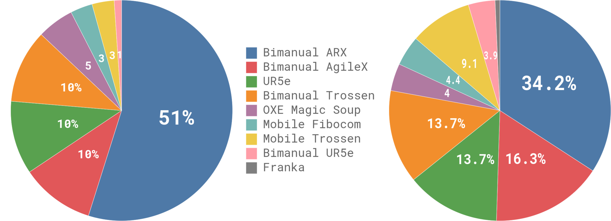

# π0: A Vision-Language-Action Flow Model for General Robot Control

아카이브 #1 · 2026-09-04 · arXiv 2410.24164 (Physical Intelligence) · 선정 이유: 마음AI 면접(9/4)에서 "OpenVLA 이후 계보" 질문에 답하지 못한 갭을 정면으로 메우는 논문. OpenVLA 이후 VLA의 사실상 표준 참조점.

---

## 1. 한 줄 요약

**액션을 토큰으로 이산화하는 대신, flow matching으로 연속 액션 청크(50스텝)를 통째로 생성하는 VLA** — 이산화 VLA(OpenVLA류)의 두 한계(정밀도 양자화, 자기회귀 속도)를 동시에 푸는 설계.

## 2. 문제 정의 — 왜 이산화를 버렸나

OpenVLA 계열은 각 자유도를 256구간으로 이산화해 "다음 토큰 예측"으로 액션을 만든다. 이 설계의 비용:

1. **정밀도**: 연속 제어량을 양자화 — 섬세한 조작(옷 개기, 달걀 포장)에서 해상도 부족
2. **속도**: 자기회귀 — 액션 토큰을 순차 생성하므로 고주파 제어(50Hz)에 부적합
3. **다봉 분포**: 이산화 분류는 다봉을 다루지만 청크 단위의 시간적 일관성은 약함

π0의 답: 액션 청크 **A_t = [a_t, ..., a_{t+H-1}] (H=50)** 를 flow matching으로 **한 번에** 생성. 50Hz 덱스터러스 제어가 가능해진다.

## 3. 아키텍처

- **백본**: PaliGemma 3B (사전학습 VLM) + **action expert 300M = 총 3.3B**
- **Mixture-of-experts 라우팅**: 이미지·언어 토큰은 VLM 가중치로, **로봇 상태(proprio)·액션 토큰은 별도의 action expert 가중치로** 라우팅 — 같은 트랜스포머 안에서 모달리티별 전문가를 나눈 구조. VLM의 시맨틱은 보존하면서 연속 제어 표현을 따로 학습
- 비교 기억: CANVAS는 웨이포인트를 K-means 이산화(분류) — π0는 그 반대편 설계

*Fig 1 (overview): 사전학습(다양한 로봇·태스크 혼합) → 사후학습(고품질 태스크 데이터)의 2단 레시피와 flow matching 액션 생성 구조.*

## 4. 수식 전개 — flow matching이 실제로 하는 일

**목표**: 관측 o_t가 주어졌을 때 액션 청크 분포 p(A_t|o_t)에서 샘플링하고 싶다. Flow matching은 "노이즈 → 데이터"로 흐르는 벡터장을 회귀로 배운다.

**① 노이즈 주입 (선형-가우시안 경로)**: 시간 변수 τ∈[0,1]에서

A_t^τ = τ·A_t + (1−τ)·ε,  ε ~ N(0, I)

- τ=0이면 순수 노이즈, τ=1이면 실제 액션. 데이터와 노이즈 사이를 직선으로 잇는 경로다.

**② 타깃 벡터장**: 이 직선 경로를 따라가는 속도는

u(A_t^τ | A_t) = A_t − ε

- 유도: A_t^τ를 τ로 미분하면 d/dτ[τA_t + (1−τ)ε] = A_t − ε. 즉 "지금 위치에서 데이터 쪽으로 가는 방향"이 타깃.

**③ 학습 손실 (벡터장 회귀)**:

L(θ) = E_{p(A_t|o_t), q(A_t^τ|A_t)} ‖ v_θ(A_t^τ, o_t) − u(A_t^τ|A_t) ‖²

- 네트워크 v_θ는 "노이즈 섞인 액션 청크 + 관측"을 받아 그 위치에서의 속도를 예측. **디퓨전과의 차이**: 노이즈를 빼는 스코어 대신 직선 속도를 직접 회귀 — 경로가 직선이라 적은 스텝으로 적분 가능.

**④ 추론 (Euler 적분 10스텝)**:

A_t^{τ+δ} = A_t^τ + δ·v_θ(A_t^τ, o_t),  δ = 0.1

- 순수 노이즈 A^0 = ε에서 출발해 10번 전진 적분하면 액션 청크 완성. 자기회귀 토큰 생성 대비 병렬적이고 빠름 — 온보드 추론 ~73ms.

**한 줄로**: "이산화 분류 대신, 노이즈→액션 직선 경로의 속도장을 배워 10스텝 적분으로 연속 청크를 뽑는다."

## 5. 데이터와 학습 레시피

- **사전학습**: 자체 수집 **903M 타임스텝**(로봇 7종, 68태스크) + OXE·Bridge v2·DROID(혼합의 ~9.1%) ≈ **총 1만 시간** — 공개 VLA 대비 압도적 자체 데이터
- 데이터 균형: 과대표된 (태스크×로봇) 조합에 n^0.43 가중 — 그대로 두면 큰 데이터셋이 지배하는 문제의 실무적 해법
- **사후학습**: 태스크별 고품질 데이터 5~100+시간으로 파인튜닝 — "LLM의 사전학습→SFT 패턴을 로봇에 이식"이 이 논문의 서사
- 제어: 50Hz, 청크 50, 추론은 0.5~0.8초마다(청크 중 16~25 액션을 open-loop 실행 후 재계획)

*Fig 2 (robot allocation): 사전학습 혼합의 로봇 플랫폼·태스크 분포 — 데이터 팩토리 관점에서 "무엇을 얼마나 섞나"가 곧 성능 설계임을 보여주는 그림.*

## 6. 결과 핵심

- 베이스라인(OpenVLA, Octo, ACT, Diffusion Policy) 대비 전 평가에서 우위 — 단순 태스크(수건 개기, 그릇 쌓기)는 거의 만점
- 하이라이트: **세탁물 개기 5~20분 다단계 시퀀스**, 박스 조립, 달걀 포장 — 청크 기반 고주파 제어가 만드는 차이
- 언어 지시 따르기(복수 오브젝트 지정)도 VLM 백본 덕에 유지

*Fig 3 (complex finetune): 다단계 복잡 태스크에서 사전학습+사후학습 조합의 효과 — 사전학습 없는 변형 대비 격차가 큼.*

*Fig 4 (language tasks): 언어 지시 추종 평가 — VLM 백본 보존(전문가 분리 라우팅)의 근거.*

## 7. 한계

- 자체 데이터 1만 시간이 성능의 전제 — **재현 불가능한 규모**(공개 모델 π0는 이후 오픈소스화됐지만 데이터는 비공개)
- open-loop 청크 실행 구간(0.5~0.8초)은 외란에 취약 — 재계획 주기가 반응성의 상한
- 평가가 자체 태스크 중심 — 공개 벤치(LIBERO류) 비교는 후속 커뮤니티 작업에서

## 8. 김도현 연결 — 면접용 세 마디

1. **(OpenVLA 이후 계보 질문 — 마음AI 기출 설욕)**: "이산화 VLA의 다음 단계가 π0입니다 — 액션을 토큰화하지 않고 flow matching으로 50스텝 청크를 한 번에 생성해서 정밀도와 50Hz 제어를 얻었습니다. 이후 OpenVLA-OFT가 파인튜닝 쪽을, GR00T N1이 같은 구조의 공개판을 잇고 있고요."
2. **(주파수 질문 — 마음AI 기출 설욕)**: "π0가 청크 50개를 0.5~0.8초마다 재계획하는 구조인 것처럼, 이질 주파수 데이터는 액션 청크 단위로 정렬하는 게 표준입니다."
3. **(데이터 관점 — 기여 시나리오 연결)**: "π0의 실질 기여는 수식보다 903M 타임스텝의 자체 데이터와 n^0.43 균형 같은 데이터 엔지니어링입니다 — 데이터 팩토리가 곧 모델 성능이라는 제 관점의 근거로 쓰는 논문입니다."

## 9. 30초 요약 카드

> "π0는 Physical Intelligence의 VLA로, PaliGemma 3B에 300M action expert를 붙여 flow matching으로 50스텝 액션 청크를 생성합니다. 노이즈와 액션을 직선으로 잇는 경로의 속도장을 회귀로 배우고, 추론은 Euler 10스텝 적분 — 이산화 없이 연속 제어라 50Hz 덱스터러스 조작이 됩니다. 자체 수집 1만 시간 사전학습 후 태스크별 사후학습하는 LLM식 레시피고, 세탁물 개기 같은 5~20분 다단계 태스크가 대표 데모입니다."

---
*출처: Black et al., "π0: A Vision-Language-Action Flow Model for General Robot Control", arXiv 2410.24164. 피겨는 원문 HTML판에서 학습 목적 인용.*
