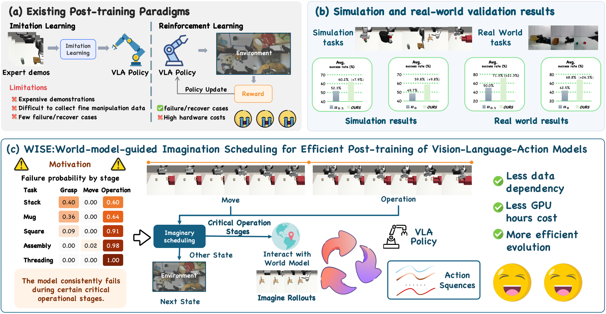
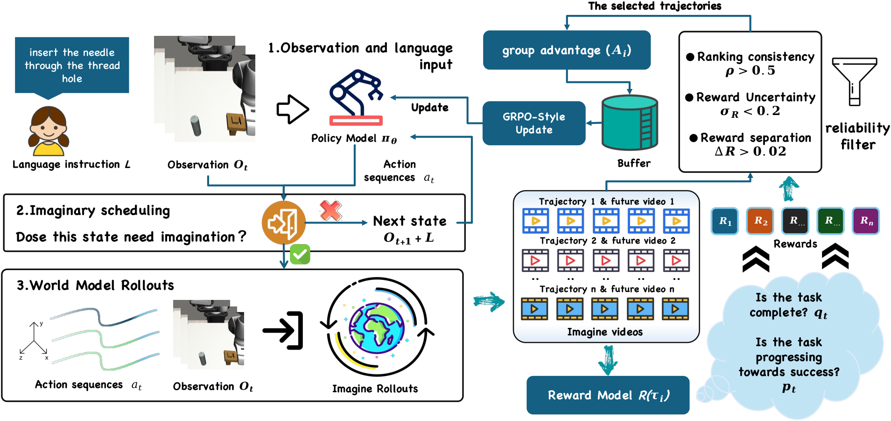
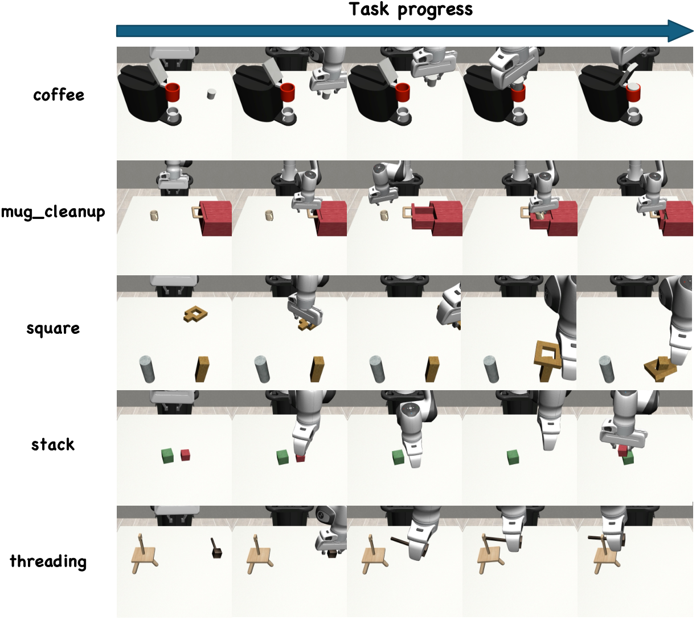
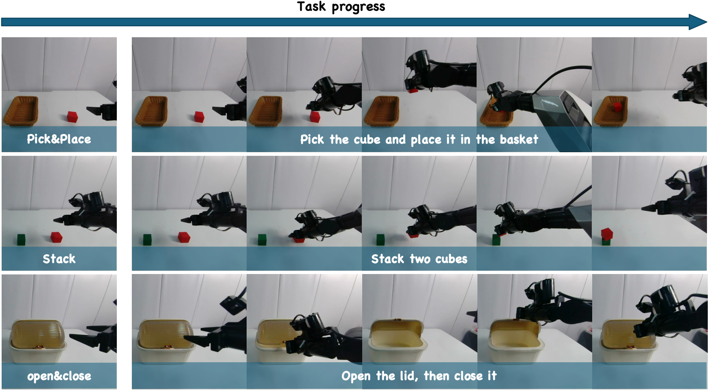
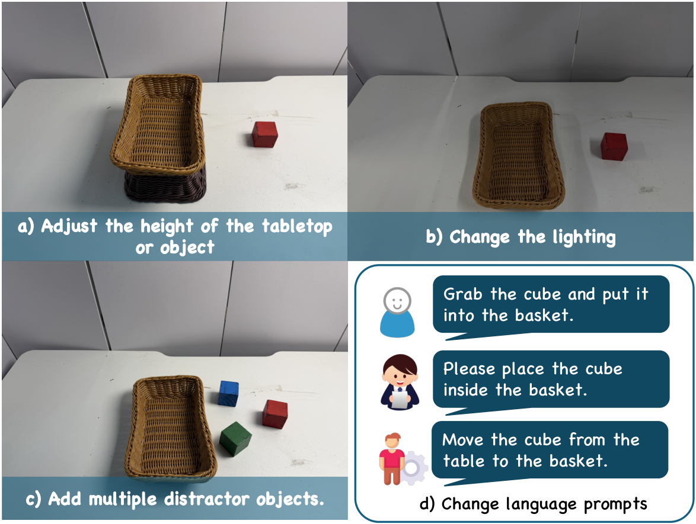
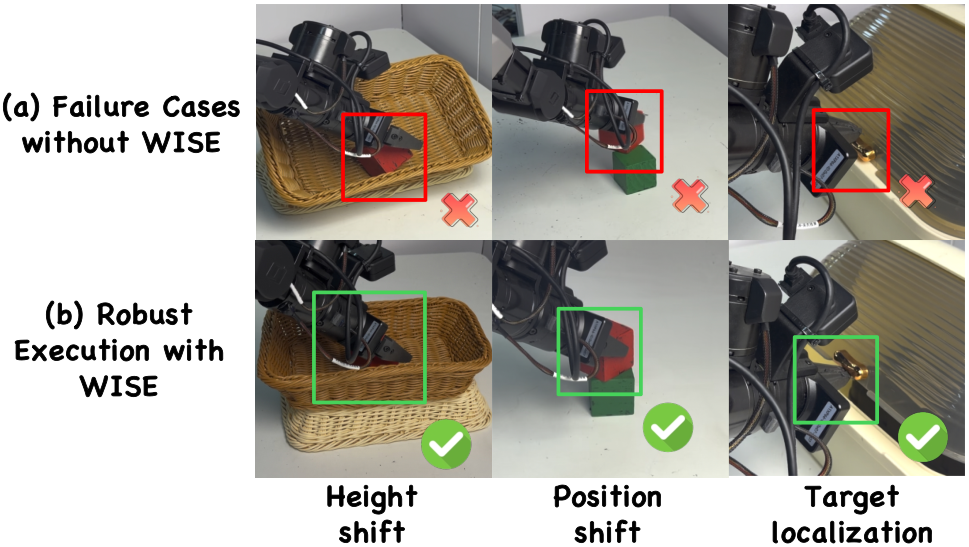
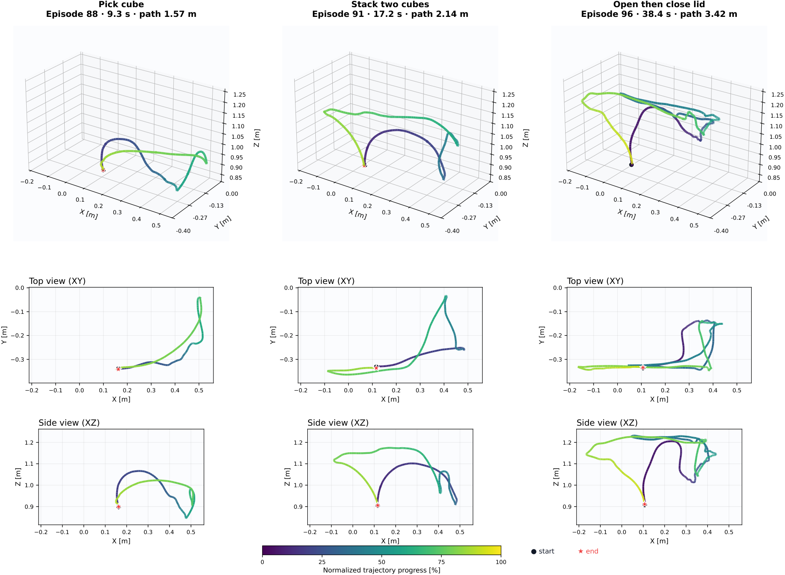

# WISE: World-model-guided Imagination Scheduling for Efficient Post-training of Vision-Language-Action Models

아카이브 #2 · 2026-09-07 · arXiv 2609.03681v1 · Chenhao Zhang, Hanyu Zhao, Hang Cheng, Tengfei Pan, Long Zeng · 선정 이유: 아카이브 #1(π0)의 정확히 다음 단계 질문 — "사전학습된 VLA를 실물 로봇을 굴리지 않고 어떻게 더 좋게 만드나". 월드모델(TD-MPC2 경험)과 VLA 파인튜닝(OpenVLA LoRA 경험)을 한 프레임에 묶는 논문이라 면접에서 두 개인 프로젝트를 한 답변으로 연결할 수 있다.

---

## 1. 한 줄 요약

**월드모델의 "상상"을 언제·얼마나 쓸지 스케줄링해서 VLA 사후학습을 돌리는 프레임워크.** 상상을 상호작용이 일어나는 순간에만 호출하고(전체 대비 상태 수 약 80% 절감), 롤아웃 길이를 유한하게 묶고, 상상 결과는 **직접 학습 데이터로 쓰지 않고 후보 액션의 순위를 매기는 데만** 쓴다. π0 기준 시뮬레이션 평균 성공률 49.7% → 59.5%, 실물 일반화 설정 42.5% → 68.8%.

## 2. 문제 정의 — 사후학습의 두 갈래가 모두 비싸다

사전학습 VLA(π0, π0.5)를 특정 환경에 맞추는 방법은 지금까지 둘뿐이었다.

1. **모방학습 기반 사후학습(SFT)**: 고품질 시연이 대량으로 필요하다. 수집 비용이 곧 병목이다.
2. **강화학습(GRPO, DSRL, DPO 등)**: 실물 탐색이 필요하다. 충돌·하드웨어 마모·파손이 실제로 발생하고, 탐색 자체가 불안정하다.

세 번째 길이 **월드모델**이다. 후보 액션을 실행하기 **전에** 결과를 예측해서 평가한다. 그런데 저자들의 관찰은 "예측이 정확하면 된다"가 아니다.

- **상상의 가치는 태스크 구간마다 다르다.** 사전학습 VLA는 이미 대략적 접근 동작(reaching)은 안정적으로 한다. 예측 추론이 실제로 도움 되는 곳은 **접촉·파지 같은 상호작용 임계 상태**다.
- **롤아웃을 길게 늘리면 예측 오차가 누적된다.** 긴 상상은 오히려 학습 신호를 오염시킨다.

그래서 논문의 주장은 "상상은 많을수록 좋은 게 아니다"이고, 설계 문제는 세 가지로 분해된다: **어디서 호출할 것인가(scheduling), 얼마나 멀리 볼 것인가(bounding), 예측 결과를 어떻게 학습 신호로 바꿀 것인가(evaluation)**.

## 3. 방법 — 수식 전개

### 3.1 문제 설정

실제 상호작용 컨텍스트를 `h_t = (O_t, s_t, ℓ)` — 최근 다중 시점 관측, 로봇 상태, 언어 지시 — 로 두고, 정책은 액션 청크를 낸다.

    a_t ~ π_θ(· | h_t)

목표는 태스크 성공의 기댓값 최대화다.

    θ* = argmax_θ  E_{ℓ~p(ℓ), τ~p(τ|π_θ, ℓ)} [ y(τ, ℓ) ],   y ∈ {0, 1}

`y`는 궤적 τ가 지시 ℓ을 성공적으로 완수했는지의 이진 지시자다. 이 목적함수를 실물에서 직접 최적화하는 것이 비싼 이유는 **피드백이 희소하고(성공/실패 한 비트) 탐색이 위험**해서다. 그래서 월드모델 `p_ψ`로 반사실적(counterfactual) 결과를 예측한다.

    Ô_{t+1:t+H} ~ p_ψ(· | O_t, ℓ, a_t)

즉 "이 액션 청크를 실행하면 앞으로 H 프레임 동안 뭐가 보일지"를 액션 조건부로 생성한다.

### 3.2 월드모델 학습 — rectified flow (π0와 같은 수학, 다른 자리)

월드모델은 Open-Sora를 개조한 것으로, 손목 카메라와 3인칭 카메라의 **다중 시점 미래**를 액션 조건부로 예측한다. 학습은 rectified flow다. 관측 프레임과 미래 H 프레임의 VAE 잠재를 각각 `z_obs`, `z_fut`라 하고, `λ ~ U(0,1)`, `ε ~ N(0, I)`에 대해

**① 선형 보간 경로**

    z_fut,λ = (1 − λ)·ε + λ·z_fut

- λ=0이면 순수 노이즈, λ=1이면 실제 미래 잠재. 노이즈와 데이터를 잇는 직선이다.

**② 타깃 속도**

    d/dλ [ z_fut,λ ] = z_fut − ε

- 직선 경로를 미분하면 속도는 상수 `z_fut − ε`. 이게 회귀 타깃이다.

**③ 손실**

    L_WM = E ‖ v_ψ([z̃_obs ; z_fut,λ], λ, ℓ, a)_fut − (z_fut − ε) ‖²₂

- `z̃_obs`는 섭동된 관측 잠재로, **조건 컨텍스트로만** 들어간다. rectified flow 지도는 **미래 잠재에만** 걸린다.
- **아카이브 #1과의 연결점**: π0가 액션 공간에서 쓴 flow matching과 정확히 같은 수학이 여기서는 비디오 VAE 잠재 공간에 쓰인다. `A^τ = τA + (1−τ)ε`, 타깃 `A − ε` ↔ `z_λ = λz + (1−λ)ε`, 타깃 `z − ε`. **면접에서 "flow matching이 뭐냐"는 질문에 액션 생성과 미래 예측 두 자리를 한 번에 답할 수 있다.**

### 3.3 유한 반사실 상상 (Bounded Counterfactual Imagination)

스케줄러가 고른 컨텍스트에서 정책이 후보 액션 청크 M개를 샘플링한다.

    a_{t,i} ~ π_θ(· | O_t, s_t, ℓ),   i = 1, ..., M

각 후보마다 **닫힌 루프 상상**을 돌린다. 초기값 `Ô_i^(0) = O_t`, `ŝ_i^(0) = s_t`, `â_i^(0) = a_{t,i}`에서 시작해 재귀적으로

    Ô_i^(r+1) ~ p_ψ(· | Ô_i^(r), ℓ, â_i^(r))          … 월드모델이 다음 관측 생성
    ŝ_i^(r+1) = F_s(ŝ_i^(r), â_i^(r))                  … 고유수용 상태는 결정론적으로 갱신
    â_i^(r+1) ~ π_θ(· | Ô_i^(r+1), ŝ_i^(r+1), ℓ)       … r < L−1 일 때, 정책이 상상 관측 위에서 다음 액션

`F_s`는 액션 청크로부터 proprioception을 결정론적으로 업데이트하는 함수다. **월드모델은 픽셀만 만들고 상태는 운동학적으로 굴린다** — 비디오 예측 모델이 관절각까지 환각하지 않게 막는 실무적 분리다.

L개 청크를 반복하면

    τ̂_i = { Ô_i^(1:L), â_i^(0:L−1) }

청크당 H 프레임이므로 총 `L·H` 프레임, 인덱스 `j = 1, ..., LH`. **L을 유한하게 묶는 것 자체가 오차 누적 방지 장치**다. (논문 HTML판에 M, H, L, κ의 구체 수치는 명시되지 않았다.)

### 3.4 상상 스케줄링 — 언제 호출할지를 학습한다

동기화된 손목/3인칭 관측 `O_t = {I_t^w, I_t^a}`를 view-shared DINOv2 ViT-L/14 인코더 `E_φs`로 인코딩하고, 경량 헤드 `g_η`가 상호작용 관련도 점수를 낸다.

    s_t = σ( g_η [ E_φs(I_t^w) ; E_φs(I_t^a) ] ),   s_t ∈ [0, 1]
    m_t = 𝟙[ s_t > κ ]

`m_t = 1`인 컨텍스트에서만 후보 생성 + 월드모델 롤아웃을 돌리고, 아니면 건너뛴다.

**약지도(weak supervision)가 이 논문의 실용적 핵심이다.** 라벨은 사람이 태스크 단계를 주석하지 않는다. 오프라인 궤적의 **그리퍼/파지 상태**에서 자동 유도한다 — 파지 또는 능동 조작 상태면 `y_n = 1`, 나머지는 `y_n = 0`. 클래스 불균형은 가중치로 보정한다.

    L_sched = −(1/N) Σ_n w_n [ y_n log s_n + (1 − y_n) log(1 − s_n) ]

헤드 아키텍처는 256차원 은닉층 2개 MLP + LayerNorm + GELU + dropout 0.1. 학습 시엔 분류 헤드와 `E_φs`의 **마지막 트랜스포머 블록만** 열고 나머지는 동결한다. 사후학습 중에는 스케줄러 전체가 동결되며, **추론 시엔 그리퍼 신호 없이 시각 관측만으로** 상호작용 관련도를 판단한다.

### 3.5 반사실 궤적 평가와 정책 갱신

별도로 학습한 DINOv2 인코더 `E_φr`로 상상된 다중 시점 프레임을 임베딩하고

    e_{i,j} = [ E_φr(Î_{i,j}^w) ; E_φr(Î_{i,j}^a) ]

세 개 헤드로 **진척도·신뢰도·완료도**를 예측한다.

    p_{i,j} = σ(h_p(e_{i,j}))     … 진척도 (progress)
    c_{i,j} = σ(h_c(e_{i,j}))     … 신뢰도 (confidence)
    q_{i,j} = tanh(h_q(e_{i,j}))  … 완료도 (completion)

실제 컨텍스트에서 평가한 `p_{i,0} = p_t`를 시작점으로 궤적 보상을 조립한다.

    G_i = Σ_{j=1}^{LH}  c_{i,j} · [ p_{i,j} − p_{i,j−1} ]_0^δ     … 전진 진척(신뢰도 가중)
    B_i = Σ_{j=1}^{LH}        [ p_{i,j−1} − p_{i,j} ]_0^δ         … 후퇴 페널티
    T_i = max_j q_{i,j}                                            … 최고 완료도
    R_i = G_i − α·B_i + β·T_i                                      … α=0.2, β=2.0, δ=0.2

여기서 `[x]_0^δ = min(max(x, 0), δ)`는 0과 δ 사이로 자르는 클리핑이다.

**세 가지 설계 포인트를 읽어야 한다.**
- **δ 클리핑**: 한 프레임에서 진척도가 급등하면(=월드모델이 장면을 튀게 그렸으면) 그 이득을 δ=0.2로 잘라낸다. 환각 한 방으로 보상이 뛰는 것을 막는다.
- **비대칭 신뢰도 가중**: 전진 항 `G_i`에만 `c_{i,j}`가 곱해지고, 후퇴 항 `B_i`에는 곱하지 않는다. 즉 **좋은 소식은 확신할 때만 인정하고, 나쁜 소식은 확신 없어도 센다.** 보수적 설계다.
- **밀도 vs 종단**: `G/B`는 프레임 단위 밀집 신호, `T`는 종단 신호. β=2.0으로 종단 완료에 큰 가중을 준다.

**신뢰할 수 없는 그룹은 버린다.** 각 후보를 두 번 상상해 `R̄_i = (R_i^(1) + R_i^(2))/2`를 쓰고, 그룹 전체를 다음 세 조건을 모두 만족할 때만 유지한다.

    ΔR = max_i R̄_i − min_i R̄_i ≥ 0.02      … 후보 간 변별력이 있어야 함
    ρ_rank ≥ 0.5                             … 두 번의 상상에서 순위가 일관되어야 함
    σ_WM ≤ 0.2                               … 반복 상상 간 보상 변동이 작아야 함

**정책 갱신은 그룹 상대(group-relative) 방식이다.**

    A_i = ( R̄_i − μ_R̄ ) / max( σ_R̄, ε )

    g_WISE = (1/M) Σ_{i=1}^{M} sg(A_i) · ∇_θ L_FM(θ; a_{t,i}, h_t)  +  λ_ref · ∇_θ L_ref

정책은 `−g_WISE` 방향으로 갱신된다. (논문 HTML판은 `sg(·)`를 정의하지 않는다. 본문 서술은 "signed advantages define the update direction"이므로 부호 함수로 읽는 것이 자연스럽고, stop-gradient로 읽어도 정성적 거동은 같다.)

**이 식이 왜 이렇게 생겼는지가 핵심이다.** π0류 정책은 flow matching으로 액션을 만들기 때문에 `log π_θ(a|h)`가 다루기 어렵다. 표준 정책경사(GRPO 포함)의 log-prob 항을 그대로 쓸 수 없다. 그래서 **flow matching 손실 `L_FM`을 대리(surrogate)로 쓴다.** 어드밴티지가 양수인 후보는 `L_FM`을 낮추는 방향(=그 액션을 모방)으로, 음수인 후보는 높이는 방향(=밀어내기)으로 간다. **자기가 생성한 액션에 대한 부호 붙은 행동복제**라고 보면 정확하다.

**그리고 가장 중요한 안전장치**: 지도는 **실제 컨텍스트에서 나온 첫 번째 액션 청크 `a_{t,i}`에만** 걸린다. 상상된 관측·상태는 학습 타깃이 되지 않고 오직 후보 순위 매김에만 쓰인다. 월드모델의 환각이 정책 가중치로 흘러들어갈 경로를 구조적으로 차단한 것이다.

### 3.6 학습 구성 요약

| 단계 | 항목 | 설정 |
|---|---|---|
| 월드모델 사전학습 | 데이터 | DROID 전체 |
| | 컴퓨트 | NVIDIA A800 × 16, 약 7일 |
| 태스크별 월드모델 | 시연 | 시뮬 300 / 실물 100 |
| | 컴퓨트 | A800 × 8, 태스크당 약 10시간 |
| 태스크별 VLA | 백본 | π0, π0.5 (태스크마다 독립 파인튜닝) |
| | 학습 시간 | 시뮬 약 12h / 실물 약 8h |
| WISE 사후학습 | 갱신당 롤아웃 | 256 |
| | 학습 파라미터 | **액션 헤드만** |
| | 동결 | 월드모델 + VLA 백본 |

보상 모델은 AdamW로 15 에폭, 예측 헤드와 `E_φr`의 **마지막 4개 트랜스포머 블록**만 열어 학습한다. 손실은

    L_RM = L_rank + L_abs + 0.5·L_conf + L_comp + 0.1·L_aug

`L_rank`는 시간 순서 기반 랭킹 손실로, 성공 궤적에서 나중 상태가 더 높은 점수를 받도록 한다.

    L_rank = softplus( m − (z_{t_l}^p − z_{t_e}^p) ),   t_e < t_l

`z^p`는 시그모이드 이전 진척도 로짓, `m`은 마진이다. 여기에 실패 궤적의 시간 정렬된 상태를 하드 네거티브로 붙인다.

## 4. 피겨와 해설

*Fig 1 (overview): 기존 사후학습이 비싼 시연 또는 광범위한 실물 탐색에 의존하는 구도와, WISE가 상상을 조율해 학습 신호를 얻는 구도를 대비한다. 출처: WISE, arXiv 2609.03681.*

*Fig 2 (framework): 상상–평가–최적화 루프 전체. 스케줄러가 고른 상태에서만 후보 액션 M개를 뽑고, 유한 다중 시점 롤아웃을 돌리고, 보상 모델로 순위를 매겨 실제 컨텍스트의 첫 청크를 갱신한다. 출처: WISE, arXiv 2609.03681.*

*Fig 7 (simulation tasks): 평가에 쓰인 MimicGen D0 환경 5종 — Coffee, Mug Cleanup, Square, Stack, Threading. Square/Threading은 접촉 기반 삽입, Mug Cleanup은 장기 시퀀스다. 출처: WISE, arXiv 2609.03681.*

*Fig 3 (setup): Galaxea R1 Lite에서의 실물 태스크 4종 — Pick-and-Place, Two-Cube Stacking, Open, Open-and-Close. 손목 카메라 + 고정 3인칭 카메라 구성이며, Open은 Open-and-Close의 부분 태스크다. 출처: WISE, arXiv 2609.03681.*

*Fig 4 (generalization settings): 일반화 평가의 네 가지 변형 — 상호작용 높이(작업대 높이 변경), 조명(학습 시 사용한 작업대 조명 소등), 미학습 방해물 추가, 지시문 패러프레이즈. 각 인자는 독립적으로 변화시킨다. 출처: WISE, arXiv 2609.03681.*

*Fig 5 (failure cases): 일반화 조건에서 베이스라인이 변경된 상호작용 기하에 액션을 맞추지 못하는 대표 실패와 WISE의 복구 거동. Pick-and-Place의 높이 변화, Two-Cube Stacking의 상대 위치 변화, Open-and-Close의 핸들 위치 추정이 주된 실점 지점이다. 출처: WISE, arXiv 2609.03681.*

*Fig 8 (EE trajectories): 실물 3개 태스크의 오른팔 엔드이펙터 궤적을 3D와 XY/XZ 투영으로 본 것. 색은 정규화된 태스크 진척도, 검은 원이 시작점, 빨간 별이 종료점. 태스크 길이가 길어질수록 궤적의 다단계 구조가 뚜렷해진다. 출처: WISE, arXiv 2609.03681.*

## 5. 실험 결과 — 핵심 숫자

**시뮬레이션 (MimicGen D0 5태스크, 태스크·정책당 96 에피소드, 동일 시드 페어 비교)**

| 방법 | Stack | Coffee | Square | Threading | Mug Cleanup | 평균 |
|---|---|---|---|---|---|---|
| π0 | 72.2 | 46.9 | 28.1 | 61.5 | 39.6 | 49.7 |
| π0 + GRPO | 74.3 | 50.0 | 30.2 | 60.4 | 42.7 | 51.5 |
| π0 + DSRL | 77.9 | 50.5 | 21.1 | 61.6 | 38.8 | 50.0 |
| π0 + DPO | 78.1 | 52.3 | 27.1 | 64.6 | 46.9 | 53.8 |
| **π0 + WISE** | **84.4** | **56.3** | **36.5** | **68.8** | **51.6** | **59.5** |
| π0.5 | 81.2 | 40.6 | 39.6 | 45.8 | 54.2 | 52.3 |
| **π0.5 + WISE** | **88.5** | 46.8 | **50.0** | 53.1 | **62.5** | **60.2** |

- π0 대비 **+9.8pp**, 최강 베이스라인 DPO 대비 **+5.7pp**. π0.5 대비 **+7.9pp**. 두 백본 모두에서 5개 태스크 전부 개선.

**보상 설계 ablation (Stack, Threading, Mug Cleanup 평균)**

| 변형 | 평균 성공률 |
|---|---|
| 진척도만 | 57.3 |
| 완료도만 | 57.3 |
| 신뢰도 가중 제거 | 58.0 |
| 후퇴 페널티 제거 | 59.4 |
| **전체 보상** | **68.3** |

- 진척도 단독과 완료도 단독이 정확히 같은 57.3%인데 전체는 68.3% — **밀집 신호와 종단 신호가 상호 보완적**이라는 근거다. 한쪽만으로는 11pp를 잃는다.

**스케줄링 ablation — 이 논문의 실질 기여**

| 전략 | 평균 성공률 | 선택 상태 수 | GPU 시간 |
|---|---|---|---|
| 전체 상상 | 60.4 | 138 | 11.45h |
| 균등(Uniform) | 61.1 | 28 | 2.90h |
| 무작위(Random) | 59.1 | 28 | 2.89h |
| **WISE** | **68.3** | 28 | **2.61h** |

- 전체 상상 대비 **선택 상태 약 80% 감소, GPU 시간 77% 감소, 성공률 +7.9pp**. 덜 쓰면서 더 잘한다.
- 동일 예산의 균등/무작위 대비 **+7.2pp / +9.2pp**. 즉 이득은 "적게 쓴 것"이 아니라 **"어디에 쓸지 골랐다"**에서 나온다. 이 대조가 논문의 핵심 증거다.

**실물 (Galaxea R1 Lite, 태스크·정책당 20 시행, 재시도 없음)**

| 방법 | 평균 Std. | 평균 Gen. |
|---|---|---|
| π0 | 60.0 | 42.5 |
| π0 + DPO | 55.0 | 45.0 |
| **π0 + WISE** | **77.5 (+17.5)** | **68.8 (+26.3)** |
| π0.5 | 61.3 | 50.0 |
| **π0.5 + WISE** | **77.5 (+16.3)** | **71.3 (+21.3)** |

- **일반화 설정에서의 이득이 표준 설정보다 크다** (+26.3 vs +17.5). 분포 이동 하에서의 강건성이 더 크게 개선된다는 뜻이며, 저자들의 해석도 여기에 걸려 있다.
- 태스크별로는 Open-and-Close(장기, 다단계)가 π0 30.0% → WISE 50.0%로 가장 어렵고, Pick-and-Place는 표준 설정에서 이미 100%라 일반화 설정(70.0 → 95.0)에서만 차이가 난다.
- 보상 모델의 최종 보상 AUROC는 태스크별 0.938~1.000 (0.5가 무작위, 1.0이 완벽 판별).

## 6. 한계

1. **상상 지평이 고정이다.** 저자들 스스로 결론에서 인정한다. 예측 불확실성이나 정책 확신도에 따라 L을 적응적으로 조절하는 것이 다음 단계로 남았다.
2. **스케줄링 지도가 거칠다.** 그리퍼/파지 상태에서 유도한 이진 약라벨이라 "상호작용 중"보다 세분화된 단계 구분을 못 한다.
3. **월드모델 사전학습 비용이 크다.** A800 16장 × 7일 + 태스크마다 A800 8장 × 10시간. "실물 탐색을 줄인다"는 이득을 컴퓨트로 지불한다. 절감된 2.61 GPU시간은 **사후학습 단계만의** 숫자다.
4. **실물 검증이 단일 임베디먼트다.** Galaxea R1 Lite 하나, 태스크 4종, 시행 20회. 20회 시행에서 성공률 차이 20pp는 시행 4회 차이이므로, 신뢰구간은 넓다.
5. **하이퍼파라미터 공개가 불완전하다.** M(후보 수), H(예측 프레임), L(청크 수), κ(스케줄 임계값)의 구체 수치가 HTML판 본문·부록에 없다. 재현 시 직접 탐색해야 한다.
6. **월드모델이 픽셀 공간이다.** 명시적 3D 표현이나 접촉 물리가 없다. Fig 5의 실패가 대부분 **상호작용 기하**(높이 변화, 상대 위치, 핸들 위치) 문제라는 점은 이 선택의 대가를 보여준다.

## 7. 김도현 연결 — 면접용 한 마디

**① TD-MPC2 대비 "상상을 언제 쓰는가"의 축**

> "TD-MPC2는 잠재 월드모델로 **추론 시점에** MPC 롤아웃을 굴려 액션을 고릅니다. 배포 때도 월드모델이 계속 필요하죠. WISE는 같은 상상을 **사후학습 시점으로 옮겨서**, 학습이 끝나면 월드모델을 버리고 정책만 배포합니다. 실시간 제어 예산이 빡빡한 현장에서는 후자가 맞는 트레이드오프라고 봅니다. 제가 TD-MPC2를 돌려보면서 느낀 병목도 결국 추론 시 롤아웃 비용이었습니다."

**② π0 계보 위에서 flow matching을 두 번 설명하기 (아카이브 #1과 연결)**

> "WISE의 정책 갱신식에 `L_FM`이 들어가는 이유는, π0류 정책이 flow matching으로 액션을 만들어서 `log π(a|h)`를 쓸 수 없기 때문입니다. GRPO의 log-prob 항 자리에 flow matching 손실을 대리로 넣고 어드밴티지 부호를 곱한 겁니다. 재미있는 건 flow matching이 이 논문에 두 번 나온다는 점인데, 하나는 π0의 액션 생성이고 다른 하나는 월드모델의 비디오 잠재 예측입니다. `z_λ = λz + (1−λ)ε`, 타깃 `z − ε`으로 수식이 동일합니다."

**③ 3D 인식 배경에서 나오는 질문 — 왜 픽셀 월드모델인가**

> "이 월드모델은 Open-Sora 기반이라 명시적 3D 표현이 없습니다. 그런데 실패 사례 그림을 보면 실점이 대부분 상호작용 기하 — 작업대 높이 변화, 물체 상대 위치, 핸들 위치 추정 — 에서 납니다. 저는 리콘랩스에서 3DGS와 VGGT로 실스케일 측정을 제품화하면서 스케일과 기하가 어긋날 때 뭐가 무너지는지를 봤습니다. 상상 롤아웃을 픽셀이 아니라 기하 정합된 표현 위에서 돌리면 이 실패 모드가 줄어들지 궁금하고, 그게 제가 기여할 수 있는 지점이라고 생각합니다."

**④ 빈피킹·산업 셀 관점 — 스케줄러의 실용성**

> "제일 실용적인 아이디어는 스케줄러입니다. 사람이 태스크 단계를 주석하는 대신 **그리퍼 개폐 신호에서 약라벨을 자동으로 뽑아** DINOv2 헤드를 학습시키고, 배포할 때는 영상만 보고 파지 순간을 판단합니다. 제가 만든 빈피킹 파이프라인에서도 비싼 연산은 파지 직전에만 필요했는데, 같은 구조입니다. 라벨링 비용 없이 '언제 계산을 쓸지'를 배우는 방식이라 산업 셀에 바로 옮길 수 있습니다."

**⑤ 파라미터 효율 — OpenVLA LoRA 경험과 같은 결**

> "WISE는 월드모델과 VLA 백본을 전부 동결하고 **액션 헤드만** 학습합니다. 제가 OpenVLA를 LoRA로 파인튜닝할 때 세운 가정과 같은 결인데, 사전학습된 시맨틱은 건드리지 말고 액션 매핑만 환경에 맞추자는 겁니다. 다만 WISE는 그 갱신 신호를 시연이 아니라 상상된 롤아웃의 상대 순위에서 가져온다는 점이 다릅니다."

**⑥ 숫자 하나만 기억한다면**

> "전체 상상 대비 상태 수 80%, GPU 시간 77%를 줄이면서 성공률은 7.9pp 올랐습니다. 그런데 같은 예산의 균등 샘플링은 61.1%, 무작위는 59.1%, WISE는 68.3%입니다. 이득이 '적게 쓴 것'이 아니라 **'어디에 쓸지 골랐다'**에서 나온다는 걸 이 세 숫자가 증명합니다."

## 8. 30초 요약 카드

> **WISE (arXiv 2609.03681, 2026)** — 사전학습 VLA(π0/π0.5)를 실물 탐색 없이 개선하는 사후학습 프레임워크.
>
> **문제**: SFT는 시연이 비싸고 RL은 실물 탐색이 위험하다. 월드모델로 상상하면 되는데, 상상은 비싸고 길어지면 오차가 쌓인다.
>
> **핵심 3요소**: (1) **스케줄링** — DINOv2 헤드가 그리퍼 약라벨로 학습돼 상호작용 순간에만 상상을 호출. (2) **유한 롤아웃** — L개 청크로 묶어 오차 누적 차단, 상태는 월드모델이 아닌 운동학으로 갱신. (3) **상대 평가** — 진척도·신뢰도·완료도 세 헤드로 `R = G − 0.2B + 2.0T`를 만들고, 그룹 정규화 어드밴티지의 부호를 **flow matching 손실에 곱해** 정책을 민다. `log π`를 못 쓰는 flow 정책용 GRPO 변형이다.
>
> **안전장치**: 상상된 관측은 절대 학습 타깃이 되지 않는다. 실제 컨텍스트의 첫 액션 청크만 지도된다.
>
> **숫자**: 시뮬 π0 49.7→59.5% (DPO 53.8 대비 +5.7), 실물 일반화 42.5→68.8%. 전체 상상 대비 상태 80%·GPU 77% 절감하며 +7.9pp. 같은 예산의 균등(61.1)·무작위(59.1) 대비 각각 +7.2·+9.2pp.
>
> **한계**: 상상 지평 고정, 픽셀 월드모델이라 상호작용 기하에서 실패, 월드모델 사전학습에 A800×16 7일, 실물은 단일 로봇 20시행.
