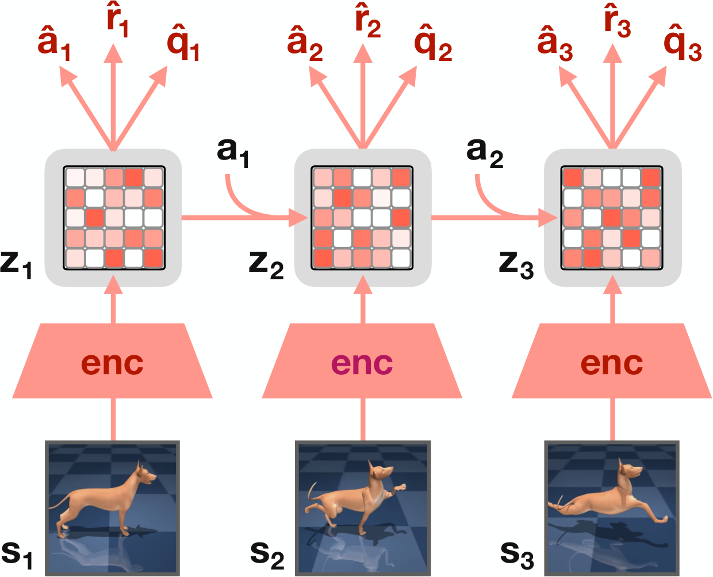
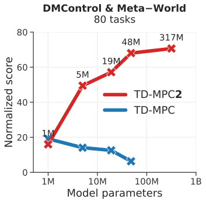
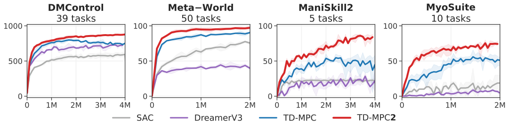
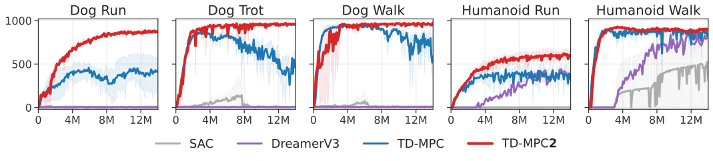
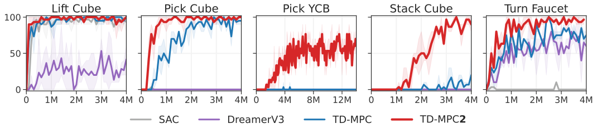
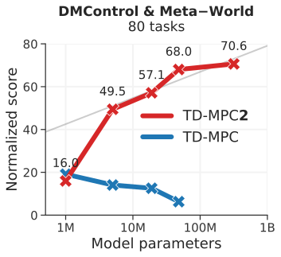
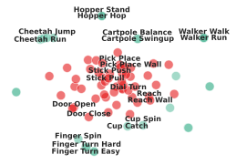
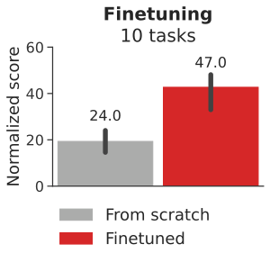
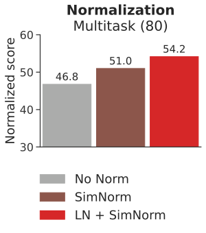

# TD-MPC2: Scalable, Robust World Models for Continuous Control

아카이브 #3 · 2026-09-30 · arXiv 2310.16828v2 (ICLR 2024) · Nicklas Hansen, Hao Su, Xiaolong Wang (UC San Diego) · 선정 이유: 우선 큐 1번. 김도현이 ws0(4090)에서 공식 체크포인트를 직접 로드해 return 863±12를 재현하고 잠재 월드모델의 horizon별 drift(h1 2.9e-5 → h30 6.7e-3)까지 계측한 논문이다. "돌려본 것"을 "수식 수준으로 설명 가능한 것"으로 승격시키는 것이 이번 회차의 목적이다. 아카이브 #2(WISE)가 월드모델을 VLA 사후학습에 붙였다면, 이 논문은 그 월드모델 축의 원류 중 하나다.

---

## 1. 한 줄 요약

**디코더 없는(implicit) 잠재 월드모델 + MPPI 계획 + 정책 prior를 하나의 알고리즘으로 묶고, 단일 하이퍼파라미터 세트로 104개 연속제어 태스크에서 SOTA를 달성한 model-based RL.** 이산 회귀(101-bin 소프트 CE)와 SimNorm 잠재 정규화로 학습을 안정화해, 전작 TD-MPC 대비 최대 300배 큰 317M 파라미터 멀티태스크 월드모델(80태스크, 545M 트랜지션)까지 스케일링했다. 성능은 log(파라미터 수)에 대해 선형으로 증가하며 317M에서도 포화되지 않았다.

## 2. 문제 정의 — model-based RL의 두 가지 고질병

무한 지평 MDP `(S, A, T, R, γ)`에서 기대 감가 return을 최대화하는 정책 π를 찾는다. TD-MPC 계열은 정책을 명시적으로 학습하는 대신, **학습된 월드모델로 매 스텝 궤적 최적화(계획)를 수행해** 행동을 고른다. MPC의 기본 문제는

    π(s_t) = argmax_{a_{t:t+H}}  E[ Σ_{i=0}^{H} γ^{t+i} R(s_{t+i}, a_{t+i}) ]        (1)

인데, 지평 H가 유한하므로 이 해는 **시간적으로 국소 최적**일 뿐이다. TD-MPC2는 지평 끝에 학습된 terminal value를 붙여 이 한계를 보정한다(§3.3의 식 6).

전작 TD-MPC가 남긴 실제 문제는 두 가지였다.

1. **강건성**: 태스크마다 하이퍼파라미터를 다시 튜닝해야 했고, 잠재 상태에 제약이 없어 일부 태스크에서 gradient 폭발로 발산했다.
2. **스케일**: 모델을 키워도(1M→) 성능이 일관되게 오르지 않았다. 보상 크기가 태스크마다 달라 연속 회귀 손실의 스케일이 요동치는 것이 한 원인이다.

TD-MPC2의 기여는 새로운 이론이 아니라, 이 두 문제를 정면으로 잡는 **설계 개선의 집합**이다. 그 결과 "같은 하이퍼파라미터로 104개 태스크" + "80태스크 317M 멀티태스크 모델"이 가능해졌다.

## 3. 방법 — 수식 전개

### 3.1 다섯 개의 구성요소 (모두 MLP)

관측 s, 행동 a, 잠재 z, 학습 가능한 태스크 임베딩 e에 대해:

    Encoder        z  = h(s, e)         관측 → 잠재
    Latent dynamics z' = d(z, a, e)     잠재 공간 forward dynamics
    Reward         r̂  = R(z, a, e)     트랜지션의 보상 예측
    Terminal value q̂  = Q(z, a, e)     감가 return 예측
    Policy prior   â  = p(z, e)         Q를 최대화하는 행동 예측     (2)

핵심 설계 철학: **관측을 복원(decode)하지 않는다.** 픽셀·고차원 상태의 장기 예측은 어렵고 제어에 꼭 필요하지도 않으므로, "행동 시퀀스가 주어졌을 때 결과(보상·가치)를 정확히 맞히는" 최소한의 모델만 학습한다. 이것이 implicit world model이며, 저자들은 이 절제가 **적당한 모델 크기로 대규모 데이터를 소화하는 열쇠**라고 주장한다. 정책 prior p는 planner의 샘플링을 유도하고 TD 학습 비용을 줄이는 보조 역할이다.

### 3.2 모델 목적함수 — 세 항의 시간 감쇠 합

리플레이 버퍼 B에서 길이 H 구간 (s, a, r, s')_{0:H}를 샘플링해, h·d·R·Q를 공동 최적화한다.

    L(θ) = E[ Σ_{t=0}^{H} λ^t ( ‖z'_t − sg(h(s'_t))‖²₂  +  CE(r̂_t, r_t)  +  CE(q̂_t, q_t) ) ]        (3)

각 항을 뜯으면:

- **① Joint-embedding 예측** `‖z'_t − sg(h(s'_t))‖²`: 다이나믹스가 예측한 다음 잠재 z'_t를, 실제 다음 관측을 인코딩한 h(s'_t)에 맞춘다. sg는 stop-gradient — 타깃 쪽으로는 역전파하지 않아 표현 붕괴를 막는다(BYOL 계열 아이디어). 재구성 손실의 자리를 이 항이 대신한다.
- **② 보상 예측** `CE(r̂_t, r_t)`: 회귀가 아니라 **log 변환 공간에서 101개 bin에 대한 소프트 크로스엔트로피**(discrete regression)다. 보상의 절대 크기가 태스크마다 수십 배 달라도 손실 스케일이 일정해진다 — 멀티태스크 학습의 전제 조건.
- **③ 가치 예측** `CE(q̂_t, q_t)`: TD 타깃은 `q_t = r_t + γ Q̄(z'_t, p(z'_t))`. Q̄는 Q의 EMA(모멘텀 0.99)이고, 다음 행동은 planner가 아닌 **정책 prior p가 대신 공급**한다(계획을 학습 루프에서 돌리면 비용이 폭증하므로). 역시 101-bin 이산 회귀.
- **λ^t (λ=0.5)**: 미래 스텝일수록 가중치를 지수적으로 낮춘다. 멀리 갈수록 예측 오차가 누적되므로 가까운 스텝의 정확도를 우선한다.

①만 연속 회귀로 남긴 이유: 잠재는 이미 SimNorm으로 정규화돼 있고, z의 차원마다 bin을 두는 이산화는 계산이 비싸다.

### 3.3 정책 prior — 최대 엔트로피 SAC 스타일

    L_p(θ) = E[ Σ_{t=0}^{H} λ^t ( α Q(z_t, p(z_t)) − β H(p(·|z_t)) ) ],   z_{t+1} = d(z_t, a_t),  z_0 = h(s_0)        (4)

gradient는 p에만 흐른다. Q의 크기와 엔트로피 H의 크기가 태스크·학습 단계마다 크게 다르므로 α를 이동 통계(5%–95% 백분위)로 자동 조정한다. 전작의 "가우시안 노이즈 스케줄을 손으로 튜닝한 결정적 정책"을 태스크 불문 하이퍼파라미터로 대체한 것이다.

### 3.4 SimNorm — 잠재를 심플렉스 조각으로

잠재 z를 L개 그룹으로 나누고 각 그룹(차원 V=8)에 softmax를 적용한다.

    z° = [g_1, …, g_L],   g_i = exp(z_{i:i+V}/τ) / Σ_{j=1}^{V} exp(z_j/τ)        (5)

각 그룹의 합이 1이 되므로 전체 z의 ℓ₂-norm이 작게 유지되고, softmax의 성질상 표현이 자연스럽게 **희소한 쪽으로 편향**된다. 해석: VQ-VAE의 "one-hot 코드 벡터 묶음"의 연속 완화판이다. τ→∞면 정확히 one-hot(이산 코드), τ=0이면 균등 분포(정보 소멸). 기본값 τ=1로 그 사이의 부드러운 지점을 쓴다. 절제 실험에서 SimNorm 제거 시 학습이 불안정해지는 것이 확인됐다 — **gradient 폭발로 발산하던 TD-MPC의 병을 고친 핵심 부품**. 여기에 Q 앙상블 5개(1% dropout, TD 타깃은 무작위 2개의 min)로 가치 과대추정을 눌렀다.

### 3.5 계획 — 정책 prior가 유도하는 MPPI

행동 선택은 매 스텝 MPPI(derivative-free 샘플링 최적화)로 한다. 시간 종속 대각 가우시안 N(μ, σ²), μ,σ ∈ R^{H×m}의 파라미터를 다음을 최대화하도록 반복 갱신한다.

    μ*, σ* = argmax E_{a_{t:t+H} ~ N(μ,σ²)} [ γ^H Q(z_{t+H}, a_{t+H}) + Σ_{h=t}^{H−1} γ^h R(z_h, a_h) ]        (6)

절차: 후보 행동 시퀀스 512개를 샘플링(그중 24개는 정책 prior p의 rollout에서) → 잠재 공간에서 d로 굴려 보상 합 + 지평 끝 가치로 평가 → 상위 64개(elite)의 가중 평균으로 μ, σ 갱신 → 6회 반복(행동 차원 ≥ 20이면 +2회) → 첫 행동 a_t ~ N(μ*_t, σ*_t)만 실행. 이전 스텝의 해를 1칸 시프트해 warm-start한다.

식 6의 요점 두 가지. **지평이 H=3으로 매우 짧다** — 대신 `γ^H Q` 항이 지평 너머를 부트스트랩해 식 1의 국소성을 보정한다. 그리고 **계획이 잠재 공간에서만 일어난다** — 픽셀을 한 장도 생성하지 않고 512×(3스텝) rollout을 배치로 평가한다.

### 3.6 멀티태스크 — 임베딩·패딩·마스킹 세 가지로 끝

- **학습 가능한 태스크 임베딩 e** (96차원): 다섯 구성요소 전부에 조건으로 들어가고, `‖e‖₂ ≤ 1` 제약으로 안정화. 새 태스크 파인튜닝 시엔 유사 태스크의 e 또는 랜덤 벡터로 초기화.
- **Zero-padding**: 관측·행동을 도메인 최대 차원에 맞춰 0으로 채워 서로 다른 embodiment를 한 모델에 수용.
- **Action masking**: 무효 행동 차원을 학습·추론 모두에서 마스킹 — 무효 차원의 예측 오차가 TD 타깃을 오염시키거나 엔트로피를 부풀리는 것을 차단.

언어 지시도, 도메인 지식도 없이 이 세 장치만으로 80개 태스크(Meta-World 50 + DMControl 30, 서로 다른 관측·행동 공간)를 단일 모델이 소화한다.

## 4. 피겨와 해설

*Figure 3 (원문): 아키텍처 개요. 관측 s가 인코더 h로 잠재 z가 되고, 다이나믹스 d가 행동 조건으로 z를 굴리며, R·Q가 보상·가치를 예측한다. 계획(MPPI)은 전부 이 잠재 공간 안에서 일어난다 — 디코더가 없다는 점이 Dreamer 계열과의 근본 차이.*

*Figure 1 (원문, 좌): 80태스크 멀티태스크에서 모델 크기별 정규화 점수. TD-MPC2는 1M→317M로 커질수록 단조 상승하지만, 전작 TD-MPC와 SAC는 커져도 오르지 않는다 — "알고리즘이 스케일링을 받쳐주는가"가 이 논문의 핵심 차별점.*

*Figure 4 (원문): 104개 태스크, 4개 도메인(DMControl·Meta-World·ManiSkill2·MyoSuite) 집계 곡선. 단일 하이퍼파라미터 세트로 SAC·DreamerV3·TD-MPC를 전 도메인에서 상회. MyoSuite는 사전 실험 없이 낸 결과라는 점이 강건성 주장의 근거.*

*Figure 5 (원문): Dog·Humanoid 등 고차원(A ∈ R³⁸) locomotion. TD-MPC는 gradient 폭발로 발산하는 지점이 있고 DreamerV3는 Dog에서 수치 불안정 — TD-MPC2만 안정적으로 학습.*

*Figure 6 (원문): ManiSkill2 다물체·pick-YCB 계열 조작 성공률. 정밀 파지(lift/pick/stack)에서 DreamerV3가 고전하는 반면 TD-MPC2는 큰 폭으로 앞선다 — bin picking 관점에서 주목할 결과.*

*Figure 7 (원문, 좌): 80태스크 정규화 점수 vs 모델 크기(1M–317M). 점수가 log(파라미터)에 대해 대략 선형으로 증가하고 317M에서도 포화 기미가 없다.*

*Figure 7 (원문, 우): 학습된 96차원 태스크 임베딩의 t-SNE. Door Open/Close처럼 의미가 비슷한 태스크가 모이는데, 군집 기준은 목적(walk/run)보다 **다이나믹스(embodiment·물체)** — 제어와 강하게 결합된 표현이라는 방증.*

*Figure 8 (원문): 70태스크로 사전학습한 19M 모델을 미학습 10태스크에 온라인 RL로 파인튜닝. 20k 환경 스텝(저데이터 구간)에서 from-scratch 대비 2배 점수.*

*Figure 9 발췌 (원문): 80태스크 멀티태스크에서 정규화(SimNorm 등) 제거 절제. 제거 시 성능이 크게 무너진다 — 스케일링을 가능케 한 것이 화려한 신기능이 아니라 정규화·이산 회귀 같은 안정화 장치임을 보여준다.*

## 5. 실험 결과 — 핵심 숫자

- **범위**: 온라인 RL 104태스크(4개 도메인) + 시각 관측 DMControl 10태스크. 행동 차원 최대 39(MyoSuite 근골격 손), 희소 보상·다물체 조작 포함.
- **기본 모델**: 5M 파라미터, batch 256, UTD 1 — DreamerV3(약 20M, UTD 512), SAC/TD-MPC(batch 512, 태스크별 튜닝) 대비 작은 예산으로 전 도메인 우위.
- **멀티태스크**: 240개 단일태스크 에이전트의 리플레이 버퍼에서 모은 545M 트랜지션(랜덤~전문가 혼합)으로 80태스크 학습. 정규화 점수: 1M→16.0, 5M→49.5, 19M→57.1, 48M→68.0, **317M→70.6**. 학습 비용은 RTX 3090 1장 기준 3.7 / 4.2 / 5.3 / 12 / **33 GPU-day** — 317M도 단일 소비자 GPU로 학습 가능한 수준.
- **Few-shot**: 20k 스텝에서 from-scratch 대비 **2배**.
- **시각 RL**: 하이퍼파라미터 변경 없이 conv 인코더로 교체만 해서 DrQ-v2·DreamerV3와 동급.
- **공개**: 체크포인트 300개+(멀티태스크 12개 포함), 데이터셋, 코드 — tdmpc2.com.

주요 하이퍼파라미터(전 태스크 공통): H=3, MPPI 6회(고차원 +2), population 512, elite 64, prior 샘플 24, Q 5개, bin 101, λ=0.5, SimNorm V=8·τ=1, lr 3e-4(인코더 1e-4), grad clip 20. 감가율은 휴리스틱 `γ = clip((T/5−1)/(T/5), [0.95, 0.995])`(T=액션 리핏 적용 후 에피소드 길이)로 자동 설정 — DMControl(T=500)이면 γ=0.99.

## 6. 한계

- **이산 행동 공간은 미해결.** 저자들 스스로 Atari·Minecraft류에서는 DreamerV3가 강하다고 인정한다(부록 I에서 확장 시도만 제시). "연속 제어의 SOTA"로 읽어야 한다.
- **보상이 필요하다.** 보상 없는 대규모 사전학습(선호·성공 라벨·목표 임베딩 거리 등 일반화된 보상 활용)은 열린 문제로 남겼다.
- 멀티태스크 데이터가 **자기 자신(단일태스크 TD-MPC2)의 리플레이 버퍼**라 데이터 분포가 알고리즘에 우호적이다. 진짜 이종 데이터(원격 조작, 타 알고리즘 궤적)에서의 스케일링은 별개 질문.
- 임베딩 유사도가 다이나믹스 중심이라, **의미·목적 수준의 일반화**(zero-shot 새 태스크)는 이 프레임에서 아직 멀다. 저자들도 "수 자릿수 더 많은 태스크가 필요"하다고 명시.
- 계획이 매 스텝 512×6회 rollout을 요구하므로 추론 비용이 model-free 대비 크다(코드 최적화로 2배 개선했다고 하나 절대 비용은 남는다).

## 7. 김도현 연결 — 면접용 한 마디

- **"TD-MPC2는 논문으로만 아는 게 아니라 직접 열어봤다"**: 공식 5M cheetah-run 체크포인트를 로드해 return 863±12(5에피소드, 논문급)를 재현하고, 에이전트 내부의 잠재 월드모델을 open-loop으로 30스텝 굴려 latent MSE 2.9×10⁻⁵(h1) → 2.7×10⁻⁴(h10) → 6.7×10⁻³(h30), 보상 예측 오차 0.006 → 0.12를 계측했다(robotics-lab/outputs/wm_tdmpc2/). **이 drift 곡선이 바로 이 논문이 H=3이라는 짧은 계획 지평 + terminal value 부트스트랩을 택한 이유의 실측 증거다** — h≤3에서는 잠재 오차가 10⁻⁵~10⁻⁴ 수준이라 계획이 신뢰 가능하고, 그 너머는 Q에 맡기는 구조.
- **"implicit world model은 feed-forward 복원과 같은 절제의 철학"**: 리콘랩스에서 per-scene 최적화 대신 feed-forward 3D 복원으로 제품화했듯, TD-MPC2도 픽셀 재구성을 버리고 제어에 필요한 예측(보상·가치)만 남겼다. "무엇을 안 만들지"로 스케일을 얻는 설계를 양쪽에서 봤다고 말할 수 있다.
- **"조작 결과를 읽을 줄 안다"**: Figure 6에서 DreamerV3가 lift/pick/stack 같은 정밀 파지에서 무너지고 TD-MPC2가 앞서는 것은, 빈피킹 개인 프로젝트에서 본 "접촉 순간의 정밀도가 병목"이라는 경험과 정확히 겹친다. 월드모델 계열을 조작에 쓸 때 무엇을 봐야 하는지(성공률 곡선의 도메인별 분해)를 안다.
- 아카이브 연결: #2 WISE가 월드모델 상상을 VLA 사후학습에 붙일 때 전제한 "짧은 rollout만 신뢰 가능"이라는 원칙은, 이 논문의 λ^t 감쇠·H=3 설계 및 내 drift 실측과 같은 이야기다. 다음 큐인 DreamerV3는 같은 문제를 "재구성 있는 생성 모델 + 상상 학습"으로 푸는 대조군으로 읽는다.

## 8. 30초 요약 카드

> **TD-MPC2 (ICLR 2024, UCSD)** — 디코더 없는 잠재 월드모델(인코더·다이나믹스·보상·가치·정책prior, 전부 MLP)을 joint-embedding 예측 + 101-bin 이산 회귀로 학습하고, 행동은 매 스텝 MPPI(H=3, 512 샘플, prior 24개 유도)로 잠재 공간에서 계획해 고른다. SimNorm(심플렉스 softmax 정규화)과 Q-앙상블 5개로 안정화해 **단일 하이퍼파라미터로 104태스크 SOTA**, 80태스크 545M 트랜지션에서 **1M→317M 스케일링**(점수 16.0→70.6, log-선형, 3090 1장 33 GPU-day). 한계: 이산 행동 미해결, 보상 필요, 데이터가 자기 리플레이 버퍼. 내 실측: return 863±12 재현, latent drift h1 2.9e-5 → h30 6.7e-3 — H=3 설계의 근거를 직접 계측.

---

*피겨 출처: Hansen, Su, Wang, "TD-MPC2: Scalable, Robust World Models for Continuous Control", arXiv 2310.16828. 개인 학습용 아카이브.*
