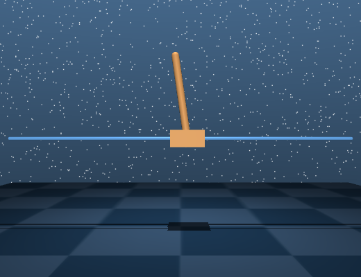
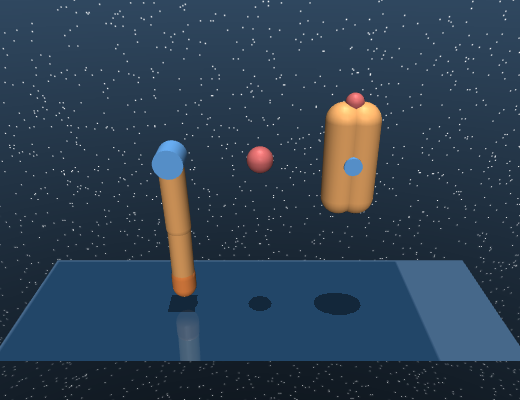
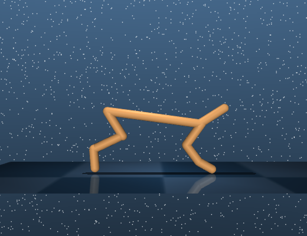
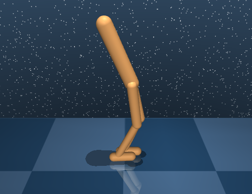
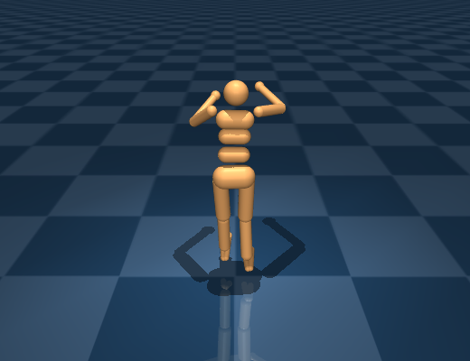
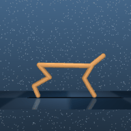

# DMControl — DeepMind Control Suite

*연속제어의 "공용 자" — 모든 태스크의 만점이 1000이 되도록 규격화된 스위트*

Tassa 외, *DeepMind Control Suite*, 2018 (arXiv 1801.00690). MuJoCo 기반. [벤치 지도로 돌아가기](index.md)

## 무엇인가

MuJoCo 위의 **연속제어 태스크 표준 모음**. cartpole·walker·cheetah·humanoid 같은 추상화된 몸(도메인)마다 여러 태스크(walk, run, balance…)가 정의돼 있고, RL 알고리즘 — 특히 [PlaNet](../world-models/planet.md)·[Dreamer](../world-models/dreamer.md)·[TD-MPC](../world-models/tdmpc.md) 계보 — 의 기본 채점장이다.

핵심은 태스크 수가 아니라 **규격화 설계**다(원문 대조):

- **보상이 전 태스크 $r\in[0,1]$** (LQR 도메인 제외) — 스텝당 최대 1.
- **에피소드 길이 1000스텝 고정** — 따라서 모든 태스크의 **return이 [0, 1000]으로 통일**된다. "cheetah 850점"과 "walker 950점"을 같은 축에서 읽을 수 있는 이유이고, 논문들의 "normalized score"가 대개 return/10인 이유다.
- **행동 $a\in[-1,1]^{\dim}$** 규격화 (LQR 제외).
- 관측은 기본 **저차원 물리 상태**(OrderedDict) — 픽셀 관측은 래퍼로 선택. 같은 태스크를 "상태 입력 RL"과 "픽셀 입력 RL" 두 난이도로 쓸 수 있는 구조라, [PlaNet/Dreamer가 "이미지 입력 연속제어"를 주장](../world-models/planet.md)할 때의 그 이미지 모드가 이것이다.

도메인은 원 릴리스 기준 약 20개(pendulum, acrobot, cart-pole, ball-in-cup, point-mass, reacher, finger, hopper, fish, cheetah, walker, manipulator, swimmer, humanoid + 절차 생성 변형·humanoid_CMU·LQR).

## 예시 (자체 렌더)

아래 이미지는 이 스터디에서 **순정 MuJoCo + 공식 suite XML**(google-deepmind/dm_control, Apache-2.0)로 직접 렌더한 것이다(랜덤 행동 수십 스텝 후 프레임).

<figure style="width:31%;min-width:220px;margin:0"><figcaption><em>cartpole — 스윙업·밸런스. 가장 낮은 차원의 고전 제어</em></figcaption></figure>
<figure style="width:31%;min-width:220px;margin:0"><figcaption><em>finger — 손가락으로 스피너 돌리기(spin). 접촉이 들어가는 저차원 조작</em></figcaption></figure>
<figure style="width:31%;min-width:220px;margin:0"><figcaption><em>cheetah — run. 우리 W6 TD-MPC2 재현(863±12)이 뛰는 그 몸</em></figcaption></figure>

<figure style="width:31%;min-width:220px;margin:0"><figcaption><em>walker — 2D 보행체. stand/walk/run 3태스크</em></figcaption></figure>
<figure style="width:31%;min-width:220px;margin:0"><figcaption><em>humanoid — 21-DoF 전신. "Locomotion" 난이도 축의 시작</em></figcaption></figure>
<figure style="width:31%;min-width:220px;margin:0"><figcaption><em>우리 실측 — TD-MPC2 공식 체크포인트가 cheetah-run을 제어하는 롤아웃(<a href="../wm.html">W6</a>)</em></figcaption></figure>

## 왜 중요한가 / 어떻게 읽나

- **모델 기반 RL 계보의 기본 채점장**: [PlaNet](../world-models/planet.md)(6태스크) → [Dreamer](../world-models/dreamer.md)(20태스크) → [DreamerV3](../world-models/dreamerv3.md)·[TD-MPC](../world-models/tdmpc.md)로 이어지는 모든 비교의 공통분모. 논문 간 비교 시 반드시 확인할 것: **상태 입력인가 픽셀 입력인가**, 그리고 상호작용 예산(100k/500k/1M 스텝).
- **Locomotion 서브셋**: TD-MPC2 Figure 1의 "Locomotion 7 tasks"는 별도 벤치가 아니라 DMControl의 **Humanoid·Dog embodiment** 서브셋이다(원문 확인) — 자유도가 커서 스위트 안의 최고 난이도 축이고, [TD-MPC가 "Dog 최초 해결"](../world-models/tdmpc.md)을 주장한 무대가 바로 여기다.
- 우리 실측 연결: [W6](../wm.md)에서 TD-MPC2 5M 체크포인트로 cheetah-run **return 863±12**(논문급)를 재현하고, 내부 latent 모델의 horizon drift(h1 2.9e-5 → h30 6.7e-3)까지 측정했다.

## 한계·주의

- **추상 몸·무의미 관측**: 태스크가 기하적으로 깨끗해서(단색 배경·마커 없는 몸) 실로봇 인지의 어려움(텍스처·조명·가림)이 전혀 반영되지 않는다 — "DMControl 픽셀 모드 잘함"과 "실카메라 잘함" 사이엔 큰 간극이 있다.
- **보상 셰이핑이 잘 돼 있다** — [0,1] 규격 보상은 대부분 dense라, 희소 보상 탐험 능력은 이 스위트로 측정되지 않는다.
- 조작(manipulation) 커버리지가 얕다 — 그 축은 [Meta-World](metaworld.md)·[ManiSkill](maniskill.md)이 담당.
