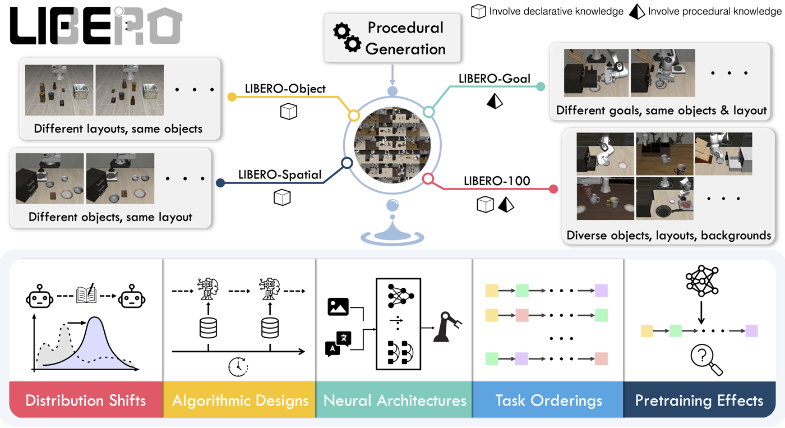

# LIBERO

*언어 조건 조작의 표준 채점장 — 우리가 OpenVLA로 직접 돌린 그 벤치*

Liu 외, *LIBERO: Benchmarking Knowledge Transfer for Lifelong Robot Learning*, NeurIPS 2023 (arXiv 2306.03310). robosuite(MuJoCo) 기반, Franka 팔. [벤치 지도로 돌아가기](index.md)

## 무엇인가

**언어 지시 조건부 조작** 벤치 — "pick up the black bowl … and place it on the plate" 같은 문장이 태스크 정의다. 총 **130개 태스크**(원문 확인)를 **네 스위트**로 나눠, 정책이 **어떤 종류의 지식**을 전이하는지 분리 측정하도록 설계됐다:

| 스위트 | 태스크 수 | 무엇을 분리해 재나 |
|---|---|---|
| LIBERO-**Spatial** | 10 | 같은 물체들, **배치**(공간 관계)만 변화 — 공간 지식 |
| LIBERO-**Object** | 10 | 같은 배치, **물체 종류**만 변화 — 물체 지식 |
| LIBERO-**Goal** | 10 | 같은 물체·배치, **목표**(무엇을 하라)만 변화 — 절차 지식 |
| LIBERO-**100** | 100 | 혼합·장기 과제(짧은 90 + 장기 10 = **LIBERO-Long**) |

- 씬·태스크는 **BDDL**(행동 도메인 정의 언어) 기술에서 절차 생성되고, **성공 판정도 BDDL goal 술어**가 내린다 — 우리가 짠 룰이 아니라 벤치 네이티브 판정이라는 점이 "재현"의 조건이었다([VLA 실측](../vla.md)).
- 각 태스크에 **사람 텔레옵 시연 데이터**가 딸려 있다 — 즉 LIBERO는 **환경(벤치)이면서 데이터셋**이다. 원 논문은 lifelong learning(순차 학습·망각) 벤치로 설계했지만, 현재는 **VLA 파인튜닝·평가의 사실상 표준**으로 더 널리 쓰인다([OpenVLA](../reviews/openvla.md)·[π0](../reviews/pi0.md)·[Octo](../reviews/octo.md) 전부 이 벤치로 비교).

## 예시 (우리 실측 자산 + 공식 figure)

<figure style="margin:0"><figcaption><em>공식 개요 figure — 네 스위트가 각각 어떤 변화축(배치/물체/목표/장기 혼합)을 고립시키는지. 출처: Lifelong-Robot-Learning/LIBERO 저장소(MIT).</em></figcaption></figure>

<figure style="width:48%;min-width:260px;margin:0"><video src="../_static/vla_ok1.mp4" controls loop muted playsinline style="width:100%;border-radius:8px"></video><figcaption><em>우리 롤아웃(성공) — OpenVLA-7B가 LIBERO-Spatial 태스크 수행. 20ep 실측 80%</em></figcaption></figure>
<figure style="width:48%;min-width:260px;margin:0"><video src="../_static/vla_fail.mp4" controls loop muted playsinline style="width:100%;border-radius:8px"></video><figcaption><em>우리 롤아웃(실패) — 애매한 위치에서 grasp을 놓치는 대표 실패 모드</em></figcaption></figure>

<figure style="margin-top:8px"><figcaption><em>같은 LIBERO 씬에 임베디드 추론 VLM(ER 2)을 붙인 우리 실험 — pick(초록)·place(주황) 포인팅. 실행(VLA)과 추론(VLM)의 분업 실험장으로도 쓰인다(<a href="../vla.html">VLA 페이지</a>).</em></figcaption></figure>

## 우리 실측 요약

[VLA 페이지](../vla.md)에서 OpenVLA 공식 체크포인트로 4-suite를 재현했다(20ep/suite): **spatial 80 / object 85 / goal 85 / long 45, 평균 74%** — 논문 500ep 값(76.5%)과 패턴 정합(long이 최난이도). 자체 LoRA 파인튜닝의 0.45-epoch bounded run은 0%로, norm stats 점검을 통해 버그가 아닌 undertrain임을 확인 — "체크포인트 재현"과 "학습시켜 쓸 만하게"의 간극을 이 벤치에서 실측했다.

## 왜 중요한가 / 어떻게 읽나

- **VLA 논문 숫자의 공용 축**: 요즘 VLA 비교표의 대부분이 LIBERO 4-suite 성공률이다. 읽을 때 확인할 것 — **에피소드 수**(논문 500ep vs 약식 재현), **suite별 분리 보고 여부**(평균만 내면 long의 난이도가 가려진다), 그리고 카메라·전처리 규약(center-crop 등).
- **스위트 설계 자체가 교훈**: "일반화"를 한 숫자로 재지 않고 **변화축을 고립**시킨 설계(배치만/물체만/목표만) — 벤치를 만들 때 무엇을 통제해야 하는지의 교과서적 예. 우리 [grasp A/B](../grasp_sota.md)의 walled/open 두 조건 설계와 같은 사상이다.
- [Meta-World](metaworld.md)와의 대비: 같은 탁상 조작이지만 Meta-World=**보상 RL·상태 관측**, LIBERO=**언어 조건 모방·픽셀 관측** — 신호와 관측이 달라 점수를 섞어 읽으면 안 된다.

## 한계·주의

- **시뮬 전용·단일 embodiment**: Franka+robosuite 조합 — 실기·타 로봇 이식성은 벤치 밖 문제다.
- **시연 품질 상한**: 모방 벤치라 정책 성능이 시연 분포에 종속 — 벤치 점수가 "알고리즘+데이터"의 합작이라는 걸 잊으면 안 된다.
- lifelong learning 벤치로서의 원 설계(순차 학습·망각 측정)는 VLA 유행 속에 덜 쓰인다 — 논문이 주장한 용도와 커뮤니티 용도가 갈라진 사례.
