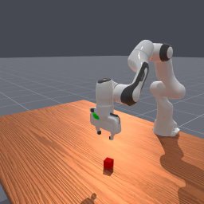
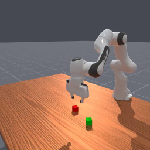
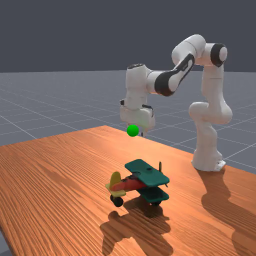
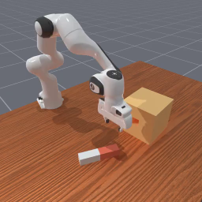

# ManiSkill (ManiSkill2)

*물체 다양성으로 일반화를 재는 조작 벤치 — 20 태스크 패밀리, 2000+ 물체, 시연 4M+ 프레임*

Gu 외, *ManiSkill2: A Unified Benchmark for Generalizable Manipulation Skills*, ICLR 2023 (arXiv 2302.04659). SAPIEN 시뮬레이터 기반. 현행 버전은 ManiSkill3로 계승. [벤치 지도로 돌아가기](index.md)

## 무엇인가

SAPIEN 물리 엔진 위의 **일반화 지향 조작 벤치**. 원문 대조 기준:

- **20개 태스크 패밀리 · 2000+ 물체 모델 · 4M+ 시연 프레임** — "같은 태스크, 다른 물체"로 일반화를 잰다는 설계.
- 커버 범위가 넓다: **고정/모바일 베이스, 단팔/양팔, 강체/연체(soft-body)** 조작까지 한 인터페이스로.
- **RL·IL·고전 sense-plan-act를 한 프로토콜**로 평가할 수 있게 통일된 인터페이스 — 시연이 딸려 있어 모방학습 벤치로도 쓰인다.
- 시스템 최적화가 명시적 기여: 렌더 서버 구조로 **1 GPU·16 프로세스에서 ~2000 FPS** 샘플 수집(원문) — 조작 RL의 병목이 물리·렌더 처리량이라는 걸 정면으로 다룬 벤치.

대표 태스크(패밀리): PickCube, StackCube, **PickSingleYCB**, PegInsertionSide, TurnFaucet, 서랍/캐비닛 열기(모바일), 연체 태스크 등.

## 예시

이미지 출처: haosulab/ManiSkill 공식 문서 환경 썸네일(Apache-2.0).

<figure style="width:48%;min-width:240px;margin:0"><figcaption><em>PickCube — 큐브를 집어 목표점(초록)으로. 조작 RL의 "hello world"</em></figcaption></figure>
<figure style="width:48%;min-width:240px;margin:0"><figcaption><em>StackCube — 집기 + 정밀 놓기의 합성. 성공 판정이 접촉 상태까지 본다</em></figcaption></figure>

<figure style="width:48%;min-width:240px;margin:0"><figcaption><em>PickSingleYCB — 에피소드마다 다른 YCB 물체(총 74종)를 집는다. TD-MPC2 Figure 1의 "Pick YCB 1 task"가 바로 이것 — 태스크는 하나지만 물체 축 일반화가 관건</em></figcaption></figure>
<figure style="width:48%;min-width:240px;margin:0"><figcaption><em>PegInsertionSide — 옆구멍 페그 삽입. 밀리미터급 정렬 + 접촉 풍부 제어의 대표 난제</em></figcaption></figure>

## 왜 중요한가 / 어떻게 읽나

- **"물체 일반화"를 벤치 1급 시민으로** 만든 스위트다. [Meta-World](metaworld.md)가 태스크 다양성(50개)을 재고 물체는 고정한다면, ManiSkill은 태스크당 **물체 분포**(YCB 74종, 전체 2000+)를 깔아 "처음 보는 기하에서 되는가"를 잰다 — 우리 [grasp A/B](../grasp_sota.md)에서 확인한 "모델은 기하 분포에 민감하다"는 문제의식과 정확히 같은 축.
- **YCB라는 연결고리**: YCB는 실물 로봇 연구의 표준 물체 세트라, 시뮬 벤치와 실기 벤치([GraspNet-1B](../reviews/graspnet.md) 계열 포함)가 같은 물체 어휘를 공유하게 된다 — sim-to-real 비교의 공통분모.
- TD-MPC2 Figure 1에서 ManiSkill2 5태스크 중 Pick YCB만 따로 뽑아 보여준 건, **한 태스크 안의 물체 일반화가 스위트에서 가장 어려운 축**이라는 뜻으로 읽으면 된다.

## 한계·주의

- **버전 주의**: ManiSkill2(논문 기준) → ManiSkill3로 API·태스크 구성이 진화했다 — 논문 간 수치 비교 시 버전·태스크 정의를 맞춰야 한다(이 페이지 수치는 2302.04659 기준).
- 시연 기반 IL 트랙은 시연의 질·수집 방식에 성능이 종속된다 — "벤치 점수"가 알고리즘만의 점수가 아니게 되는 지점([UMI](../reviews/umi.md)의 문제의식).
- 연체·모바일 축은 커버는 되지만 태스크 수가 얇다 — 깊은 검증은 별도 벤치의 몫.
