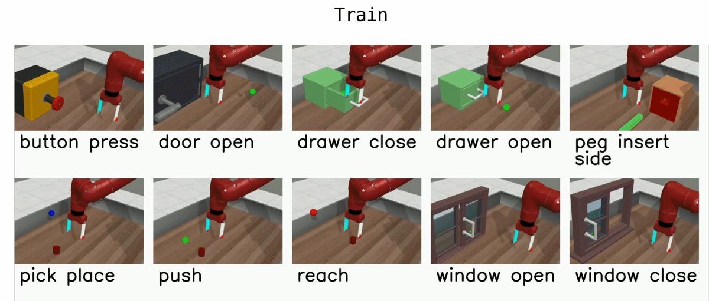
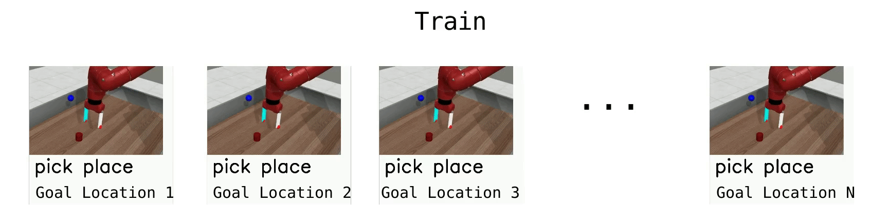
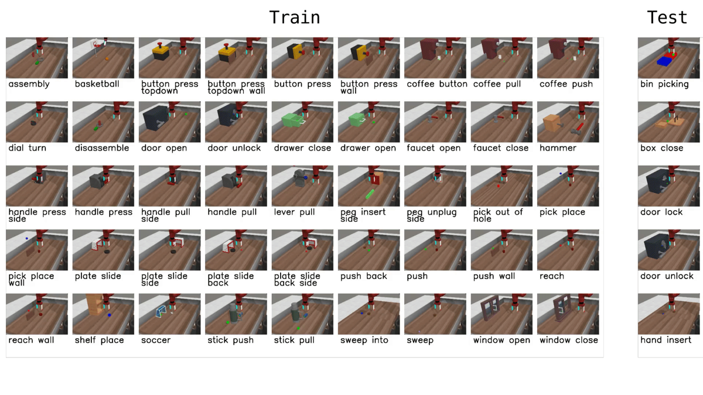

# Meta-World

*한 팔, 50가지 일 — 멀티태스크·메타러닝을 위해 설계된 조작 스위트*

Yu 외, *Meta-World: A Benchmark and Evaluation for Multi-Task and Meta Reinforcement Learning*, CoRL 2019 (arXiv 1910.10897). MuJoCo 기반. [벤치 지도로 돌아가기](index.md)

## 무엇인가

시뮬레이션 **Sawyer 팔 하나**가 탁상 위에서 수행하는 **50개 조작 태스크**의 모음. reach·push·pick-place부터 door-open, drawer-close, button-press, peg-insert-side, window-open, sweep, hammer, basketball, dial-turn, faucet-open, coffee-push, bin-picking까지 — "조작의 어휘"를 한 벌로 모았다.

설계의 요점(원문 대조):

- **공유 embodiment·공유 공간**: 모든 태스크가 같은 팔, 같은 **39차원 관측**(안 쓰는 좌표는 0으로 패딩), 같은 행동 공간 — **EE 3D 변위 + 그리퍼 토크**의 4차원. 태스크가 바뀌어도 입출력 형이 같아서 **하나의 정책으로 여러 태스크**를 배우는 실험이 성립한다.
- **파라메트릭 변형**: 각 태스크 안에서 물체·목표 위치가 랜덤화된다 — "한 자세 암기"가 아니라 태스크 분포를 배우게 강제.
- **채점 = 성공률**: 보상이 아니라 $\|o-g\|_2<\epsilon$(예: 5cm) 같은 **거리 임계 기반 성공 판정** — 태스크마다 보상 스케일이 달라도 비교 가능하게.

## 프로토콜 — MT와 ML을 구분해 읽어야 한다

Meta-World의 진짜 기여는 태스크 50개가 아니라 **평가 프로토콜의 표준화**다:

| 프로토콜 | 종류 | 내용 |
|---|---|---|
| **MT10 / MT50** | 멀티태스크 RL | 10개/50개 태스크를 **한 정책**으로 동시 학습(태스크별 목표 변형 포함 500/2,500개) — "다 배울 수 있나" |
| **ML1** | 메타RL | 태스크 1개 안에서 목표 변형에 few-shot 적응 — "변형 일반화" |
| **ML10 / ML45** | 메타RL | 10/45개 태스크로 메타학습 → **본 적 없는 5개 태스크**에 적응 — "새 태스크 일반화" |

[TD-MPC2](../world-models/tdmpc.md)의 "50 tasks" 막대와 80태스크 멀티태스크 에이전트(Meta-World 50 + DMControl 30)는 이 중 MT 계열 사용법이다.

## 예시

이미지 출처: Farama-Foundation/Metaworld 공식 문서(MIT 라이선스).

<figure style="margin:0"><figcaption><em>MT10 — 한 정책이 동시에 배우는 10개 태스크(reach·push·pick-place·door-open·drawer-close·button-press·peg-insert·window-open/close·기타). 같은 Sawyer 팔·같은 탁상이라는 공유 구조가 보인다.</em></figcaption></figure>

<figure style="width:48%;min-width:260px;margin:0"><figcaption><em>MT1(단일 태스크) 롤아웃 — 목표 위치가 에피소드마다 바뀌는 파라메트릭 변형</em></figcaption></figure>
<figure style="width:48%;min-width:260px;margin:0"><figcaption><em>ML45 — 45개로 메타학습 후 미지 5개(오른쪽 분리 표시)에 적응하는 최대 난이도 프로토콜</em></figcaption></figure>

## 왜 중요한가 / 어떻게 읽나

- **"멀티태스크 조작"의 사실상 표준 축**. 논문에서 Meta-World 숫자를 보면 먼저 **어느 프로토콜인지**(MT10인가 MT50인가 ML인가)와 **성공 판정 버전**(v1/v2 환경 개정으로 수치 호환이 깨지는 구간이 있다)을 확인해야 한다.
- **VLA와의 위치 관계**: Meta-World는 **보상 기반 RL**의 조작 벤치이고, [LIBERO](libero.md)는 **언어 조건 모방**의 조작 벤치다 — 같은 "탁상 조작"이라도 신호(보상 vs 시연)와 채점 문화가 다르다([Concepts](../concepts.md)의 VLA vs WM-RL 구분과 같은 축).
- 우리 트랙 연결: 관측 39차원에 "안 쓰는 좌표 0 패딩"이라는 설계는 [VLA의 이질 데이터 통일](../vla.md) 문제의 작은 선례다 — 태스크 간 인터페이스를 맞춰야 하나의 정책이 선다.

## 한계·주의

- **탁상·단일 팔·저마찰의 세계**: clutter·가림·정밀 힘 제어가 거의 없다 — 우리 [bin picking 실측](../grasp_sota.md)에서 본 "쐐기·기움" 같은 실패 모드는 이 벤치에 없다.
- **상태 관측 중심**: 표준 프로토콜은 물체 위치를 상태로 준다 — 인지 난이도가 0이라, perception 병목([perception](../perception.md)의 주제)이 측정되지 않는다.
- 파라메트릭 변형은 위치 변형이지 **물체·기하 다양성**이 아니다 — 그 축은 [ManiSkill](maniskill.md)(2000+ 물체)이 담당.
