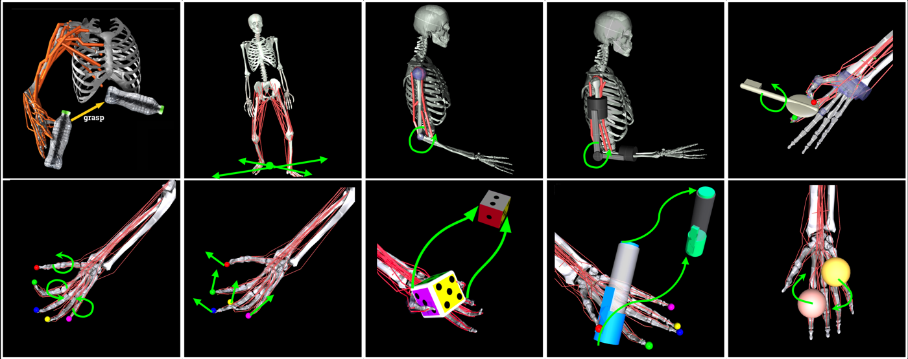
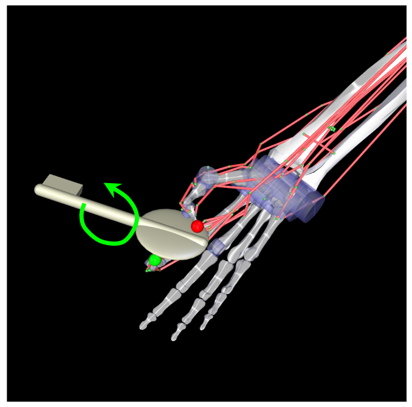
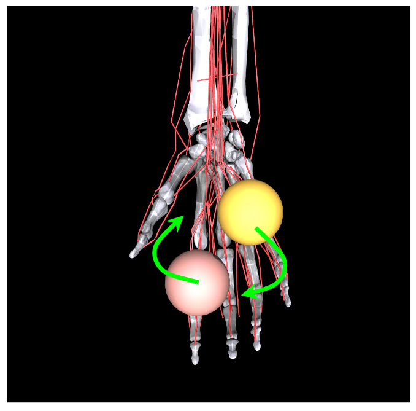
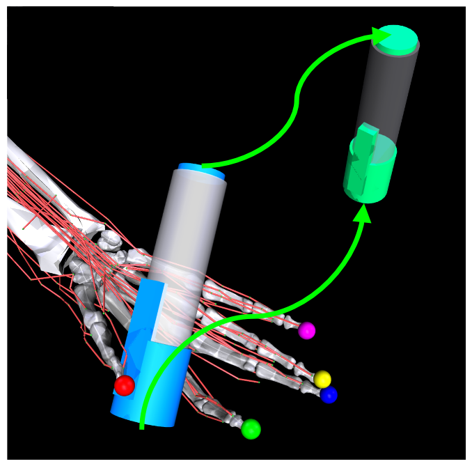

# MyoSuite

*토크가 아니라 근육으로 — 근골격 제어 벤치 (29뼈·23관절·39근육의 손)*

Caggiano 외, *MyoSuite: A contact-rich simulation suite for musculoskeletal motor control*, 2022 (arXiv 2205.13600). MuJoCo 기반. [벤치 지도로 돌아가기](index.md)

## 무엇인가

보통의 제어 벤치는 관절에 **토크**를 직접 넣는다. MyoSuite는 그 자리를 **생리학적으로 정확한 근육-힘줄 모델**로 바꾼 벤치다 — 제어 입력이 "관절 토크"가 아니라 "근육 활성(activation)"이 된다. 원문 대조 기준 세 가지 모델:

| 모델 | 구성 |
|---|---|
| **MyoFinger** | 4-DoF 손가락, 단순화된 길항 근육-힘줄 5개 |
| **MyoElbow** | 1-DoF 팔꿈치, 근육 6개(굴근 3 + 신근 3) |
| **MyoHand** | **뼈 29 · 관절 23 · 근육-힘줄 39** — 전완·손목·손 전체 |

태스크는 9개 패밀리: 관절 자세 맞추기(finger/elbow/hand pose), 손끝 도달(reach), **열쇠 돌리기(key turn), 물체 쥐고 유지(object hold), 펜 돌리기(pen twirl), 바오딩 볼 2개 회전(baoding balls)**, 주사위 재배향 등 — 자세 제어에서 손안 조작(in-hand manipulation)까지. OpenSim 참조 모델과 **수치적으로 동등**하면서 시뮬 속도는 **2자릿수(100배) 빠르다**는 것이 엔지니어링 기여(원문).

## 왜 근육 제어가 유독 어려운가 (원문의 논지)

1. **과작동(overactuation)**: 사람은 관절 ~300개를 근육 ~600개로 움직인다 — 자유도보다 액추에이터가 많아, 같은 동작을 만드는 활성 조합이 무한히 많다(근육 시너지의 존재 이유).
2. **단방향 구동**: 근육은 **당기기만** 한다 — 미는 토크가 없으므로 모든 관절이 길항쌍(agonist–antagonist)으로 제어돼야 한다. 토크 제어에는 없는 구조적 제약.
3. **3차 동역학**: 신경 신호 → 근육 활성(activation dynamics) → 수축 동역학 → 그 다음에야 2차 강체 동역학 — 제어 입력과 힘 사이에 지연·비선형 층이 두 겹 더 있다.

즉 같은 "reach"라도 토크 팔([DMControl](dmcontrol.md))과 근육 팔(MyoSuite)은 최적화 지형이 다르다 — [TD-MPC2](../world-models/tdmpc.md)가 MyoSuite 10태스크를 평가축에 넣은 건 "하나의 하이퍼로 **행동 공간의 성격이 완전히 다른 도메인**까지 커버되는가"를 보이기 위해서다.

## 예시

이미지 출처: MyoHub/myosuite 공식 문서(Apache-2.0).

<figure style="margin:0"><figcaption><em>스위트 개요 — 팔꿈치·손가락·손 모델과 태스크군. 붉은 선들이 근육-힘줄 경로다(관절 모터가 아니라 이 선들의 장력이 제어 입력).</em></figcaption></figure>

<figure style="width:31%;min-width:200px;margin:0"><figcaption><em>key turn — 열쇠 돌리기. 접촉 + 손가락 협응</em></figcaption></figure>
<figure style="width:31%;min-width:200px;margin:0"><figcaption><em>baoding balls — 손바닥 안 공 2개 회전. 스위트 최고 난이도의 손안 조작</em></figcaption></figure>
<figure style="width:31%;min-width:200px;margin:0"><figcaption><em>pen twirl — 펜 돌리기. 굴리기·재파지의 연속 접촉</em></figcaption></figure>

## 왜 중요한가 / 어떻게 읽나

- **행동 공간 다양성의 극단**을 담당한다. 벤치 지도에서 DMControl=추상 토크, Meta-World/ManiSkill=EE·그리퍼, MyoSuite=**근육 활성** — "행동이 무엇인가"가 벤치마다 다르고, 이걸 뭉뚱그리면 비교가 무의미해진다([index의 4축 독해](index.md)).
- 손안 조작(바오딩·펜)은 로봇 다지 핸드 연구와 겹치는 문제다 — [MANO 손 모델](../reviews/smpl-mano.md)·[핸드 리타게팅](../hand_pose.md) 트랙과 "손의 자유도를 어떻게 다루나"라는 질문을 공유한다.
- 바이오메카닉스와 RL의 접점: 재활·보철·인체 시뮬 쪽 응용이 이 벤치의 존재 이유 중 하나 — 로봇 벤치들과 목적이 다르다는 걸 알고 읽어야 한다.

## 한계·주의

- **손·팔 국소 모델**: 전신 근골격이 아니라 상지 중심(후속 확장으로 다리·몸통 모델이 추가되는 흐름이나, 원 논문 범위는 elbow/wrist·finger/hand).
- 근육 모델의 생리학적 충실도와 시뮬 속도의 절충 — "수치적으로 OpenSim과 동등"은 참조 조건 하의 주장이고, 실제 인체 검증은 별도 문제.
- 관측이 상태 기반 — 시각·촉각 인지는 범위 밖.
