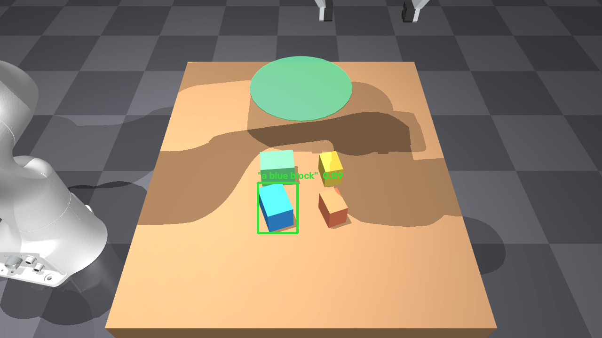

# 컨텍스트 전달 — "이걸 집어라"가 어떻게 로봇에 전해지나

앞의 매니퓰레이션 태스크들([Manipulation](manipulation.md)의 스태킹·삽입·소팅)은 "무엇을 집나"가 **코드 규칙에 박혀** 있었다(최상단 우선 등). 그럼 실제로 "이걸 집어라"라는 **컨텍스트/의도**는 런타임에 어떻게 전달되나? 이 질문을 세 단계로 나눠 실증한다.

## L1 — 기호·공간 포인터 (학습 없음)

런타임 명령으로 타겟을 지정하면, 그 명령은 **인지된 물체 리스트에 대한 선택 규칙**으로 해석된다:

- `color=blue` → 세그멘테이션 마스크 평균 RGB를 명령 색과 최근접 매칭
- `point=x,y` (world mm) → 좌표에 가장 가까운 물체
- `size=large|small` → footprint 면적 최대/최소

**같은 씬·같은 seed, 명령만 바꾸면 다른 물체**를 집는다:

| 명령 | 선택된 물체 |
|---|---|
| `color=blue` | bid12 |
| `color=green` | bid14 |
| `point=(530,-60)` | orange bid13 |
| `size=large` | footprint 최대 물체 |

전부 정확. 명령이 "무엇을"을 정하고, 인지([marker-less ICP](perception.md) top-face 중심)·DLS IK·제어는 그대로 재사용된다. 즉 이 단계는 학습이 아니라 **기하적 선택 규칙**이다 — 물체 리스트를 만드는 perception과, 좌표를 잡는 grasp 파이프라인은 그대로 두고, "어떤 인덱스를 고를지"만 명령이 바꾼다.

:::{dropdown} 해부 — 선택 규칙의 실제 코드 (`src/pick_goal.py` 발췌)
**입력**: 명령 문자열 + 인지된 물체 리스트(`perceive()` 출력 + 물체별 평균 RGB·픽셀 면적). **출력**: 물체 하나(`bid`). 100% 룰베이스 — 세 규칙이 전부 `min`/`max` 한 줄이다:

```python
# 인지 출력에 색·면적을 덧붙인다 (물체별 seg 마스크 평균 RGB — GT 라벨 아님)
for p in perceived:
    m = seg == p["gid"]; mean = rgb[m].mean(0) / 255.0
    info.append(dict(p=p, color=nearest_ref_color(mean), mean=mean, area=int(m.sum())))

# 명령 → 물체 하나 (resolve)
if cmd["kind"] == "color":     # color=blue → 기준색과 평균 RGB 최근접
    target = min(info, key=lambda x: np.linalg.norm(x["mean"] - REF[cmd["val"]]))
elif cmd["kind"] == "point":   # point=x,y → 인지된 중심과 좌표 최근접
    target = min(info, key=lambda x: np.linalg.norm(x["p"]["cxy"] - cmd["val"]))
else:                          # size=large|small → 픽셀 면적 최대/최소
    target = (max if cmd["val"] == "large" else min)(info, key=lambda x: x["area"])
```

이후는 [manipulation 공통 파이프라인](manipulation.md) 그대로: `topdown_R(yaw)` → `dls_ik` → `sim`. 판정(`picked_correct`)은 선택된 물체의 GT 색과 명령 색 일치 여부로 자동 채점된다.
:::

<div style="display:flex;gap:12px;flex-wrap:wrap">
<video src="_static/pg_blue_s.mp4" controls loop muted playsinline style="width:31%;min-width:200px;border-radius:8px"></video>
<video src="_static/pg_green_s.mp4" controls loop muted playsinline style="width:31%;min-width:200px;border-radius:8px"></video>
<video src="_static/pg_point_s.mp4" controls loop muted playsinline style="width:31%;min-width:200px;border-radius:8px"></video>
</div>

*좌 color=blue · 중 color=green · 우 point=(530,-60)*

## L2 — 자연어 grounding (OWL-ViT)

L1의 명령은 여전히 기호(`color=`, `point=`)다. L2는 자연어 문장을 **open-vocab 검출기 OWL-ViT**(`google/owlvit-base-patch32`)로 이미지에 직접 접지한다:

문장 `"a blue block"` → OWL-ViT 검출 box → box ∩ **segmentation** → instance 확정 → top-face 중심 → DLS IK → grasp.



*"a blue block" → OWL-ViT 검출→instance*

4개 문장(blue/green/orange/yellow) → **4/4 정확한 물체**. 학습 모델이 관여하는 부분은 **인지(언어 접지)뿐**이고, 동작은 여전히 L1과 동일한 고전 IK/제어다.

:::{dropdown} 해부 — OWL-ViT 인퍼런스 한 사이클 (`wsl/pick_lang.py` 발췌)
L1과의 차이는 "명령 → 물체" resolve 단계 하나가 학습 모델로 바뀐 것뿐이다. **모델 입력**: 문장 1개 + RGB `(720,1280,3)` uint8. **모델 출력**: box `(N,4)` 픽셀 좌표 + score `(N,)`. 나머지(필터·instance 확정·grasp)는 룰베이스다.

```python
# ① 학습: open-vocab 검출 — 텍스트·이미지를 같은 임베딩 공간에서 매칭
inputs = proc(text=[[phrase]], images=img, return_tensors="pt").to("cuda")
out = model(**inputs)                                # OwlViTForObjectDetection
res = proc.post_process_object_detection(out, threshold=0.0, target_sizes=tsz)[0]
boxes, scores = res["boxes"], res["scores"]          # score 내림차순 정렬해 반환

# ② 룰: 스퓨리어스 박스 필터 + segmentation 교차로 instance 확정
for b, s in zip(boxes, scores):                      # score 순으로 첫 통과를 채택
    if box 면적 > 화면의 12% or 한 변 > 300px:        # 씬 전체를 덮는 1등 박스 기각
        continue                                     #   (합성 렌더 도메인갭의 실제 증상)
    objpix = seg[y0:y1, x0:x1]에서 물체 geom 픽셀만
    if objpix.size < 30: continue                    # 박스 안에 실제 물체가 있어야
    gid = np.bincount(objpix).argmax()               # 박스 안 최다 픽셀 물체 = instance
    return box, gid, s

# ③ 룰: 확정된 instance만 기하 인지 → 공통 파이프라인
tc = top_center(model, data, seg, depth, gid, uu, vv)   # top면 grasp 중심 (stack의 보정 재사용)
R = bp.topdown_R(tgt["yaw"]);  → dls_ik → sim
```

caveat 문단의 "필터"가 바로 ②다 — threshold를 0으로 열고(합성 렌더라 confidence 0.01–0.12) **크기 룰 + seg 교차**로 정밀도를 회복한다. 학습 모델의 출력을 그대로 믿지 않고 기하로 검증하는 구조.
:::

**정직한 caveat (계측).** OWL-ViT는 실사 이미지로 학습된 모델이라 합성 렌더에서는 confidence가 낮고(0.01–0.12), 종종 **씬 전체를 덮는 스퓨리어스 박스**를 1등으로 낸다. 이걸 그대로 쓰면 orange/yellow를 물어봐도 blue가 잡히는 오류가 났다. 수정은 **물체 크기 범위의 박스만** 남기고 segmentation과 교차해 instance를 확정하는 필터 — 이후 4/4. 실사 이미지나 도메인 랜덤화 렌더라면 이 필터 없이도 더 견고할 것으로 본다. 학습 grasp 모델들이 겪는 sim 도메인갭([Grasp SOTA](grasp_sota.md))과 같은 뿌리 문제다.

<div style="display:flex;gap:12px;flex-wrap:wrap">
<video src="_static/pl_blue_s.mp4" controls loop muted playsinline style="width:31%;min-width:200px;border-radius:8px"></video>
<video src="_static/pl_orange_s.mp4" controls loop muted playsinline style="width:31%;min-width:200px;border-radius:8px"></video>
</div>

*좌 "a blue block" · 우 "an orange block"*

## L3 — VLA 정책

L1·L2는 인지만 바뀌고 결정과 동작(IK/제어)은 고전 파이프라인 그대로였다. L3는 그 경계를 지운다: 언어+이미지 입력이 **action을 직접** 출력한다 — 인지·결정·IK 전체를 학습된 정책 하나가 대체한다. 재현 결과와 파인튜닝 실험은 [VLA](vla.md) 참고.

## 축: 컨텍스트 전달은 perception 층의 문제

**L1 포인터(기하) → L2 언어 grounding(spatial AI) → L3 VLA(end-to-end).** 단계가 올라갈수록 인지 쪽에 학습·언어가 더 많이 들어가고, 동작(IK/제어)은 더 오래 고전 파이프라인으로 유지된다. "이걸 집어라"라는 컨텍스트가 실제로 꽂히는 자리는 언제나 **perception이 action으로 갈라지는 분기점**이다.

## 재현

```powershell
# L1 (Windows, robotics-env)
python src\pick_goal.py color=green seed=5 --render
```

```bash
# L2 (WSL, zg 환경: torch + transformers 4.44.2 + mujoco)
conda run -n zg python wsl/pick_lang.py "a blue block" seed=5
```
