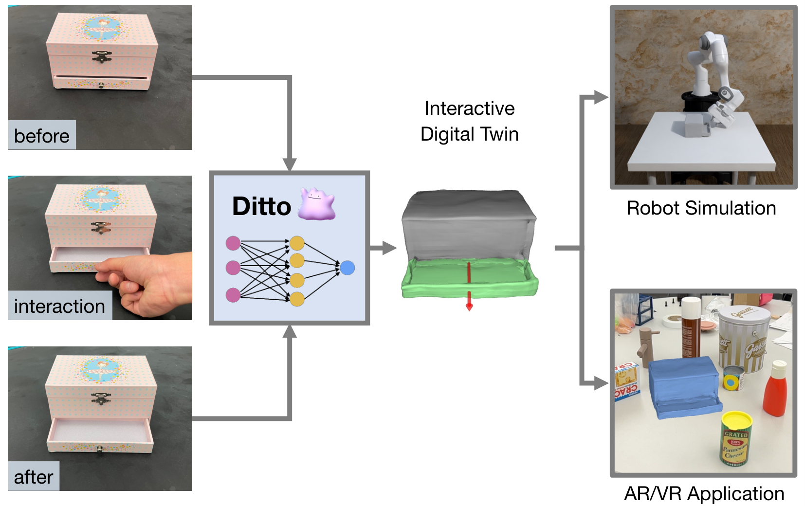
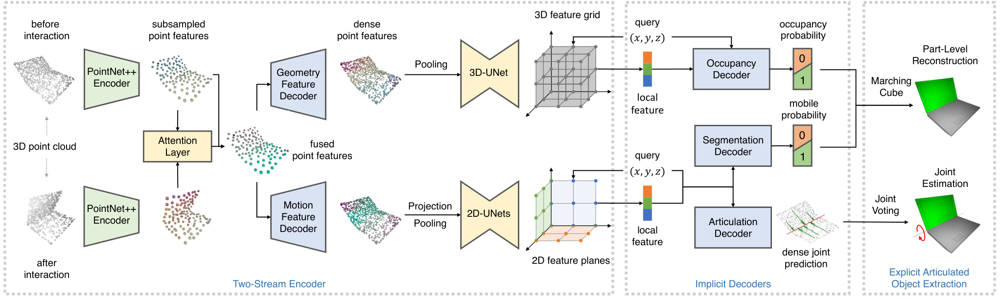
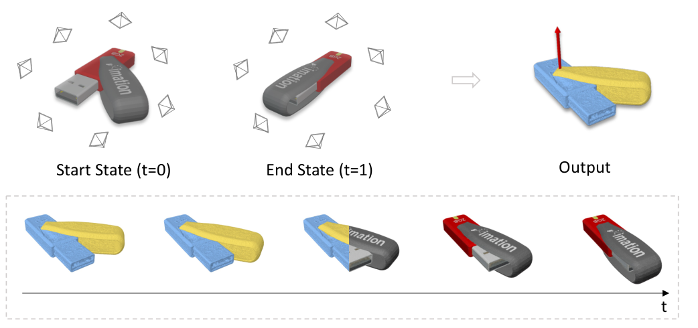
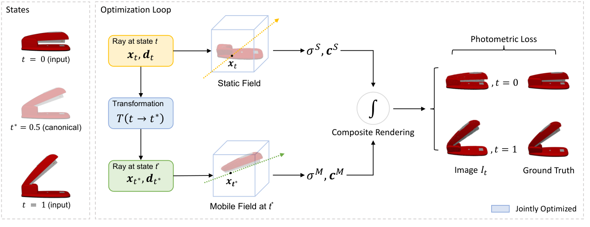

# 관절 구조 추정 (Articulation Estimation) — 정지 스캔에 없는 정보

스캔은 어떤 순간의 기하를 준다. 그러나 캐비닛 문이 **어느 축으로, 어느 범위까지 돌아가는지**는 그 순간의 기하 어디에도 없다. 시뮬레이터에 넣을 관절체(articulated object)를 만들려면 — 부품 분할, 관절 타입, 축, 가동범위 — 를 별도로 추정해야 한다. 이 페이지는 그 문제의 수학과 계보를 정리한다.

## 1. 문제 정의

입력: 물체의 관측(점군·이미지·다중 상태 스캔). 출력:

1. **부품 분할(part segmentation)** — 어디까지가 움직이는 덩어리인가
2. **관절 타입** — revolute(회전) / prismatic(병진) / 고정
3. **관절 파라미터** — 축 방향 $\hat{u}$, (회전이면) 축 위의 한 점 $p$, 가동범위 $[\theta_{min}, \theta_{max}]$
4. (시뮬 투입용) 링크-조인트 트리 — URDF/MJCF/USD의 Joint prim으로 직렬화

## 2. 왜 정지 스캔 한 번으로는 원리적으로 안 되나

관절 파라미터는 **운동의 속성**이지 형상의 속성이 아니다. 같은 기하라도 경첩이 왼쪽에 있을 수도, 오른쪽에 있을 수도 있다. 따라서 가능한 접근은 셋뿐이다:

- **다중 상태 관측**: 닫힌 상태와 열린 상태처럼 두 개 이상의 자세를 보고 운동을 역산 — 가장 직접적이고 정확
- **상호작용**: 로봇이 직접 건드려 상태 변화를 만들어낸 뒤 전후를 비교 (다중 상태의 능동 버전)
- **사전 지식(prior)**: "서랍장은 보통 이렇게 생겼다"는 카테고리 수준 통계를 학습해 한 번의 관측에서 추측 — 빠르지만 본 적 없는 구조에 약함

## 3. 수학 — 두 상태에서 축을 역산하기

움직인 부품의 두 상태 사이 강체 변환 $T = (R, t) \in SE(3)$을 알았다고 하자(대응점 매칭 + Procrustes/Kabsch, 또는 part 정합으로 획득). 이 $T$에서 관절을 읽는다.

**판별 — 회전이냐 병진이냐:**

$$\theta = \arccos\left(\frac{\mathrm{tr}(R) - 1}{2}\right)$$

$\theta \approx 0$인데 $\|t\| > 0$이면 **prismatic**, $\theta > 0$이면 **revolute**다.

**Prismatic**: 축 방향은 그냥 이동 방향이다.

$$\hat{u} = \frac{t}{\|t\|}, \qquad d = \|t\|$$

**Revolute**: 회전축 방향 $\hat{u}$는 $R$의 고유벡터($R\hat{u} = \hat{u}$, 고유값 1). Rodrigues 표현에서 직접 꺼내면

$$\hat{u} = \frac{1}{2\sin\theta}\begin{bmatrix} R_{32} - R_{23} \\ R_{13} - R_{31} \\ R_{21} - R_{12} \end{bmatrix}$$

축이 지나는 점 $p$는 "회전 중 움직이지 않는 점" 조건 $Rp + t = p$에서:

$$(I - R)\,p = t$$

여기서 주의 — $(I-R)$은 축 방향으로 **랭크 결손**(rank 2)이라 $p$는 유일하지 않고 축 위의 어느 점이든 해가 된다. 최소노름 해(의사역행렬)를 쓰거나 축에 수직인 평면에서 푼다. 일반 운동은 screw 운동(축 둘레 회전 + 축 방향 병진 $d = \hat{u}^\top t$)으로 통합 기술된다 — 회전·병진은 screw의 특수 경우다.

**실무 함정 둘:**
- $\theta$가 작으면(문을 조금만 열고 스캔) 축 추정이 노이즈에 극도로 민감해진다 — 두 상태의 변화량을 충분히 벌리는 것이 데이터 품질의 절반.
- 부품 분할이 틀리면(고정부 점이 섞이면) $T$ 자체가 오염된다 — 분할과 운동 추정은 chicken-and-egg라, 최신 방법들은 둘을 공동 최적화한다.

## 4. 계보 — 카테고리 prior에서 상호작용·2상태 복원으로

**Shape2Motion (CVPR 2019)** — 단일 점군에서 가동 부품과 운동 축을 동시 제안하는 초기 학습 접근. "한 번 보고 추측" 계열의 출발점.

**ANCSH (CVPR 2020)** — 카테고리 수준 정규 좌표계(Articulation-aware Normalized Coordinate Space Hierarchy). 같은 카테고리(서랍장류)의 부품·관절을 정규 공간에 정렬해 단일 관측에서 자세·관절 상태를 회귀. 카테고리 밖 일반화가 한계.

**Ditto (CVPR 2022)** — **상호작용 전후의 점군 쌍**을 입력으로, 암시적(implicit) 표현으로 부품 기하를 복원하면서 관절 타입·축·상태를 함께 추정한다. "직접 건드려서 생긴 변화"를 지도 신호로 쓰는 interactive perception의 대표작.

*Ditto pull figure: 상호작용 전후 관측 → 부품 분할 + 관절 파라미터 + 복원된 디지털 트윈. 출처: Jiang et al., "Ditto: Building Digital Twins of Articulated Objects from Interaction", CVPR 2022 (arXiv 2202.08227).*

*Ditto 파이프라인: 두 점군을 인코딩해 대응을 암시적으로 맞추고, 관절 파라미터 헤드와 occupancy 복원 헤드가 갈라진다. 분할·운동·기하를 한 네트워크에서 공동으로 푸는 구조. 출처: 위와 동일.*

**PARIS (ICCV 2023)** — 두 상태(예: 닫힘/열림)의 **다중 시점 이미지**만으로, 고정부·가동부의 NeRF를 분리 학습하면서 관절 파라미터를 동시 최적화한다. 3D 지도도, 분할 라벨도 없이 "두 상태의 렌더링이 맞아떨어지려면 운동이 이래야 한다"는 photometric 신호로 관절을 푸는 것이 요점.

*PARIS: 두 상태의 multi-view 캡처 → 부품 분리 + 관절 축 + 임의 상태 보간 렌더링. 출처: Liu et al., "PARIS: Part-level Reconstruction and Motion Analysis for Articulated Objects", ICCV 2023 (arXiv 2308.07391).*

*PARIS 구조: static field와 mobile field를 분리하고, mobile field를 관절 변환으로 워핑해 두 상태를 모두 설명하도록 공동 최적화. 관절 파라미터가 역전파로 직접 학습된다. 출처: 위와 동일.*

**이후 흐름 (2024~)** — LLM/VLM을 끌어와 부품·관절을 코드(URDF)로 직접 생성하는 시도(Real2Code 등), 비디오에서 운동을 관측해 관절을 붙이는 시도, 메시 생성 모델에 관절을 함께 생성시키는 시도가 이어지고 있다. 공통 방향은 **"기하 복원과 관절 추정을 한 파이프라인에서"**다.

## 5. 시뮬 투입까지 — 출력 직렬화

추정 결과는 결국 [OpenUSD](openusd.md)의 Joint prim(또는 URDF `<joint>`)으로 떨어져야 한다:

- revolute → `RevoluteJoint`(axis, lowerLimit/upperLimit), prismatic → `PrismaticJoint`
- 축·점은 **두 링크 각각의 로컬 프레임**으로 변환해 기록(USD joint는 body0/body1 기준 local pose 쌍으로 정의)
- 가동범위는 관측된 상태 범위 + 여유가 아니라, 가능하면 물리적 한계(닫힘 간섭)로 — 관측 범위만 쓰면 시뮬에서 문이 덜 열린다

## 6. 내 학습 트랙과의 연결

- §3의 축 역산은 **두 자세 간 강체 변환을 분해하는 문제**로, 대응점 매칭 → Procrustes → 파라미터 해석이라는 흐름이 스테레오 계측·정합에서 쓰는 수학과 동일하다. 입력이 "두 카메라"에서 "두 상태"로 바뀌었을 뿐이다.
- 손 관절을 파라메트릭 모델(MANO)로 피팅하는 것은 "구조를 알고 상태를 추정"하는 문제고, 여기는 "구조 자체를 추정"하는 문제다 — forward 모델이 주어졌는가가 두 문제를 가른다.

## 7. 30초 요약

> "관절 파라미터는 운동의 속성이라 정지 스캔 한 번에는 원리적으로 없고, 다중 상태·상호작용·카테고리 prior 중 하나로 보충해야 합니다. 두 상태의 부품 변환 $(R,t)$를 얻으면 회전각으로 타입을 판별하고, 축은 $R$의 고유벡터, 축 위 점은 $(I-R)p=t$의 최소노름 해로 역산합니다 — $(I-R)$이 랭크 2라 점이 축 위에서 자유롭다는 것까지 말하면 끝. 계보는 카테고리 prior(ANCSH)에서 상호작용(Ditto), 2상태 역렌더링(PARIS)으로 왔고, 요즘은 복원과 관절 추정을 한 파이프라인에 넣는 방향입니다."

---
*출처: Jiang et al. 2022 (arXiv 2202.08227), Liu et al. 2023 (arXiv 2308.07391), Wang et al. 2019 Shape2Motion, Li et al. 2020 ANCSH. 피겨는 원문 HTML판에서 학습 목적 인용.*
