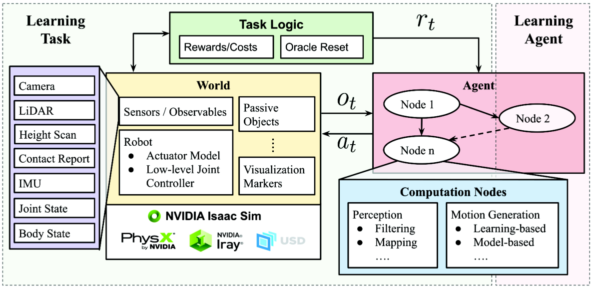
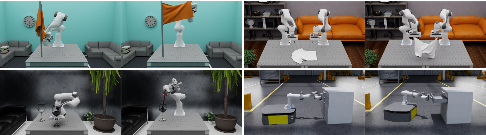

# OpenUSD 기초 — 파일 포맷이 아니라 합성(composition) 엔진

OpenUSD(Universal Scene Description)는 Pixar가 영화 제작 파이프라인용으로 만들어 오픈소스화한 씬 기술 체계다. 디지털 트윈 분야에서 사실상 표준이 된 이유는 "3D 포맷"이어서가 아니라, **여러 사람·여러 도구가 하나의 씬을 비파괴적으로 겹쳐 쓰는 합성 시스템**이기 때문이다. NVIDIA Omniverse·Isaac Sim이 USD를 네이티브 씬 표현으로 쓴다.

## 1. 핵심 개념 다섯 개

| 개념 | 정의 | 비유 |
|---|---|---|
| **Stage** | 열려 있는 씬 전체. 여러 레이어가 합성된 **결과 뷰** | 포토샵에서 "지금 보이는 캔버스" |
| **Prim** | 씬 그래프의 노드. 경로로 식별(`/World/Robot/Arm`) | 트리의 노드 |
| **Attribute / Relationship** | prim이 가진 값(`points`, `mass`) / 다른 prim에 대한 참조 | 속성 / 포인터 |
| **Layer** | 하나의 `.usd` 파일. opinion(값 주장)들의 묶음 | 포토샵 레이어 |
| **Composition** | 레이어·참조를 규칙에 따라 겹쳐 최종 씬을 만드는 과정 | 레이어 블렌딩 |

**비파괴 편집이 핵심이다.** 원본 에셋 파일을 건드리지 않고, 내 레이어에서 "이 로봇의 위치는 여기" 라는 opinion만 얹는다. 같은 attribute에 여러 레이어가 서로 다른 값을 주장하면 **강도(strength) 순서**로 승자가 정해진다.

## 2. Composition arcs — LIVRPS

합성 수단 6종의 강도 순서(강한 것부터):

**L**ocal(현재 레이어의 직접 opinion) → **I**nherits → **V**ariantSets → **R**eferences → **P**ayload → **S**pecializes

실무에서 자주 만나는 셋:

- **SubLayer**: 레이어 위에 레이어를 쌓는다. 팀 작업의 기본 — 조명 레이어, 물리 레이어, 배치 레이어를 분리.
- **Reference**: 다른 파일의 prim을 내 씬에 불러온다. 에셋 재사용의 기본 — 의자 에셋 하나를 100번 참조.
- **VariantSet**: 하나의 prim에 전환 가능한 변형들을 담는다(예: 해상도 high/low, 충돌 메시 on/off). sim-ready 에셋이 시각용/물리용 표현을 variant로 들고 다니는 패턴이 흔하다.

인스턴싱(`instanceable`)을 걸면 참조 100개가 메모리에서 하나로 공유된다 — 대규모 씬(공장 전체)에서 필수.

## 3. Schema — prim에 능력을 부여하는 타입 체계

- **Typed(IsA) schema**: prim의 본질 타입. `Xform`(변환 노드), `Mesh`, `Camera`, `DistantLight` 등.
- **API schema**: 기존 prim에 **추가로 붙이는** 능력. 이름이 `~API`로 끝난다. 물리는 전부 이 방식이다 — 시각용 Mesh prim에 물리 API를 "적용(apply)"하면 시뮬 대상이 된다.

## 4. UsdPhysics — "물리 속성 자동 부여"가 뜻하는 것

스캔→sim-ready 자동화에서 "물리 속성을 부여한다"는 말은 구체적으로 **아래 스키마들을 자동으로 채우는 일**이다.

| 스키마 | 하는 일 | 핵심 속성 |
|---|---|---|
| `RigidBodyAPI` | 이 prim은 강체다 | velocity, kinematicEnabled |
| `CollisionAPI` | 충돌에 참여한다 | approximation(`convexHull`, `convexDecomposition`, `triangleMesh`…) |
| `MassAPI` | 질량 특성 | mass, density, centerOfMass, 관성 대각/축 |
| `MaterialAPI`(physics) | 접촉 재질 | staticFriction, dynamicFriction, restitution |
| **Joint prims** | 관절(prim으로 존재) | `FixedJoint`, `RevoluteJoint`, `PrismaticJoint`, `SphericalJoint`, `D6Joint` — body0/body1 관계, axis, lower/upperLimit |
| `ArticulationRootAPI` | 이 서브트리는 관절체(reduced-coordinate articulation)로 풀어라 | 로봇·캐비닛의 루트에 적용 |
| `DriveAPI` | 관절 구동 | targetPosition/Velocity, stiffness, damping |

읽는 법: **강체 하나 = Mesh + RigidBodyAPI + CollisionAPI + MassAPI**, **관절체 = 링크들 + Joint prim들 + ArticulationRootAPI**. 스캔 파이프라인의 출력이 이 구조를 갖추면 Isaac Sim에 바로 떨어진다.

## 5. MuJoCo MJCF와의 대응표

물리 시뮬 경험이 MJCF 쪽에 있다면 이 표 하나로 개념이 옮겨진다.

| MJCF | USD | 비고 |
|---|---|---|
| `<body>` | Xform + RigidBodyAPI | 링크 |
| `<geom>` (시각/충돌 겸용) | Mesh(시각) + 별도 충돌 Mesh/CollisionAPI | USD는 시각·충돌을 **분리**하는 관례 |
| `<joint type="hinge">` | `RevoluteJoint` prim | MJCF는 body 안에 내장, USD는 독립 prim이 body0/body1을 참조 |
| `<joint type="slide">` | `PrismaticJoint` | |
| `<actuator>` | `DriveAPI` | stiffness/damping이 position servo 역할 |
| `<inertial>` | `MassAPI` | |
| worldbody 계층 | Stage의 prim 트리 | |
| `<default>` 클래스 | 레이어/inherits로 유사 효과 | USD 쪽이 더 일반적인 메커니즘 |

구조적 차이 하나만 기억: **MJCF는 트리에 관절이 내장된 kinematic tree 기술**이고, **USD는 평평한 prim들 사이를 Joint prim이 연결**한다(ArticulationRootAPI가 붙을 때 reduced-coordinate로 해석). 그래서 URDF/MJCF→USD 변환기는 트리를 풀어 joint prim을 생성하는 일을 한다.

## 6. Isaac Sim과의 연관 — USD가 "포맷"이 아니라 "씬 그 자체"인 곳

Isaac Sim은 NVIDIA Omniverse 위에 올라간 로봇 시뮬레이터인데, Omniverse의 설계가 **"열려 있는 씬 = USD Stage"**다. 즉 USD는 Isaac에서 import/export용 교환 포맷이 아니라 **런타임이 직접 읽고 쓰는 내부 상태**다.

**Isaac Sim이 무엇인가** — 세 덩어리로 기억한다: ① **물리(PhysX)**: 강체 충돌·관절·마찰 계산 ② **렌더링(RTX 레이트레이싱)**: 카메라 센서를 시뮬레이션해 실사 수준 합성 이미지를 생성 — perception 학습용 합성 데이터와 카메라 입력 정책 훈련이 여기서 나온다 ③ **씬(USD)**: 이 페이지의 주제. 용도는 세 가지 — 합성 데이터 공장, 로봇 학습장(Sim-to-Real), 디지털 트윈 검증.

**Isaac Sim vs Isaac Lab** — 층이 다르다. Sim은 시뮬레이터 본체(엔진)이고, **Isaac Lab(구 Orbit)은 그 위에 얹힌 로봇 학습 프레임워크**다 — 태스크 정의, 관측·보상 설계, 도메인 랜덤라이제이션, 환경 수천 개의 GPU 병렬 복제, RL 라이브러리 연결을 담당한다. Lab은 Sim 없이 못 돌고, Sim은 Lab 없이도 돈다(디지털 트윈·합성 데이터 용도). MuJoCo 생태계로 치면 Sim≈MuJoCo 엔진, Lab≈dm_control/gym 환경 스위트+학습 러너에 해당한다.

이 구조에서 나오는 결론들:

- **UsdPhysics 스키마가 곧 시뮬 입력이다.** §4에서 본 RigidBodyAPI·CollisionAPI·Joint prim·ArticulationRootAPI를 PhysX 엔진이 그대로 해석해 강체·관절체를 만든다. 스캔 파이프라인이 UsdPhysics를 제대로 채운 USD를 출력하면, 변환 단계 없이 Isaac에 "떨어뜨리면 돌아가는" 에셋이 된다 — sim-ready의 조작적 정의.
- **URDF/MJCF는 임포터를 거쳐 USD로 변환된다.** §5의 대응표가 실제 임포터가 하는 일이다 — kinematic tree를 풀어 링크를 평평한 prim으로 펴고, 관절을 Joint prim으로, 루트에 ArticulationRootAPI를 붙인다. 변환 후 물성(마찰·드라이브 게인)이 보존됐는지 확인하는 것이 실무 체크포인트.
- **GPU 대규모 병렬의 단위도 prim 트리다.** Isaac Lab(구 Orbit)은 환경 하나를 prim 서브트리로 정의하고 그것을 수천 개 복제(cloning)해 한 GPU에서 병렬 시뮬레이션한다 — §2의 instanceable 참조 구조가 여기서 성능을 결정한다.
- **MuJoCo와의 비교 — "Isaac이 더 실제 같다"는 절반만 맞는다.** 축을 나눠야 한다. **시각(렌더링)**은 명확히 Isaac 우위 — RTX 실사 렌더 vs MuJoCo의 기본 OpenGL. 그러나 **물리(접촉 동역학)**는 우열을 단정할 수 없다: MuJoCo는 soft contact를 볼록 최적화로 푸는 모델로 접촉 정밀 연구에서 평판이 높고, PhysX는 충격량 기반 솔버로 대규모 병렬·속도에 최적화돼 있다 — 접촉이 중요한 조작 연구에서 MuJoCo를 고집하는 그룹이 많은 이유다. 그리고 둘 다 "실제와 같은" 것은 아니어서 Sim-to-Real 갭은 양쪽 모두 존재한다. 결론은 우열이 아니라 선택 기준 — **합성 데이터·대규모 병렬·USD 생태계가 필요하면 Isaac, 접촉 정밀·가벼운 연구 루프면 MuJoCo** — 이고, 같은 에셋이라도 두 엔진에서 접촉 거동이 다를 수 있으니 물성 캘리브레이션은 엔진별로 다시 본다.

*Isaac Lab의 전신 Orbit의 계층 구조: USD 씬(에셋·센서·로봇 prim) 위에 PhysX 시뮬레이션, 그 위에 태스크·학습 프레임워크가 쌓인다. "sim-ready USD 에셋"이 전체 스택의 바닥층 입력이라는 그림. 출처: Mittal et al., "Orbit: A Unified Simulation Framework for Interactive Robot Learning Environments", RA-L 2023 (arXiv 2301.04195).*

*USD 에셋으로 구성된 조작·이동 태스크 환경들 — 스캔→sim-ready 파이프라인의 최종 소비처가 이런 로봇 학습 환경이다. 출처: 위와 동일.*

## 7. Sim-ready 에셋 체크리스트

NVIDIA가 SimReady 사양으로 정리한 관례 + 실무 통념:

1. **단위·축**: meter 단위, up-axis 명시(Isaac은 Z-up). 스케일이 틀리면 물리가 바로 무너진다(질량 대비 크기 불일치).
2. **시각 메시와 충돌 메시 분리**: 시각은 고해상, 충돌은 convex 조각 또는 단순화 메시. 동적 강체의 충돌을 `triangleMesh`로 두는 것은 금물(동적-동적 접촉 미지원/불안정 — convex 계열로).
3. **피벗·원점**: 물체의 원점이 바닥 접촉점 또는 의미 있는 위치에 오도록. 참조로 불러 배치할 때의 기준점.
4. **물리 스키마 완비**: RigidBody/Collision/Mass/Material — 위 §4.
5. **관절·가동부**: 움직이는 부품은 링크 분리 + Joint prim + limit. ([관절 구조 추정](articulation.md)이 이 정보를 스캔에서 뽑는 문제)
6. **머티리얼**: 시각(MDL/UsdPreviewSurface)과 물리 재질(마찰)을 각각.
7. **instanceable 참조 구조**: 대량 배치 대비.

## 8. 자주 틀리는 질문 셋 (자문자답)

**Q. USD는 glTF 같은 전송 포맷인가?**
아니다. glTF는 "최종 결과물 전달"에 최적화된 포맷이고, USD는 **제작 중인 씬을 여러 주체가 합성·편집하는 시스템**이다. 디지털 트윈처럼 "여러 소스(스캔·CAD·시뮬 설정)가 한 씬에 겹치는" 작업에서 USD의 레이어 합성이 본질적 이점이 된다.

**Q. 물리 속성은 USD 파일 어디에 저장되나?**
별도 파일이 아니라 **prim에 적용된 API 스키마의 attribute**로 저장된다. 그래서 "물리 레이어"를 서브레이어로 분리해, 같은 에셋에 물리 opinion만 비파괴로 얹는 구성이 가능하다 — 스캔 자동화 파이프라인이 출력하기 좋은 구조다.

**Q. `convexHull`과 `convexDecomposition`의 차이는?**
convexHull은 전체를 하나의 볼록 껍질로 — 오목한 부분(컵 안쪽, 서랍 속)이 메워진다. convexDecomposition은 여러 볼록 조각으로 분해해 오목 형상을 보존한다. 어느 쪽이 필요한지는 물체와 태스크가 결정한다 — [GS → sim-ready 메시](simready-mesh.md) §4에서 상세히.

---
*참고: OpenUSD 공식 문서(openusd.org) Terms & Concepts, UsdPhysics 제안서(Pixar/NVIDIA/Apple 공동), NVIDIA SimReady 사양. 학습 노트.*
