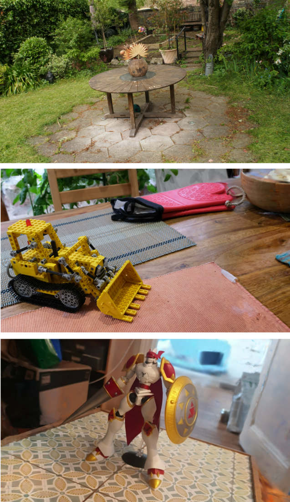
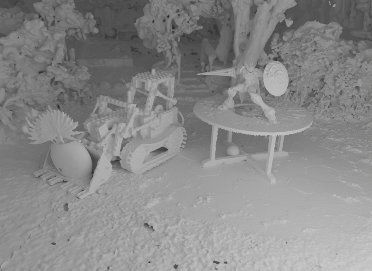
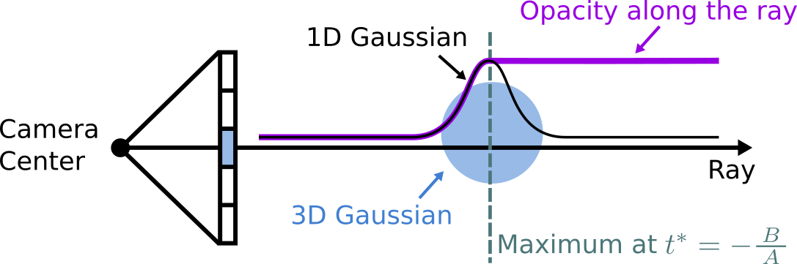
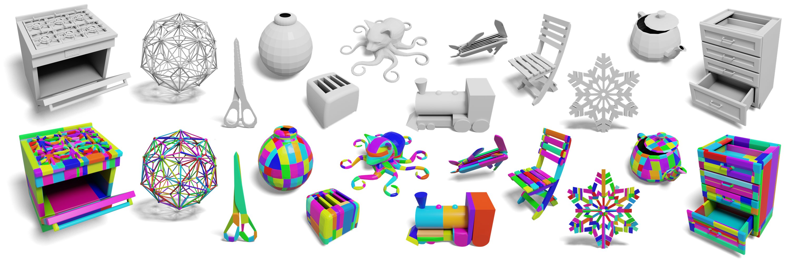
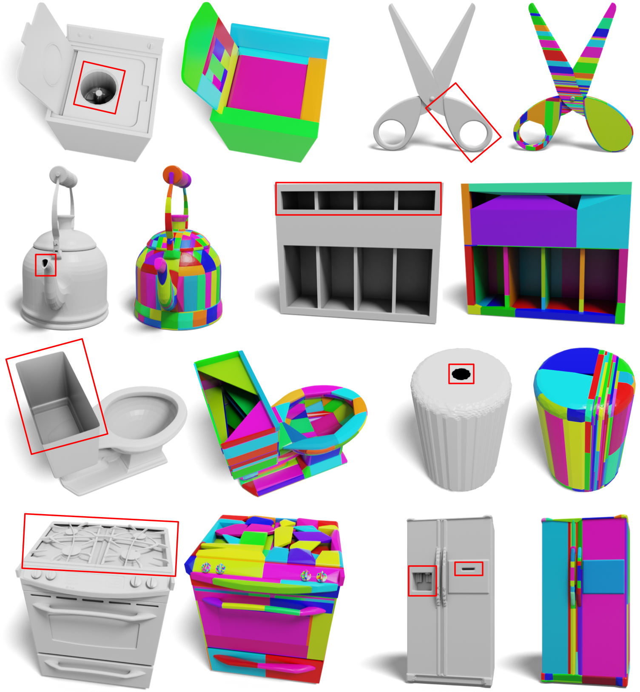

# GS 복원 → sim-ready 메시 — 추출, 충돌 가공, 물리 속성

가우시안 스플래팅의 출력은 **렌더링용 표현**이다. 수십만 개의 반투명 타원체는 눈에는 사실적이지만, 물리 엔진은 그 위에서 접촉을 계산할 수 없다. 시뮬레이터가 요구하는 것은 (1) 닫힌(watertight) 표면 메시 (2) 충돌 계산용 단순 기하 (3) 질량·마찰 같은 물리 속성이다. 이 세 단계를 순서대로 정리한다.

## 1. 왜 GS 원본은 시뮬에 못 들어가나

- 가우시안은 **표면이 아니라 밀도 뭉치**다 — "어디까지가 물체인가"의 경계가 정의되지 않는다.
- 물리 엔진의 충돌 파이프라인은 convex shape·triangle mesh 같은 명시적 기하를 전제한다.
- 떠다니는 floater, 뚫린 바닥, 안 보인 뒷면 — 렌더링에선 안 보이던 결함이 접촉 계산에선 전부 사고가 된다.

그래서 "GS로 복원했다"와 "시뮬에 넣었다" 사이에는 변환 파이프라인 하나가 통째로 들어간다.

## 2. 1단계 — 메시 추출

### 경로 A: depth 렌더 → TSDF fusion
각 학습 시점에서 GS의 depth를 렌더링하고, TSDF(truncated signed distance function) 볼륨에 융합한 뒤 marching cubes로 메시를 뽑는다. 파이프라인이 단순하고 견고해서 가장 널리 쓰인다.

이 경로의 품질은 **depth 렌더의 품질이 상한**이다. 원조 3DGS의 depth는 알파 합성 기대값이라 표면 정의가 물러서, depth를 기하적으로 정확하게 만든 변형들이 중요해진다 — 가우시안을 면으로 눌러버린 2DGS, 3D 가우시안의 레이-타원체 교차에서 닫힌형 depth를 유도한 RaDe-GS(상세는 [GS 리뷰 파트](../reviews/rade-gs.md)). **depth 정밀 개선이 곧 메시 품질 개선으로 직결**되는 구조다.

### 경로 B: 가우시안-메시 정렬 — SuGaR
SuGaR(CVPR 2024)는 가우시안이 **표면에 납작하게 정렬되도록 정규화 항을 추가**로 학습한 뒤, 밀도 레벨셋에서 Poisson 재구성으로 메시를 뽑고, 다시 가우시안을 메시 삼각형에 바인딩한다. 결과물이 "메시 + 그 위의 가우시안"이라, 메시를 편집·변형하면 렌더링이 따라오는 구조까지 얻는다.

*SuGaR가 추출한 장면 메시들. 가우시안 정렬 정규화 덕에 레벨셋이 표면답게 서고, Poisson이 닫힌 메시를 만든다. 출처: Guédon & Lepetit, "SuGaR: Surface-Aligned Gaussian Splatting for Efficient 3D Mesh Reconstruction", CVPR 2024 (arXiv 2311.12775).*

*메시에 가우시안이 바인딩되어 있어 메시 편집·합성이 렌더링에 그대로 반영된다 — "편집 가능한 복원"이라는 sim/저작 관점의 이점. 출처: 위와 동일.*

2DGS와의 관계를 한 줄로: "가우시안을 표면에 납작하게"라는 같은 아이디어를 SuGaR는 **소프트 정규화**로, 2DGS는 **프리미티브 구조 변경**(한 축 제거)으로 달성한다 — 강도의 차이로 읽으면 계보가 이어진다.

#### 보충 — Poisson 표면 재구성이 실제로 하는 일

입력은 **노멀이 달린 점군**이다. 물체 안에서 1, 밖에서 0인 **지시 함수(indicator function)** $\chi$를 생각하면, 그 그래디언트 $\nabla\chi$는 표면 근방에서만 값을 갖고 방향은 표면 노멀과 일치한다. 그렇다면 거꾸로 — 점군의 노멀들을 벡터장 $\vec{V}$로 보고, 그래디언트가 $\vec{V}$에 가장 가까운 $\chi$를 찾으면 된다:

$$\min_\chi \int \big\| \nabla\chi - \vec{V} \big\|^2 \;\;\Longrightarrow\;\; \Delta\chi = \nabla\cdot\vec{V}$$

이 최소제곱 문제의 최적 조건이 **푸아송 방정식**이다(이름의 유래). 옥트리 위에서 이 방정식을 풀어 $\chi$ 필드를 얻고, 적절한 등위값에서 등위면을 추출하면 메시가 나온다. §의 "① 필드 ② 추출" 프레임으로 보면 — **Poisson은 '점군 → 스칼라 필드'를 만드는 ①단계의 방법**이고, 마지막 ②단계는 역시 marching cubes류다(옥트리 적응형). Screened Poisson(2013)은 여기에 "표면이 입력 점들을 실제로 지나가야 한다"는 보간 제약을 추가한 개정판으로, 현재 라이브러리들의 기본값이다.

성질이 장단점을 그대로 결정한다:
- **장점**: 전역 최적화라 출력이 **항상 닫힌(watertight) 매끈한 표면** — 노이즈에 강하고 구멍이 안 남는다. sim-ready의 1차 요건(watertight)을 공짜로 얻는다.
- **단점**: 관측이 없는 영역까지 표면을 **지어내며**(과팽창, "blobby"), 그래서 점 밀도가 낮은 부분을 잘라내는 **density trimming** 후처리가 따라붙는다 — 트림하면 다시 구멍이 생길 수 있어 watertight 보장과 상충하는 지점이 생긴다(§ 공통 후처리).
- **전제**: 노멀 방향이 뒤집혀 있으면 안/밖이 꼬여 바로 무너진다 — 점군 품질보다 **노멀 품질**이 성패를 가른다.

SuGaR가 TSDF 대신 이걸 택한 이유도 여기 있다: 정렬 정규화된 가우시안에서 **점(레벨셋 샘플)과 노멀(가우시안의 최단축)**이 바로 나오므로 Poisson 입력이 공짜고, depth 렌더→복셀 융합을 거치지 않아 고해상 메시를 빠르게 얻는다.

### 경로 C: 융합 생략 — Gaussian Opacity Fields (GOF)
GOF(SIGGRAPH Asia 2024)는 depth 렌더→TSDF 융합이라는 우회로 자체를 생략한다. 레이-가우시안 교차를 이용해 **임의의 3D 점에서 opacity를 직접 평가할 수 있는 필드**를 가우시안 집합 위에 정의하고, 그 레벨셋을 **marching tetrahedra**(복셀 대신 적응형 사면체 그리드를 쓰는 marching cubes의 사면체판)로 바로 추출한다. 복셀 해상도에 묶이지 않아 배경까지 포함한 unbounded 씬의 메시에 특히 강하다. 레이-가우시안 교차에서 depth/normal을 유도하는 수학은 RaDe-GS와 같은 계열이다.

*GOF: 가우시안 위에 직접 정의한 opacity field의 레벨셋을 tetrahedral grid에서 추출 — depth 융합 없이, 배경 포함 전체 씬 메시. 출처: Yu et al., "Gaussian Opacity Fields: Efficient Adaptive Surface Reconstruction in Unbounded Scenes", SIGGRAPH Asia 2024 (arXiv 2404.10772).*

### 한 장 비교 — "① 어떤 필드를 세우고 ② 등위면을 어떻게 뽑나"

메시 추출은 항상 이 두 선택의 조합이다. marching cubes는 TSDF 전용이 아니라 **임의 스칼라 필드의 등위면 추출기**(1987, 원래 의료 CT용)라서, NeRF density(σ 임계값)·SDF(NeuS 계열의 0-등위면)·occupancy에도 똑같이 걸린다.

| 방법 | ① 필드 | ② 추출 | 한 줄 특징 |
|---|---|---|---|
| 3DGS + 후처리 | 기대값 depth → TSDF | marching cubes | 베이스라인 — depth가 물러 품질 한계 |
| SuGaR | 정렬 정규화된 밀도 레벨셋 | **Poisson** | 소프트 정렬 + 메시-가우시안 바인딩(편집 가능) |
| 2DGS | 교차 depth → TSDF | marching cubes | 프리미티브를 면으로 — depth가 구조적으로 명확 |
| GOF | **opacity field 직접 정의** | **marching tetrahedra** | 융합 생략, unbounded 씬에 강함 |
| RaDe-GS | 닫힌형 depth → TSDF | marching cubes | 3D 표현 유지 + 정밀 depth |

### 공통 후처리
- **watertight 보장**: 구멍 메움(hole filling), 비다양체(non-manifold) 정리, 고립 조각 제거. Poisson 계열은 기본적으로 닫힌 표면을 주지만 과팽창(블로비)을 트림하는 과정에서 다시 열릴 수 있다.
- **단순화(decimation)**: QEM(quadric error metric) 기반 엣지 접기(edge collapse)로 수백만 → 수만 삼각형. 시각 메시는 외관 보존 기준, 충돌용 중간 메시는 부피 보존 기준으로 공격적으로.

## 3. 2단계 — 충돌 기하 가공: "시각 메시 ≠ 물리 메시"

동적 강체의 충돌을 원본 triangle mesh로 두는 것은 실무 금기다 — 동적-동적 접촉 미지원(엔진 다수), 얇은 삼각형에서의 터널링, 비용. 표준 해법은 **convex 조각들로의 분해**다.

### Convex hull — 가장 싸고, 가장 많이 잃는다
전체를 하나의 볼록 껍질로 감싼다. 컵의 안쪽, 서랍의 수납 공간, 의자 다리 사이 — **오목한 곳이 전부 메워진다.** "컵에 물건을 넣는" 시뮬은 convex hull로는 원리적으로 불가능하다.

### Convex decomposition — V-HACD와 CoACD
오목 형상을 보존하려면 여러 볼록 조각으로 쪼갠다(정확한 분해는 조각이 폭발하므로 **근사** 분해, ACD).

*CoACD: 복잡한 오목 물체를 적은 수의 볼록 조각으로 분해하면서 충돌 거동(구멍·오목부)을 보존. 출처: Wei et al., "Approximate Convex Decomposition for 3D Meshes with Collision-Aware Concavity and Tree Search", SIGGRAPH 2022 (arXiv 2205.02961).*

- **V-HACD**: 볼륨 복셀화 후 재귀 분할. 빠르고 보편적이지만, concavity를 부피 차이로만 재서 **접촉에 중요한 얕은 오목부(홈, 턱)를 뭉개는** 경향.
- **CoACD**(SIGGRAPH 2022): concavity 척도를 **충돌 인지형**으로 재정의 — 표면 거리 기반(Hausdorff 계열) 오차에 레이 기반 검사를 더해 "빠지면 안 될 구멍이 메워졌는지"를 벌점화하고, 몬테카를로 트리 탐색으로 절단 평면을 고른다. 같은 조각 수에서 기능적 오목부 보존이 훨씬 좋다.

*V-HACD류가 오목부를 메워버리는 실패 사례 — 시각적으론 비슷해 보여도 "끼우기/담기" 상호작용이 깨진다. 충돌 기하의 품질 지표는 눈이 아니라 접촉 거동이라는 것. 출처: 위와 동일.*

선택 기준: 배경·정적 구조물은 triangle mesh 충돌 허용(정적이므로) / 집어 올릴 물체는 convex decomposition / 단순 박스류는 hull 또는 프리미티브 근사(box/capsule)가 가장 싸고 안정적.

## 4. 3단계 — 물리 속성 부여

스캔은 질량을 모른다. 현실적인 자동화 접근:

1. **부피**: watertight 메시에서 발산 정리로 정확히 계산 —

$$V = \frac{1}{6}\left|\sum_{(a,b,c)\in F} a \cdot (b \times c)\right|$$

(삼각형별 부호 있는 사면체 부피의 합. watertight가 전제 — 1단계가 여기서 되돌아온다.)

2. **재질 추정 → 밀도**: 이미지에서 재질 카테고리(목재·금속·플라스틱·세라믹)를 분류하고 밀도 테이블을 곱해 질량을 추정. 최근에는 VLM에게 물체 사진을 주고 재질·질량 범위·마찰 특성을 직접 묻는 접근이 실용 단계에 들어왔다 — 정밀하진 않지만 "그럴듯한 시뮬"에는 충분하고, 스케일이 맞는 기하 위에서만 의미가 있다.
3. **관성 텐서**: 균일 밀도 가정 아래 메시 적분으로 계산(부피와 같은 방식의 2차 모멘트 적분). 물리 엔진이 충돌 메시에서 자동 계산해주는 경우가 많아, MassAPI에 밀도만 주고 위임하는 것도 표준 패턴.
4. **마찰·반발**: 재질 테이블 기반 기본값 + 태스크 민감도에 따라 캘리브레이션. 접촉이 중요한 태스크(파지, 삽입)에서는 실측 기반 보정 없이는 Sim-to-Real 갭의 주범이 된다.

최종 직렬화는 [OpenUSD](openusd.md) §4의 스키마 — Collision은 `convexDecomposition` 근사로, Mass는 density 위임 또는 명시로.

## 5. 평가 — 무엇으로 "잘 됐다"를 재나

- **기하 정확도**: GT 스캔 대비 Chamfer distance, F-score(@τ) — 복원 평가의 표준.
- **충돌 근사 품질**: 조각 수 대비 Hausdorff 오차, 그리고 **기능 검사**(구멍에 꽂히는가, 담기는가) — CoACD가 보여줬듯 수치와 기능이 어긋날 수 있다.
- **시뮬 거동**: 드롭 테스트 안정성(폭발·침투·진동), 파지 시뮬 성공률 — 최종 소비자 기준의 평가. 파이프라인 단계마다 지표를 두면 실패 원인을 단계별로 추적할 수 있다.

## 6. 30초 요약

> "GS는 렌더 표현이라 그대로는 접촉 계산이 안 됩니다. depth를 정밀화한 변형(2DGS·RaDe-GS)으로 TSDF 융합하거나 SuGaR처럼 가우시안을 표면에 정렬시켜 메시를 뽑고, watertight 정리와 QEM 단순화를 거칩니다. 충돌용으로는 convex 분해가 표준인데, V-HACD는 얕은 오목부를 뭉개는 경향이 있어 충돌 인지형 concavity를 쓰는 CoACD가 기능 보존에 유리합니다. 물리 속성은 watertight 부피 × 재질 추정 밀도로 질량을 잡고 관성은 엔진에 위임하는 게 실용적 자동화 경로고, 평가는 Chamfer 같은 기하 지표에 드롭 테스트·파지 성공률 같은 시뮬 거동 지표를 겹쳐 단계별로 추적합니다."

---
*출처: Guédon & Lepetit 2023 (arXiv 2311.12775), Wei et al. 2022 (arXiv 2205.02961), Kerbl et al. 2023 3DGS, Huang et al. 2024 2DGS, Yu et al. 2024 GOF (arXiv 2404.10772). 피겨는 원문 HTML판에서 학습 목적 인용.*
