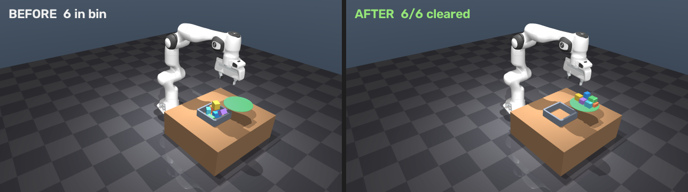
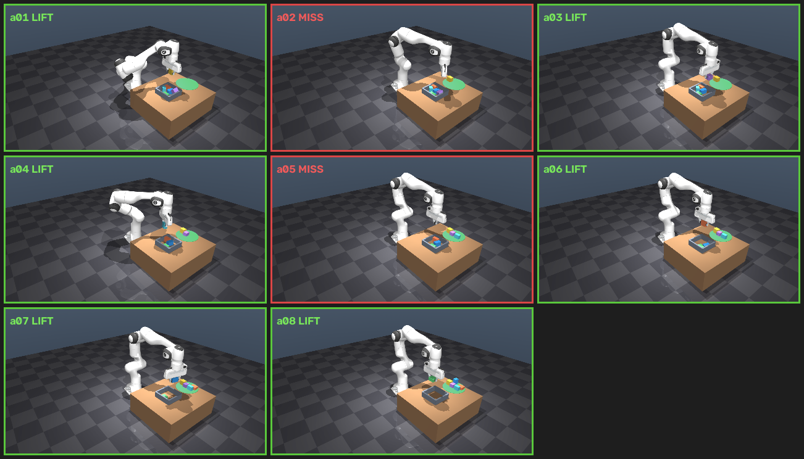

# Grasp SOTA — heuristic 63%의 벽, 그리고 학습 grasp 6모델 실측

## 질문 — 2020 GraspNet 이후 SOTA는?

Bin picking(clutter) 데모에서 top-down heuristic(마커 없는 RGB-D 인지 + 최상단 우선 수직 grasp)은 6물체·5-seed 기준 평균 clearance **63%**(walled bin) / **77%**(open tray)에서 막혔다. 인지·물체 선택 순서·place는 견고했고, 계측 기반 진단은 병목이 **grasp 전략 자체**임을 가리켰다 — 더미에 쐐기처럼 끼거나 옆으로 누운 물체는 수직 평행그리퍼로 근본적으로 못 잡는다.

자연스러운 다음 질문: "grasp 전략을 학습 기반으로 바꾸면 나아지나? 2020 GraspNet-1B 이후로 SOTA가 없나?" 답을 추측하지 않고, **2020→2025년 사이 공개된 오픈 후속 모델 6개를 전부 직접 돌려서** 검증했다.

## 방법 — apples-to-apples 통합 하네스

핵심 원칙: 모델마다 다른 벤치마크·지표로 비교하면 의미가 없다. 그래서 **모든 모델을 동일한 MuJoCo bin 씬·동일 IK·동일 실행 루프·동일 feasibility 필터**에 꽂아 측정했다(`_wsl/bin_pick_*.py`가 heuristic 드라이버(`src/bin_pick.py`)를 `bp`로 그대로 임포트해서 씬·IK·실행 코드를 재사용). 물체 6개, 5 seed, **walled**(벽 4개 bin) / **open tray**(벽 제거) 두 조건.

Windows에서는 돌릴 수 없는(MinkowskiEngine·octree 계열 CUDA 확장을 요구하는) 모델이 있어, **WSL2(Ubuntu, 동일 RTX 4090)**에 별도 환경을 세웠다.



*더미 → 비움, heuristic 베이스라인(top-down 인지 + 수직 grasp). 이 A/B의 기준선이다.*

### 환경 — 2개 conda env로 격리

| env | torch | 핵심 의존성 | 대상 모델 |
|---|---|---|---|
| `eg` | 2.5.1+cu121 | **MinkowskiEngine**(thrust-include 패치 후 소스빌드) + pytorch3d(소스빌드) + pointnet2/knn | GraspNet-1B · EconomicGrasp · graspness · Contact-GraspNet · HGGD 공용 |
| `zg` | 2.2.0+cu121 | **ocnn 2.2.5** / dwconv / octree_feature_extractor(gcc11로 pybind11-nvcc 이슈 회피, `--no-build-isolation`) | ZeroGrasp 전용 |

공통 빌드 함정: **EGL 렌더러는 torch import 전에** 생성해야 WSL에서 프로세스가 멈추지 않는다. 그래서 드라이버는 torch를 `load_net()` 안에서 지연 import하도록 순서를 맞췄다.

인지 파이프라인 자체(마커 없는 물체별 point cloud 역투영·centroid/yaw 추정)는 이 사이트의 [perception](perception.md) 챕터와 같은 marker-less RGB-D 방식이다 — 여기서 바뀌는 것은 grasp *검출* 알고리즘뿐, 인지·씬·실행 루프는 고정했다.

## 결과 (6물체 · 5 seed, 평균 clearance rate)

| method | 발표 | modality | walled | open |
|---|---|---|---|---|
| **top-down heuristic (ours)** | — | depth+seg | **63%** | **77%** |
| ZeroGrasp | CVPR'25 | RGB-D + **GT mask**, recon | 20% | **50%** |
| Contact-GraspNet | RSS'21 | depth | **33%** | 20% |
| graspness / GSNet | ICCV'21 | depth (ME) | 27% | 40% |
| EconomicGrasp | ECCV'24 | depth (ME) | 27% | 33% |
| GraspNet-1B baseline | CVPR'20 | depth | 11% | 27% |
| HGGD | RA-L'23 | **RGB**-D heatmap | ~0% | ~0% |

## 핵심 발견 4가지 (정직)

1. **학습 SOTA 6개가 전부 단순 top-down heuristic한테 진다** (walled·open 두 조건 모두). 이 벤치의 도메인갭(합성 clean-box·단일 뷰·무텍스처)이 실제 clutter로 학습된 모델에 계통적으로 불리하다. heuristic은 이 씬의 기하에 co-tune돼 있다는 점이 유리하게 작용한다.
2. **열린 트레이에서는 최신 모델이 학습 모델 중 최고**: ZeroGrasp(2025)가 **50%**로 1위(graspness 40%가 2위). "2020 이후 SOTA가 있나"의 답은 **있다 — 공정한 open 조건에서는 최신 모델이 제일 낫다.** 다만 여전히 heuristic(77%)에는 못 미친다.
3. **벽이 6-DoF grasp의 tilt 강점을 죽인다.** 대부분 open에서 크게 오른다 (ZeroGrasp 20→50, GraspNet-1B 11→27, EconomicGrasp 27→33, graspness 27→40). walled 조건은 near-vertical approach를 강제해 기울어진(tilted) grasp이 벽에 충돌해 실행 불가능해진다. (Contact-GraspNet만 33→20으로 반대 방향 — 벽이 있는 좁은 공간에서 오히려 안정적인 grasp을 낸다.)

   같은 물체·같은 시드에서 벽 유무만 다른 ZeroGrasp의 실제 실행 비교:

   <div style="display:flex;gap:12px;flex-wrap:wrap"><video src="_static/zg_walled_s.mp4" controls loop muted playsinline style="width:48%;min-width:280px;border-radius:8px"></video><video src="_static/zg_open_s.mp4" controls loop muted playsinline style="width:48%;min-width:280px;border-radius:8px"></video></div>

   *좌 walled 0/6(벽이 6-DoF tilt를 죽인다) · 우 open 4/6*

4. **HGGD는 실패(~0%)지만 통합 버그가 아니다.** 자체 realsense demo 데이터로는 정상 작동(width 68mm, score 0.77)을 확인했다. HGGD의 2D grasp heatmap이 **RGB 외형**에 의존하는데, 텍스처 없는 합성 박스에서는 무의미한 wide·비수직 grasp(전부 >75mm)만 낸다. RGB 기반 모델이 sim 도메인갭에 그대로 노출된 사례다.

## 공정성 캐비엇

- **ZeroGrasp는 per-object GT instance mask를 받는다** — object-centric reconstruction 구조상 필수 입력이다. 나머지 5개 모델은 mask 없이 전체 씬 point cloud만 사용한다. 즉 ZeroGrasp에 유리한 조건이며, 실제 파이프라인이라면 앞단에 SAM 같은 segmentation이 별도로 필요하다.
- HGGD는 realsense intrinsic(1280×720)을 가정한다 — 우리 카메라의 실제 K를 주입해 back-projection의 기하는 맞췄지만, FOV(46° vs realsense 42°) 도메인시프트는 남아 있다.
- **모든 depth는 렌더 GT(노이즈 없음)**다 — 실제 센서보다 관대한 조건이다. 그럼에도 모델 간 **상대 비교**는 유효하다: 모든 모델이 동일하게 관대한 depth를 받기 때문이다.

## heuristic이 63%에서 멈추는 이유 (진단)

파라미터를 더 돌리기 전에, 실패의 뿌리를 계측으로 확인했다.

- **perception은 원인이 아니다.** 미스 시도의 perceived grasp XY vs 실제 물체 위치 오차는 **6–10mm**뿐이다. 전방 하향 카메라의 partial-view 때문에 perceived 위치가 −y(카메라 쪽)로 ~7mm 계통 편향되지만, 그리퍼 여유(80mm) 안이라 이것만으로 미스가 나지 않는다.
- **이웃 간섭도 주원인이 아니다.** 물체 폭에 맞춘 적응형 pre-grasp aperture를 넣어봐도 평균이 오히려 떨어졌다(60% vs 63%).
- 남은 미스는 대부분 **더미에 쐐기처럼 끼거나 기운 물체**다 — 수직 top-down 평행그리퍼가 기운 단면을 확보하지 못한다. GT 물체 tilt를 실측하니 상당수가 **47–90°(옆으로 누움)**였다. 이건 파라미터 튜닝이 아니라 **grasp 전략 자체의 한계**다.
- **normal-aligned(비수직) 접근도 간단한 해법은 아니다.** 전방 하향 카메라가 관측한 top-surface 법선은 앞면 픽셀이 섞여 GT와 어긋난다(0°→45° 오차). 신뢰할 수 없는 법선으로는 안전한 tilted grasp을 계획할 수 없다 — 이건 **신뢰할 법선 + 강건한 grasp 계획**(= GraspNet급 모델)이 필요한 문제다.
- 확인된 레버: grasp 깊이(✓ 33→63%), drop 슬롯 분산(✓ lost→0). 무효 레버: pre-grasp 조리개(✗), yaw π/2 플립(✗ 오히려 악화).

→ 단순 top-down 휴리스틱의 정직한 천장 ≈ **63%**. 인지·순서·place는 견고하므로, 다음 레버는 미세조정이 아니라 **grasp 전략 교체** — 비수직 approach 또는 학습 기반 grasp(GraspNet)이다.

## 개선 시도 — GraspNet(학습) · antipodal(기하)

병목이 grasp 전략임을 확인한 뒤, 두 방향을 실제로 시도했다.

**GraspNet(학습 grasp) — end-to-end 통합 완료 + 정직한 A/B.** Windows에서 pointnet2 **CUDA op를 컴파일**(VS2022 + nvcc 12.4, sm_89)하고 torch 2.6+cu124/RTX 4090 조합을 맞춘 뒤, graspnetAPI 의존성을 우회(구버전 numpy 소스빌드를 피하고 `pred_decode`만 사용)해서, 공개 체크포인트(`checkpoint-rs.tar`)로 **실제 추론이 작동**함을 확인했다(씬 point cloud → 약 758 grasp 후보, top score 0.9). MuJoCo 통합 드라이버는 카메라 cloud → GraspNet 추론 → world 좌표 변환 → feasible 필터(width·downward·interior·reachable) → 6-DoF grasp 실행 순서다. **learned 6-DoF grasp이 실제로 물체를 집어 place까지 성공**했다(topmost 물체 기준). 그러나 6물체 clutter 기준 clearance는 **평균 ~11%(heuristic 63% 대비)**로 낮았다.

원인은 둘로 갈렸다: (1) **bin 벽이 near-vertical approach를 강제**해 GraspNet의 tilt(6-DoF) 강점이 무력화된다 — 급경사 approach는 벽 충돌로 실행 불가능하다. (2) grasp이 우리 그리퍼의 engagement에 co-tune되어 있지 않아, 무너진 더미의 **낮은 물체**에서 얕게 잡혀 미끄러지거나 헛집는다(첫 topmost 물체는 성공하지만 후속 저물체에서 실패가 몰린다). 즉 공정한 A/B에는 **open tray(벽 제거) + operational-space 제어**가 필요하며, 제약은 GraspNet 자체가 아니라 이 실험 셋업에 있었다.



*시도별 lift 순간 — heuristic부터 GraspNet 통합까지.*

**Open-tray A/B (벽 제거, 5-seed).** `open` 플래그로 벽을 없애고 GraspNet의 tilt 제한도 함께 풀었다: **heuristic 63→77%, GraspNet 11→27%(2.4배 향상)**. 벽이 GraspNet의 tilt 능력을 막고 있었다는 게 확인됐지만(open에서는 기울인 grasp이 성공한다) **역전은 일어나지 않았다** — open 조건은 수직 grasp도 똑같이 쉽게 만들고, GraspNet의 grasp이 우리 그리퍼·position 제어에 co-tune되지 않아 seed별로 0~50%까지 편차가 컸다. 남은 병목은 인지가 아니라 **실행(제어)**이다: grasp refinement와 operational-space 제어가 다음 레버다.

**antipodal / collision-aware 선택 (기하 기반, 학습 없음).** 손가락 통로에 이웃 점이 적은 "가장 집기 쉬운" 물체를 우선하도록 선택 순서를 재정렬했다 — 결과는 **평균 56.7%(63% 대비 오히려 저하)**. grasp *선택* 순서만 바꿔서는 올라가지 않는다.

**모델/SOTA 계보.** 여기서 쓴 것은 GraspNet-1Billion(CVPR 2020) **baseline**(PointNet++ → ApproachNet/OperationNet/ToleranceNet → 6-DoF grasp)이다. 이후 오픈 후속 모델(Contact-GraspNet RSS'21, EconomicGrasp ECCV'24, ZeroGrasp CVPR'25)과 상용 AnyGrasp(T-RO'23, 라이선스)는 GraspNet-1B 벤치마크 기준 +30 AP 수준의 향상을 보고한다 — 업그레이드 경로는 있다.

병목은 **grasp 선택이 아니라 센싱(top-down 부분뷰가 옆면·기운 자세를 관측하지 못함) + 수직 평행그리퍼** 자체다. 유효한 개선축은 (a) 학습 grasp(가중치만 확보하면 GraspNet은 즉시 가능), (b) 옆면을 보는 멀티뷰/스테레오 인지 + 신뢰 가능한 법선, (c) 비수직 approach — 모두 별도 마일스톤이다.

## 결론 — 학습 grasp이 자동 정답은 아니다

"2020 GraspNet 이후 SOTA가 없나"라는 질문에 6개 오픈 모델을 직접 돌려서 답했다: **있다**. open tray 조건에서는 ZeroGrasp(2025)가 학습 모델 중 최고 성능(50%)을 낸다. 하지만 그 답을 이 벤치에 그대로 옮기면 **학습 SOTA 6개가 전부 단순 top-down heuristic(63/77%)보다 낮다.**

이 결과가 뒤집는 것은 "grasp 검출을 학습으로 바꾸면 자동으로 좋아진다"는 가정이다. 실제 레버는 셋 중 하나였다:

- **도메인갭** — 합성 clean-box·단일 뷰·무텍스처 씬은 실제 clutter로 학습된 모델(특히 HGGD처럼 RGB 외형에 의존하는 모델)에 계통적으로 불리하다.
- **gripper co-tuning** — 학습된 grasp 후보가 우리 그리퍼의 engagement 깊이·폭에 맞춰져 있지 않으면, grasp 자체는 옳아도 실행에서 미끄러지거나 헛집는다.
- **operational-space 제어** — GraspNet의 6-DoF tilt 강점은 벽이 있는 좁은 공간에서 실행 불가능해진다. 이건 인지·검출 문제가 아니라 [manipulation](manipulation.md) 쪽의 제어·환경 제약 문제다.

heuristic이 co-tune된 좁은 씬 안에서는 이 셋 중 어느 것도 자동으로 해결되지 않는다. 다음으로 유효한 단계는 (a) open tray + 6-DoF 제어로 학습 grasp의 tilt 강점을 실제로 실현하는 것, (b) sim 텍스처/도메인 랜덤화로 RGB 기반 모델의 격차를 줄이는 것, (c) grasp refinement — 여전히 grasp *전략 교체*라는 원래 진단은 유지되지만, "학습이면 무조건 이긴다"는 낙관은 이 실측에서 기각됐다.

## 재현

WSL2 두 conda env(`eg`=MinkowskiEngine 계열, `zg`=ZeroGrasp)에서 동일 드라이버 인터페이스로 seed·조건을 바꿔가며 돌린다:

```bash
# env: eg = MinkowskiEngine 계열 (GraspNet-1B / EconomicGrasp / graspness / Contact-GraspNet / HGGD)
wsl -d Ubuntu -- bash -lc "conda run -n eg python _wsl/bin_pick_cgn.py 6 seed=5 open"

# env: zg = ZeroGrasp 전용
wsl -d Ubuntu -- bash -lc "conda run -n zg python _wsl/bin_pick_zg.py  6 seed=5 open"
```

heuristic 베이스라인(비교 기준선)은 Windows에서 바로 돌아간다:

```powershell
python src\bin_pick.py 6 seed=5 --render
# seed= 로 다른 clutter 배치, --probe 로 인지 단계만 검증
```

원자료: 모델별 드라이버 `_wsl/bin_pick_{gn,eg,gsn,cgn,hggd,zg}.py`와 seed별 로그. WSL 환경·체크포인트 가중치는 저장소에 포함하지 않으며, 드라이버 코드와 위 결과 표만 남긴다.
