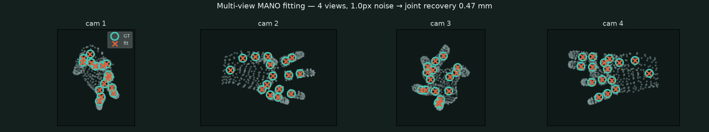
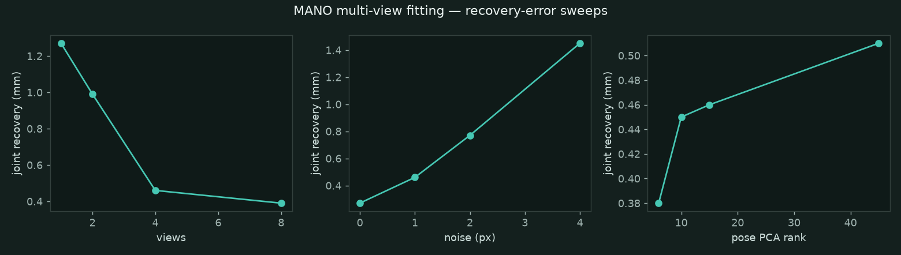
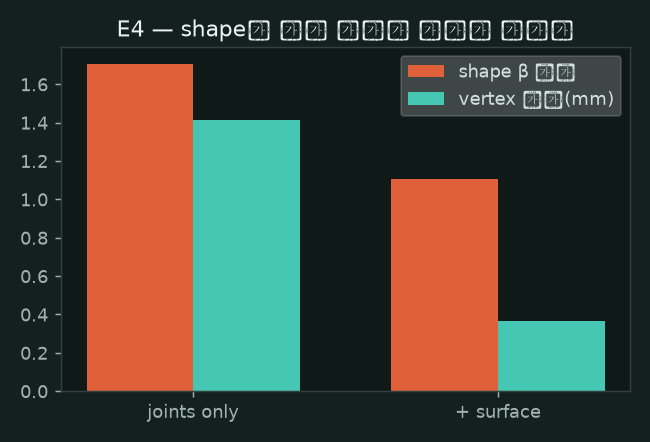
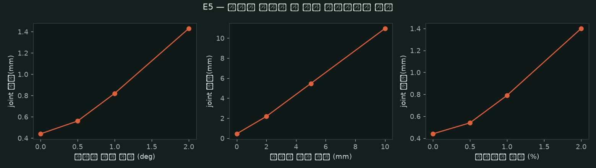

# 손 자세 추정 — 멀티뷰 MANO 피팅 (실측)

파라메트릭 **손 모델(MANO)** 을 우리 캘리브레이션 스택 위에서 직접 피팅해 본 실측이다. 방법론은 이 사이트의 [perception 파이프라인](perception.md)과 동일 — **GT를 알고, 관측에서 복원하고, 오차를 mm로 잰다** — 단 대상이 강체 6-DoF pose에서 **관절체 파라메트릭 모델**(shape β + pose)로 한 칸 커졌다. 모델 자체 리뷰는 [SMPL·MANO](reviews/smpl-mano.md).

## 방법

1. GT 손 샘플: shape $\beta\in\mathbb{R}^{10}$ + pose(global orient + PCA 계수)를 뽑아 MANO forward → 3D 관절·메시.
2. **N개 캘리브 카메라**(고정 intrinsic $K$ + 링 배치 extrinsic)에 3D 관절을 투영 → 2D 키포인트 + **픽셀 노이즈** 주입(=검출 노이즈 모사).
3. 복원: $(\beta,\text{pose})$ 를 0에서 시작해 **멀티뷰 reprojection 오차**를 Adam으로 최소화(약한 shape prior 포함).
4. GT 대비 복원 손의 **관절 오차(mm)** · 버텍스 오차 · reprojection(px) · $\beta$ 오차를 5-seed 평균으로 측정.

<video src="_static/mano_fit.mp4" controls loop muted playsinline style="width:100%;max-width:520px;border-radius:8px"></video>

*cam 1 시점에서 최적화가 수렴하는 과정 — 초기(0에서 시작)에서 GT(teal 원)로 복원값(주황 ×)이 붙는다.*



*4개 뷰의 최종 피팅 — GT 관절(teal)과 복원 관절(주황 ×)이 거의 겹친다(관절 복원오차 0.47mm). 회색 점은 재투영된 손 메시(778버텍스).*

## 결과 (5-seed 평균)



**① 뷰 수** (노이즈 1px, PCA 15)

| 뷰 | 1 | 2 | 4 | 8 |
|---|---|---|---|---|
| 관절 복원오차 | 1.27mm | 0.99mm | **0.46mm** | 0.39mm |

단일 뷰는 depth 모호성으로 최악(1.27mm), 4뷰에서 0.46mm로 −64%, 그 뒤로는 포화. 우리 [depth A/B](perception.md)에서 "단안의 약제약을 멀티뷰 기하가 푼다"와 같은 곡선이 관절체에서도 나온다.

**② 픽셀 노이즈** (4뷰, PCA 15)

| 노이즈 | 0px | 1px | 2px | 4px |
|---|---|---|---|---|
| 관절 복원오차 | 0.27mm | 0.46mm | 0.77mm | 1.45mm |

2D 검출 노이즈가 3D 오차로 **거의 선형 전파**(reprojection도 0.38→4.54px로 동반). [perception 오차예산](perception.md)의 "입력 오차 → 출력 오차 전파"가 파라메트릭 피팅에서도 성립.

**③ pose-PCA rank = 정규화** (4뷰, 1px)

| PCA rank | 6 | 10 | 15 | 45 |
|---|---|---|---|---|
| 관절 복원오차 | 0.38mm | 0.45mm | 0.46mm | 0.51mm |
| **버텍스 오차** | **0.58mm** | 0.93mm | 1.49mm | **11.06mm** |

핵심 발견: pose PCA 차원을 늘릴수록(자유도↑) **노이즈에 과적합**해 버텍스 오차가 11mm로 폭발한다. 적은 차원(6)이 오히려 최선 — [MANO의 pose PCA](reviews/smpl-mano.md)(6/10/15개=81/90/95%)가 그 자체로 **정규화기**로 작동함을 실측으로 확인.

**④ shape β는 키포인트로 안 잡힌다**: 모든 조건에서 $\beta$ 오차가 1.5–2.7로 크게 남는다. **키포인트는 pose를 제약하지 shape를 제약하지 않는다** — 체형 복원엔 실루엣·표면 관측이 필요하다는 정직한 한계(→ 다음 실험 E4).

## 연결

- **강체 → 관절체**: [markerless ICP](perception.md)가 "형상 모델을 알면 부분 관측으로 6-DoF pose가 잡힌다"였다면, 이건 "**변형 가능한** 형상 모델을 알면 관절 자세까지 잡힌다"로의 확장. 멀티뷰·노이즈·정규화의 구조가 동일하게 재현된다.
- **파라메트릭 모델 경험**을 읽은 것([SMPL·MANO](reviews/smpl-mano.md))에서 **직접 측정한 것**으로 옮긴 실측이다. 최적화 피팅의 반대편(회귀 기반 단안 복원)은 [HaMeR](reviews/hamer.md).

## 재현

```bash
# MANO 모델 파일(license 등록 다운로드)을 <MANO_dir>에 두고:
python src/mano_fit.py --mano_dir <MANO_dir> --sweep --render
```

## E4 — shape(β)는 표면 관측이 있어야 잡힌다

E1에서 "키포인트로는 shape가 안 잡힌다"를 봤다. 이걸 대조 실험으로 확인한다: 관측을 (a) **관절 키포인트만** vs (b) **관절 + 표면 대응점 200개**(실루엣/표면이 주는 정보의 대리)로 두고 각각 피팅.



| 관측 | 관절오차 | **버텍스오차** | **β 오차** |
|---|---|---|---|
| joints only | 0.46mm | 1.42mm | 1.71 |
| **+ surface (200pt)** | 0.37mm | **0.37mm (−74%)** | **1.11** |

표면 대응점을 더하면 버텍스 오차가 1.42→0.37mm로 무너지고 β 오차도 준다. **키포인트는 pose를, 표면은 shape를 제약한다** — 체형까지 복원하려면 실루엣·표면 항이 필요하다는 걸 실측으로 확인. (β는 본질적으로 어려워 완전히 0은 안 되지만 방향은 뚜렷.)

## E5 — 캘리브 오차가 손 관절오차로 전파

관측은 **참(true) 카메라**로 만들고, 피팅만 **섭동된(miscalibrated) 카메라**로 하면, 캘리브 오차가 3D 복원오차로 얼마나 새는지 측정된다 — [perception 오차예산](perception.md)의 관절체판.



| 섭동 | baseline | 회전 0.5°/1°/2° | 위치 2/5/10mm | 초점 0.5/1/2% |
|---|---|---|---|---|
| 관절 복원오차 | 0.44mm | 0.56 / 0.82 / 1.43mm | 2.18 / 5.47 / **10.96mm** | 0.54 / 0.79 / 1.4mm |

**카메라 위치 오차는 거의 1:1로 전파**(10mm 캘리브 오차 → 10.96mm 관절오차), 회전·초점도 단조 증가. [perception 파이프라인](perception.md)에서 "정확도 병목은 제어가 아니라 캘리브·기하"라 한 결론이 파라메트릭 손 피팅에서도 그대로 — **캘리브가 데이터·복원 품질의 상한**이다.

```{note}
**다음 실험 (진행 예정)** — **E6** MANO→로봇 그리퍼 retargeting: 손 파지를 2지 평행 그리퍼(개폐 + 6-DoF 손목)로 옮겨 MuJoCo에서 실행. 사람 손 → 로봇 action을 잇는 축([H2O](reviews/h2o.md)/[UMI](reviews/umi.md) 계열)이자, 우리 [매니퓰레이션](manipulation.md) 스택과의 연결.
```
