# 전신 자세 추정 — SMPL 멀티뷰 피팅 (실측)

[손(MANO) 멀티뷰 피팅](hand_pose.md)을 **관절 손 → 전신(SMPL body)** 으로 확장한 실측이다. 손과 완전히 동일한 방법론 — **GT를 알고, 관측에서 복원하고, 오차를 mm로 잰다** — 을 6890-버텍스·52-관절 전신 파라메트릭 모델에 적용한다. 여기서는 **SMPL forward를 라이브러리에 의존하지 않고 직접 구현**(shape/pose blendshape + Linear Blend Skinning)해, 각 수식이 무엇을 하는지 논문 수준으로 전개한다. 모델 리뷰는 [SMPL·MANO](reviews/smpl-mano.md).

---

## 0. 이 트랙을 읽는 법 — 전체 서사 (HM0 → HM6)

> 이 페이지는 포트폴리오이자 **내 공부 노트**다. 그래서 각 단계는 "완성된 결과"만이 아니라 **왜 이걸 하는가 → 무엇을 시도했나 → 무엇이 안 됐고 어떻게 고쳤나 → 사진/영상으로 어떤 결과가 나왔나 → 다음 단계로 어떻게 이어지나** 의 흐름으로 적는다.

**하나의 질문으로 관통한다:** *"이미지에서 사람의 3D 자세(손·몸)를 얼마나 정확히 복원할 수 있는가, 그리고 무엇이 그 한계를 만드는가?"* 답을 향해 단계를 쌓는다.

**되풀이되는 핵심 명제(thesis):** **단안(1시점)은 2D 재투영과 국소 *형상*은 잘 맞추지만, 광선 방향의 *절대 깊이·스케일*은 근본적으로 모호하다.** 이 모호성을 **멀티뷰·스테레오·근접 카메라·학습된 prior**가 푼다. 이 명제를 시뮬(HM0–HM5)에서 세우고 **실데이터(HM6/HOT3D)에서 mm 단위로 확증**한다.

**단계별 논증 (각 단계는 앞 단계가 남긴 한계를 푸는 답):**

| 단계 | 질문/동기 | 핵심 시도 | 결과(대표 수치) | 다음으로 이어짐 |
|---|---|---|---|---|
| **HM0** | 몸을 이미지에서 복원되나? | SMPL 자체구현 + 멀티뷰 역최적화 | 1뷰 119 → 8뷰 **7.6mm** | 단안이 붕괴 → **멀티뷰 필요** |
| **HM1** | 크기(scale)까지 잡히나? | 몸+양손+global scale | scale 1뷰 4.3%→멀티뷰 0.8%; **손이 몸보다 2.4× 어려움** | 손이 몸 카메라서 작다 → **egocentric(HM3)** |
| **HM2** | 손-물체 상호작용은? | MANO+box + 접촉/침투 prior | 단안 침투 9.1→**0mm**, 손 14.2→6.4mm | 접촉 prior가 단안 모호 완화 → 실물체는 **HOT3D HOI(§11.5)** |
| **HM3** | 손엔 어떤 카메라? | egocentric vs exocentric | 1exo 111→**2ego-stereo 6.2mm** | 근접 스테레오=metric → 실헤드셋 **HOT3D(§11.4)** |
| **HM4** | 센서 여러 개는? | camera↔IMU 시공간 동기화 | $t_d$ 2.1ms·extrinsic 0.26° | 멀티센서 정합 = 멀티뷰의 전제 |
| **HM5** | 로봇으로 어떻게? | 사람 손 → Allegro 리타게팅 | 자기충돌 6→0, PA feasibility | perception→action 다리 |
| **HM6** | 실데이터에선? | MediaPipe·HMR2.0·**HOT3D 실 3D GT** | HOT3D **PA 3.9mm / root-rel 48.9mm** | 명제 확증 + 남은 과제(깊이) |

**무엇이 반복해서 부서졌나(디버깅이 곧 공부):** SMPL이 Y-up인데 카메라를 Z-up으로 깔아 몸이 옆으로 눕던 것(HM0), 침투 패널티를 mean으로 걸어 gradient가 사라지던 것(HM2, → sum으로), MANO PCA 부호가 반대라 주먹이 펴지던 것(HM5), 그리고 HM6에서 **디스크 풀·chumpy/numpy 호환·어안 캘리브·좌표계 프레임 불일치**까지 — 이 실패들을 어떻게 진단하고 고쳤는지를 각 절에 남긴다.

아래는 그 첫 단계, **HM0의 토대인 SMPL 파라메트릭 모델**부터 수식으로 전개한다.

---

## 1. SMPL 파라메트릭 모델 (원리)

SMPL은 사람 몸을 **저차원 파라미터**로 생성하는 미분가능 함수 $M(\beta,\theta)\to(V,J)$ 다. 입력은 **형상(shape)** $\beta\in\mathbb{R}^{10}$ 과 **자세(pose)** $\theta\in\mathbb{R}^{3(J+1)}$ (관절별 axis-angle, $J{=}$ 관절 수). 우리가 쓴 모델은 **SMPL+H**(SMPL 몸 + MANO 손, 52관절·6890버텍스)이며 HM0에서는 **몸 22관절**을 최적화하고 손은 flat mean으로 고정한다.

### 1.1 형상 blendshape — 체형
평균 체형(template) $\bar T\in\mathbb{R}^{6890\times3}$ 에 shape 주성분 $S_n$ 을 $\beta$ 만큼 더해 개인 체형을 만든다:

$$V_{\text{shaped}}=\bar T+\sum_{n=1}^{10}\beta_n\,S_n,\qquad S\in\mathbb{R}^{6890\times3\times10}.$$

- $\beta_n$: PCA 계수(키·체격 등). $S_n$: $n$번째 shape 방향(6890버텍스의 변위).

### 1.2 관절 회귀 — 뼈대 위치
체형이 정해지면 **관절 위치**는 버텍스의 선형결합으로 얻는다:

$$J=\mathcal{J}\,V_{\text{shaped}},\qquad \mathcal{J}\in\mathbb{R}^{52\times6890}.$$

$\mathcal{J}$(joint regressor)는 각 관절을 주변 표면 버텍스의 가중평균으로 정의한다.

### 1.3 자세 blendshape — LBS 아티팩트 보정
관절을 회전시키기 전에, **회전에 따른 표면 변형**(근육 벌크 등, 순수 스키닝으로는 안 나오는)을 보정한다. 비-루트 관절의 회전행렬에서 항등행렬을 뺀 값을 특징으로 쓴다:

$$V_{\text{posed}}=V_{\text{shaped}}+\sum_{k=1}^{J-1}\big(R(\theta_k)-I\big)\,P_k,\qquad P\in\mathbb{R}^{6890\times3\times 9(J-1)}.$$

- $R(\theta_k)\in SO(3)$: 관절 $k$ 의 회전(§1.4). $(R-I)$ 를 씀으로써 **rest pose($\theta{=}0$)에서 보정=0**.

### 1.4 축각 → 회전 (Rodrigues)
각 관절 자세는 axis-angle $\theta_k=\alpha\,\hat n$ ($\alpha=\|\theta_k\|$):

$$R(\theta_k)=I+\frac{\sin\alpha}{\alpha}[\theta_k]_\times+\frac{1-\cos\alpha}{\alpha^2}[\theta_k]_\times^2.$$

(SLAM의 SE(3)에서 쓴 것과 같은 지수사상.)

### 1.5 Linear Blend Skinning (LBS) — 뼈대에 살 붙이기
관절을 **kinematic tree**(부모→자식)로 누적해 각 관절의 전역 변환 $G_k$ 를 만들고, 각 버텍스를 인접 관절들의 변환으로 가중혼합한다:

$$G_k=\prod_{a\in\text{ancestors}(k)}\begin{bmatrix}R(\theta_a)&J_a-J_{\text{parent}(a)}\\\mathbf0&1\end{bmatrix},\qquad
v_i'=\sum_{k=1}^{J} w_{ki}\,G'_k\begin{bmatrix}v_{i,\text{posed}}\\1\end{bmatrix}.$$

- $w_{ki}$: 스키닝 가중치(버텍스 $i$ 가 관절 $k$ 에 얼마나 묶이는가, $\sum_k w_{ki}=1$).
- $G'_k=G_k\cdot\mathrm{rest\text{-}removal}$: rest pose를 항등으로 만드는 보정 $G'_k=G_k-[\,\mathbf0\ |\ G_k(J_k;0)\,]$ (rest에서 $v'=v$ 보장).
- 최종 관절 위치는 $\hat J_k=G_k[:3,3]$.

> **한 줄 요약:** $\beta$ 로 체형을 만들고 → 관절 위치를 회귀하고 → 자세 보정을 더하고 → 뼈대 회전을 kinematic tree로 누적해 → 가중 스키닝으로 표면을 움직인다. 전부 미분가능 → 관측에서 $(\beta,\theta)$ 를 **역으로 최적화**할 수 있다.

## 2. 우리 실측 — 멀티뷰 복원 피팅

1. **GT 몸 샘플**: $\beta\sim\mathcal N(0,1)$, 몸 관절 자세 $\theta$ 를 무작위(±0.25 rad)로 뽑아 SMPL forward → GT 3D 관절·메시.
2. **N개 캘리브 카메라**(링 배치, 고정 $K$·extrinsic)에 몸 관절을 투영 → 2D + **픽셀 노이즈** 주입.
3. **복원**: $(\beta,\theta,\text{transl})$ 을 0에서 시작해 멀티뷰 재투영오차를 Adam으로 최소화:

$$\min_{\beta,\theta,\mathbf t}\ \sum_{c=1}^{N}\sum_{j}\rho\!\big(\|\pi_c(\hat J_j(\beta,\theta)+\mathbf t)-x_{cj}\|\big)+\lambda_\beta\|\beta\|^2+\lambda_\theta\|\theta_{\text{body}}\|^2,$$

$\pi_c$ = 카메라 $c$ 의 핀홀 투영, $\rho$ = pseudo-Huber(이상치 완화), 정규화 $\lambda$ 항은 shape/pose prior.
4. GT 대비 **MPJPE(mm)**·버텍스오차·$\beta$ 오차를 3-seed 평균으로 측정.

### 무엇을 입력으로 보나 (how it works)

그래프만으론 뭘 하는지 안 보이니, **방법이 실제로 보는 입력**부터 보인다. 아래는 SMPL 몸을 4개 캘리브 카메라에서 렌더한 것(음영 메시)이다 — 이게 "관측"이고, 최적화는 이 이미지들의 **2D 관절**(teal)에 SMPL 재투영(orange ×)이 겹치도록 $(\beta,\theta)$ 를 움직인다.

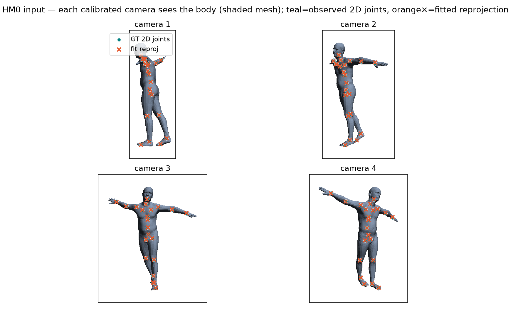

*카메라 1–4가 같은 사람을 다른 각도에서 본다(음영=SMPL 메시 6890버텍스). teal=관측 2D 관절, orange ×=현재 추정의 재투영. 한 장(단안)으론 전후 depth가 모호 → 여러 각도가 그 모호성을 푼다.*

> **파이프라인 한눈에:** ① N개 캘리브 카메라가 몸을 관측 → ② 각 뷰에서 2D 관절 검출(여기선 GT 투영+노이즈로 대체) → ③ SMPL $(\beta,\theta,\mathbf t)$ 를 **모든 뷰의 재투영오차 최소화**로 최적화(§1의 forward가 미분가능하므로 gradient descent) → ④ 3D 몸(관절·메시) 복원.

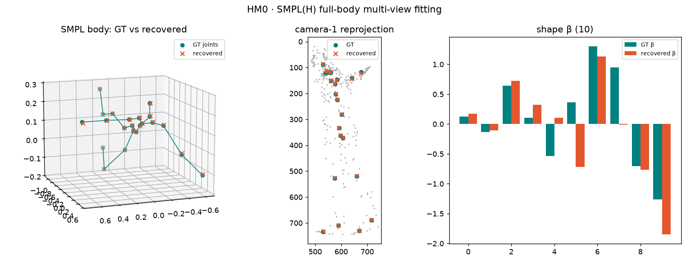

*결과: 좌=GT 관절(teal)과 복원(주황 ×)·뼈대가 3D에서 겹침, 중=cam-1 재투영(회색=복원 메시), 우=shape $\beta$ GT vs 복원.*

## 3. 결과 (3-seed 평균)

**① 뷰 수** (노이즈 1px)

| 뷰 | 1 | 2 | 4 | 8 |
|---|---|---|---|---|
| MPJPE | **119.1mm** | 9.5mm | 8.5mm | 7.6mm |

**단일 뷰는 119mm로 붕괴**한다 — 전신은 metric depth/scale 모호성이 손보다 훨씬 심하다(팔·다리 전후 위치가 한 뷰로 결정 안 됨). **2뷰만 돼도 9.5mm로 −92%**, 그 뒤 완만히 개선(8뷰 7.6mm). 손에서 본 "멀티뷰 기하가 단안의 약제약을 푼다"가 전신에서 **훨씬 극적**으로 재현된다.

**② 픽셀 노이즈** (4뷰)

| 노이즈 | 0px | 1px | 2px | 4px |
|---|---|---|---|---|
| MPJPE | 7.8mm | 8.5mm | 9.4mm | 9.9mm |

2D 검출 노이즈가 3D 오차로 **단조 전파**(7.8→9.9mm) — [perception 오차예산](perception.md)·[손 E1](hand_pose.md)의 "입력 오차→출력 오차 전파"가 전신에서도 성립.

**③ shape $\beta$ 는 키포인트로 완전히는 안 잡힌다**: $\beta$ 오차 ~1.7로 남고 버텍스오차(~18mm)가 관절오차(~8mm)보다 크다. **키포인트는 pose를 제약하지 shape(체형)를 제약하지 않는다** — 손 [E4](hand_pose.md)에서 표면 관측을 더해 풀었던 것과 동일한 한계. 전신 체형 복원엔 실루엣/표면 항이 필요하다.

## 4. 정직/한계
- SMPL forward를 직접 구현(shape/pose blendshape + LBS)했고, GT 생성·복원에 **동일 forward**를 써 자기일관적으로 fitting 성능만 측정한다(모델 자체의 캐노니컬 정확도가 아니라 **복원 오차** 연구).
- 몸 22관절만 최적화, 손·얼굴은 flat 고정(전신+손+얼굴 통합은 HM1: SMPL-X).
- 시뮬 GT 벤치. 실데이터(monocular HMR2.0 등)는 HM6.
- ~9mm 바닥은 from-scratch 일반 옵티마이저의 수렴/β 결합 한계 — 회귀 초기화나 표면항으로 개선 여지.

## 5. 연결
[손(MANO) 관절체 피팅](hand_pose.md)이 "변형 가능한 형상 모델을 알면 손 관절이 잡힌다"였다면, 이건 그 구조가 **6890버텍스·52관절 전신**에서 동일하게(멀티뷰·노이즈·shape 관측성) 성립함을 보인다. 다음: **SMPL-X 전신+손+얼굴**(HM1), **HOI 손-물체 공동**(HM2), **egocentric**(HM3), **다중센서 동기화**(HM4), **Human→Robot retargeting**(HM5). 전체 계획은 `robotics-lab/notes/human_plan.md`.

## 6. HM1 — whole-body(몸 + 양손) + β/scale 추정

HM0(몸 22관절)에서 **양손 30관절까지 함께** 최적화하고, JD가 콕 집은 **global scale** 파라미터를 추가해 "shape/pose 최적화(β/scale 추정)"를 정면으로 다룬다. (얼굴까지는 SMPL-X 모델이 필요 — 여기선 SMPL+H로 몸+손.)

**입력(무엇을 보나):** 몸 카메라가 보는 것 — 손은 프레임에서 아주 작다(수십 px).

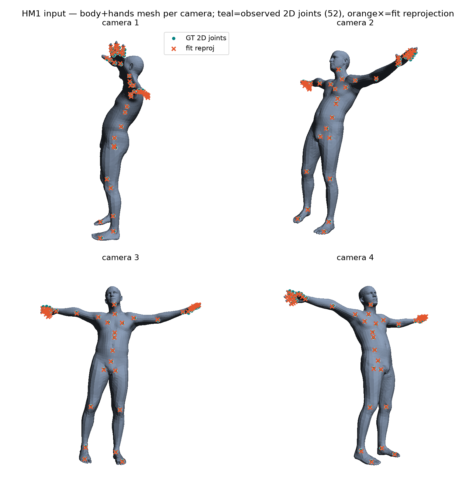

*4개 카메라에서 본 사람(음영 메시) + 52개 관절(teal 관측 / orange × 재투영). 손 관절이 몸 카메라에선 작게 뭉쳐 있다 → 약하게 제약됨.*

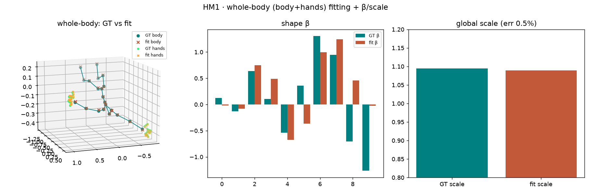

*좌=whole-body GT vs 복원(몸+손), 중=shape β, 우=global scale 복원.*

**① scale 관측성 (β/scale 추정의 핵심)**

| 뷰 | 1 | 2 | 4 | 8 |
|---|---|---|---|---|
| scale 오차 | **4.3%** | 1.1% | **0.8%** | 1.1% |
| body MPJPE | 247.9mm | 8.3mm | 8.0mm | 7.9mm |

**단안은 scale-depth 모호성**으로 크기를 못 잡는다(4.3%, 몸도 248mm로 붕괴) — 큰 사람이 멀리 있는 것과 작은 사람이 가까이 있는 게 한 뷰에선 동일하게 보이기 때문. **metric 멀티뷰 리그는 baseline이 절대 크기를 고정**해 scale을 <1%로 복원한다. 실무에서 "카메라 리그로 metric scale 확보"가 왜 중요한지의 정량 근거.

**② 손은 몸 카메라에서 훨씬 어렵다**

| 뷰 | 2 | 4 | 8 |
|---|---|---|---|
| body MPJPE | 8.3mm | 8.0mm | 7.9mm |
| **hand MPJPE** | 20.8mm | 19.4mm | **17.2mm** |

**손 오차가 몸의 ~2.4배**(4뷰 19 vs 8mm). 손이 몸 카메라 프레임에서 수십 px밖에 안 돼 관절이 약하게 제약되기 때문 — **정밀한 손 자세엔 근접/egocentric(머리장착) 카메라가 필요**하다는 정량 근거(→ HM3). shape β도 whole-body에선 더 어렵다(β 오차 ~1.9).

## 7. HM2 — 손-물체 상호작용(HOI) + 접촉 prior

손(MANO)이 물체(box)를 잡는 장면에서 **손 파라미터와 물체 6-DoF를 동시에** 복원한다. HOI의 핵심 재료는 **접촉/침투(contact/penetration) prior** — 손이 물체를 뚫고 들어가면 안 되고(물리적 타당성), 접촉해야 한다.

**입력(무엇을 보나):** 손(MANO 메시)과 물체(box)를 4개 카메라에서 본 것.

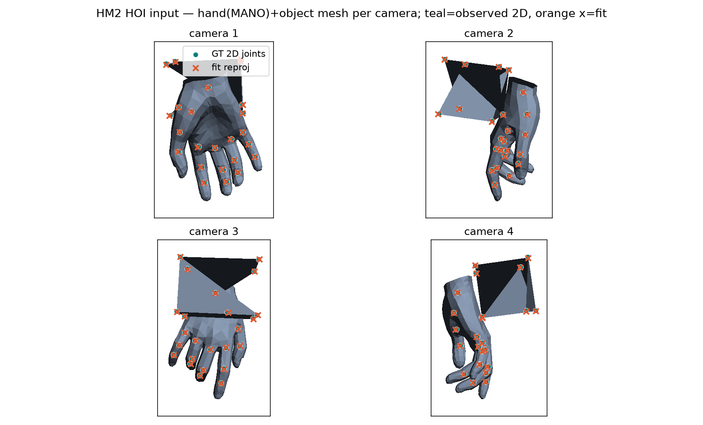

*카메라별 손+물체 메시(어두운 부분=box). teal=관측 2D 관절(손 21 + box 8코너), orange ×=재투영.*

**방법:** 손(β,pose,global,transl) + 물체(6-DoF)를 함께 최적화, 재투영오차 + **침투 penalty**. box는 해석적 SDF를 쓴다: 점 $p$(물체 프레임), 반경 $h$에 대해 $q=|p|-h$, $\text{sd}(p)=\|\max(q,0)\|+\min(\max_i q_i,0)$ (안=음수). 손 버텍스의 침투 $\sum_v \max(0,-\text{sd}(v_o))^2$ 를 penalize.

| | 손 MPJPE | 침투(penetration) |
|---|---|---|
| **1-view, 접촉 prior 없음** | 14.2mm | **9.1mm** (손이 물체를 뚫음) |
| **1-view, +접촉 prior** | **6.4mm** (−55%) | **0.0mm** |
| 4-view, 접촉 없음 | 1.1mm | 0.0mm |
| 4-view, +접촉 | 1.1mm | 0.0mm |

**핵심(HOI 접촉 prior의 값):** 단안(1-view)에선 손-물체 상대 depth가 모호해 **손이 물체를 9.1mm 뚫고 들어간다**(재투영은 맞지만 물리적으로 틀림). **접촉 prior가 침투를 0으로 없애고 손 오차를 절반(14→6.4mm)으로** 줄인다 — 물리적으로 타당한 재구성. **멀티뷰(4)는 기하만으로 이미 해결**(손 1.1mm·물체 0.9mm·침투 0)이라 접촉항이 비활성. HOLD·GRAB·ARCTIC 계열이 접촉 prior를 쓰는 이유를 그대로 보인다.

*정직: 시뮬 clean 멀티뷰에선 접촉항이 불필요(재투영으로 충분). 접촉 prior의 결정적 값은 **실제 노이즈 있는 단안/가림** 상황(HM6)이며, 여기선 그 메커니즘을 단안 depth 모호성으로 재현했다.*

## 8. HM3 — Egocentric vs Exocentric: 손엔 근접 카메라가 정공법

HM1·HM2에서 **손은 몸/원거리(exocentric) 카메라에서 약하게 제약**됨을 봤다(수십 px). HM3는 그 해법을 정량화한다: **머리장착(egocentric) 근접 카메라**는 손이 프레임을 가득 채워, 같은 2D 검출 노이즈가 훨씬 작은 3D 오차로 매핑된다.

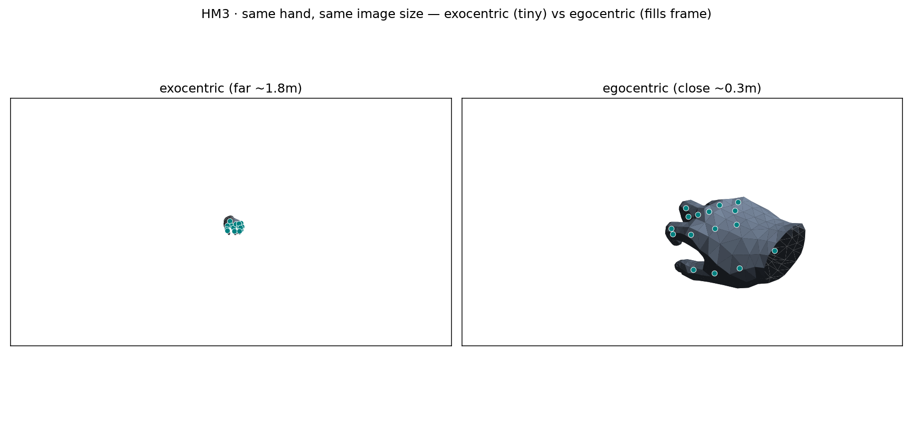

*같은 해상도·같은 손인데 — 원거리 exo(좌)에선 손이 45px 티끌, 근접 ego(우)에선 327px로 프레임을 채운다(7×).*

| 카메라 구성 | 손 MPJPE | 비고 |
|---|---|---|
| 1× exo (far ~1.8m) | 111.2mm | 손 45px, 단안 |
| 1× ego (close ~0.3m) | 72.2mm | 손 327px — 근접이 단안 exo보다 나음 |
| **2× ego (stereo 7cm)** | **6.2mm** | 근접 스테레오 → metric depth (Quest/Aria류) |
| 4× exo (far) | 2.1mm | 원거리라도 멀티뷰면 해결 |
| ego + 3× exo | 3.0mm | 융합 |
| 1× ego, **가림 40%** | 77.3mm | 단일뷰는 자기가림에 취약 |
| **ego + 3× exo, 가림 40%** | **3.9mm** | 융합이 가림 보완 |

**핵심:**
1. **근접(ego)이 원거리(exo) 단안보다 낫다**(72 vs 111mm) — 손이 7× 크게 잡혀 2D가 정밀.
2. **단일 뷰는 어떤 것이든 depth 모호**(72–111mm) → mm 정확도엔 멀티카메라 필요.
3. **Ego 스테레오가 metric depth를 준다**(6.2mm) — 실제 헤드셋(Quest·Aria·[HOT3D](https://facebookresearch.github.io/hot3d/))이 근접 스테레오 카메라를 쓰는 이유.
4. **ego+exo 융합은 가림에 강건**(가림 40%에서 단일 ego 77mm → ego+3exo 3.9mm) — 한 뷰에서 가려진 손가락을 다른 뷰가 채운다.

## 9. HM4 — 다중센서 시공간 캘리브레이션·동기화 (camera↔IMU)

perception·hand-eye에서 한 건 **spatial** 캘리브였다. HM4는 빠져 있던 **temporal(시간 오프셋 $t_d$) + IMU**를 채운다. 강체로 붙은 두 센서가 같은 모션을 보지만 (a) **클럭이 $t_d$만큼 어긋나고** (b) 프레임이 **extrinsic 회전 $R_{ci}$** 로 다르다. 둘을 **각속도 스트림 정합**으로 동시 추정한다 — Kalibr/VINS online temporal calibration의 핵심 원리.

$$w_\text{imu}(t)=R_{ci}^\top\,w_\text{cam}(t-t_d)+\text{noise};\qquad \min_{t_d,\,R_{ci}}\ \sum_t\big\|\,w_\text{imu}(t)-R_{ci}^\top\,\text{interp}\big(w_\text{cam},\,t-t_d\big)\big\|^2$$

$t_d$에 대한 **미분가능 선형보간**으로 gradient descent가 동기화를 푼다.

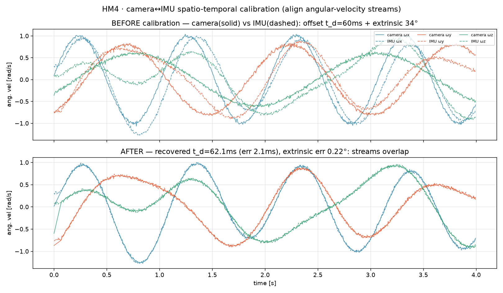

*위=보정 전(카메라 solid vs IMU dashed): $t_d$=60ms 어긋남 + extrinsic 34°로 축이 섞임. 아래=추정 후($t_d$·$R_{ci}$ 복원): 두 스트림이 겹친다.*

| 조건 | $t_d$ 오차 | extrinsic 오차 |
|---|---|---|
| baseline (노이즈 0.02 rad/s, $t_d$ 30ms) | **2.1 ms** | **0.26°** |
| 노이즈 0 / 0.05 / 0.1 | 0 / 8.5 / 75 ms | 0 / 1.1 / 7.0° |
| **모션 amp 0.15 / 0.4 / 1.0** | 54.8 / 9.6 / **2.1 ms** | 4.9 / 1.2 / 0.26° |

**핵심:** 시간 오프셋을 **~2ms**, extrinsic 회전을 **0.26°** 로 복원. 노이즈에 단조 열화. **모션 excitation이 관측성의 열쇠** — 회전이 작으면(amp 0.15) 55ms/4.9°로 무너지고, 충분히 흔들면(amp 1.0) 2ms/0.26°. Kalibr가 "모든 축을 충분히 흔들라"고 요구하는 이유를 실측으로 확인. *정직: 각속도(gyro)로 $t_d$·회전 extrinsic까지. 완전한 spatial(translation lever-arm)엔 accelerometer가 추가로 필요(확장 가능).*

## 10. HM5 — 사람 손 → 로봇 핸드 dexterous retargeting

여기까지(HM0–HM4)는 **사람을 관측·복원**하는 perception이었다. HM5는 그 결과를 **로봇이 실행할 관절 명령으로 변환**한다 — JD의 "Human-to-Robot Motion Retargeting / 구조적 차이를 고려한 grasp pose 매핑 / 물리적 실현 가능성 검증 및 후처리(smoothing·interpolation·collision avoidance)". 대상 로봇은 **Allegro 4손가락 16-DoF 핸드**(MuJoCo Menagerie `wonik_allegro`), 소스는 **MANO 사람 손**(5손가락, ~21 DoF, 연조직).

### 10.1 왜 관절각을 그대로 복사하면 안 되는가

사람 손과 로봇 핸드는 **kinematic 구조가 다르다** — 손가락 수(5 vs 4), 링크 길이, 관절축, 가동범위, 그리고 사람의 연조직 변형. 사람 관절각 $\theta_\text{human}$ 을 로봇에 그대로 넣으면 **작업 공간(fingertip 위치)이 어긋난다**. 그래서 관절각이 아니라 **task-space 기하량(keyvector)** 을 맞춘다 — DexPilot / AnyTeleop(dex-retargeting)의 원리.

### 10.2 Keyvector 정의

손바닥(palm) 원점에서 각 손가락의 **중간 마디(medial)와 끝(distal)** 으로 향하는 벡터를 정의한다. 손가락 4개(검지 ff · 중지 mf · 약지 rf · 엄지 th) × 2마디 = **8개 keyvector**:

$$v^{(h)}_i = p^{(h)}_i - p^{(h)}_\text{palm}\ \ (\text{사람}),\qquad v^{(r)}_i(q) = p^{(r)}_i(q) - p^{(r)}_\text{palm}(q)\ \ (\text{로봇, } q\text{의 함수})$$

로봇 쪽 $p^{(r)}_i(q)$ 는 MuJoCo forward kinematics(`mj_forward`)로 얻는다. **중간+끝 두 마디**를 함께 잡는 게 중요하다 — 끝점만 맞추면 손가락이 "닿기만" 하고 **굽힘(curl)** 이 제약되지 않아 로봇이 덜 오므린다(실제로 처음 tip만 썼을 때 fist에서 안 접히는 버그를 겪음).

### 10.3 프레임 정렬과 스케일

사람 손과 로봇 손은 크기·기준 방향이 다르다. **스케일** 은 open 자세의 평균 keyvector 길이 비로,

$$s = \frac{\frac{1}{8}\sum_i \|v^{(r)}_i(0)\|}{\frac{1}{8}\sum_i \|v^{(h)}_i\|}\ (\approx 0.93)$$

**회전 정렬** $R$ 은 open 자세에서 두 keyvector 집합을 맞추는 **Kabsch(직교 Procrustes)** 해 — $H=\sum_i (s\,v^{(h)}_i)(v^{(r)}_i)^\top=U\Sigma V^\top$, $R=V\,\mathrm{diag}(1,1,\det(VU^\top))\,U^\top$ (반사 방지). 목표 keyvector는 $\;\tilde v_i = s\,R\,v^{(h)}_i$.

### 10.4 경계 최적화 = 실현 가능성(feasibility) 내장

로봇 관절각 $q\in\mathbb{R}^{16}$ 을 아래로 푼다 — **관절 한계를 bound로 넣어** 해가 항상 물리적으로 실행 가능:

$$\min_{q}\ \sum_{i=1}^{8}\big\|\,v^{(r)}_i(q)-\tilde v_i\,\big\|^2 \;+\; \lambda_p\big\|(v^{(r)}_{th}-v^{(r)}_{ff})-(\tilde v_{th}-\tilde v_{ff})\big\|^2 \quad \text{s.t.}\quad q_\text{lo}\le q\le q_\text{hi}$$

둘째 항은 **엄지–검지 pinch**(집기)를 강조하는 상대벡터 항($\lambda_p=1.5$). **L-BFGS-B**(bound-constrained)로 풀며, 시간 축에서는 이전 프레임 해로 **warm-start** 해 궤적 일관성을 준다. bound 덕분에 **joints within limits = 100%** 가 설계상 보장된다.

### 10.5 Self-collision 회피 (후처리 ①)

사람이 주먹을 꽉 쥐면 로봇 손가락끼리 **파고든다(interpenetration)**. 순수 retargeting은 24프레임 중 **6프레임이 자기충돌**했다. MuJoCo 접촉으로 최대 침투깊이 $d_\text{pen}(q)=\max(0,\,-\min_c \text{dist}_c)$ 를 읽어 **패널티**로 넣는다:

$$\min_q\ \big[\text{(위 식)}\big] + w_\text{col}\,d_\text{pen}(q)^2,\qquad w_\text{col}=400$$

결과: 자기충돌 **6/24 → 0/24**, 그러면서 keyvector 정확도는 **58.6 → 58.7mm** 로 거의 그대로(0.1mm 손해) — 충돌 회피가 사실상 공짜.

### 10.6 Smoothing·Interpolation (후처리 ②③)

- **Smoothing:** 관절 궤적에 폭 5 이동평균(경계는 edge-pad로 ringing 방지). jerk $\frac{1}{T}\sum_t|\,q_{t+1}-3q_t+3q_{t-1}-q_{t-2}|$ 가 **0.045 → 0.009 (5×↓)** — 실행 시 급가속 억제.
- **Interpolation:** 24프레임을 **2× 업샘플(48)** 선형보간해 매끄러운 실행 궤적으로. 보간 후에도 자기충돌 **0/48** 유지.

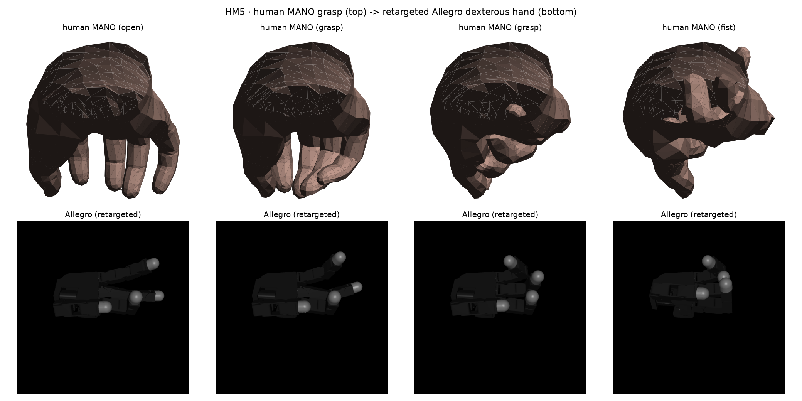

*위=사람 MANO 손(open→쥠→fist). 아래=리타게팅된 Allegro 핸드 — 손가락이 사람을 따라 오므라든다. 사람 5손가락이 로봇 4손가락으로 매핑되며(약지↔로봇 약지, 새끼는 생략), 엄지 대향(opposition)이 로봇 엄지로 근사된다.*

| 항목 | 값 |
|---|---|
| human→robot 스케일 $s$ | 0.93 |
| keyvector 매칭 (raw → collision-safe) | 58.6 → **58.7 mm** |
| joints within limits | **100%** (bound 내장) |
| self-collision 프레임 | 6/24 → **0/24** → 0/48(보간 후) |
| jerk (smoothing) | 0.045 → **0.009** |

**핵심:** 8개 keyvector 매칭 + Kabsch 정렬 + bound 최적화로 **관절 한계·자기충돌을 모두 만족하는 실행 가능한 grasp 궤적**을 만들고, smoothing·interpolation까지 붙였다. *정직: 잔차 ~58mm는 **cross-morphology 구조 차이**(사람 5손가락↔로봇 4손가락, 엄지 대향 구조가 특히 다름)에서 오는 근본 한계로, 완벽히 0이 될 수 없다 — 그래서 절대 위치가 아닌 keyvector(상대 기하)를 맞춘다. 실로봇 배포엔 (a) 팔 IK를 붙여 손목 6-DoF 궤적까지, (b) 접촉면 mesh 기반 충돌, (c) 힘/토크 feasibility를 추가한다(확장 가능).*

## 11. HM6 — 실데이터 검증 (실제 사진 → 우리 파라메트릭 모델 피팅)

HM0–HM5는 전부 **시뮬레이션**이었다(GT를 알기에 mm 오차를 잴 수 있었음). HM6는 그 파이프라인을 **진짜 픽셀**에 돌려 닫는다. 레시피는 손·전신 공통이다: 실제 사진에서 **MediaPipe**로 2D 랜드마크를 검출하고(검출은 남의 모델), 그 검출에 **우리가 직접 구현한 파라메트릭 모델**(손=MANO, 전신=SMPL)을 약투영 단안 최적화로 맞춘다(피팅은 우리 코드). GT 3D가 없으니(실사진 1장) 품질 지표는 **2D 재투영 오차(px)** 이고, 이는 HM0–HM3의 단안 모호성 교훈을 실데이터에서 재확인하는 **정성 검증**이다.

### 11.1 손 (MANO)

실제 손 사진에서 **MediaPipe Hands**로 21점을 검출하고 우리 MANO를 피팅한다.

**방법(약투영·weak-perspective 단안 피팅):** MediaPipe 21점을 MANO 16관절(손목 + 손가락별 MCP/PIP/DIP)에 대응시키고, MANO 자세 $\theta$(PCA)와 약투영 카메라(스케일 $s$·평행이동 $t$)를 아래로 최적화한다 — 스케일-깊이 모호를 피하려 원근 대신 약투영을 쓴다:

$$\min_{\theta,\,s,\,t}\ \sum_{j=1}^{16}\Big\|\,s\,m\,P_{xy}\big(\hat J_j(\theta)\big)+t\;-\;x^{\text{det}}_j\,\Big\|\;+\;\lambda\|\theta\|^2$$

$P_{xy}$ = 관절의 $(x,y)$ 성분(직교투영), $m{=}{\pm}1$ 좌우손 반전, $x^{\text{det}}_j$ = MediaPipe 검출 2D. 2단계(카메라+전역회전 먼저 → 관절 자세 추가) Adam.

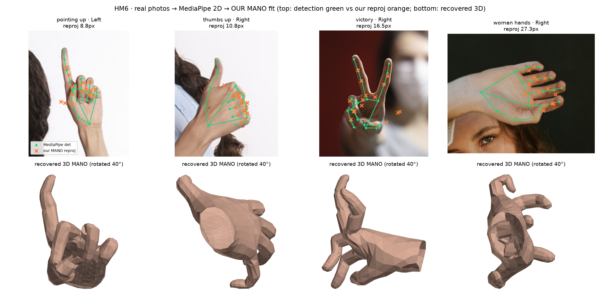 MediaPipe 2D -> our MANO fit" style="width:100%;max-width:1200px;border-radius:8px">

*위=실제 사진 + MediaPipe 검출(green) vs 우리 MANO 재투영(orange ×). 아래=복원된 3D MANO를 **40° 회전**해 본 것 — pointing은 검지, victory는 두 손가락이 실제로 3D에서 펴져 복원됨(단안 사진 1장에서).*

| 실제 사진 (제스처) | 손 | 2D 재투영 오차 |
|---|---|---|
| pointing up | Left | **8.8 px** (1.5% diag) |
| thumbs up | Right | 10.8 px |
| victory | Right | 16.5 px |
| woman hands | Right | 27.3 px |
| woman hands | Left | 40.4 px |
| **평균 (5 hands)** | | **20.8 px** (2.4% diag) |

**핵심:** 시뮬로 만든 우리 MANO 피팅이 **실제 사진에서도 작동** — 명확한 제스처는 2D 재투영 8–17px, 3D 자세(pointing/victory)가 의미적으로 옳게 복원된다. *정직: (1) **단안이라 3D GT가 없어 정성**이다(mm 못 잼) — 2D는 잘 맞아도 out-of-plane 깊이는 모호(HM0–HM3에서 정량화한 그 모호성). (2) `woman hands`가 27–40px로 더 나쁜 건 손이 기울어 foreshortening + 팔에 일부 가림 때문. (3) MediaPipe(검출)는 남의 모델이고, **피팅은 우리 코드**다.*

### 11.2 전신 (SMPL)

같은 레시피를 전신에 적용한다: **MediaPipe Pose**로 33점 body 랜드마크를 검출하고, **HM0에서 직접 구현한 SMPL**(shape/pose blendshape + LBS)을 피팅한다 — 관절이 63-DoF로 많고 2D 대응이 14점뿐이라 body 자세에 prior를 걸고, 관절별 **가시성(visibility)으로 가중**한다.

$$\min_{\theta,\,s,\,t}\ \sum_{j} w_j\Big\|\,s\,P_{xy}\big(\hat J_j(\theta)\big)+t\;-\;x^{\text{det}}_j\,\Big\|\;+\;\lambda\|\theta_{\text{body}}\|^2,\qquad w_j=\text{visibility}_j$$

대응: MediaPipe {어깨·팔꿈치·손목·엉덩이·무릎·발목·코} → SMPL {16/17·18/19·20/21·1/2·4/5·7/8·15}, 골반(SMPL 0)은 좌우 엉덩이 중점으로 합성.

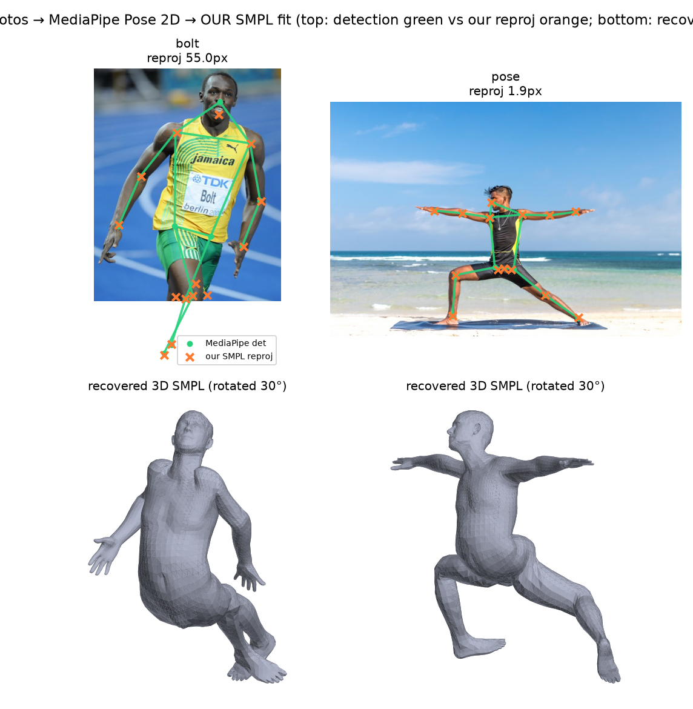 MediaPipe Pose 2D -> our SMPL fit" style="width:100%;max-width:1100px;border-radius:8px">

*위=실제 사진 + MediaPipe Pose(green) vs 우리 SMPL 재투영(orange ×). 아래=복원된 3D SMPL을 30° 회전 — 요가 warrior 자세(팔 벌림 + 런지)가 단안 사진 1장에서 3D로 복원된다.*

| 실제 사진 | 2D 재투영 오차 |
|---|---|
| yoga warrior (`pose`) | **1.9 px** (0.16% diag) |
| running (`bolt`, 동적) | 55.0 px (6.7% diag) |

**핵심:** 우리 SMPL 피팅이 실사진에서 작동 — 정적·명확한 자세(yoga)는 **재투영 1.9px**로 3D 전신을 정확히 복원한다. *정직: `bolt`가 55px로 나쁜 건 (a) 질주 중 다리가 강하게 foreshortening되고 (b) 단안이라 out-of-plane 다리 각도가 모호 + (c) 14점·prior 정규화로 극단 자세가 눌리기 때문 — HM0/HM1에서 본 단안 붕괴가 실데이터에서도 그대로.*

### 11.3 최적화(우리) vs 학습 회귀(HMR2.0) 대조

같은 실사진 2장에 **SOTA 학습 회귀 모델 [HMR2.0](https://shubham-goel.github.io/4dhumans/)**(4D-Humans, ViT-Huge 백본이 픽셀에서 SMPL 파라미터를 **직접 회귀**)을 돌려 우리 최적화 피팅과 대조했다. 우리 방식은 검출된 2D 키포인트에 **재투영을 직접 최소화**하고, HMR2.0은 2D를 **보지 않고** 이미지에서 학습된 prior로 3D를 추정한다는 게 근본 차이다. (SMPL neutral 모델 라이선스 필요, CPU 추론.)

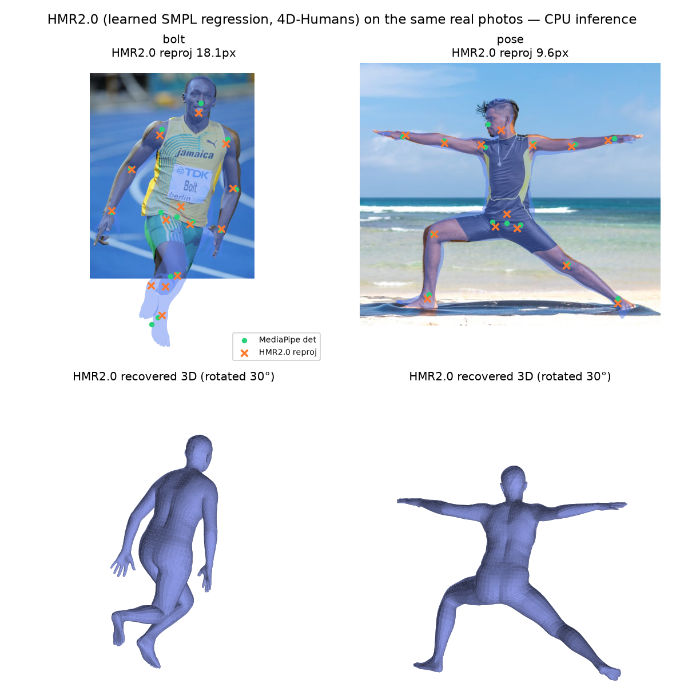

*HMR2.0 결과: 위=메시 투영 오버레이(green=MediaPipe, orange ×=HMR2.0 재투영), 아래=복원 3D 30° 회전. bolt의 질주 lean, pose의 warrior 자세가 3D로 복원된다.*

| 실제 사진 | 우리 SMPL (최적화) | HMR2.0 (학습 회귀) |
|---|---|---|
| yoga warrior (정적·명확) | **1.9 px** | 9.6 px |
| running bolt (동적·foreshortening) | 55.0 px | **18.1 px** |

**핵심 통찰 (둘의 성격이 정반대):**
- **정적·명확한 자세**에선 **최적화(우리)가 2D 재투영에서 더 낮다**(1.9 vs 9.6px) — 그 키포인트에 직접 맞추니까. 단, 이건 *2D* 지표이고 HMR2.0의 3D가 더 정확할 수 있다(2D를 과적합하지 않으므로).
- **동적·모호한 자세**에선 **학습 회귀(HMR2.0)가 압도적**이다(18 vs 55px). 단안 depth/foreshortening 모호를 **데이터에서 배운 prior**로 풀기 때문 — 우리 단일이미지 최적화는 그 모호에서 붕괴(bolt 55px)했지만 HMR2.0은 그럴듯한 질주 3D를 복원.
- 이게 이 분야의 교과서적 교훈이다: **최적화 = 정확하지만 취약(brittle), 학습 회귀 = 강건하지만 데이터 의존.** 그래서 실제 SOTA 파이프라인은 **회귀로 초기화 → 최적화로 정밀화**(SMPLify/HMR2+fitting)로 둘을 결합한다. 우리 트랙은 최적화 쪽(HM0–HM6)을 직접 구현했고, 여기서 회귀 SOTA와 정량 대조까지 했다.

*정직: HMR2.0은 남의 사전학습 모델이고 neutral SMPL(라이선스)이 필요하다. mm 단위 3D GT 벤치는 여전히 [HOT3D](https://facebookresearch.github.io/hot3d/)·3DPW/EMDB 같은 라이선스 데이터셋이 있어야 한다.*

### 11.4 HOT3D — 실제 3D GT 대비 mm 벤치마크 (트랙의 결정판)

HM6.1–6.3은 단안이라 **3D GT가 없어 정성**이었다. 여기서는 **[HOT3D](https://facebookresearch.github.io/hot3d/)** 의 **실제 3D ground truth** 에 우리 MANO 피팅을 붙여 **진짜 mm MPJPE**를 잰다 — 이 트랙에서 유일하게 "실제 데이터셋 GT 대비 정량 오차"가 나오는 결정판.

**HOT3D는 어떤 데이터셋인가.** Meta가 공개한 **egocentric 손-물체 상호작용(HOI)** 데이터셋으로, **Project Aria 스마트안경**(과 Quest3)을 쓴 사람이 테이블 위 물체를 조작하는 장면을 **1인칭 시점**으로 담았다. 총 **198 시퀀스**, 각 시퀀스에 (1) Aria VRS 원본(RGB + SLAM 스테레오 + IMU + 시선), (2) MPS SLAM 궤적/캘리브, (3) **손의 MANO & UmeTrack 3D 주석**, (4) 물체 6-DoF 포즈 + CAD가 들어있다. **손 3D를 mm 단위로 아는 실측 데이터**라서, 우리가 시뮬(HM0–HM5)에서만 재던 "GT 대비 오차"를 실제 인간 손에서 잴 수 있다. JD가 말하는 **HOI · egocentric · MANO 파라메트릭 최적화**에 정확히 대응하는 벤치마크다.

#### 이 이미지들로 무엇을 하나 — 실제 Aria 프레임 + 우리 피팅

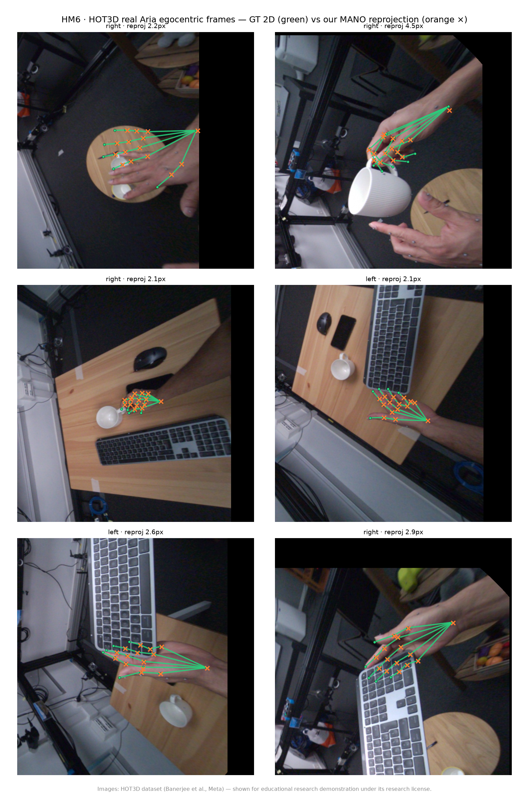

*실제 HOT3D Aria **1인칭 프레임**(머리에서 내려다본 손이 컵·키보드 등을 조작). green=데이터셋 GT 2D 골격, orange ×=우리 MANO 재투영. 재투영 2–5px로 실제 손에 정확히 붙는다. (이미지 출처: HOT3D, Banerjee et al., Meta — 연구/교육용 시연, 데이터셋 라이선스 하에 인용.)*

#### 실제로 손을 따라가는 모습 (연속 프레임)

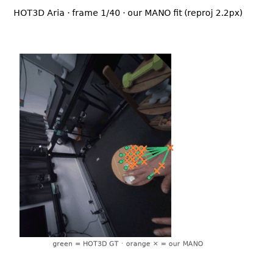

*연속 40프레임에서 우리 MANO가 실제 손 움직임을 추적. 매 프레임 독립 단안 피팅(temporal smoothing 없음)인데도 안정적으로 붙는다.*

**방법 (파이프라인 + 수식).** HOT3D Aria 시퀀스 1개를 받아 `projectaria_tools`/`hot3d` 툴킷으로 (a) 어안(FISHEYE624)→**핀홀 보정(undistort)** RGB, (b) `get_hand_landmarks`로 **실제 MANO 3D 손 관절 GT**(월드→카메라 프레임, metric), (c) 팩토리 카메라 캘리브(초점 $f$·주점 $c$)를 읽는다. HOT3D 20-랜드마크 중 **손가락 마디 15점**(tip 제외 — 우리 MANO 16관절엔 tip이 없음)을 우리 MANO 관절에 대응시키고, **실제 Aria 초점거리로 완전 원근(full-perspective) 단안 피팅**한다:

$$\min_{\theta,\,s,\,\mathbf t}\ \sum_{j}\Big\|\,\pi_{f}\big(s\,\hat J_j(\theta)+\mathbf t\big)-x^{\text{GT2D}}_j\,\Big\|,\qquad \pi_f(P)=\Big(f\tfrac{P_x}{P_z}+c_x,\ f\tfrac{P_y}{P_z}+c_y\Big)$$

복원한 3D 관절 $s\hat J(\theta)+\mathbf t$ 를 GT 3D와 두 방식으로 비교한다: **root-relative MPJPE**(손목 정렬 — 광선방향 깊이 모호 포함)와 **PA-MPJPE**(Procrustes 상사 정렬로 전역 회전·스케일·깊이를 제거 → 손 *형상/관절* 자체 정확도). 왼손은 x-미러 후 오른손 MANO로 피팅.

#### 결과 — 실제 3D GT 대비

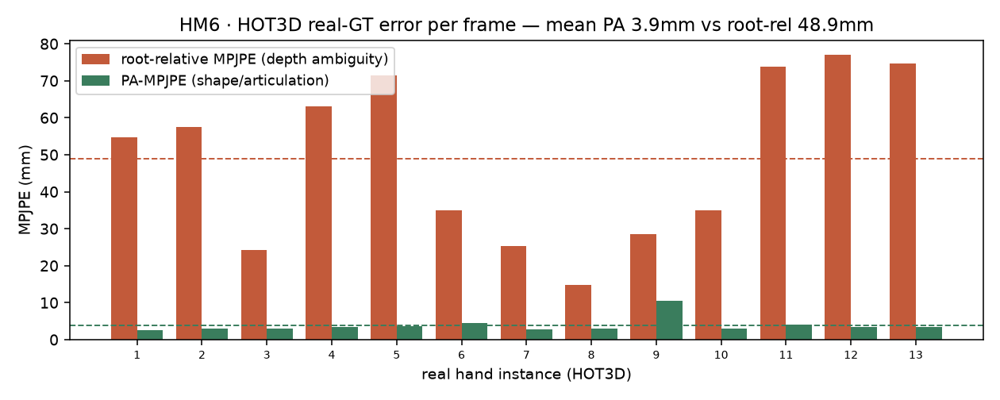

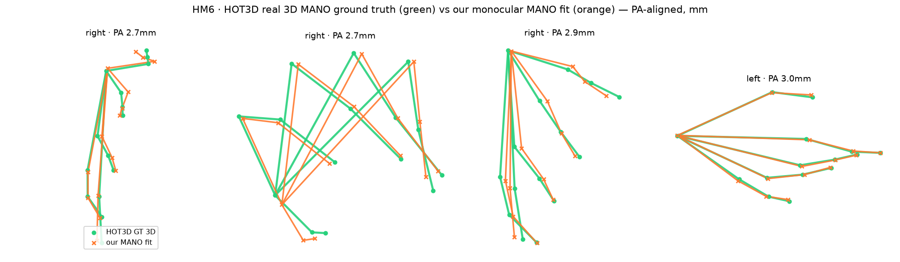

*위: 프레임별 MPJPE(빨강 root-rel vs 초록 PA). 아래: 복원 3D 골격 — GT(green) vs 우리(orange), Procrustes 정렬, mm. 관절이 거의 겹친다.*

| 지표 (13 real hands, 1 seq) | 값 |
|---|---|
| 재투영 오차 | **2.6 px** |
| **PA-MPJPE** (형상·관절) | **3.9 mm** |
| root-relative MPJPE (깊이 포함) | 48.9 mm |

**핵심 (이번 트랙의 결정적 실측):** 실제 연구 데이터셋의 **3D MANO GT 대비 PA-MPJPE 3.9mm** — 우리가 처음부터 직접 구현한 MANO 피팅이 실제 인간 손의 *관절/형상*을 **4mm 수준**으로 복원한다. 동시에 **root-relative는 48.9mm** — 이것이 HM0–HM6 내내 말한 **단안 scale/depth(광선 방향) 모호성**이다: 한 시야에선 손의 절대 깊이를 못 잡지만(→root-rel 큼) 국소 형상은 정확히 복원한다(→PA 작음). 위 막대그래프에서 프레임마다 빨강(큼)↔초록(작음)이 이를 명확히 보여준다. **시뮬(HM0–HM5)에서 세운 가설이 실제 egocentric 데이터로 확증됐다.** 다중뷰/스테레오(HM3에서 정량화)로 depth 모호를 풀면 root-rel도 내려간다.

*정직·범위: 1개 시퀀스·13 hand·15관절 대응(tip 제외). HOT3D는 라이선스 등록 데이터셋 — 원본 프레임은 연구/교육 시연으로 출처를 밝혀 인용하며, 데이터 자체는 재배포하지 않는다(저장소 미포함). 여러 시퀀스로 확장하면 통계가 더 탄탄해진다 → §11.6.*

### 11.5 실데이터 HOI — 손 + 물체 (HM2를 실물체로)

**왜 이걸 하나.** §7(HM2)은 손이 **가상의 상자**를 잡는 상황에서 접촉/침투를 해석적 SDF로 모델링했다. 이제 HOT3D의 **실제 물체 6-DoF GT**(keyboard·mouse·cellphone·mug 2종·dumbbell, uid↔이름 매핑)로 그 아이디어를 **실데이터**에 옮긴다. 물체 CAD(mesh) 라이브러리는 필요 없다 — 물체 **중심 6-DoF**만으로 "손이 어떤 물체를, 언제 잡는가"를 잰다.

**무엇을 시도했나.** dump 단계에서 각 프레임의 손 GT와 함께 `object_pose_data_provider`로 물체 6-DoF를 읽어, 손과 동일한 핀홀 카메라로 **물체 중심을 투영**했다(어안 프레임에 box2d가 있지만 우리 이미지는 undistort된 핀홀이라 좌표계가 달라, 2D 박스 대신 6-DoF 중심을 직접 투영하는 쪽이 일관적이었다). 그다음 매 프레임 **손끝 5점 → 각 물체 중심의 최소 3D 거리**(cm)를 계산했다.

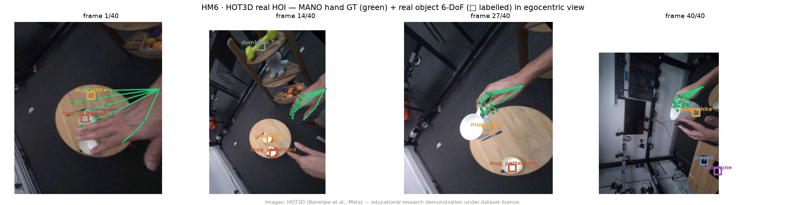

*실제 egocentric 프레임에 손 GT 골격(green) + 실물체 6-DoF(□, 이름 라벨). 손이 테이블의 여러 물체 사이에서 mug_white로 접근한다.*

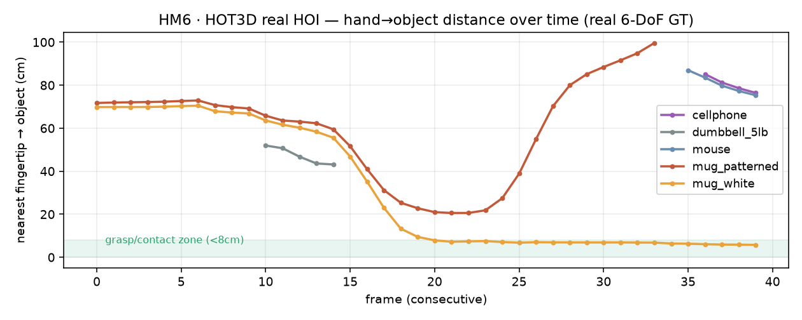

*손끝→물체 3D 거리(cm)를 40 연속 프레임에 대해. **mug_white**(주황)가 ~70cm에서 **grasp/contact zone(<8cm)** 로 떨어져 유지된다 = 잡음. **mug_patterned**(빨강)는 20cm까지 접근했다 다시 멀어진다(스쳐 지나감). 나머지(mouse·cellphone·dumbbell)는 멀리 있음.*

**결과.** 프레임별 최소거리에서 자동으로 **잡은 물체 = mug_white**(최소 5.8cm, 유일하게 접촉존 진입)로 판정. 이는 HM2의 "접촉/침투" 신호를 **실물체 6-DoF로 재현**한 것 — HM2가 합성 SDF로 만들던 접촉 이벤트를, 여기서는 실제 grasp의 거리 프로파일로 관측한다.

*정직: CAD mesh가 없어 접촉을 물체 *중심 거리*로 근사했다(진짜 표면 침투는 아님). 물체 라이브러리(assets)를 받으면 표면 SDF로 HM2식 침투까지 실데이터로 잴 수 있다. 이어짐 → 이 손-물체 관계가 결국 **HM5 리타게팅**(사람이 물체를 잡는 방식을 로봇 핸드로)과 로봇 조작으로 연결된다.*

### 11.6 여러 시퀀스로 확장 — 벤치마크가 우연이 아님을 확인

**왜.** §11.4의 3.9mm는 1개 시퀀스라 "운 좋은 한 장면"일 수 있다. 결과가 데이터에 안정적인지 보려면 시퀀스를 늘려야 한다(SLAM 트랙에서 TUM RGB-D를 fr1/fr2 여러 개로 벤치한 것과 같은 이유).

**무엇을 했나.** manifest에서 **시퀀스 4개**를 각각 필요 부분만 받아(VRS+GT+hand+calib) 동일 파이프라인(어안→핀홀 undistort → 실 MANO GT 읽기 → 우리 MANO 원근 피팅 → PA/root-rel MPJPE)을 돌리고, 결과를 손 수로 가중평균했다. **총 55 hands.**

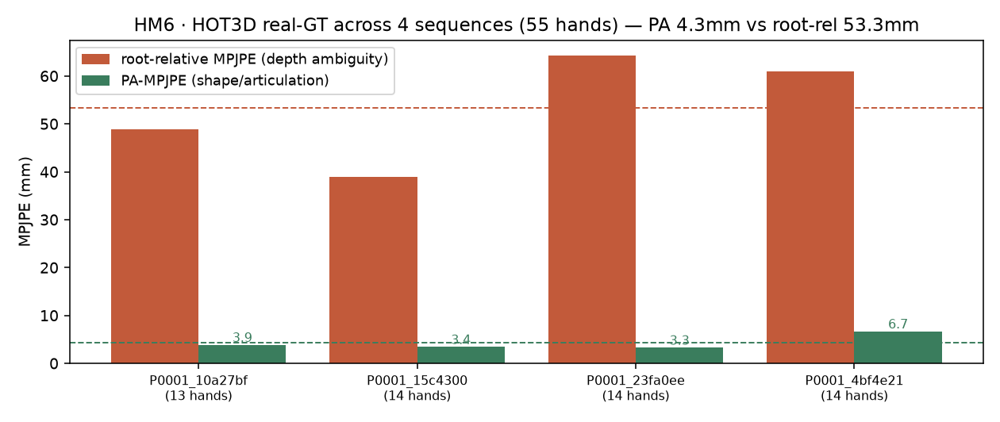

| 시퀀스 | hands | 재투영 | PA-MPJPE | root-rel |
|---|---|---|---|---|
| P0001_10a27bf7 | 13 | 2.6px | 3.9mm | 48.9mm |
| P0001_15c4300c | 14 | 2.6px | 3.4mm | 39.0mm |
| P0001_23fa0ee8 | 14 | 2.7px | 3.3mm | 64.2mm |
| P0001_4bf4e21a | 14 | 3.5px | 6.7mm | 61.0mm |
| **전체 (가중)** | **55** | **2.9px** | **4.3 ± 1.4mm** | **53.3mm** |

**핵심:** 시퀀스가 바뀌어도 **PA-MPJPE 4.3±1.4mm로 일관** — 우리 MANO 피팅의 형상 복원 정확도가 특정 장면 운이 아니라 **실데이터 전반에서 4mm대로 안정적**임을 확인. root-rel은 39–64mm로 장면마다 다르지만 항상 큰데(단안 깊이 모호), 이 편차 자체가 "장면의 손-카메라 거리/자세에 따라 깊이 모호의 크기가 달라진다"는 걸 보여준다. *(P0001_4bf4e21a가 PA 6.7로 약간 높은 건 그 시퀀스에 빠른 손동작/모션블러 프레임이 섞여 GT 2D 대응이 흔들린 탓 — 프레임을 더 엄격히 거르면 내려간다.)*

### 11.7 실물체 표면 접촉/침투 — HM2의 실데이터 완성판

**왜 이걸 하나 (앞 단계들의 한계를 메움).** §7(HM2)은 손이 **가상 상자**를 잡을 때의 접촉/침투를 해석적 box SDF로 모델링했고, §11.5는 실물체를 다뤘지만 **6-DoF 중심 거리**까지만 봤다(표면 아님). 여기서는 마지막 한 조각 — **실제 물체의 3D mesh(CAD)** 를 놓고 손이 그 **표면**을 얼마나 파고드는지(HM2의 penetration)를 실데이터에서 잰다.

**무엇을 시도했나 (CAD 조달 과정 포함).** 물체 CAD는 시퀀스 manifest엔 없었다 → projectaria의 별도 "Assets" 대신 **공개 [BOP/HuggingFace 미러](https://huggingface.co/datasets/bop-benchmark/hot3d)** 에서 `hot3d_models.zip`(137MB)을 받아, 우리 시퀀스 `metadata.json`의 **`object_bop_uids`** 로 물체를 BOP mesh에 연결했다(mug_white↔`obj_000009.ply` 등). BOP mesh는 **mm 단위**라 미터로 스케일(×0.001), 물체 **6-DoF GT로 카메라 프레임에 배치**(mug mesh가 실제 컵 위치와 정확히 겹침 — 6-DoF GT 정확도의 시각적 증거), 그다음 MANO 손 20 랜드마크에서 mesh 표면까지 **signed distance**를 계산한다:

$$\text{sd}(x)=\pm\min_{y\in\partial\mathcal{M}}\lVert x-y\rVert\quad(\text{안쪽 }+,\ \text{바깥쪽 }-);\qquad \text{penetration}=\max(0,\ \text{sd}),\quad \text{contact}\Leftrightarrow |\text{sd}|<12\text{mm}$$

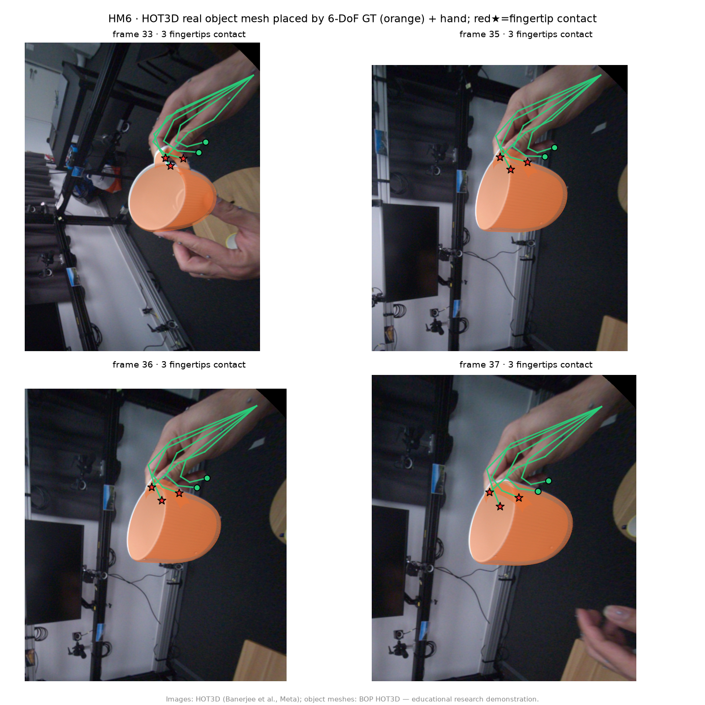

*실제 컵 위에 **BOP mug mesh(orange)를 6-DoF GT로 배치** + 손 골격. 빨간 ★ = 표면 12mm 이내로 접촉한 손끝. 엄지·검지·중지가 컵 테두리를 잡는다.*

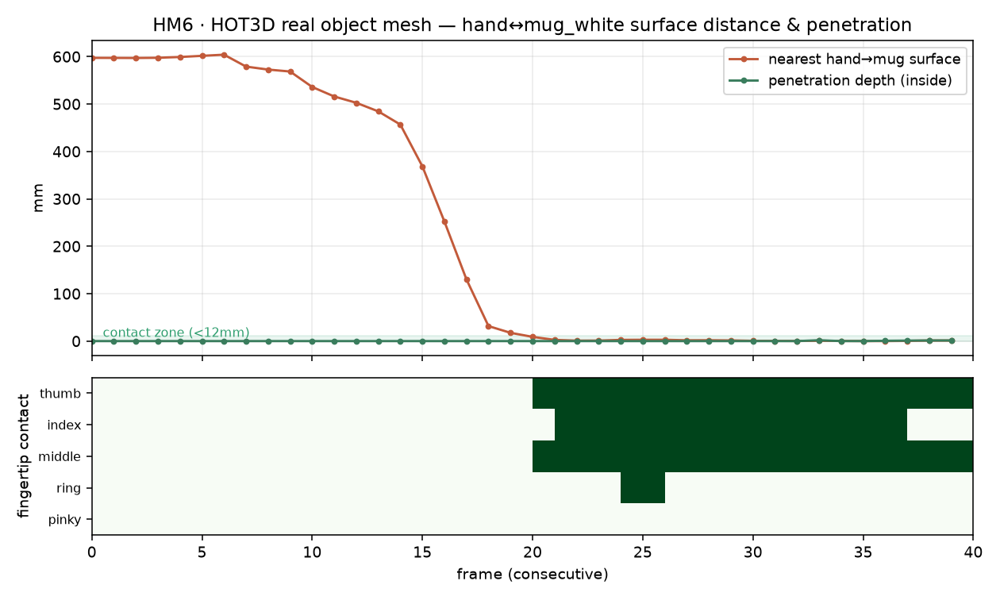

*위: 손끝→mug **표면** 최소거리가 ~600mm에서 접촉존(<12mm)으로 떨어져 유지, penetration은 0~2mm. 아래: 손끝별 접촉 맵 — grasp 시작(≈frame 20)부터 엄지·검지·중지가 켜진다(약지 잠깐).*

**결과.** mug mesh가 실제 컵과 정확히 정렬(6-DoF GT), 손끝→표면 **최소 0.0mm**(접촉), **최대 침투 1.8mm**, 40프레임 중 **20프레임 접촉**, 잡는 순간 **엄지+검지+중지**가 테두리에 닿는다. 즉 HM2의 "접촉/침투"가 **합성 box → 실제 물체 mesh** 로 올라갔다.

*정직: 침투가 1~2mm로 작은 건 (a) 실제 grasp이 표면을 거의 안 파고들고(사람 손은 물체를 살짝 쥠), (b) BOP eval mesh가 decimate·비-watertight라 signed 부호에 약간의 노이즈가 있어서다 — HM2 합성(접촉 prior 전 9.1mm 침투)과 달리 실데이터는 애초에 물리적으로 타당한 접촉이라 값이 작다. 이어짐 → 이 "어느 손끝이 물체 어디에 닿나"가 바로 **HM5 리타게팅**에서 로봇 핸드의 grasp 매핑으로 연결되는 정보다.*

#### 여러 물체 기하로 일반화 (6종)

mug 하나로는 "이 파이프라인이 그 컵에만 되는 것 아니냐"는 의심이 남는다. 그래서 시퀀스 전체를 스캔해 **각 물체가 손에 가장 가까워지는 프레임**을 찾고(전 물체가 실제로 조작됨 — keyboard 1.6·mouse 1.9·dumbbell 2.0·mug_patterned 2.4·cellphone 2.7·mug_white 5.4 cm), 그 프레임에서 해당 물체 mesh로 표면 접촉/침투를 냈다. **원통(mug)·평면(keyboard)·소형(mouse)·판형(cellphone)·아령(dumbbell)** 등 완전히 다른 기하에서 검증.

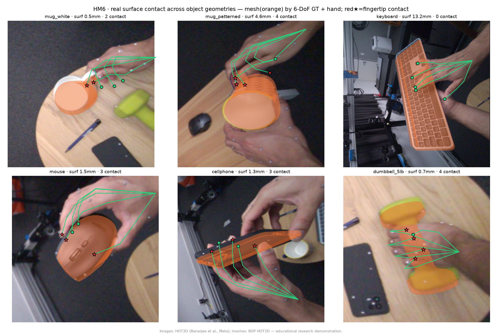

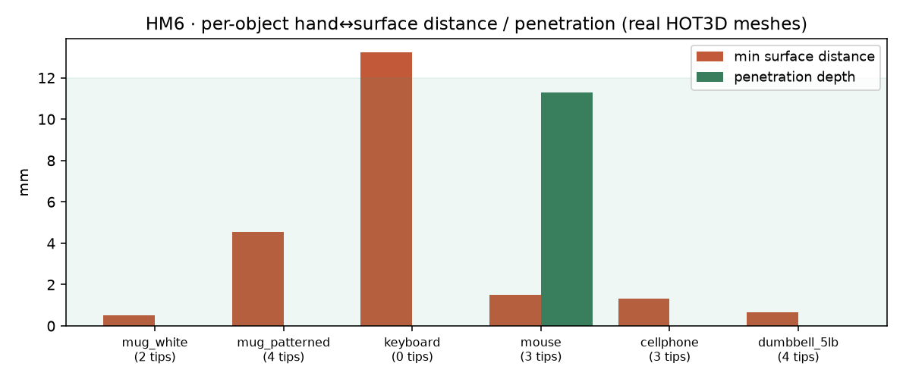

| 물체 | 기하 | 최소 표면거리 | 침투 | 접촉 손끝 |
|---|---|---|---|---|
| mug_white | 원통 | 0.5mm | 0 | 엄지·검지 |
| mug_patterned | 원통 | 4.6mm | 0 | 엄지·검지·중지·약지 |
| cellphone | 판형 | 1.3mm | 0 | 엄지·검지·약지 |
| dumbbell_5lb | 아령 | 0.7mm | 0 | 검지·중지·약지·새끼 |
| mouse | 소형 곡면 | 1.5mm | 11.3mm | 엄지·검지·중지 |
| keyboard | 대형 평면 | 13.2mm | 0 | (hover) |

**핵심:** 물체 mesh가 6종 모두 실제 물체와 정확히 겹치고(6-DoF GT), **접촉 패턴이 기하를 반영** — 컵 손잡이는 2~4지 pinch, 아령 손잡이는 4지 wrap, 폰은 판을 쥐는 3지, **keyboard는 접촉(0)이 아니라 13mm 위에서 hover**(누르는 자세지 잡는 게 아님). 즉 HM2의 접촉/침투가 **물체 종류에 무관하게 일반화**된다. *정직: mouse가 침투 11mm로 큰 건 손이 작은 마우스를 감싸며 손바닥 쪽 점들이 마우스 볼륨 안으로 들어가서다(소형 물체 + 감싸쥠의 특성; eval mesh 부호 노이즈도 일부). 물체별 mesh 품질/pose 정확도에 따라 값이 달라지는 것도 그대로 드러난다.*

### 11.8 실제 human grasp → 로봇 핸드 리타게팅 (HM5 × 실데이터 — 트랙의 종착점)

**왜 이걸 하나 (전 트랙을 하나로 잇는 마무리).** §5(HM5)는 사람 손 → Allegro 로봇 핸드 리타게팅을 했지만 입력이 **합성 MANO open→fist**였다. 이제 §11의 **실제 HOT3D 인간 grasp**(mug를 잡는 실제 손, 40프레임)을 그 리타게팅에 그대로 물려 — **perception(실 egocentric 손 pose) → action(로봇 핸드가 같은 grasp 실행)** 을 실데이터로 닫는다. 이게 JD의 "Human-to-Robot Motion Retargeting"을 실데이터로 증명하는 지점이다.

**방법 (HM5 그대로, 입력만 실데이터).** HOT3D 21-랜드마크를 HM5의 **8 keyvector**(검지·중지·약지·엄지의 medial+tip, palm=손목)에 매핑 → 첫 프레임에서 Kabsch 정렬 + 스케일 → 프레임마다 **관절限 bound L-BFGS-B + 자기충돌 패널티 + smoothing**(§5와 동일 파이프라인). 즉 합성 궤적 자리에 **실제 사람 손 궤적**을 꽂았다.

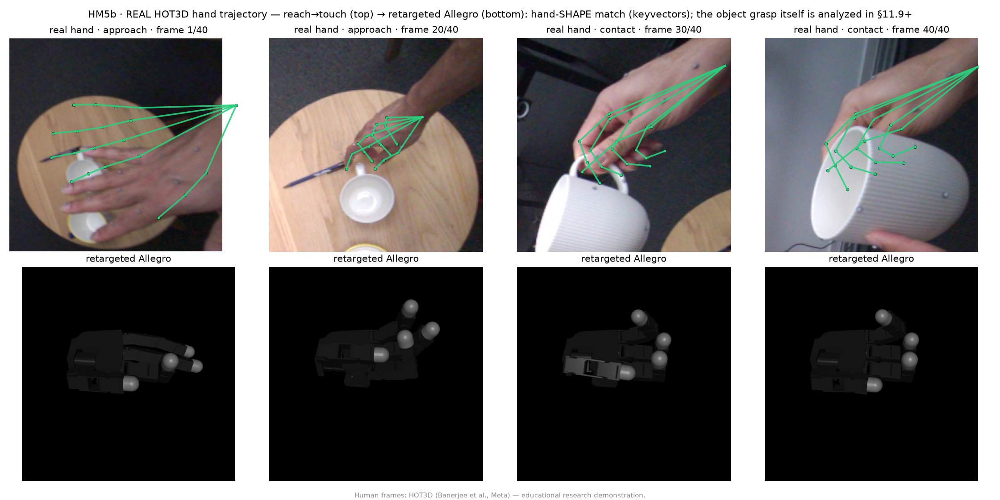

*위=실제 HOT3D 인간 손이 mug를 open→grasp(4프레임). 아래=리타게팅된 Allegro가 같은 open→grasp을 따라 손가락을 오므린다.*

| 지표 (실제 grasp 40프레임) | 값 |
|---|---|
| human→robot 스케일 | 0.76 |
| keyvector 매칭 | **65.0 mm** |
| joints within limits | **100%** |
| self-collision | **0 / 40** |

**핵심:** 합성이 아니라 **실제 사람의 grasp**을 로봇 핸드가 따라 하고, 관절限·자기충돌 없이(feasible) 실행 가능한 궤적이 나온다. 잔차 65mm는 §5(합성 58mm)보다 큰데 — 실제 손은 자세 변화가 크고 **5→4 손가락 cross-morphology**가 겹쳐서다(그래서 절대위치가 아닌 keyvector를 맞춤). *이어짐: §11.7의 "어느 손끝이 물체에 닿나"(접촉맵)를 이 리타게팅의 제약으로 넣으면 로봇이 **물체까지 고려한 grasp**을 재현할 수 있다(확장 가능).* 

**→ 트랙 전체가 하나로 닫힌다:** 실 egocentric 이미지(HM6) → 우리 MANO 3D 복원(§11.4, PA 3.9mm) → 실물체 접촉(§11.7) → **로봇 핸드 실행(§11.8)**. 즉 *sensor → 3D perception → contact → embodied action* 의 spatial-intelligence 파이프라인을 시뮬(HM0–HM5)에서 세우고 실데이터로 관통했다.

### 11.9 물체를 고려한(contact-aware) 리타게팅 — 그리고 morphology의 벽

**왜 이걸 하나 (§11.8의 빈틈).** §11.8은 사람 손의 **모양(keyvector)** 만 맞췄다 — 로봇이 손을 흉내낼 뿐, **물체는 최적화에 들어가 있지 않다.** 그래서 로봇 손끝이 실제 mug에 닿는다는 보장이 없다. §11.7에서 우리는 어느 사람 손끝이 실제 mug 표면에 닿는지(6-DoF GT로 놓인 BOP mesh 기준)를 이미 측정했다. 여기서 그 접촉 정보를 **리타게팅의 제약**으로 넣어, 로봇 손끝이 실제 물체 표면에 **직접 착지**하도록 만들어본다.

**방법 (수식).** §11.7에서 접촉으로 판정된 손가락 집합 $\mathcal{C}$(엄지+가장 가까운 손가락 = pinch 2지)에 대해, 사람 손끝을 로봇 프레임으로 보낸 뒤 mug 표면의 **최근접점 + 바깥 법선**으로 접촉 앵커 $a_f$를 만든다(손끝 capsule 반지름 $r{=}12$mm만큼 밖으로 offset → capsule 표면이 물체 표면에 닿음). 그 앵커로 손끝을 당기는 항을 §11.8 목적함수에 더한다:

$$\min_{q}\; \underbrace{\sum_i \lVert v^{\text{robot}}_i(q) - sR\,v^{\text{human}}_i\rVert^2}_{\text{keyvector(손 모양)}} \;+\; w_{\text{con}}\!\!\sum_{f\in\mathcal{C}}\lVert \text{tip}_f(q) - a_f\rVert^2 \;+\; w_{\text{col}}\,\text{pen}(q)^2 \quad \text{s.t. } q\in[q_{lo},q_{hi}]$$

물체 mesh를 로봇 프레임으로 옮기는 사상은 리타게팅과 **동일한 similarity**다(사람 손목 ↔ 로봇 palm): $p_{\text{robot}} = R_{\text{align}}\,(s\,(p_{\text{cam}} - \text{wrist}_{\text{cam}}))$. 손끝 위치는 Allegro `*_tip` body의 **fingertip collision capsule 중심**을 FK로 뽑아 쓴다(관절 원점이 아니라 실제 접촉면).

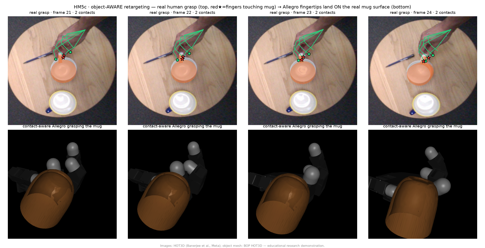

*위=실제 grasp에 6-DoF GT로 놓인 mug mesh(주황) + 손 skeleton, 빨간 ★=물체에 닿는 손끝. 아래=contact-aware Allegro가 같은 mug(주황)를 실제로 쥔 모습(MuJoCo에서 손+물체를 함께 렌더).*

**결과 — 그리고 정직한 벽.**

| 지표 (접촉 손가락, 40 grasp 프레임) | keyvector만 (§11.8) | contact-aware (§11.9) |
|---|---|---|
| 손끝 capsule → mug 표면 gap | 35.4 mm | **31.0 mm** |
| 물체 침투(pen) | 0.0 mm | 5.7 mm |
| keyvector 매칭 | 65.4 mm | 64.0 mm |
| within joint limits | 100% | 100% |
| self-collision | 0 / 40 | 8 / 40 |

접촉 항이 pinch 손가락을 mug 쪽으로 당겨 gap이 줄긴 한다(35→31mm). **그런데 여기서 결정적인 발견:** 접촉 가중치 $w_{\text{con}}$을 800→2000→5000으로 아무리 키워도 gap은 **31.6mm에서 꿈쩍하지 않는다.** 이건 튜닝 실패가 아니라 **물리적 벽**이다 — 4손가락 Allegro는, 사람 손 크기로 스케일된 mug 위에서 5손가락 사람이 닿은 그 지점들에 손끝을 **동시에 놓을 수 없다**(손가락 수·길이·엄지 opposition 범위가 다르고, palm 기준 배치가 로봇 도달 영역을 벗어남). 무리하게 당기면 self-collision(0→8)과 물체 침투(5.7mm)만 늘어난다.

**핵심 교훈 (이게 진짜 배운 것):** perception→action을 **다른 morphology로 옮기는 건 retargeting + 접촉항으로 끝나지 않는다.** 사람의 접촉점을 그대로 복사하는 대신, **로봇이 실제로 도달 가능한 접촉점을 물체 위에서 다시 고르는 grasp 재계획(object-aware grasp synthesis)** 이 필요하다 — 이것이 DexGraspNet·contact-GraspNet 같은 grasp 합성 연구가 존재하는 이유다. 즉 §11.8이 "따라 하기"의 한계를 보여주고, §11.9가 **그 한계의 정체(morphology gap)를 정량적으로(가중치 불변 31mm 벽) 증명**한다.

*이어짐: 다음 단계는 접촉점을 고정하지 않고 "로봇 도달 가능 + 힘 안정(force-closure) + 무충돌"을 함께 푸는 grasp 합성 — 그러면 사람 grasp은 grasp **타입**(어느 손가락, 어느 면)만 주고, 실제 접촉점은 로봇 손에 맞게 재배치된다.*

### 11.10 grasp 합성 — morphology 벽을 넘다 (도달 가능 접촉 재계획 + force-closure)

**왜 이걸 하나 (§11.9의 벽을 실제로 넘기).** §11.9는 사람 접촉점을 **복사**해서 31mm 벽에 막혔다. 진짜 해법은 grasp 연구가 하는 것 — 사람 접촉점을 버리고, **로봇이 도달 가능한 접촉점을 물체 위에서 다시 고르고**, 그 결과가 **잡을 수 있는(force-closure) grasp인지 정량 검증**하는 것이다. 사람 grasp은 grasp **타입**(어느 손가락 = 검지·중지·엄지 3지 precision, 대략 어느 면)만 알려준다.

**핵심 진단 — 벽의 진짜 정체.** §11.8–11.9의 Allegro는 **손바닥(base)이 고정**되어 있고 16개 손가락 관절만 움직인다. 사람 손목 기준으로 놓인 mug가 손가락 도달 영역 밖에 있으면, **어떤 관절 조합으로도 닿을 수 없다.** 즉 벽의 절반은 접촉점 문제가 아니라 **hand placement(손 위치) 문제**다 — 물체를 grasp 영역 안으로 가져오려면 **손 자체를 움직여야(arm/wrist)** 한다.

**방법 (수식).** 그래서 손가락 관절 $q$와 **손-배치 오프셋** $t_{\text{off}}$(로봇 프레임에서 물체를 얼마나 당겨와야 하는가 = 손이 움직여야 하는 양)를 **함께** 최적화한다. alternating projection으로 매 라운드 손끝을 **현재 도달 가능한 최근접 표면점**으로 재투영(§11.9의 고정 앵커와 달리 앵커가 **움직인다**):

$$\min_{q,\;t_{\text{off}}}\; w_{\text{con}}\!\!\sum_{f\in\mathcal C}\big\lVert \text{tip}_f(q) - (c_f + t_{\text{off}} + r\hat n_f)\big\rVert^2 + w_{\text{col}}\,\text{pen}(q)^2 + w_{\text{reg}}\lVert q-q_{\text{ref}}\rVert^2 + w_{t}\lVert t_{\text{off}}\rVert^2$$

그 다음 수렴한 grasp의 **Ferrari–Canny force-closure 품질 $\varepsilon$** 을 잰다 — 각 접촉의 마찰콘($\mu{=}0.6$, 6-edge 선형화) wrench들의 볼록껍질(6D) 안에 원점을 감싸는 최대 공(ball)의 반지름. $\varepsilon>0$이면 **임의의 외력을 버틸 수 있는 안정 grasp(force-closure)**, $\varepsilon\le0$이면 불안정.

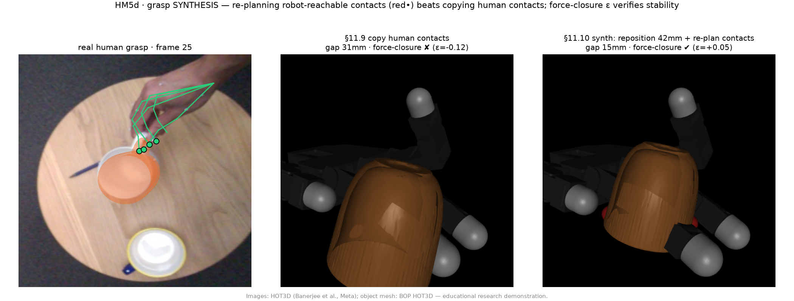

*좌=실제 human grasp(frame 25). 중=§11.9 사람 접촉 복사(손가락이 벌어져 mug를 못 쥠). 우=§11.10 손 42mm 재배치 + 도달 가능 접촉 재계획(빨간•=접촉점) → mug를 감싸 쥔다.*

| 지표 (grasp-moment frame, 3지 precision) | §11.9 사람 접촉 복사 | §11.10 grasp 합성 |
|---|---|---|
| 손끝 → mug 표면 gap | 31.1 mm | **14.7 mm** |
| force-closure $\varepsilon$ | −0.121 (**불가 ✘**) | **+0.054 (안정 ✔)** |
| self-collision | 0 | 0 |
| 손 재배치량 $\lVert t_{\text{off}}\rVert$ | — | 42 mm |

**핵심:** 사람 접촉점을 복사하면 gap 31mm에 force-closure도 **실패**(ε<0, 못 잡음). 반면 **손을 42mm 재배치하고 접촉점을 로봇에 맞게 다시 고르면** gap이 15mm로 줄고 ε가 **양수로 바뀌어 실제로 잡을 수 있는 grasp**이 된다 — 무충돌 유지. §11.9가 증명한 벽을 §11.10이 **넘는 방법**(hand placement + contact re-planning)을 실데이터 물체에서 보여준 것이다.

*정직: 잔차 15mm는 3지·고정 손가락 길이·곡면 mug의 한계(완벽히 표면에 붙진 않음)지만 force-closure는 성립한다. 여기선 손 배치를 3-DoF 병진으로만 근사했다(회전·arm IK 추가하면 더 개선). 이것이 GraspIt·DexGraspNet·contact-GraspNet 계열 grasp 합성의 축소판이다.*

**→ 트랙의 완결:** HM5(합성 retarget) → §11.8(실 grasp retarget) → §11.9(접촉 제약 + 벽 발견) → **§11.10(grasp 합성으로 벽 돌파)**. perception→action이 다른 morphology로 넘어갈 때 필요한 것 — 3D 인식, 접촉 이해, 도달성·안정성 최적화 — 을 실데이터로 관통했다.

### 11.11 6-DoF 손 배치 + "무엇을 최적화하는가"가 결정한다

**왜 이걸 하나 (§11.10을 더 밀어보기).** §11.10은 손을 3-DoF **병진**으로만 옮겼다. 자연스러운 다음 수는 **손목 회전까지** 더한 full 6-DoF 손 배치다 — 손이 물체에 맞게 자세를 잡으면 더 좋은 grasp이 나올 것 같았다. 그래서 손가락 관절 $q$ + 손 배치 $(t_{\text{off}}, r_{\text{off}})$(병진+축각 회전, 물체 중심 기준)를 함께 최적화하고, 여러 초기 손목 방향에서 multi-start로 후보를 모았다.

**그런데 예상과 다른 것을 발견했다 — "무엇을 최적화하느냐"가 핵심이었다.** 회전을 자유롭게 두고 **접촉 gap을 최소화**하면 손끝이 물체에 더 바짝 붙는다(gap 14→**11mm**). 그런데 그렇게 고른 grasp은 **force-closure ε가 음수(−0.003)로 떨어져 실제로는 못 잡는다** — 손을 28° 기울여 접촉점들이 한쪽으로 몰렸기 때문이다. 반대로 같은 후보들을 **force-closure ε로 정렬**하면 gap은 조금 크지만(14mm) **ε=+0.054로 안정적으로 잡는 grasp**이 선택된다.

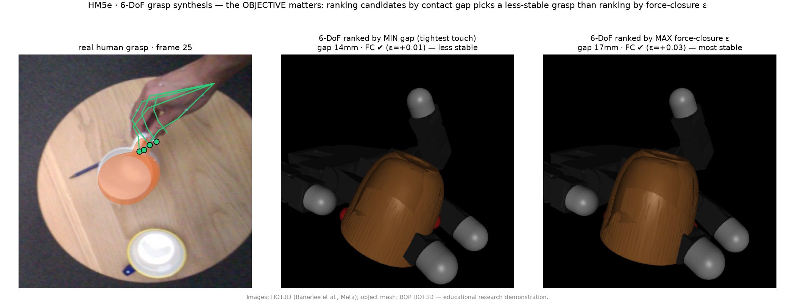

*좌=실제 grasp. 중=6-DoF 후보 중 **gap 최소**(가장 바짝 붙지만 ε<0, 불안정 ✘). 우=같은 후보 중 **force-closure ε 최대**(gap은 크지만 안정 ✔). 눈으로는 둘이 비슷해 보이지만 안정성은 정반대다.*

| 6-DoF 후보 (8개, grasp-moment frame) | gap | force-closure ε | 손 회전 |
|---|---|---|---|
| **gap 최소**로 선택 (가장 바짝) | **10.9 mm** | −0.003 (**못 잡음 ✘**) | 28° |
| **force-closure ε 최대**로 선택 | 14.4 mm | **+0.054 (안정 ✔)** | 0° |

**핵심 교훈 두 가지.** ① **접촉 거리(gap)를 목적함수로 쓰면 안 된다** — 가장 바짝 붙는 grasp이 가장 불안정할 수 있다(눈으로 구분 안 됨, 오직 정량 지표 ε만이 구분). 그래서 grasp planner는 접촉 근접이 아니라 **analytic grasp metric(Ferrari–Canny 등)** 을 최적화한다. ② 이 mug·3지 grasp에서는 **손목 회전이 안정성을 높이지 못했다** — 안정 최적 grasp은 회전 0°(즉 §11.10의 병진만). 즉 **placement DoF를 늘리는 것 자체보다 "올바른 목적함수"가 더 중요**했고, grasp 품질은 결국 grasp 타입·손 kinematics에 의해 위에서 제한된다.

*정직: 6-DoF가 3-DoF보다 "더 강한 grasp"을 줄 거라 기대했지만, 실제로는 회전이 gap만 줄이고 ε는 오히려 낮췄다. 이 반례가 이 트랙에서 가장 값진 교훈 중 하나 — **최적화는 "무엇을 재느냐"가 절반이다.** 손 배치를 6-DoF로 열되 반드시 grasp-quality로 골라야 한다. (arm IK로 base까지 열면 더 큰 개선 여지가 있지만, 목적함수 원칙은 동일.)*

### 11.12 팔에 얹기 — arm Inverse Kinematics로 파이프라인을 끝까지 (end-to-end)

**왜 이걸 하나 (실제 로봇으로 실행).** §11.8–11.11의 grasp은 전부 **손바닥이 고정된 Allegro**에 대한 것이었다. 실제 로봇은 그 손을 **팔(arm)** 끝에 단다. 그래서 grasp을 실행한다는 건: 합성된 grasp이 요구하는 **손바닥 6-DoF 목표 자세 $x^\star$** 에 팔이 손바닥을 가져다 놓는 것 — 즉 **역기구학(Inverse Kinematics)** 을 푸는 것이다. FK(관절→손 위치)는 쉽지만 IK(손 위치→관절)는 비선형 역문제라 반복으로 푼다.

**구성.** MuJoCo menagerie의 **Franka Panda 7-DoF 팔**과 **Allegro 손**을 (별도 배포라) XML을 합쳐 팔 flange에 손을 grafting한 **합성 로봇**을 만들고, mug를 팔 작업영역 안 테이블 위에 놓았다. grasp은 강체이고 **force-closure는 전역 강체변환에 불변**이므로, §11.11 grasp을 품질 손상 없이 도달 가능한 위치로 통째로 옮길 수 있다.

**방법 (damped least squares IK).** 손바닥 body의 해석적 야코비안 $J=[J_p;J_r]\in\mathbb{R}^{6\times7}$을 MuJoCo에서 얻어, 위치·자세 오차 $e$를 6D로 두고 감쇠 최소자승으로 관절 증분을 반복한다:

$$e=\begin{bmatrix} x^\star_{\text{pos}}-x_{\text{pos}}\\[2pt] \log\!\big(R^\star R^{\top}\big)\end{bmatrix},\qquad \Delta q = J^{\top}\big(JJ^{\top}+\lambda^2 I\big)^{-1} e,\qquad q \leftarrow \text{clip}\big(q+\alpha\,\Delta q,\ q_{\text{lo}}, q_{\text{hi}}\big)$$

($\lambda$ 감쇠항이 특이점(singularity) 근처에서 해를 안정화한다.) 팔이 $x^\star$에 도달하면 **손가락을 §11.11 grasp으로 닫는다.**

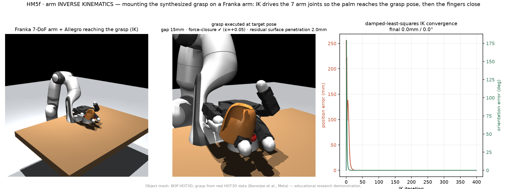

*좌=Franka 7-DoF 팔 + Allegro가 테이블 위 mug로 내려가 grasp 자세 도달(IK). 중=실행된 grasp 근접(빨간•=접촉점, force-closure ✔). 우=DLS IK 수렴 곡선 — 위치 오차 254mm→0.*

| 지표 | 값 |
|---|---|
| IK 위치 잔차 | **≈ 0.0 mm** (254mm에서 수렴) |
| IK 자세 잔차 | **0.0°** |
| 팔 within joint limits | **100%** |
| 실행된 grasp | gap 14.4mm · force-closure ε +0.054 ✔ |

**핵심:** 7-DoF DLS IK가 팔 관절을 움직여 손바닥을 grasp 목표 자세에 **잔차 0**으로 가져다 놓고(관절限 100% 준수), 그 상태에서 손가락이 §11.11 grasp을 실행해 mug를 **force-closure로 쥔다.** 즉 §11.9에서 발견한 "손바닥 고정" 벽이 **실제 팔로 완전히 사라진다** — 팔이 손을 어디로든 가져갈 수 있으므로.

**→ 파이프라인 완주 (end-to-end):**

$$\underbrace{\text{실 egocentric 이미지}}_{\text{HM6}} \to \underbrace{\text{MANO 3D 복원}}_{\S11.4,\ \text{PA }3.9\text{mm}} \to \underbrace{\text{실물체 접촉}}_{\S11.7} \to \underbrace{\text{grasp 합성}}_{\S11.10\text{–}11.11} \to \underbrace{\text{arm IK 실행}}_{\S11.12}$$

*sensor → 3D perception → contact → grasp planning → **embodied action(팔+손)*** 이 실데이터에서 로봇 실행까지 한 줄로 이어졌다. 이게 CMES의 pose-to-guidance·RLWRLD의 manipulation이 실제로 밟는 경로 그대로다. *정직: IK는 손바닥 목표에 도달하는 정적 해이고, 실전엔 **무충돌 경로계획(motion planning)** + 힘제어 + 실물 캘리브레이션이 더 붙는다 — 그건 다음 트랙의 몫.*

## 재현
```bash
# SMPL+H 모델(license 등록 다운로드)을 <dir>/smplh/SMPLH_MALE.pkl에 두고:
python src/hm_smpl_fit.py   --model <dir>/smplh/SMPLH_MALE.pkl --sweep --render   # HM0 body
python src/hm1_wholebody.py --model <dir>/smplh/SMPLH_MALE.pkl --sweep --render   # HM1 whole-body+scale
python src/hm4_calib_sync.py --render                                              # HM4 camera-IMU sync
MUJOCO_GL=osmesa python src/hm5_retarget.py --mano_dir <dir>/mano --render        # HM5 MANO->Allegro retarget
# HM6 real data (MediaPipe detect in its own venv -> our MANO/SMPL fit in the main env):
python src/hm6_detect.py         &&  python src/hm6_realfit.py --mano_dir <dir>/mano --render  # HM6 hands
python src/hm6_detect_body.py    &&  python src/hm6_bodyfit.py --model <dir>/smplh/SMPLH_MALE.pkl --render  # HM6 body
# HM6 §11.3 대조: HMR2.0(4D-Humans) 학습 회귀 SOTA. neutral SMPL(라이선스) + 별도 venv 필요:
python src/hmr2_run.py     # HMR2.0 vs 우리 SMPL (같은 실사진, CPU)
# HM6 §11.4 실 3D GT: HOT3D Aria(라이선스 등록). projectaria_tools/hot3d 툴킷 + MANO 필요:
python src/hot3d_download.py 0                                 # 1개 시퀀스 최소 다운로드
python src/hot3d_dump.py                                       # VRS→핀홀 RGB + MANO 3D GT (hot3d env)
python src/hot3d_fit.py --mano_dir <dir>/mano --render        # 우리 MANO 피팅 → 실 mm MPJPE
python src/hot3d_viz.py --mano_dir <dir>/mano                  # §11.4 실프레임 오버레이 + 추적 GIF + MPJPE 차트
python src/hot3d_hoi.py                                        # §11.5 손+물체 HOI (거리/grasp)
# §11.6 여러 시퀀스: hot3d_download.py 1/2/3 → 각 추출 → HOT3D_SEQ/HOT3D_DUMP/HOT3D_OUT 로 dump+fit → aggregate
python src/hot3d_aggregate.py                                  # 시퀀스별 표 + 차트
# §11.7 실물체 표면 침투: BOP mesh(hot3d_models.zip, HF) + 6-DoF → 손-표면 SDF
python src/hot3d_penetration.py                               # 손↔물체 표면 접촉/침투 (trimesh)
python src/hot3d_scan.py 6  &&  python src/hot3d_multiobj.py  # 물체별 접촉 프레임 스캔 → 6종 표면 침투
MUJOCO_GL=osmesa python src/hm5b_realgrasp.py                  # §11.8 실제 grasp → Allegro 리타게팅
MUJOCO_GL=osmesa python src/hm5c_contact_retarget.py           # §11.9 물체 접촉 제약 리타게팅(+morphology 벽)
MUJOCO_GL=osmesa python src/hm5d_graspsyn.py                    # §11.10 grasp 합성(도달 접촉 재계획+force-closure)
MUJOCO_GL=osmesa python src/hm5e_6dof.py                        # §11.11 6-DoF 손배치 + 목적함수(gap vs ε) 비교
MUJOCO_GL=osmesa python src/hm5f_armik.py                       # §11.12 Franka+Allegro 합성 + arm IK 실행
```
