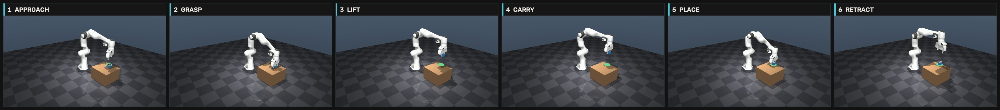
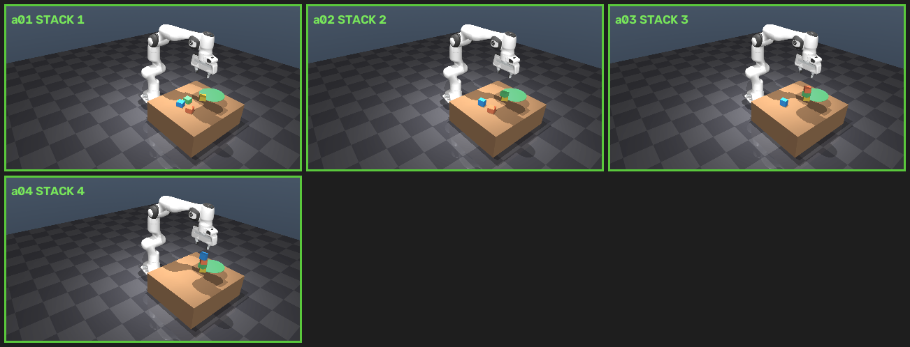
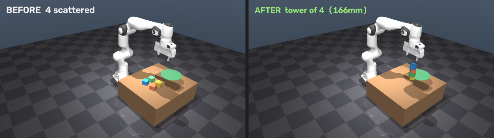
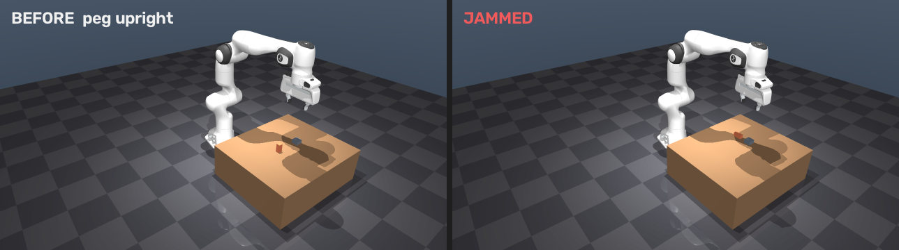
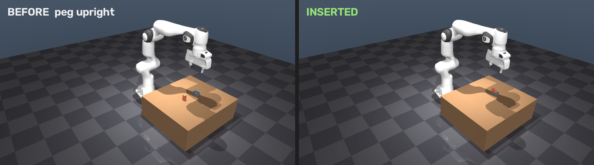
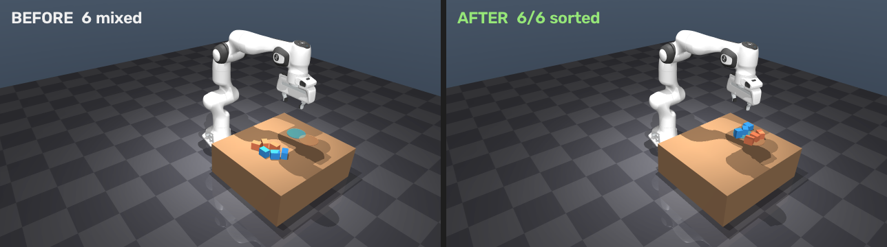
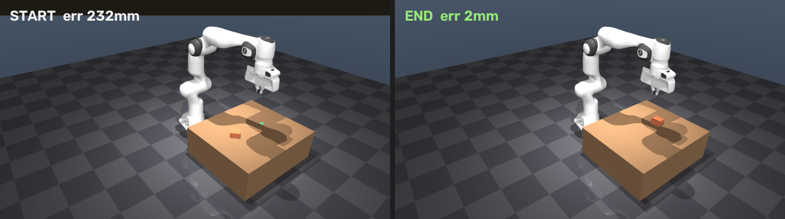
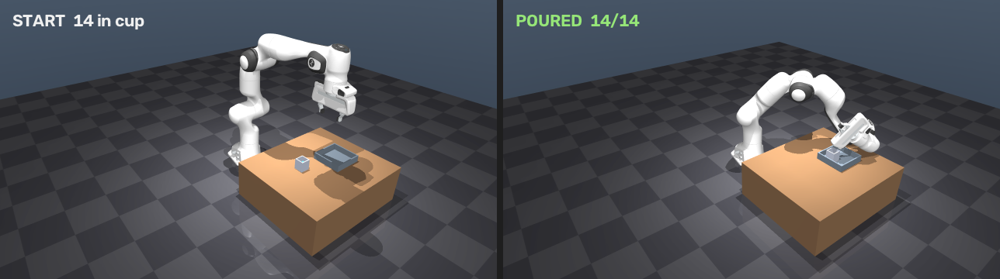
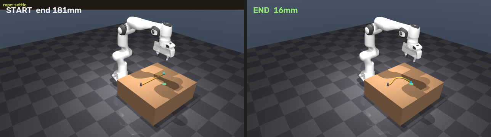

# Manipulation — 물성 4축

이 페이지의 태스크는 전부 **고전 파이프라인**으로 움직인다: 기하 기반 perception(마커 또는 마커리스 RGB-D → world 좌표 역투영) + analytic grasp(PCA·top-face 기반 grasp point 계산) + damped least-squares(DLS) IK + PD 위치제어 액추에이터 + 스크립트 FSM(perceive → approach → grasp → carry → place → retract). **학습된 policy·imitation·RL은 전혀 쓰지 않는다.** 유일한 예외는 bin picking 절에서 "왜 63%에서 막히나"를 진단하며 잠깐 등장하는 학습 기반 grasp 비교(GraspNet 등)인데, 이건 파이프라인의 일부가 아니라 별도 A/B 실험이고 자세한 SOTA 비교는 grasp_sota.md에서 다룬다.

전 태스크에서 반복되는 원칙 하나: **성공률은 재현 가능한 수치로만 보고하고, 애매하거나 낮은 결과는 추측이 아니라 단계별 텔레메트리 계측으로 원인을 분해한다.** stacking의 held-offset, bin picking의 grasp depth, push의 오버슈트, pouring의 clean_pour 진단이 모두 같은 패턴이다.

물성 4축으로 묶는다: **강체 파지**(pick-place·bin-pick·stack·insert·sort) → **비파지**(push) → **동적/도구**(pour) → **변형체**(rope). 뒤로 갈수록 물체의 자유도와 상태 공간이 커지고, 순수 위치제어의 한계가 더 뚜렷해진다.

## 강체 파지 (Rigid-Body Grasping)

grasp가 유지되는지, 옮기는 중 안 떨어지는지가 전부 물리 스텝(`mj_step`)의 접촉력으로 결정되는 다섯 태스크. 물체는 전부 질량·마찰을 가진 자유 강체(`freejoint`)다.

### 1. 단일 pick-and-place — 100%

**목표.** 이전 데모([[pick_demo]] 격)는 kinematic이었다 — 관절각을 보간해 렌더만 했고 물체는 mocap 타일이라 실제로 "잡히는" 게 아니었다. 여기서는 물체를 질량·마찰을 가진 자유 강체로 두고 Panda가 실제 접촉력으로 집는다. 가이던스 파이프라인을 닫힌 루프로 만들어 정직하고 재현 가능한 headline 성공률을 얻는 것이 목표다.

**방법(닫힌 루프).** perceive(ArUco) → DLS IK로 approach/grasp → 그리퍼 CLOSE(힘) → lift → place 타겟으로 carry → release. 전 구간 `mj_step`으로 스텝하므로 접촉 물리가 실제로 잡아야만 성공한다. 물체는 44×44×52mm 상자(그리퍼 80mm 안), 질량 30g, `friction 1.8`, `condim 6`, `freejoint`로 중력 낙하·접촉을 그대로 받는다. 매 trial 물체 위치(x 450–545mm, y −10~110mm)·yaw를 랜덤화해 중력으로 안착한 뒤 인지부터 시작한다. 각 구간에서 관절 타겟을 현재 자세에서 60% 지점까지 램프하는 부드러운 구동을 쓴다 — step 명령은 잡은 물체를 튕겨낸다. 단계별 물체 위치(lift 직후/carry 후/release 전/최종)를 전부 기록해 실패 원인 분해용 텔레메트리로 남긴다.

**결과 (40/40 trial).**

| 지표 | 값 |
|---|---|
| perception rate | **100%** (40/40) |
| grasp+lift rate | **100%** (40/40) |
| **place success rate** | **100%** (40/40) |
| perception 오차 | 6.59mm (mean) |
| place 오차 | 4.87mm (mean, 성공분) |

**디버깅 발견.** 첫 실행은 place 성공률 **72%**였다. perception·grasp-lift는 100%인데 place만 5/18이 ~93–104mm 밖으로 튀었다. "그립이 약한가"로 추측하지 않고 단계별 위치 텔레메트리로 원인을 분해했다: carry 후~release 직전까지 물체는 전부 타겟(≈445, 180mm)에 정확히 있었다 — 인지·IK·grasp·운반은 무결. final 위치만 튀었고, 튄 방향이 전부 pick 위치 쪽(+x, −y)으로 일관됐다. 범인은 retract 한 줄: release 후 복귀 자세를 pick 위 자세(`q_lift`)로 줘서, 열린 그리퍼가 방금 놓은 물체를 pick 방향으로 쓸고 지나갔다(똑바로 밀리면 ~95mm/z=226, 옆으로 넘어지면 40–50mm/z=222 — 같은 원인). retract를 place 타겟 바로 위(`q_pup`)로 수직 상승시키자 **72% → 100%**, place 오차 18.1 → 4.87mm로 떨어졌다.

교훈: 성공률이 애매할 때 어느 단계에서 깨지는지 계측하면 추측 없이 한 줄로 고쳐진다. perception이 아니라 **동작 계획(복귀 경로)** 결함이었다는 게 포인트 — perception 정확도가 전부를 결정한다는 통념과는 다른 축(계획/실행)의 실패 모드였다.

perception 오차 6.6mm는 그리퍼 여유(80mm) 안이라 grasp-lift가 100%인 것과 정합한다 — mm급 인지(perception.md 참고)가 실제 잡기로 이어짐을 닫는 사례. 남은 축은 단일 물체·정돈된 씬이라는 점이다. clutter·가림·미지 물체는 다음 태스크(bin picking)에서 다룬다.



*pick → lift → carry → place 키프레임*

**재현**
```bash
python src/physics_pick.py 40 --render
```

### 2. Bin picking (클러터) — 평균 63%, 벽 제거 시 77%

**목표.** 단일 pick-and-place는 정돈된 단일 물체였다. 실제 bin은 마커 없는 물체들이 쌓여 서로 가리는 더미다. bin에 박스 6개를 떨어뜨려 clutter를 만들고, 마커 없이 물체별 point cloud로 pose를 잡아, 최상단(가림 최소) 우선으로 집어 drop zone으로 옮기고, 매번 다시 인지하며 bin이 빌 때까지 반복한다. 헤드라인은 정직한 **clearance rate**(비워낸 물체 / 전체) — 100%가 아니라 평균치를 그대로 보고한다.

**방법(닫힌 루프).** 씬은 테이블 위 bin(벽 4개, 내부 15cm) + 박스 6개(44~60mm, 30g, `friction 1.6`, `condim 6`)가 랜덤 낙하·안착한 더미. drop zone은 bin 옆 실린더. 인지는 마커리스 RGB-D: 전방 하향 카메라(팔 home이 시야를 안 가리게 배치 — 순수 top-down은 팔이 가림)로 depth+segmentation을 렌더 후 물체별 픽셀을 world로 역투영해 각 물체의 centroid·top_z·yaw(PCA)·grasp 폭을 추정한다. 선택은 bin 안 물체 중 top_z 최대(가장 위 = 가림 적음)를 골라, PCA 단축에 그리퍼를 정렬(Franka 손가락은 `topdown_R`의 X축으로 벌어짐). 폭이 그리퍼(72mm)를 넘거나 IK 잔차가 크면 skip한다. 실행은 수직 하강 → 접촉력 close → 들어올림 → drop zone 슬롯으로 운반 → release → place 위 수직상승 retract(단일 pick-place의 교훈 재사용) → home. 장면이 바뀌었으니 매 사이클 재인지하고, 물체당 최대 2회 재시도한다.

**결과 (6물체 · 5 seed).**

| 지표 | 값 |
|---|---|
| perception(검출) | **~100%** (6/6, 마커 없음) |
| **clearance rate** | **평균 63%** (범위 33–100%) |
| grasp-lift(첫 시도) | ~50% |
| place(들린 것 중) | **~100%** |
| multi-pick | **0** |

seed 5는 6/6 완전 clearance.

**디버깅 발견.** 첫 실행 clearance 33%. 추측 대신 단계별 위치 텔레메트리로 원인을 세 갈래로 분해했다.

1. **drop-zone 충돌**: `knock=0`인데 lost가 생기고 "PLACED 3인데 cleared 2". 한 점에 여러 개를 놓아 나중 것이 먼저 것을 밀어냄 → drop을 슬롯별로 분산 → lost 0, place율 100%.
2. **작은 낮은 물체 완전 미스**: start/descend/close/lift z가 전부 동일 = 물체가 안 움직임(헛집음). grasp가 너무 얕아 손가락이 물체 상단만 스침 → grasp를 더 깊게(top_z−26mm) 물려 engagement 확보 → 회수.
3. **grasp yaw 축**: 손가락이 단축을 잡게 π/2 플립을 시도했더니 오히려 나빠짐 → Franka 손가락은 `topdown_R`의 X축으로 벌어져 원래(offset 0)가 이미 단축 정렬임을 확인.

→ clearance 33% → 평균 63%(정돈된 config는 100%).

**왜 63%에서 멈추나(진단).** 파라미터를 더 돌리기 전에 실패의 뿌리를 계측으로 확인했다.

- **perception은 원인이 아니다.** 미스 시도의 perceived grasp XY vs 실제 물체 위치 오차는 6–10mm. 전방 하향 카메라의 partial-view 때문에 perceived가 −y(카메라 쪽)로 ~7mm 계통 편향되지만, 그리퍼 여유(80mm) 안이라 미스를 못 만든다.
- **이웃 간섭도 주원인이 아니다.** 물체 폭에 맞춘 적응형 pre-grasp aperture를 넣어도 평균이 안 올랐다(60% vs 63%).
- 남은 미스는 대부분 **더미에 쐐기처럼 끼거나 기운 물체**다 — 수직 top-down 평행 그리퍼가 기운 단면을 확보하지 못한다. GT 물체 tilt를 실측하니 상당수가 47–90°(옆으로 누움)였다.
- **비수직 접근도 간단한 해법은 아니다.** 전방 하향 카메라가 관측한 top-surface 법선은 앞면 픽셀이 섞여 GT와 안 맞는다(0°→45° 오차) — 신뢰할 수 없다. 안전한 tilted grasp에는 신뢰할 법선 + 강건한 grasp 계획(GraspNet급)이 필요하다.
- 확인된 레버: grasp 깊이(✓ 33→63%)·drop 슬롯 분산(✓ lost→0). 무효 레버: 조리개(✗)·yaw π/2 플립(✗ 악화).

단순 top-down 휴리스틱의 정직한 천장은 **≈63%**다. bin 벽을 제거한 open-tray 조건에서는 같은 휴리스틱이 **77%**까지 오른다(walled가 near-vertical grasp을 강제해 안정적인 자세를 더 많이 허용하기 때문) — 다만 그 이상으로 벽 유무를 넘나드는 grasp 전략 비교(GraspNet 등 학습 기반 6-DoF grasp)는 grasp_sota.md에서 별도로 다룬다. 여기서 확인할 결론은: 인지·순서·place는 견고하고, **grasp 전략(수직 top-down 평행 그리퍼)이 유일한 병목**이라는 것.


*시도별 lift 순간 몽타주*


*더미 → 비워진 bin (seed 5, 6/6 완전 clearance)*

**재현**
```bash
python src/bin_pick.py 6 seed=5 --render
# seed= 로 다른 clutter, --probe 로 인지만 검증
```

### 3. Stacking — 평균 95% · 배치 오차 ~5mm

**목표.** 여기서는 헤드라인이 clearance가 아니라 **배치 정밀도 + 스택 안정성**이다. 테이블에 균일 박스 N개를 흩어놓고 마커 없이 인지 → 하나씩 집어 → 탑 위 정확한 높이·중심에 얹어 → 무너지지 않는 탑을 만든다. 지표는 stack success rate(탑에 남은 박스/N)·tower height·배치 XY 오차.

**방법(닫힌 루프).** 씬은 오픈 테이블(벽 없음, bin picking의 `build_model(with_walls=False)` 재사용) + 균일 박스 4개(52×52×40mm — 정사각 footprint라 탑이 안정). 탑 위치(`STACK_XY`)는 소스 박스들과 분리된 고정점이다. 인지는 bin picking의 `perceive`를 재사용하되(전방하향 depth+seg 역투영), **탑 높이는 depth로 실측**한다(탑 근처 물체의 top_z) → 다음 박스 배치 높이 = 실측 탑 + 박스높이/2 + clearance — 고정 높이를 가정하지 않는 닫힌 루프다. grasp는 top-down(균일 박스라 yaw는 무의미). 배치가 핵심: lift 직후 **박스가 그리퍼에 물린 3D 오프셋을 실측**(`held = box_center − TCP`)해서 그리퍼를 `STACK_XY − held[:2]`, `place_center_z − held[2]`로 보내 박스 중심이 정확히 탑 축에 떨어지도록 보정한다. release는 탑 4mm 위에서, 이후 수직상승 retract(단일 pick-place의 교훈) → home(다음 인지를 안 가림). 판정은 안착 후 박스가 `STACK_XY` 반경 5cm 안 + 예상 높이에 남아 있으면 stacked.

**결과 (4박스 · 5 seed).**

| 지표 | 값 |
|---|---|
| **stack success rate** | **평균 95%** (3.8/4, 4개 seed 4/4 · 1개 3/4) |
| tower height (4-stack) | **~160–165mm** |
| **배치 XY 오차** | **평균 ~5mm** (범위 1.8–9.6mm, sub-cm) |
| 인지 | 마커 없음, 4/4 검출 |

seed 5는 4/4 완전 스택(165mm).

**디버깅 발견.** 첫 실행 **50%**(2/4). 추측 대신 시도별 텔레메트리, 특히 `held_xy`(박스가 그리퍼에 물린 XY 오프셋)를 로깅해 원인을 분해했다. 실패 시도는 전부 held_xy 19–26mm(= 박스 반폭!) = 박스를 모서리로 물어 기울어짐 → 놓으면 기울어져 54–102mm 미끄러졌다. held_xy가 작은 시도(2mm)는 배치오차 3mm로 완벽했다. 근본 원인은 `perceive`의 centroid가 top면 + 앞면 픽셀을 함께 평균한다는 것 — 전방하향 카메라에서 중심이 카메라 쪽으로 최대 ~2cm 편향돼 off-center grasp이 됐다(bin picking의 "perceived가 −y로 ~7mm 편향" 관찰의 확대판 — 키 큰 박스라 앞면 픽셀 비중이 더 크다). 수정은 **top면(상위 6mm) 픽셀만으로 grasp 중심을 재계산**(`top_center`)하는 것 — 정중앙 grasp이 되어 박스가 그리퍼에 평평·중앙으로 물리고 평평하게 안착했다. → stack success **50% → 95%**, 배치오차 40mm대 → ~5mm.

정밀 배치는 두 개의 실측 보정으로 얻는다: (1) grasp 중심을 top면으로 정확히, (2) 그리퍼에 물린 오프셋을 실측해 배치 때 상쇄. 둘 다 "GT로 안다"가 아니라 depth 센서로 측정한 값이라 실제 파이프라인에 이식 가능하다. 남은 실패(seed 7, 3/4)는 탑이 높아질수록 하강 박스가 아래 박스를 살짝 건드리는 케이스다 — 개선축은 배치 전 짧은 안정화 대기, 더 부드러운 하강, 또는 compliant/힘제어. bin picking의 결론(병목=grasp 전략)과 대비하면: stacking은 grasp가 쉽고(오픈 테이블) **배치 정밀도가 관건**인 태스크다 — perception→precise action 연결을 보여준다.

<video src="_static/stack_s.mp4" controls loop muted playsinline style="width:100%;max-width:720px;border-radius:8px"></video>



*시도별 스택 순간 몽타주*



*흩어진 박스 → 완성된 탑*

**재현**
```bash
python src/stack.py 4 seed=5 --render
# --probe 로 인지만, seed= 로 다른 배치, N 인자로 박스 수
```

### 4. Insertion (peg-in-hole) — position 제어의 절벽

**목표.** 헤드라인은 **빡빡한 공차에서의 정렬 정밀도**다. 직립한 사각 peg(22×22×50mm)를 집어 고정된 사각 socket(내부 = peg + clearance)에 똑바로 꽂는다. clearance를 쓸어(sweep) 순수 position 제어의 한계를 드러낸다: 헐거우면 들어가고, 빡빡하면 rim에 걸려 jam한다.

**방법(닫힌 루프).** 씬은 오픈 테이블 + 사각 socket(4벽, 내부 half = peg_half + clearance, 벽높이 22mm — peg가 위로 충분히 노출돼야 그리퍼가 rim 위에서 물 수 있음) + 직립 peg(랜덤 시작 xy). bin picking의 카메라/IK/perceive를 재사용한다. 인지는 stacking의 `top_center`(top면만으로 grasp 중심 계산 — 앞면 픽셀 편향 제거)로 peg 중심을 1mm 정확도까지 잡는다. grasp는 top-down으로 peg의 노출된 상단을 문다(벽 충돌 회피). 깊은 socket + 평행 그리퍼의 구조적 제약 때문에 상단만 물 수 있어 grip이 짧다(tilt 유발 — 실측한 근본 원인). 삽입은 lift 후 peg가 그리퍼에 물린 3D 오프셋을 실측 → 그리퍼를 `SOCKET_XY − offset`로 정렬 → peg 바닥이 테이블 위 2mm까지 수직 하강 → release → 수직상승 retract. 판정은 peg가 socket footprint 안(xy_err < inner) + 낮게 안착(z ≈ 삽입 높이)이면 inserted — rim에 걸리면 z가 높게 남고 종종 튕겨나간다.

**결과 (seed 5–9 · clearance/side sweep).**

| clearance/side | 성공 | 배치 xy 오차 |
|---|---|---|
| 8mm | **5/5 (100%)** | 3.7mm |
| 6mm | **5/5 (100%)** | 8.3mm |
| 4mm | **5/5 (100%)** | 9.2mm |
| **3mm** | **0/5 (0%)** | 77mm (jam) |
| **2mm** | **0/5 (0%)** | 80mm (jam) |

4mm(100%)와 3mm(0%) 사이가 절벽이다. 정렬 정밀도(≈3–4mm, grasp 오프셋 + 배치 오차의 합)보다 공차가 작아지면 peg 바닥이 rim에 걸려 삽입 실패 + 튕겨나감(xy_err 77–80mm)이 일어난다.

**관찰.** 이건 position 제어의 정직한 한계다. 힘/compliance 없이 순수 위치제어로는 "정렬 정밀도 ≈ 필요 clearance"가 성립한다 — 4mm/side까지는 100%, 그 아래는 급락. 실제 산업 insertion이 힘제어·RCM·나선 탐색(spiral search)을 쓰는 이유를 한 곡선으로 보여준다. 또 다른 구조적 원인은 **깊은 socket + 평행 그리퍼의 tilt**: peg 상단만 물 수 있어 grip purchase가 짧고, 이게 정렬 오차의 주원인이다. 낮은 socket/긴 peg로 완화했으나 근본 해법은 grip 재설계 또는 compliance다. 개선축(정직): (a) compliant/admittance 제어 또는 힘피드백 search로 tight clearance 돌파, (b) 삽입 중 접촉력 모니터로 jam 감지·재시도, (c) 스테레오/RGB-D로 socket 위치까지 인지(현재 socket은 고정 좌표) — perception.md의 정밀 depth 작업과 직결된다. stacking(배치 정밀도)·bin picking(grasp 전략)과 함께, insertion은 **접촉 풍부 정밀 조립** 축을 추가한다 — perception→precise action의 가장 빡빡한 케이스.

<div style="display:flex;gap:12px;flex-wrap:wrap">
<video src="_static/insert_6_s.mp4" controls loop muted playsinline style="width:48%;min-width:280px;border-radius:8px"></video>
<video src="_static/insert_2_s.mp4" controls loop muted playsinline style="width:48%;min-width:280px;border-radius:8px"></video>
</div>

*좌 6mm 성공 · 우 2mm jam*



*삽입 전(직립 peg) → 후(socket 안착 또는 jam) 장면*



*성공 삽입 근접 — peg가 낮게, socket footprint 안에 안착*

**재현**
```bash
python src/insert.py sweep                         # clearance 곡선
python src/insert.py seed=5 clr=0.006 --render      # 단일 + 영상
```

### 5. Sorting / kitting — 평균 96.7%

**목표.** 여기서는 인지와 동작 **사이에 결정(decision)**이 들어간다. 두 색 박스가 섞여 흩어져 있고, 색마다 목적지 존이 하나다. 로봇은 각 박스를 인지 → RGB 렌더에서 색을 읽어 분류(GT 라벨 아님) → 집어 → 맞는 색 존에 놓는다. 헤드라인은 sort accuracy(맞는 존/전체)·classify accuracy.

**방법(인지 → 분류 → 배치).** 씬은 오픈 테이블 + 색 존 2개(파랑 좌 [0.44, 0.22]·주황 우 [0.53, 0.22]) + 박스 6개(색 2종 랜덤 배정) 흩어 안착. bin picking의 카메라/IK/perceive를 재사용한다. 인지+분류는 stacking의 `top_center`(top면 grasp 중심) + `classify_color`: 박스 세그 마스크의 평균 RGB를 렌더에서 읽어 두 기준색과 최근접 분류한다 — GT 색 라벨을 안 쓰고 실제 카메라 분류 단계를 시뮬레이션한다. grasp/place는 top-down grasp → 예측 색의 존으로 운반(슬롯 분산으로 겹침 방지) → release → 수직상승 → home(stacking/단일 pick-place 교훈 반영). 소스(존 밖) 박스가 없을 때까지 최상단 우선 반복한다. 판정은 박스가 예측한 색 존 안 + 그 예측이 GT와 일치하면 sorted OK.

**결과 (6박스 · 2색 · 5 seed).**

| 지표 | 값 |
|---|---|
| **sort accuracy** | **평균 96.7%** (29/30, 4 seed 6/6 · 1 seed 5/6) |
| classify accuracy | **~97%** (색 분류, 렌더 RGB 기반) |
| 인지 | 마커 없음, 6/6 검출 |

seed 5는 6/6 완전 분류·배치.

**관찰.** pick→classify→place 폐루프가 견고하다. 색 분류는 렌더 RGB 평균으로 충분히 정확하고(2색 대비가 큼), 병목은 분류가 아니라 bin picking과 같은 **clutter grasp/실행**이다(seed 6의 1 미스는 grasp 실패). kitting의 가치는 "분류가 어렵다"가 아니라 **인지→결정→카테고리 배치**의 전체 루프를 닫은 것이다. 확장축(정직): (a) 색 대신 크기/형상/카테고리 분류(더 어려운 perceptual 결정 — footprint·PCA·간단 분류기), (b) 조명/텍스처 변동에 강건한 색 정규화, (c) 세그를 sim GT가 아닌 실제 instance-seg 모델(SAM 등)로 교체(실물 이식 시 필수). stacking(배치 정밀)·insertion(정렬 한계)과 함께 sorting은 **인지 기반 결정** 축을 추가한다 — perception이 곧 action의 분기라는 걸 보여준다.

<video src="_static/sort_s.mp4" controls loop muted playsinline style="width:100%;max-width:720px;border-radius:8px"></video>



*섞인 두 색 박스 → 색별 정렬 완료*

**재현**
```bash
python src/sort.py 6 seed=5 --render
# --probe 로 인지+분류만
```

## 비파지 (Non-Prehensile)

지금까지는 전부 grasp 기반이었다. 밀기(pushing)는 물체를 잡지 않고 접촉력만으로 옮기는 축이다.

### Push-to-goal — 5/5 (100%)

**목표.** grasp 없이 밀어서(planar pushing) 박스를 목표 위치로 옮긴다. 밀기는 접촉이 조금만 어긋나도 박스가 회전·미끄러져 open-loop로는 발산하므로, 매 push마다 다시 인지(visual servo)해 목표로 재조준한다. 헤드라인은 최종 위치 오차·push 횟수·성공률.

**방법(시각 서보 밀기).** 씬은 오픈 테이블(마찰 0.6) + 낮은 박스(60×60×32mm, 마찰 0.5 → 잘 미끄러짐) + 목표 원(15mm). 박스는 목표에서 ~20cm 랜덤 시작. pusher는 닫은 그리퍼(GRIP_CLOSE)를 밀대로 쓴다 — top-down 자세로 박스 옆면 중간 높이(`push_z = T + box_half`)에서 접촉한다. 한 번의 push는: 인지된 박스 중심 `cxy` → 방향 `d = (goal − cxy)` → 목표 반대편(근측) 접촉점 `back = cxy − d·(box_half + gap)` 위로 접근·하강 → `d` 방향으로 `gap + step` 만큼 수평 이동(그리퍼 이동 = 갭+step → 박스는 약 step만큼 전진) → 수직상승 → home(다음 인지 시야 확보). 수렴 제어가 핵심이다: `step = min(0.7·err, 35mm)` — 잔차의 70%만 미는 댐핑으로 오버슈트 없이 수렴한다. gripper 이동을 `gap+step`으로 정확히 잡아 박스가 딱 step만 이동하도록 했다(초기엔 박스폭만큼 오버슈트해 44mm에서 진동 → 이후 수정). 루프는 err<15mm까지, 최대 14 push.

**결과 (seed 5–9).**

| 지표 | 값 |
|---|---|
| **성공률** | **5/5 (100%)** |
| 시작 오차 | 196–235mm |
| **최종 오차** | **평균 ~4mm** (2.0–7.0mm) |
| push 횟수 | 5–6회 |

seed 6은 232 → 2.5mm(6 push).

**관찰.** 비파지 제어는 폐루프가 필수다. open-loop 밀기는 박스 회전·미끄럼으로 발산하지만, 매 push마다 재인지→재조준하면 5–6회에 sub-cm으로 수렴한다. insertion(정렬 정밀)·stacking(배치 정밀)이 grasp 후 정밀이라면, 여기서는 **접촉 동역학 아래의 시각 서보**가 정밀을 만든다. 첫 실행은 44mm에서 정체했는데, telemetry로 pusher 이동량이 박스폭만큼 오버슈트함을 확인하고 `gap+step`으로 교정 + step 댐핑을 넣어 수렴시켰다(bin picking·stacking과 같은 계측 주도 수정 패턴). 확장축: 목표 자세(yaw)까지 맞추기(회전 밀기), 여러 물체 재배치(rearrangement), 접촉력 활용. non-prehensile은 좁은 곳·못 잡는 물체에서 grasp를 보완한다 — 매니퓰레이션 primitive 축을 grasp 밖(비파지)으로 확장한다.

<video src="_static/push_s.mp4" controls loop muted playsinline style="width:100%;max-width:720px;border-radius:8px"></video>



*시작 위치 → 목표 도달*

**재현**
```bash
python src/push.py seed=6 --render
```

## 동적/도구 조작 (Dynamic & Tool Use)

grasp(pick/place/stack/insert/sort)·비파지(push)와 또 다른 축: 강체가 아니라 내용물(granular)을 옮기고, 정밀 배치가 아니라 손목 회전(tilt)으로 쏟는 동역학.

### Pouring — ⚠️ 정직한 실패

**목표.** 컵(구슬 14개)을 잡아 그릇 위로 옮기고 기울여 붓는다. 헤드라인은 원래 "그릇에 들어간 구슬 비율"로 잡았다.

**방법.** 씬은 컵(4벽+바닥, open-top, 내부 38mm, 자유 강체) + 구슬 14개(r6.5mm 자유 구체) + 그릇(4벽, 내부 140mm). 구슬은 컵 안에 안착. timestep 0.001(granular 안정). grasp는 컵을 top-down으로(손가락이 컵 ±x 벽을 물게), 벽 마찰을 높여 firm grasp 후 lift. carry는 그릇 중심 위로(컵은 아직 수직). pour(tilt)는 pour 방향에 수직인 수평축 둘레로 grasp 자세를 50°→95°→130° 회전(Rodrigues 회전)시켜 컵 opening이 아래로 기울며 구슬이 배출되게 한다 — 손목 위치는 그릇 중심 대비 `−dir×2cm` 보정(기운 rim이 그릇 중앙에 오도록) + 낮은 pour 높이, 기운 자세를 유지하며 배수한다. 판정은 구슬 최종 xy가 그릇 footprint 안 + 낮은 z이면 그릇에 들어간 것으로 봤다.

**결과 (seed 5) — ⚠️ 정직한 재판정: 깨끗한 pour 아님.**

| 지표 | 값 |
|---|---|
| 그릇에 든 구슬 | 14/14 |
| **clean_pour** | **False** |
| 컵 최종 상태 | z=231mm(바닥 근처), 그릇 안(cup_in_bowl=True), 손에서 145mm(사실상 놓침) |

**처음엔 "14/14 = 100%"로 보고했으나, 영상에서 컵을 놓치는 것이 확인되어 재판정했다.** 진단 로깅(`clean_pour`) 결과: 130° 기울이는 동안 얇은 컵 벽(5mm) 파지가 미끄러져 컵이 그릇 안으로 떨어졌다. 구슬이 "그릇 안"으로 잡힌 건 컵째 그릇에 쏟아진 것이지 제어된 붓기가 아니었다. 지표(bead-in-bowl footprint)가 이 confounding을 못 걸러 100%로 과대평가한 것이다. → **pour는 검증된 성공이 아니다(실패에 가깝다).**

**관찰(정직).** 지표가 성공을 정의하지 못하면 과대평가된다. "그릇에 구슬이 있으면 성공"이라는 기준은 컵을 그릇에 떨어뜨려도 만점을 준다 — 성공 판정에는 "컵을 끝까지 쥐고 있었나(clean_pour)"가 들어가야 했다. stacking의 held-offset·push의 오버슈트 사례처럼, 여기서는 **판정 기준 자체의 결함**을 컵 진단 계측으로 잡아냈다. 실패 근본 원인은 깊은 컵을 얇은 벽으로 top-down 파지한 것 — 130° tilt의 토크에 미끄러졌다. 고칠 축(미실행): (a) 컵에 손잡이/두꺼운 rim 부여, (b) 더 낮게·firm 파지, (c) tilt 각 축소 + 천천히, (d) 힘/접촉 피드백. 지금은 수정하지 않고 정직하게 기록만 남긴다.

매니퓰레이션 축 현황: 파지(pick-place·stack·insert·sort ✓) + 비파지(push ✓) + **동적/도구(pour = 미검증, 컵 파지 실패)** + 변형체(rope ✓).

<video src="_static/pour_s.mp4" controls loop muted playsinline style="width:100%;max-width:720px;border-radius:8px"></video>



*130° tilt 후 — 구슬은 그릇에 들어갔지만 컵도 함께 그릇 안으로 떨어졌다(clean_pour=False)*

**재현**
```bash
python src/pour.py seed=5 --render
```

## 변형체 (Deformable)

강체(pick/stack/insert/sort/push/pour) 밖의 축: 형상이 변하는 물체.

### Rope 자유단 서보 — 181mm → 16mm

**목표.** 한쪽이 고정된 밧줄의 자유단을 잡아 목표로 옮긴다. 밧줄은 잡아당기면 변형되며 따라오므로 open-loop로는 어긋난다 — 매 이동마다 자유단을 다시 보고 목표로 재조준(visual servo)한다. 헤드라인은 자유단 최종 위치 오차.

**방법.** 밧줄 모델은 MuJoCo cable 플러그인 대신 버전 독립적인 ball-joint 캡슐 체인(12 세그먼트, seg 28mm, r 6mm, ball joint damping+약한 stiffness)을 쓴다. rope0을 앵커에 고정(pinned)하고, 자유단에는 파란 손잡이 구슬을 달아 그리퍼가 확실히 잡게 했다. 제어는: 자유단(구슬) 위치 인지 → 목표 방향으로 damped step(≤6cm) → 구슬 grasp → 살짝 들어 목표로 carry(밧줄 변형) → 내려놓기 → 물러나 재인지, TOL 20mm까지 최대 8 move. push의 시각 서보와 같은 원리를 변형체에 적용한 것이다.

**결과 (seed 5, 결정적).**

| 지표 | 값 |
|---|---|
| 시작 자유단 오차 | 181mm |
| **최종 오차** | **16mm (성공, <20mm)** |
| move 횟수 | 3 |

앵커/목표가 고정이라 결정적(무작위 없음)이다.

**관찰.** 변형체는 상태가 무한차원이라 한 번에 못 맞춘다 — 잡아당기면 밧줄 전체 형상이 바뀌어 자유단이 예측과 어긋난다. push와 마찬가지로 재인지→재조준이 수렴의 핵심이었다(3 move에 181→16mm). 확장축: 목표 형상(U자/매듭 근처)까지 맞추기, 양단 조작(두 팔 필요), 천(cloth) 접기, 밧줄 인지를 segment GT가 아닌 depth/skeleton으로. deformable은 로봇 조작의 어려운 프런티어다(무한 DOF·비선형 접촉).

매니퓰레이션 축 정리: **파지**(pick-place·stack·insert·sort) · **비파지**(push) · **동적/도구**(pour) · **변형체**(rope). 강체를 넘어 물성이 다른 물체까지 커버한다.

<video src="_static/rope_s.mp4" controls loop muted playsinline style="width:100%;max-width:720px;border-radius:8px"></video>



*자유단 시작 위치(181mm 오차) → 목표 근접(16mm)*

**재현**
```bash
python src/rope.py seed=5 --render
```

## 종합

| 태스크 | 축 | 헤드라인 | 정직한 한계/디버깅 핵심 |
|---|---|---|---|
| 단일 pick-and-place | 강체 파지 | 100% (40/40) | retract 경로가 놓은 물체를 쓸고 지나감(72→100%) |
| bin picking | 강체 파지 | 평균 63% (33–100%, 벽 제거 77%) | 쐐기/기운 물체 — 수직 top-down grasp의 원리적 한계 |
| stacking | 강체 파지 | 평균 95% | centroid의 앞면 픽셀 편향 → top면만으로 재계산(50→95%) |
| insertion | 강체 파지 | 4mm 100%, 3mm 0% (절벽) | 힘/compliance 없는 위치제어의 정직한 한계 |
| sorting/kitting | 강체 파지 | 평균 96.7% | 병목은 분류가 아니라 clutter grasp |
| push-to-goal | 비파지 | 5/5, 평균 ~4mm | open-loop 발산 → 시각 서보로 수렴 |
| pouring | 동적/도구 | ⚠️ 미검증(clean_pour=False) | 지표(bead-in-bowl)가 컵 낙하를 못 걸러 과대평가 |
| rope | 변형체 | 181→16mm (3 move) | 무한 DOF → 재인지·재조준으로만 수렴 |

전 태스크가 학습 없이 기하 인지 + 실측 보정 closed loop만으로 얻은 수치라는 점, 그리고 실패(bin picking의 63% 천장, pouring의 confounded 지표)를 부풀리지 않고 그대로 남겼다는 점이 이 페이지의 핵심이다.
