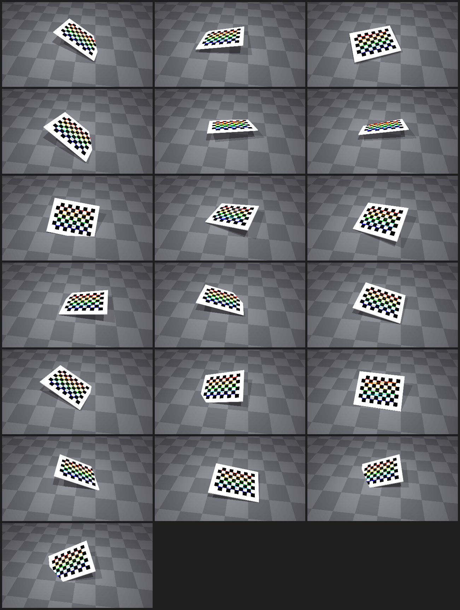
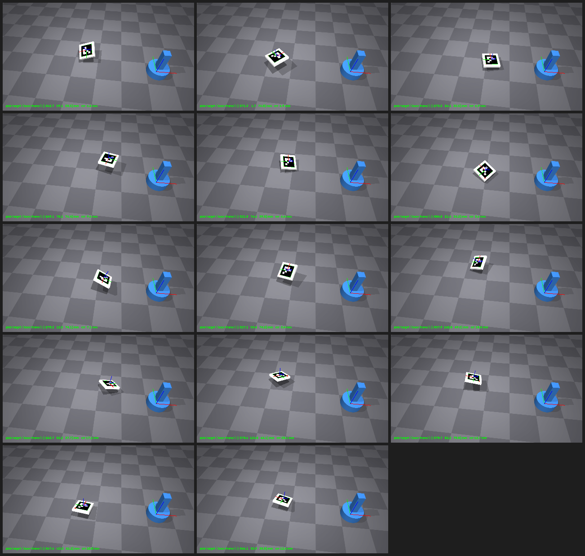
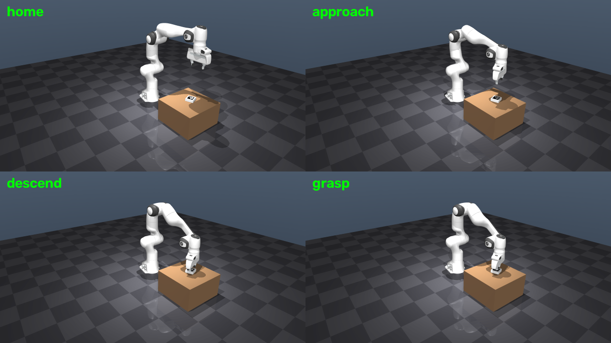
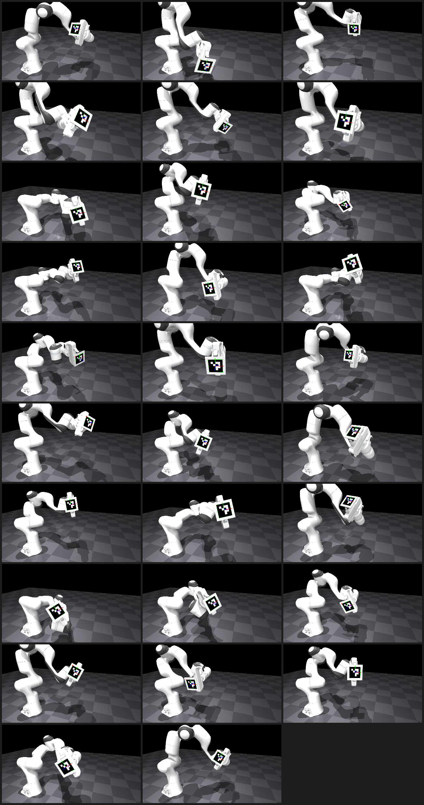
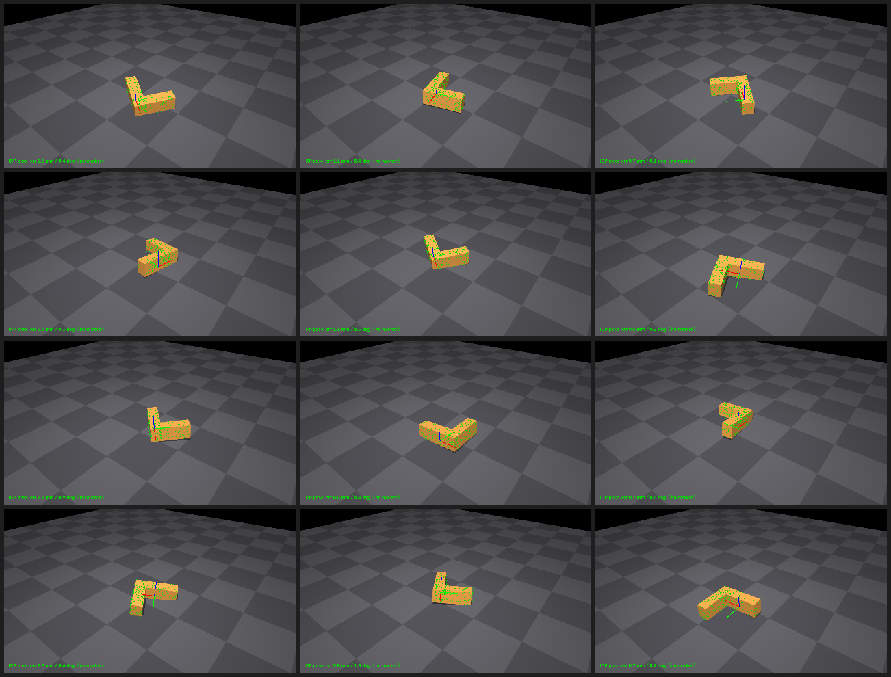

# Camera → Robot Guidance: Perception 파이프라인 (8단계)

카메라가 본 좌표를 로봇이 닿는 좌표로 옮기는 파이프라인을 8단계로 쪼개, 단계마다 시뮬레이션 ground truth 대비 오차를 **실측**했다. 결론은 하나로 수렴한다 — *정확도 병목은 제어(IK)가 아니라 perception, 그중에서도 depth(거리) 추정이다.* 단일 평면 마커로 거리를 겉보기 크기로만 추정하면 오차가 mono 기준 7~8mm대인데, 거리를 stereo나 RGB-D로 **직접 측정**하는 순간 오차가 1mm 안팎으로 무너진다(약 −92%). 3D perception(스테레오 기하·캘리브레이션·point cloud registration)에 대한 배경이 정확히 이 병목을 푸는 지점과 맞닿아 있다.

## 한눈에 보기

| 단계 | 방법 | 실측 |
|---|---|---|
| 1 캘리브레이션 | 체커보드 30뷰 → `calibrateCamera` | fx/fy 오차 ~0.6%, reprojection RMS **0.37px** |
| 2 물체 pose | ArUco + `solvePnP`(IPPE_SQUARE) → base 변환 | 위치 **9.7mm**, 자세 0.22° |
| 3 guidance(pick) | DLS IK로 Franka Panda가 pick 타겟 도달(kinematic) | end-to-end **≈19mm** (IK 잔차 0.08mm → perception-bound) |
| 4 오차 예산 | 캘리브 K를 인지에 전파(GT→실측 K 교체) | GT 9.5mm → 캘리브 K **17.5mm**(주범 cy) |
| 5 depth 격파 | mono vs stereo vs RGB-D A/B | mono 7.9mm → **stereo 0.65 / RGB-D 1.08mm** |
| 6 hand-eye | eye-to-hand, **AX=XB 자체구현**(OpenCV5 `calibrateHandEye` 미제공) | 위치 4.24mm, 회전 0.096° |
| 7 marker-less ICP | depth+seg 역투영 → Kabsch ICP 자체구현 | 위치 **1.32mm**, 회전 0.51°(마커 없이) |
| 8 물리 pick-place | 닫힌 루프, 접촉 물리(freejoint + `mj_step`) | perception/grasp-lift/place 성공률 **100%**(40/40) |

**핵심:** 제어(IK)는 0.08mm로 정확 → end-to-end 오차는 사실상 전부 **perception**에서 온다. depth를 stereo/RGB-D로 직접 측정하면 −92%까지 떨어진다.

---

## 1. 캘리브레이션 — 체커보드 30뷰

### 방법

- 씬: 바닥 + 고정 씬 카메라(fovy 45°, 1280×720) + 평면 체커보드(9×6 내부 코너, 25mm 정사각) — mocap body로 자세만 바꿔 30장 렌더.
- Ground truth: intrinsic은 카메라 fovy에서 해석적으로 계산(`f = 0.5·H / tan(0.5·fovy)`, principal point = 이미지 중심), extrinsic은 `cam_xpos`/`cam_xmat`에서 직접(MuJoCo 카메라 프레임 → OpenCV 프레임 변환 포함).
- 검출: `cv2.findChessboardCornersSB`(신형 sector-based, 서브픽셀 내장) → `cv2.calibrateCamera`(핀홀 + k1, k2, p1, p2, k3).
- 오차: 추정 K vs GT K, 그리고 뷰별 board-in-camera pose vs GT(회전각·translation).

### 결과 (seed=7, 19/30 뷰 검출)

| param | estimated | ground-truth | error | err % |
|---|---|---|---|---|
| fx | 863.45 | 869.12 | −5.66 px | **−0.65%** |
| fy | 864.19 | 869.12 | −4.93 px | **−0.57%** |
| cx | 647.76 | 640.00 | +7.76 px | +1.21% |
| cy | 373.54 | 360.00 | +13.54 px | +3.76% |

- Reprojection RMS: **0.37px**
- Extrinsic(board-in-camera): 회전 오차 mean **1.03°** / max 1.45°, translation mean **15.8mm** / max 17.4mm(board-frame 축 컨벤션의 상수 오프셋 1개를 식별·제거한 후의 잔차)



*체커보드 30뷰 중 일부 — 검출된 코너와 추정 pose*

### 관찰 — capture 품질이 캘리브레이션을 결정한다

이 단계의 핵심 가치는 숫자 하나가 아니라, **오차가 어디서 오는지를 실측으로 분리**한 데 있다.

1. **타겟 렌더링 방식이 정확도의 바닥을 정한다.** 처음엔 체커보드를 *지오메트리*(칸별 박스 geom)로 만들었다. 검은 칸이 흰 바닥 위로 0.06mm만 떠 있어도, 경사뷰에서 saddle 코너가 기울기 방향으로 밀린다. 이 편향은 방사형이 아니라 방향성이라 어떤 카메라 모델(왜곡 포함)로도 흡수되지 않았고, reprojection RMS가 0.6px에 고정되며 intrinsic이 뷰 조합에 따라 0.5%~12%로 요동했다. **평면 텍스처 보드(흑백 완전 동일평면)로 바꾸자 RMS가 0.37px로 내려가고 안정화**됐다.
2. **텍스처 필터링 편향은 "왜곡처럼" 보인다.** 텍스처 minification(mipmap/bilinear)이 만드는 코너 편향은 대체로 방사형이라, 표준 왜곡항(k1,k2,p1,p2)이 흡수한다. MuJoCo 자체는 왜곡이 0이지만, 실제 렌즈 왜곡을 핀홀에서 분리하듯 처리하는 게 옳다. 왜곡을 0으로 강제하면 이 편향이 fx/fy/cy로 새어 나온다(실측 확인).
3. **principal point는 초점거리보다 훨씬 약하게 제약된다.** fx/fy는 0.6% 이내인데 cy는 3.8%다. 원인은 모든 보드가 프레임 중앙에 몰려 있고 코너를 못 채우는 데 있다 — cx/cy를 조이려면 보드를 프레임 네 귀퉁이까지 배치해야 한다(고전적 캘리브레이션 커버리지 원칙). 실제 로봇 셋업에서도 그대로 적용되는 교훈이다.

### 한계 / 다음

- cx/cy 편향은 포즈 프레임 커버리지 부족이 원인 — 더 작은 보드 + 프레임 코너 커버로 개선 가능(과투자 방지를 위해 이 단계에서는 미실행).
- in-plane 회전을 |rz|<0.5로 제한해 비대칭 체커보드 코너 순서 모호성을 회피했다. 전방위 자세는 marker ID(ArUco/ChArUco)가 필요 → 2단계에서 도입.
- board-frame 축 컨벤션이 실행마다 Rx180/Ry180로 갈려 GT bookkeeping에 잔여 모호성이 있었다. ArUco 도입 시 코너 ID가 고정되어 사라졌다.

### 재현

```
python src/calib_demo.py
python src/make_montage.py
```

---

## 2. 물체 Pose 추정 — ArUco + solvePnP → robot base 변환

### 목표

파이프라인은 다음과 같이 이어진다.

```
렌더 → ArUco 검출 → solvePnP(카메라 프레임 pose)
      → T_world_cam → T_world_base (프레임 체인)
      → ROBOT BASE 프레임에서의 물체 pose  ==  pick 타겟
```

### 방법

- 고정 씬 카메라(1단계와 동일, GT intrinsic/extrinsic 사용) + 로봇 base(world `(0.30, −0.05, 0)`, yaw 40°) + ArUco 마커(DICT_4X4_50, 6cm) 부착 물체를 14개 자세로 배치·렌더.
- 검출: `cv2.aruco.ArucoDetector`(서브픽셀 코너 refinement) → `solvePnP(SOLVEPNP_IPPE_SQUARE)`(평면 사각 마커 전용).
- 변환: 추정 마커 pose(카메라 프레임) → world → base. `p_base = R_base^T (p_world − p_base_origin)`.
- 오차: base 프레임에서의 위치(pick point)·자세를 GT와 비교. 카메라는 GT 파라미터를 사용해 이 단계는 *pose 추정 + 프레임 변환* 오차만 격리한다(캘리브 오차는 4단계에서 별도로 전파).

### 결과 (seed=11, 14/14 검출)

| 지표 | 값 |
|---|---|
| 위치 오차(pick point, base 프레임) | mean **9.7mm** · median 8.4mm · max 20.6mm |
| — 카메라 프레임 분해: depth(시선축) | mean **8.1mm** |
| — 카메라 프레임 분해: lateral(이미지면) | mean **5.2mm** |
| 자세 오차 | mean **0.22°** · max 0.33° |

- 검출률 14/14 — ArUco+IPPE_SQUARE는 전방위 in-plane 회전에도 견고(체커보드의 순서 모호성 없음).
- 자세 컨벤션: marker frame과 body frame이 identity로 일치(1단계 텍스처 체커보드의 flip 모호성이 여기선 사라짐 — 마커가 방향까지 인코딩하기 때문).



*ArUco 마커 물체 14개 자세 — 검출과 추정 pose 축*

### 관찰 — 오차의 축을 분리하다

자세는 0.22°로 거의 완벽한데 위치는 ~10mm다. 카메라 프레임으로 분해하니 원인이 명확하다: **depth(시선축) 8.1mm > lateral 5.2mm.** 단일 평면 마커는 거리(depth)를 마커의 겉보기 크기로만 추정하므로, 코너의 서브픽셀 오차가 거리 방향으로 크게 증폭된다 — ArUco의 고전적 한계다.

- lateral(이미지면 내 위치)과 자세는 코너 각도로 잘 잡히지만, depth는 원리적으로 약제약이다.
- 개선 경로(pick 정확도가 필요할 때): (1) 마커를 크게, (2) ChArUco/멀티마커 보드로 코너 수를 늘리기, (3) 스테레오/RGB-D로 depth를 직접 관측 — 이 세 번째가 5단계의 주제다.

### 한계 / 다음

- 카메라는 GT를 사용 → 1단계의 캘리브 오차(fx/fy ~0.6%)는 아직 미전파(4단계에서 전파).
- 로봇 base는 pedestal placeholder(실제 arm·IK 없음) → 3단계에서 매니퓰레이터 모델 + IK로 실제 pick 동작을 붙인다.
- depth 약제약이 정량화됨 → RGB-D/스테레오 확장이 자연스러운 다음 축(5단계).

### 재현

```
python src/pose_transform_demo.py
python src/make_montage.py pose_view pose_montage.png
```

---

## 3. Guidance / Pick 동작 — DLS IK로 Franka Panda 이동

### 목표

1·2단계를 하나의 씬에서 실제 로봇 동작으로 잇는다: 카메라가 마커 물체를 보고 → pick 타겟을 계산 → Franka Panda(7-DOF)가 그 지점으로 이동한다.

### 파이프라인 (한 씬, 한 실행)

1. 고정 씬 카메라가 테이블 위 ArUco(5cm) 물체를 본다.
2. **인지**: 렌더 → ArUco 검출 → solvePnP → 물체 pose(→ world/base 프레임) = pick 타겟.
3. **모션**: damped least-squares IK(표준 라이브러리 기법)로 TCP를 타겟 위로 approach → 하강 → 그리퍼 닫음. `mj_jac`로 TCP 점의 Jacobian을 직접 계산(EE site 불필요).
4. 산출물: 3인칭 모션 영상 + 키프레임 스트립 + 인지 오버레이.

arm: Franka Emika Panda(MuJoCo Menagerie), base = world 원점.

### 결과

| 단계 | 오차 |
|---|---|
| 인지(단일 뷰 solvePnP, 물체 위치) | **19.1mm** |
| IK 잔차(TCP → 타겟) | approach **0.08mm** · grasp **0.08mm** |
| **end-to-end**(그리퍼 vs 실제 물체) | **≈19mm** |



*perceive → approach → grasp 키프레임*

### 관찰 — 오차 예산이 말해주는 것

end-to-end 오차의 거의 전부가 인지(19mm)에서 오고, IK는 0.08mm로 무시할 수준이다. 즉 이 guidance 시스템의 정확도는 **제어가 아니라 perception이 정한다.** 이는 2단계의 결론(단일 평면 마커는 depth가 약제약)과 정확히 일치한다.

- 단일 마커·단일 뷰 → 스테레오/RGB-D로 depth를 직접 관측하거나, 멀티뷰/ChArUco로 pose를 조이는 쪽이 다음 레버다.
- 정직한 프레이밍: 이 데모는 guidance 파이프라인이 닫힌다는 것을 보이고, 그 정확도 한계와 개선 경로를 실측 오차 예산으로 제시한다.

### 한계 / 다음

- 카메라 파라미터는 GT 사용 → 1단계 캘리브 오차(fx/fy ~0.6%)는 아직 미전파(4단계에서 완성).
- 그리퍼 close는 kinematic(물리 기반 grasp이 아님) — 실제 grasp 안정성 검증은 8단계에서 물리 기반으로 다룬다.

### 재현

```
python src/pick_demo.py   # 인지 + IK + 영상/키프레임
```

---

## 4. 오차 예산 — 캘리브 오차를 인지에 전파

### 목표

2·3단계는 카메라 파라미터로 GT(정답)를 써서 pose+변환 오차만 격리했다. 여기서는 루프를 닫는다: 1단계에서 실제로 복원한 intrinsic(fx/fy ~0.6% 오차, cy 3.8%, 그리고 피팅된 distortion)을 인지에 꽂아, 캘리브 오차가 최종 pick 타겟까지 얼마나 번지는지 잰다. 검출 코너는 동일하게 두고 intrinsic만 바꾼 3-way 비교다.

### 결과 (18/18 뷰, 로봇 base 프레임 pick 위치 오차)

| config | 평균 | 의미 |
|---|---|---|
| A · GT K, 무왜곡 | **9.52mm** | pose+변환만(2단계 baseline) |
| B · 캘리브 K, 무왜곡 | **17.48mm** | + intrinsic(fx/fy/cx/cy) 전파 → **+7.96mm** |
| C · 캘리브 K + 피팅 왜곡 | **17.32mm** | 실제 1단계 출력 그대로 → −0.16mm |

### 관찰

- **캘리브 오차가 pick 오차를 거의 2배로 키운다**(9.5 → 17.5mm). 이 +8mm의 주범은 1단계에서 약제약이었던 **cy**(3.8%)다 — 보드를 프레임 구석까지 못 채운 문제가 하류에서 8mm의 비용으로 나타난다. 오차 예산이 1단계의 관찰을 정량적으로 확증한다.
- **왜곡 과적합(k3=+14)은 여기선 무해**(−0.16mm). 마커가 이미지 중앙 근처라 왜곡 항의 영향이 작기 때문이다. 화면 가장자리 물체라면 달라질 수 있다 → 캘리브 시 왜곡 모델 정규화의 근거가 된다.
- 개선 레버가 둘로 갈린다: (1) 캘리브 조임(프레임 커버리지 → cy)과 (2) pose 조임(depth). 둘 다 실측으로 크기가 매겨져 있어 어디에 투자할지 근거 있는 결정이 가능하다.

### 재현

```
python src/error_budget.py
# outputs/calib_result.json(1단계 결과) 필요
```

---

## 5. Depth 병목 격파 — mono vs stereo vs RGB-D

### 목표

2·3단계에서 pick 오차는 depth(거리) 성분이 지배한다고 실측했다(단일 평면 마커는 거리를 겉보기 크기로만 추정). 해법은 거리를 *추정*하지 말고 *측정*하는 것이다. 세 방법으로 같은 물체(마커) 중심을 3D 위치로 복원해 GT 대비 오차를 비교한다.

1. **mono** — 단일 카메라 solvePnP(baseline)
2. **stereo** — 캘리브된 스테레오 쌍(12cm baseline)에서 마커 코너를 양쪽 검출 → `cv2.triangulatePoints`로 삼각측량
3. **RGB-D** — depth 버퍼 렌더 → 마커 중심 픽셀 역투영

(intrinsic은 GT 사용 — depth-센싱 방법만 격리. 실제 시스템에선 4단계의 캘리브 오차가 위에 더해진다.)

### 결과 (18/18 뷰, 물체 중심 위치 오차)

| 방법 | 위치 오차(평균) | depth 성분 | vs mono |
|---|---|---|---|
| mono ArUco | 7.91mm | 7.83mm | — |
| **stereo 삼각측량** | **0.65mm** | **0.42mm** | **−92%** |
| **RGB-D** | **1.08mm** | 0.93mm | **−86%** |

### 관찰

- **depth 병목(7.8mm)이 stereo/RGB-D로 1mm 미만으로 붕괴**한다. mono의 오차가 거의 전부 depth였으니(7.83 of 7.91mm), 거리를 직접 측정하는 순간 문제가 사라진다.
- 핵심 메시지: "로봇을 더 잘 제어"가 아니라 "**공간을 더 잘 측정**"이 답이다. 스테레오 기하·캘리브레이션·멀티뷰 triangulation 같은 고전적 3D vision 기법이 이 병목을 정면으로 해결한다.
- stereo는 코너 대응(ArUco 코너 순서가 좌우 동일)으로 correspondence가 공짜로 주어진다 — marker-based 스테레오의 실용적 강점이다. marker-less라면 stereo matching/registration이 별도로 필요하다(7단계에서 다룬다).

### 재현

```
python src/depth_compare.py
```

---

## 6. Hand-eye Calibration — 카메라↔로봇 변환을 관측만으로 복원

### 목표

2·3단계는 카메라↔로봇 base 변환을 시뮬 정답(GT)으로 안다고 가정했다 — 실전에선 존재하지 않는 정보다. 이 변환을 관측만으로 푸는 것이 hand-eye calibration이며, 로봇 비전 현장의 필수 절차다. 이 단계가 파이프라인의 마지막 "치트"를 제거한다.

### 방법 (eye-to-hand)

- 고정 카메라 + Franka 그리퍼에 마커를 리지드하게 장착. 팔을 29개 다양한 자세로 움직인다(회전 다양성 = observability 조건).
- 각 자세에서: 로봇 FK로 `T_gripper2base`(정확히 앎) + 카메라가 `T_marker2cam`(ArUco+solvePnP)를 관측.
- 두 자세 쌍마다 상대운동 `A = Gⱼ Gᵢ⁻¹`, `B = Cⱼ Cᵢ⁻¹`를 만들면 **`A X = X B`**(X = 카메라→base)가 성립한다. 405개 포즈쌍으로 풀이.
- **솔버 자체 구현**: OpenCV 5.0 빌드에 `cv2.calibrateHandEye`가 없어(상수만 존재) 직접 구현했다. 회전은 축 정렬 Procrustes(SVD, `Rx = V Uᵀ`), translation은 `(R_A − I) t_X = R_X t_B − t_A` 최소자승으로 푼다.
- 시뮬이므로 GT 카메라 pose와 직접 비교해 검증.

:::{dropdown} 해부 — AX=XB 수식 전개: 왜 이 형태가 되고 어떻게 푸는가 (`src/hand_eye.py` 발췌)
**분류**: 100% 룰베이스 — 닫힌형(SVD) + 최소자승. 학습은 물론 반복 최적화도 없다.
**함수**: `solve_axxb(G: [T(4,4)] gripper→base(FK), C: [T(4,4)] marker→cam(PnP)) → (X: T(4,4) cam→base, n_pairs)`

**무엇을 캘리브하는 것이 아닌가.** 카메라 내부 파라미터 $K$는 1단계에서 이미 알고, 로봇 FK(링크 길이·조인트 오프셋)도 정확하다고 믿는다. 이 단계가 푸는 건 이미 캘리브된 두 시스템을 **잇는 강체변환 $X$ 하나**다 — 카메라와 매니퓰레이터를 각각 다시 캘리브하는 게 아니다.

**① 왜 AX=XB 형태가 되는가 — 미지수 2개 중 하나를 소거.** 미지수는 사실 둘이다: 구하려는 $X$(camera→base)와, 마커가 그리퍼에 어떤 오프셋으로 붙었는지인 $Y$(marker→gripper) — 마운트 변환도 정확히 모른다. 자세 $i$에서 marker→base를 두 경로(그리퍼 경유 vs 카메라 경유)로 쓰면 하나의 등식이 된다:

$$ G_i\,Y = X\,C_i $$

자세 쌍 $(i,j)$에서 $Y = G_i^{-1} X C_i = G_j^{-1} X C_j$ 로 $Y$를 **소거**하면:

$$ \underbrace{(G_j G_i^{-1})}_{A}\,X = X\,\underbrace{(C_j C_i^{-1})}_{B} $$

$A$ = base 좌표계가 본 그리퍼 상대운동, $B$ = 카메라 좌표계가 본 마커 상대운동. **같은 물리적 움직임을 두 좌표계가 다르게 본 것**이고, 그 차이가 정확히 $X$다. 절대 pose가 아니라 상대운동 쌍을 쓰는 이유가 바로 $Y$ 소거다. 29자세 → 405쌍(상대회전 8° 미만은 회전축 추정이 노이즈에 취약해 버림).

**② 회전 — conjugation은 회전축만 돌린다.** $4{\times}4$를 블록으로 쪼개면 회전 부분은 $R_A R_X = R_X R_B$, 즉 $R_A = R_X R_B R_X^\top$ (conjugation). 항등식 $R\,e^{[\omega]_\times}R^\top = e^{[R\omega]_\times}$ 에 의해 conjugation은 **회전각을 보존하고 축만 돌린다**. 각 쌍의 axis-angle 벡터 $\alpha_k = \log R_{A,k}$, $\beta_k = \log R_{B,k}$ 에 대해:

$$ \alpha_k = R_X\,\beta_k $$

즉 점 정합이 아니라 **운동축 정합** 문제다(Park–Martin). $\min_R \sum_k \|\alpha_k - R\beta_k\|^2 = \max_R\,\mathrm{tr}(R\,M)$, $M = \sum_k \beta_k \alpha_k^\top$ 이고, SVD $M = U\Sigma V^\top$ 에서 $R_X = V U^\top$ (Procrustes/Wahba, $\det<0$이면 반사 보정). 축 $\beta_k$가 전부 평행하면 그 축 둘레 회전이 미정으로 남는다 — "회전 다양성 = observability"의 수식적 이유.

**③ translation — $R_X$를 대입하면 선형이 된다.** translation 블록은 $R_A t_X + t_A = R_X t_B + t_X$, 정리하면:

$$ (R_A - I)\,t_X = R_X\,t_B - t_A $$

쌍마다 3개의 선형식. 단 $(R_A - I)$는 **특이행렬**이다($A$의 회전축 $v$는 $(R_A - I)v = 0$) — 한 쌍만으론 축 방향 성분이 미정이라, 여기서도 축이 다른 쌍이 2개 이상 필요하다. 405쌍을 세로로 쌓아 최소자승.

```python
for i in range(n):
    for j in range(i + 1, n):
        A = G[j] @ inv_T(G[i])          # 그리퍼 상대운동 (base 좌표계)
        B = C[j] @ inv_T(C[i])          # 마커 상대운동 (cam 좌표계)
        a = cv2.Rodrigues(A[:3, :3])[0].ravel()      # α_k: axis-angle
        b = cv2.Rodrigues(B[:3, :3])[0].ravel()      # β_k
        if np.degrees(np.linalg.norm(a)) < min_deg:  # <8°: 축 추정 불안정 → 버림
            continue
        alphas.append(a); betas.append(b)
        AR.append(A[:3, :3]); At.append(A[:3, 3]); Bt.append(B[:3, 3])
M = betas.T @ alphas                    # M = Σ β_k α_k^T
U, _, Vt = np.linalg.svd(M)
Rx = Vt.T @ U.T                         # ② argmax tr(Rx M) — Procrustes
if np.linalg.det(Rx) < 0:
    Vt = Vt.copy(); Vt[2] *= -1; Rx = Vt.T @ U.T
Amat = np.vstack([R - np.eye(3) for R in AR])                    # ③ (R_A − I) 쌓기
bvec = np.concatenate([Rx @ tb - ta for ta, tb in zip(At, Bt)])  #    R_X t_B − t_A
tx, *_ = np.linalg.lstsq(Amat, bvec, rcond=None)
return to_T(Rx, tx), len(alphas)
```

회전을 먼저 풀고 translation에 대입하는 **순차(separable) 방식**이라 회전 오차가 translation으로 전파된다 — Tsai–Lenz·Park–Martin 계열의 공통 구조. 회전·이동을 dual quaternion으로 동시에 푸는 방법(Daniilidis)도 있다 — [3D 변환 노트](vision/transforms-3d.md) 참고. 소거했던 $Y$(마커 마운트)가 필요하면 $Y = G_i^{-1} X C_i$ 로 사후 복원할 수 있다.
:::

### 결과 (29/30 자세, 405 포즈쌍)

| 지표 | 값 |
|---|---|
| 카메라 위치 복원 오차 | **4.24mm** |
| 카메라 회전 복원 오차 | **0.096°** |
| 복원 위치(base) | [0.620, −0.584, 0.622] m |
| GT 위치(base) | [0.620, −0.580, 0.620] m |



*팔이 마커를 29개 자세로 들고 있는 관측 세트*

### 관찰

- "정답으로 알던" 카메라↔로봇 변환을 관측만으로 **4mm / 0.1°**에 복원했다. 회전(0.1°)은 거의 완벽하고, 위치(4mm)의 잔차는 단일 마커 pose의 depth 약제약이 그대로 전파된 것이다 — 2단계·5단계와 같은 뿌리다. 즉 스테레오로 마커 pose를 조이면 hand-eye translation도 같이 좋아진다.
- 자체 구현이 핵심 가치다. `AX = XB`를 회전/translation으로 분해해 SVD·최소자승으로 푸는 과정을 직접 구현했다 — 라이브러리 호출이 아니다.
- eye-to-hand vs eye-in-hand 구분, observability(회전 다양성)의 필요성까지 실측으로 다뤘다.

### 재현

```
python src/hand_eye.py
python src/make_montage.py handeye_view handeye_montage.png
```

---

## 7. Marker-less 6-DoF Pose — 마커 없이 point cloud 정합(ICP)만으로

### 목표

2·3단계와 hand-eye 단계는 전부 ArUco 마커에 의존했다 — 마커가 pose를 직접 준다. 하지만 실제로 집어야 할 물체엔 마커가 없다. 여기서는 태그 없는 비대칭 물체의 6-DoF pose를, RGB-D 인지 스택이 하는 방식 그대로 추정한다: depth+segmentation → 물체 픽셀을 3D point cloud로 역투영 → 알려진 모델과 ICP 정합 → pose. 2단계에서 남아 있던 "마커 의존"을 여기서 제거한다.

### 방법

- **비대칭 L자 물체**: 상자 2개(ARM1·ARM2)를 xy평면에 붙여 회전 대칭을 깼다(대칭이면 yaw가 관측 불가라 pose가 안 정해진다). 12개 뷰마다 랜덤 yaw + 소량 tilt + 위치로 배치.
- **관측 클라우드**: MuJoCo에서 depth·segmentation을 렌더 → 세그로 물체 픽셀만 골라 `(u−cx)/fx·d, (v−cy)/fy·d, d`로 카메라 좌표 역투영 → world로 변환. 한 뷰에서 보이는 부분(partial) 클라우드다.
- **ICP 자체 구현**: 최근접점은 `cKDTree`, 강체 정합은 Kabsch/SVD(`R = V Uᵀ`, det<0 반사 보정)로 구현. ICP는 지역 최소값에 빠지는 local method라 8개 yaw 가설로 시드를 뿌리고 RMSE 최소해를 채택한다.
- 시뮬이므로 각 뷰의 물체 GT pose와 직접 비교해 검증.

### 결과 (12/12 뷰)

| 지표 | mean | median | max |
|---|---|---|---|
| 위치 오차 | **1.32mm** | 0.72mm | 3.77mm |
| 회전 오차 | **0.51°** | 0.39° | 1.76° |
| ICP fit RMSE | 1.98mm | — | — |



*12개 뷰 각각에 정합된 모델 클라우드(초록)와 복원 pose 축을 물체 위에 재투영*

### 관찰

- **마커 없이 1.3mm / 0.5°.** 단일 뷰 depth 제약으로 위치 오차가 컸던 마커 기반 2단계와 달리, 여기선 물체 표면 전체가 제약을 주므로 **단일 마커보다 오히려 위치가 좋다** — 마커의 depth 약제약을 형상 정합이 대체한 셈이다. depth 정보를 형상으로 쓰는 게 왜 강한지는 5단계와 같은 뿌리다.
- **ICP를 직접 구현**한 게 핵심 가치다. KD-tree 대응 + Kabsch SVD를 매 반복 돌리고, local 수렴 문제를 yaw 시드로 회피했다 — 라이브러리 호출이 아니라 정합 알고리즘 자체를 구현했다는 증거다.
- **관측성**(observability)을 형상 설계로 확보했다: 대칭 물체면 pose가 안 정해진다는 것을 L자 비대칭으로 실증했다. 실제 bin-picking에서 부품 대칭성이 왜 문제인지로 연결된다.
- 한계: partial cloud + 알려진 모델을 가정한다. 미지 물체·심한 가림(occlusion)·clutter는 향후 bin picking 단계에서 다룰 주제다.

### 재현

```
python src/markerless_icp.py
python src/make_montage.py icp_view icp_montage.png
```

---

## 8. 물리 Pick-and-Place — 접촉 물리로 측정한 성공률

### 목표

3단계는 kinematic이었다 — 관절각을 보간해 렌더만 했고, 물체는 mocap 타일이라 실제로 "잡히는" 게 아니었다. 여기서는 물체를 질량·마찰을 가진 자유 강체(free rigid body)로 두고, Panda가 실제 접촉력으로 집는다. 즉 grasp가 유지되는지, 옮기는 중 안 떨어지는지가 전부 `mj_step` 물리로 결정된다. 가이던스 파이프라인을 닫힌 루프로 만들어 정직하고 재현 가능한 성공률을 얻는 것이 목표다.

### 방법

- **닫힌 루프**: perceive(ArUco) → DLS IK로 approach/grasp → 그리퍼 CLOSE(힘) → lift → place 타겟으로 carry → release. 전 구간을 `mj_step`으로 진행하므로 접촉 물리가 실제로 잡아야만 성공한다.
- **물체**: 44×44×52mm 상자(그리퍼 개구 80mm 이내), 질량 30g, `friction 1.8`, `condim 6`. `freejoint`로 중력 낙하·접촉을 그대로 받는다.
- **랜덤화**: 매 trial마다 물체 위치(x 450–545mm, y −10~110mm)·yaw를 랜덤화 → 중력으로 안착 후 인지부터 시작. N trial의 perception / grasp-lift / place 성공률을 집계한다.
- **부드러운 구동**: 각 구간에서 관절 타겟을 현재 자세에서 60% 지점까지 램프한다 — step 명령은 잡은 물체를 튕겨낸다.
- 단계별 물체 위치(lift 직후 / carry 후 / release 전 / 최종)를 기록해 실패 원인 분해용 텔레메트리로 사용한다.

### 결과 (40/40 trial)

| 지표 | 값 |
|---|---|
| perception rate | **100%**(40/40) |
| grasp+lift rate | **100%**(40/40) |
| **place success rate** | **100%**(40/40) |
| perception 오차 | 6.59mm(mean) |
| place 오차 | 4.87mm(mean, 성공분) |

### 디버깅 발견 — 핵심

첫 실행의 place 성공률은 **72%**. perception·grasp-lift는 100%인데 place만 5/18이 ~93–104mm 밖으로 튀었다. "그립이 약한가"로 추측하지 않고 단계별 위치 텔레메트리를 붙여 원인을 분해했다.

- carry 후·release 직전까지 물체는 전부 타겟(≈445, 180mm)에 정확히 있었다. 즉 **인지·IK·grasp·운반은 무결**이었다.
- final 위치만 튀었고, 튄 방향이 전부 pick 위치 쪽(+x, −y)으로 일관됐다.

범인은 retract 경로 한 줄이었다. release 후 복귀 자세를 pick 위 `q_lift`로 줘서, 열린 그리퍼가 방금 놓은 물체를 pick 방향으로 쓸고 지나갔다(똑바로 밀리면 ~95mm/z=226, 옆으로 넘어지면 40–50mm/z=222 — 같은 원인). retract를 place 타겟 바로 위(`q_pup`)로 수직 상승시키자 **72% → 100%**, place 오차는 18.1 → 4.87mm로 개선됐다.

교훈: 성공률이 애매할 때 어느 단계에서 깨지는지 계측하면 추측 없이 한 줄로 고쳐진다. 이번 실패는 perception이 아니라 **동작 계획(복귀 경로)** 결함이었다 — 3단계의 "정확도는 perception이 결정한다"는 결론과는 다른 축(계획/실행)의 실패 모드다.

### 관찰

- 3단계의 kinematic 데모를 물리 기반 grasp으로 승격했다. "될 것 같다"가 아니라 "40번 중 40번 됐다"는 수치를 확보했다.
- perception 오차 6.6mm가 그리퍼 여유(80mm) 안이라 grasp-lift가 100%인 것과 정합한다 — 2단계·7단계의 mm급 인지가 실제로 잡는 동작으로 이어짐이 여기서 닫힌다.
- 남은 축: 단일 물체·정돈된 씬이다. clutter·가림·미지 물체는 향후 bin picking 단계의 주제다.

### 재현

```
python src/physics_pick.py 40 --render
```

---

## 정리

8단계를 관통하는 결론은 일관된다.

- **제어(IK)는 거의 완벽하다** — 잔차 0.08mm. 로봇을 "더 잘 움직이는" 쪽은 병목이 아니다.
- **오차는 perception, 특히 depth에서 온다** — 단일 평면 마커의 mono pose는 depth 성분이 7~8mm대. stereo/RGB-D로 거리를 직접 측정하면 1mm 안팎으로 붕괴한다(약 −92%/−86%).
- **캘리브레이션 커버리지가 하류 오차를 몇 배로 키운다** — principal point(cy)가 약제약이면 pick 오차가 거의 2배(9.5 → 17.5mm)로 번진다.
- **마커 의존은 제거 가능하다** — depth+segmentation 기반 point cloud ICP는 마커 없이도 1.3mm/0.5°를 낸다. 형상 전체가 제약을 주기 때문에 오히려 단일 마커보다 낫다.
- **닫힌 루프에서 실패 모드는 perception이 아닐 수도 있다** — 물리 기반 pick-and-place의 실패는 인지가 아니라 동작 계획(복귀 경로)에서 나왔고, 단계별 계측으로만 찾을 수 있었다.

물성별 조작 데모(스태킹·삽입·소팅·비파지·변형체)는 이 perception→guidance 파이프라인 위에서 이어진다. 자세한 내용은 [Manipulation](manipulation.md)에서 다룬다.
