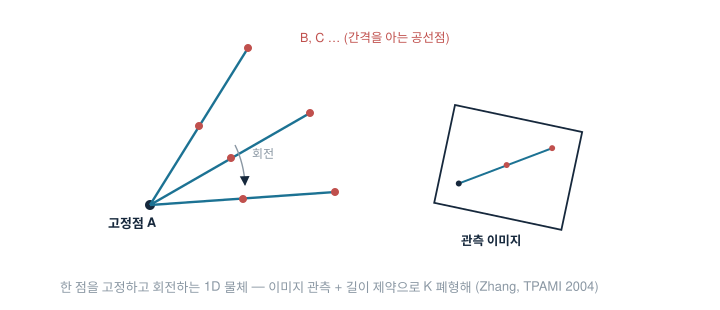

# Camera Calibration with 1D Objects (Zhang, TPAMI 2004)

*막대 하나로 캘리브레이션이 "언제" 가능한가 — 자유도 회계로 답한 논문*

Zhengyou Zhang, *Camera Calibration with One-Dimensional Objects*, IEEE TPAMI 26(7), 2004. (같은 저자의 평면 보드 캘리브레이션(TPAMI 2000)의 후속 — 0D/1D/2D/3D 타깃 스펙트럼에서 1D의 빈칸을 채웠다.)

## 한 줄 요약

> 자유롭게 움직이는 1D 물체로는 단일 카메라 내부 캘리브레이션이 **원리적으로 불가능**함을 보이고, **한 점을 고정한 채 회전**하는 1D 물체(간격을 아는 공선점 3개 이상)라면 가능함을 증명 — 폐형해 + MLE 정제 알고리즘까지 제시한 "1D 캘리브레이션의 존재 정리".

## 문제 — 왜 하필 1D인가

2D 보드는 정확하지만 크기가 곧 제약이다. 멀리서·여러 카메라가 동시에 봐야 하는 상황(감시망·모션캡처·대형 구조물)에서 모든 카메라에 잘 보이는 대형 평면 타깃은 만들기도 들고 다니기도 어렵다. 1D 물체(끝에 점이 달린 막대)는 싸고, 휴대성이 좋고, **어느 방향에서도 같은 모양**이라 멀티카메라 동시 관측에 이상적이다. 문제는 정보량 — 막대 하나가 내부 파라미터 5개를 결정할 수 있는가?

## 방법

### 자유도 회계 — 자유 이동 1D는 안 된다

관측마다 새 포즈가 미지수로 들어온다. 자유 이동하는 점 3개짜리 1D 물체는 관측당 늘어나는 미지수와 얻는 방정식이 상쇄되어, 몇 번을 찍어도 $K$에 대한 순제약이 쌓이지 않는다 — 논문은 이를 세어 보여 **0D(자유 점)와 자유 1D의 불가능성**을 결론짓는다. (직관: 막대가 아무렇게나 움직이면 "크기를 아는 구조"가 카메라에 주는 제약이 스케일-깊이 모호성에 전부 흡수된다.)

### 고정점 회전 — 미지수를 잠그면 가능해진다

설정: 점 $A$를 공간에 고정하고, 길이 $L$인 막대를 $A$ 중심으로 휘저으며 $N$장 촬영. 막대 위에 $A, B$와 내분점 $C$ ($C = \lambda A + (1-\lambda)B$, $\lambda$는 기지)가 있고 세 점 모두 이미지에서 관측된다.

유도의 뼈대 (카메라 좌표, 정규화 관측 $\tilde{\mathbf a}, \tilde{\mathbf b}, \tilde{\mathbf c}$):

1. 각 점은 $A = z_A \tilde{\mathbf a}$, $B = z_B \tilde{\mathbf b}$, $C = z_C \tilde{\mathbf c}$ — 미지수는 깊이들.
2. 공선·내분 제약으로 $z_B, z_C$가 $z_A$와 관측만으로 표현된다 (외적으로 정리하면 닫힌 식).
3. 길이 제약 $\|B - A\| = L$에 대입하면, 관측마다

$$ z_A^2 \cdot \mathbf{h}^\top \,\omega\, \mathbf{h} \;=\; L^2, \qquad \omega = K^{-\top}K^{-1} $$

꼴의 식이 남는다 ($\mathbf{h}$는 그 프레임의 관측으로만 계산되는 벡터). 고정점 덕분에 $z_A$는 **모든 프레임에서 공통** — 미지수가 프레임마다 늘지 않는다.

4. $\omega$(대칭, 5 DoF) + 공통 깊이 $z_A$ → 미지수 6. 관측 하나가 식 하나를 주므로 **$N \ge 6$이면 선형(폐형)해**: $A\mathbf{x}=\mathbf{b}$ 꼴로 풀고 $\omega$에서 Cholesky로 $K$ 복원.

### 정제 — 언제나처럼 MLE

폐형해를 초기값으로, 모든 프레임의 세 점 재투영 오차 합을 LM으로 최소화한다. 논문 실험(합성 + 실촬영)의 결론: 노이즈에 대한 민감도는 2D 보드보다 크지만, 합리적 노이즈에서 상대 오차 수 % 수준 — "되긴 되고, 조건이 중요하다."

## 결과와 조건 — 실무 감각으로 번역하면

- **회전 다양성이 생명**: 막대가 비슷한 방향만 쓸면 $\mathbf{h}$들이 겹쳐 조건수가 나빠진다. hand-eye의 "회전축 2개 이상"과 같은 종류의 관측 가능성 조건.
- 점 검출 정밀도가 2D 코너보다 불리(원형 마커 중심 추정) → 프레임 수로 보상해야 한다.
- 단일 카메라 내부 캘리브레이션 용도로 2D 보드를 이기지는 못한다 — 이 논문의 진짜 유산은 **멀티카메라 외부 캘리브레이션**이다: 여러 카메라가 같은 막대를 동시에 보면 카메라 간 상대 포즈가 묶인다. 모션캡처 업계의 wand calibration(T/L형 완드를 휘젓는 그 절차)이 이 아이디어의 산업 표준형이고, 후속 연구들이 자유 이동 1D + 멀티뷰 설정을 정리했다.

## 내 실습 연결 — 조선소의 1D 타깃

계측 과제 현장(외부 캘리브레이션)에서 1D 타깃을 쓴 이유가 논문의 동기와 정확히 겹친다:

- W.D 3.7~17.2 m에서 대형 화이트보드는 운반·거치가 곧 비용이다. 막대는 사람이 들고 서면 끝.
- 스테레오 리그 **두 카메라가 동시에 관측** → 외부 파라미터(상대 포즈)를 잇는 용도 — 위 "멀티카메라" 사용법에 해당한다. 내부는 실험실에서 [ray calibration](ray-calibration.md)으로 이미 확보했으므로, 현장에서는 1D가 약한 내부 제약을 떠맡을 필요가 없다.
- 3차 현장 계측: 화이트보드 평균 2.46 mm vs **1D 타깃 2.68 mm** — 정확도가 유사함을 실측으로 확인했고, 결론은 "타깃 선택은 정확도가 아니라 운용성의 문제"였다.

면접식 한 줄: **"1D 캘리브레이션의 존재 조건(고정점/멀티뷰)을 알면, 현장에서 무엇을 포기해도 되는지 계산할 수 있다 — 우리는 내부를 실험실에서 끝냈기에 현장의 1D로 충분했다."**

## 한 줄 평 / 한계

"어떤 타깃이면 충분한가"를 자유도 회계로 깔끔하게 답한, 공학보다 수학에 가까운 논문. 한계도 명확하다 — 단일 카메라 정밀도, 점 검출 의존성, 고정점이라는 실무적 번거로움. 그러나 멀티카메라 시대(모캡·감시망·대형 계측)에 1D가 표준 도구가 된 근거를 제공했다는 점에서, 작지만 오래 남는 결과다.
