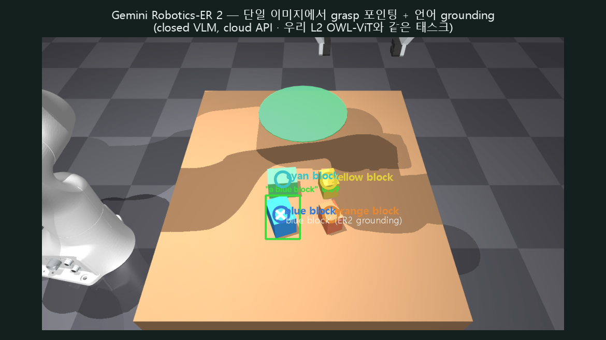

# Gemini Robotics 2 (2026)

*테이블탑을 넘어 — 전신 제어·다섯손가락 조작·다중 로봇 협업으로*

Google DeepMind, *Gemini Robotics 2* 공식 발표(블로그·데모 영상), 2026-07-30. 별도 arXiv 논문·기술보고서는 **미확인**(발표 시점 기준 존재하지 않음 — 이전 세대인 *Gemini Robotics 1.5*는 arXiv 2510.03342로 존재). 카테고리 개요는 [VLA 리뷰 허브](vla.md), 우리가 직접 돌려본 오픈 VLA는 [OpenVLA](openvla.md), 비공개 대형 VLA의 선례는 [RT-2](rt2.md), 실습 기록 전체는 [VLA 실습 페이지](../vla.md).

이 글은 **논문 리뷰가 아니라 뉴스/발표 리뷰**다. 우리가 직접 실행한 적 없고, 애초에 실행이 불가능하다(§3.2). 발표 이틀 뒤 시점에 공개된 정보만으로 작성했으므로, 아키텍처·학습 데이터·평가 프로토콜의 세부는 대부분 **미확인**으로 남긴다.

## 한 줄 요약

> 조작 범위를 테이블탑 위 물체 집기에서 **휴머노이드 전신 제어·다섯손가락 정교조작·다중 로봇 협업**으로 넓힌 "물리 지능(physical intelligence)" 발표. 액션을 내는 VLA, 고수준 추론을 맡는 임바디드 추론 VLM(**ER 2**), 온보드 경량 VLA로 스택을 **3개 모델**로 쪼갰다. 그런데 **ER 2만 API 퍼블릭 프리뷰**로 열려 있고, 실제로 몸을 움직이는 VLA·On-Device 2는 **얼리 액세스 파트너에게만 게이트**돼 있다 — [OpenVLA](openvla.md)처럼 우리가 가중치를 내려받아 로컬에서 돌려볼 수 있는 물건이 아니다.

---

## 1. 문제 — 왜 "테이블탑을 넘어"인가

[OpenVLA](openvla.md)·RT-2 계열을 포함해 지금까지 VLA 연구 대부분은 **단일/양팔 그리퍼가 탁상 위 물체를 집고 놓는** 테이블탑 조작에 집중돼 왔다. 우리가 [VLA 리뷰 허브](vla.md)에서 직접 다룬 LIBERO 벤치마크도 이 범주다.

Google DeepMind는 Gemini Robotics 2를 "그 다음 단계"로 포지셔닝한다. 발표에서 강조한 세 방향은:

1. **전신 제어(whole-body control)**: 다리·허리까지 포함해 걷기·웅크리기·비틀기·뻗기를 팔 조작과 **하나의 정책**으로 동시에 조율.
2. **다섯손가락 정교조작(five-finger dexterity)**: 표준 2-핑거 그리퍼가 아니라 사람 손처럼 여러 자유도를 가진 손으로 지퍼백 밀봉, 전구 풀기/조이기, 쓰레기봉투 묶기 같은 태스크.
3. **다중 로봇 협업(multi-robot collaboration)**: 서로 다른 종류의 로봇이 하나의 작업을 나눠 맡고 핸드오프하는 워크플로.

이 세 가지는 서로 다른 로봇 형태(embodiment)·제어 주파수·추론 지평(reasoning horizon)을 요구한다는 점에서, 단일 모델 하나로 다 감당하기보다 **역할을 분리한 다중 모델 스택**을 택한 배경이 된다(§2).

## 2. 방법 — 3-모델 스택 (세부 대부분 미확인)

### 2.1 구성

| 모델 | 역할 | 공개 형태 |
|---|---|---|
| **Gemini Robotics 2** | VLA(액션 모델). 시각+언어 입력을 모터 제어로 변환. 휴머노이드 전신, 양팔로봇, 다섯손가락 핸드, 표준 그리퍼 등 다양한 embodiment 제어 | 얼리 액세스 파트너 전용 |
| **Gemini Robotics ER 2** | Embodied-Reasoning VLM. "고수준 두뇌" — 공간추론, 수 분 단위 멀티스텝 계획, 하위 VLA/API를 도구처럼 호출하는 오케스트레이션, 진행상황 판정, 다중 로봇 조율 | **퍼블릭 프리뷰**(API) |
| **Gemini Robotics On-Device 2** | 로컬 실행용 경량 VLA. 새 양팔 embodiment에 "몇 시간, 통상 200개 미만 시연"으로 적응한다고 보도됨 | 트러스티드 테스터 전용 |

ER 2는 이전 세대(**ER 1.6**, *Gemini Robotics 1.5* 계열)를 잇는 버전으로 소개된다 — 즉 이번이 첫 세대가 아니라 두 번째 메이저 릴리스다.

### 2.2 백본

"Gemini 계열 멀티모달 백본 기반"이라고만 언급되며, 구체적 버전명·파라미터 수는 **미확인**이다(일부 2차 보도가 특정 버전명을 언급하지만 1차 자료로 확인되지 않아 이 리뷰에는 싣지 않는다). ER 2는 텍스트·이미지·비디오·오디오를 입력받고 텍스트(함수 호출 포함)를 출력한다는 정도만 확인되며, 컨텍스트 윈도·On-Device 모델 파라미터 수 등은 **미확인**이다.

### 2.3 학습 방법

모방학습(behavior cloning)인지 RL 파인튜닝이 섞여 있는지, 학습 데이터 규모·출처(자체 원격조작 텔레옵인지 Open X-Embodiment류 공개 데이터인지)는 **전부 미확인**이다. 기술보고서가 없어 [OpenVLA](openvla.md)나 [RT-2](rt2.md) 리뷰처럼 손실 함수·토큰화 방식을 검증할 방법이 없다.

## 3. 결과 / 접근성

### 3.1 발표된 수치 (공식 블로그·언론 보도 기준 — 평가 프로토콜 미확인)

DeepMind 블로그와 보도에서 확인되는 수치는 다음과 같다. **자체 벤치마크 수치이며 독립 검증·통계적 유의성·시행 횟수 등은 미확인**이라는 점을 전제로 읽어야 한다.

- **전신 조작(Apollo 2 휴머노이드, 선반/테이블/바닥 픽업)**: 성공률 45.7%–76.3%
- **그리퍼 정교조작(Franka Duo)**: 성공률 74.2%–89.6%
- **다섯손가락 정교조작(Apollo 2 + 다섯손가락 핸드, 핸드 모델명은 매체별 표기 상이 — 미확인)**: 태스크별 32%–92%. 언론에 개별 보도된 값으로 전구 풀기 92%, 쓰레기봉투 묶기 44%, 지퍼백 밀봉 40%, 전구 조이기 36%, 쓰레받기 정리 32% 등이 있으나, 어느 매체가 어느 조건을 재보도한 것인지 완전히 교차 확인되지는 않는다.
- **ER 2 진행상황 분류(progress classification) 정확도**: 57.4% (전세대 대비 개선이라고 보고)
- **ER 2 순간 탐지(moment-finding) 정확도**: 91.3%, 평균절대오차 0.96초
- **안전 데모**: 사람이 가까이 오면 정지, 안전 확인 후 재개(ASIMOV-Agentic 데이터셋으로 안전성 벤치마킹했다고 언급)

### 3.2 접근성 — 가장 중요한 실무적 사실

이 발표에서 리뷰어 입장에 가장 중요한 것은 성능 수치가 아니라 **누가 무엇을 만질 수 있느냐**다.

| 모델 | 접근 방식 | 우리가 로컬에서 돌릴 수 있나 |
|---|---|---|
| ER 2 | Gemini API / Google AI Studio **퍼블릭 프리뷰** (API 키만 있으면 사용 가능), Enterprise Agent Platform은 프라이빗 프리뷰 | API 호출은 가능, 로컬 실행 불가 |
| Gemini Robotics 2 (VLA) | 얼리 액세스 파트너 전용 (Trusted Tester Program 신청) | **불가** |
| On-Device 2 | 트러스티드 테스터 전용 | **불가** |

세 모델 모두 **가중치 다운로드가 없다** — 오픈 웨이트가 아니다. 명시된 얼리 파트너/데모 하드웨어는 Apptronik(Apollo 2), Franka(Duo/F3 Duo), Boston Dynamics, Agile Robots SE 등이다. 일반 공개 시점은 **미확인**이다.

즉 [OpenVLA](openvla.md)를 우리가 직접 LIBERO에서 재현하고 LoRA 파인튜닝까지 돌렸던 것과 달리, Gemini Robotics 2(VLA)는 **원천적으로 재현·파인튜닝·로컬 실행이 불가능**하다. 유일하게 손댈 수 있는 조각은 ER 2 API뿐이다.

## 4. 내 실습 연결

- 대비가 극단적이다. [OpenVLA](openvla.md)는 **완전 오픈 가중치 + 단일 GPU**로 우리가 직접 LIBERO 4-suite를 재현했다(spatial 80% / object 85% / goal 85% / long 45%, [VLA 리뷰 허브](vla.md) 참고). Gemini Robotics 2는 정반대 극단 — 실제로 몸을 움직이는 VLA·On-Device 2는 닫혀 있고 게이트돼 있어 **우리 환경에서 실행할 방법이 없다**.
- 유일하게 접근 가능한 조각은 **ER 2 API**뿐이다. ER 2는 액션을 내는 VLA가 아니라 상위 추론 레이어이므로, 우리 [컨텍스트 사다리](../context.md)의 L3(언어+이미지→action을 정책이 통째로 대체)보다는 그 위의 planning/reasoning 레이어에 해당한다. 이론적으로는 "ER 2에게 멀티스텝 계획·도구 오케스트레이션을 맡기고, 실제 액션은 우리가 돌린 OpenVLA가 실행하는" 하이브리드 구조를 API로 실험해볼 여지가 있다 — 다만 **API 키 발급이 필요**하고, 이 리뷰 작성 시점에는 시도하지 않았다(향후 과제로 남긴다).
- 계보상으로는 [RT-2](rt2.md)와 같은 패턴의 반복이다. RT-2도 55B 비공개 클라우드 모델이라 우리가 직접 돌리지 못했고, 그 빈자리를 OpenVLA가 채웠다. Gemini Robotics 2도 "성능은 화려하게 홍보되지만 정작 몸을 움직이는 모델은 닫혀 있다"는 동일한 구조다. 다만 이번엔 최소한 ER 2 하나는 API로 열어뒀다는 점이 RT-2 시절과 다르다.

## 5. 한 줄 평 / 한계

**한 줄 평.** 논문이 아니라 발표다 — 벤치마크는 자체 홍보 수치이고, 아키텍처는 블랙박스이며, 정작 "몸을 움직이는" 모델은 우리 같은 외부 학습자가 써볼 수 없다. VLA 연구 흐름을 팔로우하는 입장에서는 "업계가 테이블탑 너머 전신·다지 조작·다중 로봇으로 가고 있다"는 방향 신호로 읽는 게 맞고, 아직은 직접 검증하거나 재현할 대상이 아니다.

**한계.**
- **1차 기술자료 부재**: 논문·기술보고서가 없어 평가 프로토콜, 시행 횟수, ablation, 실패 사례 분석을 검증할 방법이 없다. 언론·블로그 수치만 존재한다.
- **접근 불가**: [OpenVLA](openvla.md)·[RT-2](rt2.md)와의 비교에서 드러나듯, 액션 모델(VLA·On-Device 2)은 완전 폐쇄형 배포다. 얼리 파트너 선정 기준과 일반 공개(GA) 일정은 **미확인**이다.
- **다섯손가락 정교조작 성공률이 낮은 태스크가 다수**(보도 기준 32~44%대): 전신 제어·다중 로봇 협업 데모의 화려함과 별개로, 손끝 정교조작은 발표 스스로도 "여전히 어렵다"고 인정한 지점으로 보인다.
- **On-Device 모델의 분포 밖(OOD) 대응, 고자유도 로봇 대응은 약하다고 보도됨** — 구체적으로 어떤 실패 양상인지는 미확인.
- **안전성 주장(ASIMOV-Agentic)의 세부 방법론·수치는 미확인** — "사람 근처에서 정지"라는 데모 수준 서술 이상의 정량 평가는 확인되지 않는다.

---

## 우리가 직접 돌려본 것 — ER 2 (public preview)

행동 VLA·On-Device는 게이트라 못 돌리지만, **ER 2(임베디드 추론)는 Gemini API로 접근** 가능하다. 그래서 `gemini-robotics-er-2-preview`를 **우리 씬에 직접 API로 probe**했다(클라우드, GPU 무관).

*단일 이미지 한 장으로 4개 블록의 grasp 포인트 + "blue block" 언어 grounding(흰 ×). ER2의 blue-block 포인트가 우리 [컨텍스트 L2](../context.md)의 OWL-ViT 검출(초록 박스) 안에 들어가 두 방법이 일치했다.*

- ER2는 **단일 RGB 한 장**에서 open-vocab pointing + grasp 추론을 바로 냈다 — 우리 [context 사다리](../context.md)의 L2(OWL-ViT)·L1(기하 규칙)이 하던 "이걸 집어라"를 로보틱스-튜닝 VLM이 한 번에 하는 셈.
- 단 **추론(어디를)만** 준다 — 실제 action rollout은 게이트된 행동 VLA의 몫. 우리 [매니퓰레이션](../manipulation.md) IK·제어에 붙이면 "ER2가 가리키고 → 우리 스택이 집는" 파이프라인이 된다([손 자세 E6](../hand_pose.md)의 MANO→panda와 같은 구도).
- 정직: 이 씬에선 ER2 grounding이 OWL-ViT와 일치했으나 **n=1 정성 확인**이다(정량 A/B는 추후).

---

## 출처

- [Gemini Robotics 2 brings whole body intelligence to robots — Google DeepMind (공식 블로그)](https://deepmind.google/blog/gemini-robotics-2-brings-whole-body-intelligence-to-robots/)
- [Introducing Gemini Robotics ER 2 — Google (공식 발표)](https://blog.google/innovation-and-ai/models-and-research/google-deepmind/gemini-robotics-er-2/)
- [Gemini Robotics ER 2 — Google DeepMind 모델 페이지](https://deepmind.google/models/gemini-robotics/embodied-reasoning/)
- [Gemini Robotics — Google DeepMind 모델 페이지](https://deepmind.google/models/gemini-robotics/)
- [Google DeepMind Ships Three Physical AI Models For Whole Body Control, Dexterity And Multi Robot Collaboration — MarkTechPost](https://www.marktechpost.com/2026/07/30/google-deepmind-gemini-robotics-2-whole-body-control-dexterity-multi-robot-collaboration/)
- [Google DeepMind debuts Gemini Robotics 2 model series for humanoid robots — SiliconANGLE](https://siliconangle.com/2026/07/30/google-deepmind-debuts-gemini-robotics-2-model-series-humanoid-robots/)
- [Gemini Robotics 2 Controls Full Humanoids: Legs, Torso, Arms, and Fingers Under One Policy — Tech Times](https://www.techtimes.com/articles/322309/20260730/gemini-robotics-2-controls-full-humanoids-legs-torso-arms-fingers-under-one-policy.htm)
- [Google Unveils Gemini AI for Robots Struggling With Dexterity — Bloomberg](https://www.bloomberg.com/news/articles/2026-07-30/google-unveils-gemini-ai-for-robots-struggling-with-dexterity)
- [Google Releases Gemini Robotics 2 Model That Gives Humanoids Full-Body Control And Lets Them Work In Teams — officechai](https://officechai.com/ai/google-releases-gemini-robotics-2-model-that-gives-humanoids-full-body-control-and-lets-them-work-in-teams/)
- [Gemini Robotics 1.5 (arXiv 2510.03342) — 이전 세대 기술보고서, 계보 확인용](https://arxiv.org/pdf/2510.03342)
