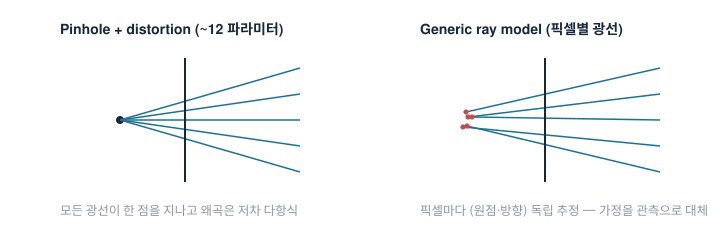

# Ray (Generic) Calibration 계보 (2001 → 2020)

*파라메트릭 카메라 모델의 가정을 버리고, 픽셀 하나하나의 광선을 직접 측정한다 — 세 편의 원문을 직접 읽고 정리*

Grossberg & Nayar, *A General Imaging Model and a Method for Finding its Parameters*, ICCV 2001 ([PDF](https://cave.cs.columbia.edu/old/publications/pdfs/Grossberg_ICCV01.pdf)) → Sturm & Ramalingam, *A Generic Concept for Camera Calibration*, ECCV 2004 ([HAL](https://inria.hal.science/inria-00524411)) → Schöps, Larsson, Pollefeys, Sattler, *Why Having 10,000 Parameters in Your Camera Model Is Better Than Twelve*, CVPR 2020 ([arXiv 1912.02908](https://arxiv.org/abs/1912.02908), [코드](https://github.com/puzzlepaint/camera_calibration)).

## 한 줄 요약

> 카메라를 "핀홀 + 왜곡 다항식"이라는 소수 파라미터 모델로 근사하는 대신 **픽셀→광선 대응의 집합**으로 정의하고, 알려진 패턴과의 dense 대응으로 광선들을 직접 추정한다 — 파라메트릭 모델이 남기는 **체계적(bias) 잔차**가 원리적으로 사라진다.

## 문제 — 12개 파라미터의 천장

표준 모델의 전제는 두 가지다: 모든 광선이 한 점을 지난다(central), 왜곡은 저차 다항식으로 충분하다. 그러나 원문들이 지적하는 현실은:

- **비원근(non-perspective) 시스템의 존재** (G&N §1) — 곡면 미러 카타디옵트릭, 광각 디옵트릭, 카메라 클러스터, 복안(compound) 카메라. 이들은 단일 유효 시점이 없거나(diacaustic), 시점이 궤적을 이룬다.
- **파라메트릭 잔차는 랜덤이 아니라 패턴이다** (Schöps Fig.1·7) — 휴대폰·산업 카메라 같은 "거의 핀홀"에서도 12-파라미터 모델의 재투영 잔차 방향을 시각화하면 뚜렷한 공간 구조가 남는다. 평균 RMS가 작아 보여도 **평균으로 지워지지 않는 bias**라서, 다운스트림(스테레오·포즈·SLAM)에 그대로 전파된다.

## 방법 — 세 단계의 진화

### ① Grossberg & Nayar 2001 — 정의를 바꾸다: raxel

이미징 시스템을 블랙박스로 보고, 최소 단위를 **raxel**(ray + pixel)로 정의한다. raxel은 위치 $\mathbf{p}$·방향 $\mathbf{q}$의 기하 파라미터에 더해 픽셀별 초점(장·단축 $f_a, f_b$와 방향 $\psi$ — 점퍼짐을 타원 가우시안으로 모델), 방사 응답 $g$, fall-off $h$까지 갖는다. 광선들을 놓을 자리로는 **caustic**(광선 다발의 포락면 — $(x,y,r)\to(X,Y,Z)$ 좌표 변환의 야코비안이 특이해지는 궤적)을 제안한다. 원근 카메라의 caustic은 한 점(투영중심)으로 퇴화한다 — "핀홀은 generic 모델의 특수해"라는 관점.

**캘리브레이션**: 알려진 간격 $\Delta z$만큼 떨어진 **두 평면** 위의 대응점을 픽셀마다 얻으면, 두 3D 점을 잇는 직선이 그 픽셀의 광선이다. 실험에서는 노트북 LCD(14.5", 1024×768)를 이동 스테이지로 60 mm 평행이동시키며 **평면당 이진 gray-coding 약 20장**(메가픽셀 디스플레이 기준 $\log N$장) + 균일 밝기 17장(방사 보정)으로 총 ~60장을 촬영했다. 검증은 포물면 미러 카타디옵트릭(외경 100 mm)과 일반 원근 카메라 — 복원된 caustic이 각각 이론 곡면과 점 클러스터로 나왔다.

한계(원문 명시): 이 2평면 방식은 시야가 제한되거나 회전 대칭인 시스템용이고, **평면의 위치(모션)를 알아야 한다**.

### ② Sturm & Ramalingam 2004 — 미지 포즈로 확장: calibration tensor

①의 "알려진 모션" 요구를 제거했다. 포즈를 모르는 캘리브레이션 물체를 **3회 관측**하면, 같은 픽셀이 본 세 점(각 물체 좌표계의 $\mathbf{Q}, \mathbf{Q}', \mathbf{Q}''$)을 공통 좌표계로 옮겼을 때 **공선이어야 한다**는 제약이 생긴다. 좌표를 쌓은 $4\times3$ 행렬의 rank<3 조건(3×3 소행렬식 4개 = 0)이 점좌표에 **삼중선형(trilinear)** — 미지 모션 계수로 이뤄진 **calibration tensor**를 정의한다.

- 3D 일반(비중심) 카메라: 트라이포컬 텐서 4개, 계수 64개 중 34개는 항상 0. **픽셀 29개 이상**이면 선형으로 유일해(스케일 제외) → 텐서에서 $R', R''$ 추출(직교화 보정) → $\mathbf{t}', \mathbf{t}''$는 선형 최소제곱 → 모션이 정해지면 픽셀별 광선은 점 잇기로 완성.
- **Central 특수화**: 두 뷰로 충분. rank-2 바이포컬 텐서의 **우측 널벡터가 곧 광학중심** $\mathbf{Z}$ — F행렬과 닮은꼴 구조. 픽셀 8개 이상.
- Central + 평면 패턴: 두 뷰로는 부족해 3뷰 알고리즘 필요(원근+평면 2뷰 불가라는 고전 결과와 일치).

실험(3MP 카메라·어안·자작 카타디옵트릭, 도트 보드 3장, Harris 검출 + 호모그래피 보간으로 픽셀별 대응 생성): central 알고리즘은 최소 입력(3뷰)에서도 동작 — 방사왜곡이 "광선의 평면성"으로 자연스럽게 모델링됨을 확인. **Discussion의 정직함이 인상적**: 비중심 알고리즘은 아직 불안정하고, 일반 알고리즘은 (거의) central인 카메라에서 퇴화한다고 스스로 밝힌다.

### ③ Schöps et al. 2020 — 정밀도와 실용화

관측과 모델 양쪽을 현대화해 "generic이 번거롭다"는 통념을 도구로 반박한 논문.

- **패턴**: 체커보드의 일반화인 **star 패턴**(교차 선분 s개; s=4가 체커보드) + 중앙 AprilTag. 세그먼트 수를 실험으로 스윕해 카메라별 최적이 12~20에 있음을 보이고 기본값 16을 쓴다 — 체커보드도 deltille도 최적이 아니었다는 실측.
- **피처 정제**: 패턴 공간에서의 **대칭성 비용** $C_{sym}$ — 피처 중심 기준 거울상 샘플쌍의 밝기 차를 국소 호모그래피로 비교해 LM으로 최소화(창 21×21, 랜덤 샘플로 격자 편향 제거).
- **모델**: 광선 방향을 **픽셀 격자에 저장하고 cubic B-spline으로 보간** — central(방향만)과 non-central(방향+선상의 3D점) 두 종. 셀 크기 10 px까지. 투영은 역방향이 닫힌형이 없어 LM 최적화로 푼다.
- **전체 번들 조정**: Huber 손실, 방향은 접평면 2D 국소 갱신, 패턴 기하 자체도 최적화(인쇄/디스플레이 불완전 보정).

**결과** (D435 컬러/IR, Structure Core 컬러/IR): 재투영 오차(중앙값, train/test)와 **biasedness**(잔차 방향 분포의 KL 발산)에서 generic이 일관 우위 — 예: D435-C에서 OpenCV 12-파라미터 0.091 px(test)/0.748(bias) vs **non-central generic 0.032 px/0.184**. 파라메트릭과의 차이는 이미지 영역에 따라 **0.2 px 이상** — 이것이 실제로 무엇을 의미하는지 응용으로 보인다:

- 스테레오(b=5 cm, f≈650 px, 2 m): 0.05 px 시차 bias ≈ **0.6 cm 깊이 bias**, 거리 제곱으로 증가 — 실측 벽 스캔에서 0.5~1 cm 차이 확인.
- 포즈 추정: 파라메트릭으로 바꿔치면 카메라 중심이 중앙값 0.25~2.15 mm 이동.
- SfM(COLMAP): 궤적 종점 병진 오차 D435-I 0.2±0.1% vs SC-C 2.9±2.3%.

결론의 균형도 원문 그대로 새겨둘 만하다 — generic이 기본값이 되어야 하지만, **왜곡 이미지로의 고속 투영이 필요하거나, 자기캘리브레이션이거나, dense 데이터를 못 얻는 경우는 예외**다.

## 내 실습 연결 — 과제의 "Ray calibration 고도화"가 정확히 이 계보다

선체블록 계측 과제에서 내부 파라미터를 모니터 패턴 촬영(실험실 24장)으로 추정한 것은 ①의 디스플레이 기반 dense 대응 + ③의 정밀 피처 사상과 같은 발상이다.

1. 계측 목표가 **수 mm @ W.D 최대 17 m** — Schöps의 스테레오 예시가 보여주듯 픽셀 bias는 거리 제곱으로 증폭되는, 평균으로 안 지워지는 오차다.
2. 디스플레이는 코너 몇십 개가 아니라 **픽셀 단위 dense 대응**을 준다 — 체커보드 수십 장으로는 못 얻는 관측 밀도.
3. 결과: 3차 현장 계측 평균 2.46 mm — 내부 캘리브레이션 품질이 받쳐준 수치다.

면접식 한 줄: **"핀홀+왜곡은 '모델'이고, ray calibration은 '측정'이다. 정밀 계측에서는 가정을 줄이고 관측으로 대체하는 쪽이 이긴다."**

## 한 줄 평 / 한계

20년에 걸친 사고의 순서가 아름답다 — ①이 *정의*를 바꾸고(caustic 위의 raxel), ②가 *조건*을 풀고(미지 포즈, 텐서 선형해), ③이 *도구*로 만들었다(패턴·피처·오픈소스). 대가는 일관된다: 파라미터가 많아진 만큼 **dense한 관측이 전제**이고, 관측 안 된 영역으로 외삽할 수 없으며, 투영이 느려진다. 파라메트릭(적은 데이터·외삽·속도)과 generic(무편향·데이터 탐욕) 사이에서 위치를 정하는 건 결국 응용의 정밀도 요구다 — 로봇 근거리 인지라면 Brown으로 충분하고, 원거리 정밀 계측이라면 generic이 답이었다.
