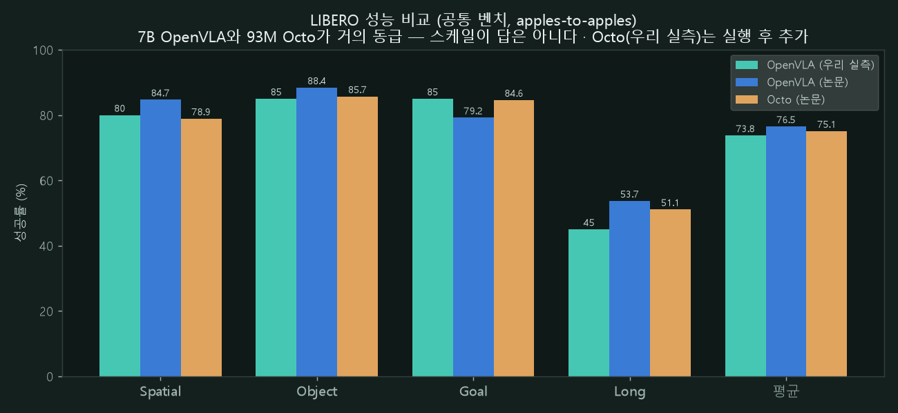

# Vision-Language-Action (VLA)

언어 + 이미지를 받아 로봇 **action을 직접** 내는 정책 모델 리뷰. 인지·결정·제어를 하나의 정책이 통째로 대체하는 계열 — 우리 [컨텍스트 사다리](../context.md)의 L3에 해당한다.

- [OpenVLA (2024)](openvla.md) — Llama-2 7B + DINOv2/SigLIP 기반 오픈 VLA. LIBERO 4-suite를 직접 재현하고 LoRA 파인튜닝까지 돌렸다 → [VLA 실습 페이지](../vla.md).

## 우리 실측 요약 (LIBERO 4-suite, 20 ep/suite)

| suite | 우리 실측 | 논문 보고 |
|-------|-----------|-----------|
| spatial | 80% | 84.7% |
| object | 85% | 88.4% |
| goal | 85% | 79.2% |
| long | **45%** | 53.7% |

패턴 정합(long이 최난이도), 평균 74% ≈ 93M Octo(75.1%) — **LIBERO에선 7B의 파라미터 이점이 거의 안 드러난다**. 자체 LoRA 파인튜닝은 0.45 epoch bounded run에서 0%(norm stats 점검으로 undertrain 확인) — "체크포인트 재현"과 "훈련시켜 쓸 만하게"는 전혀 다른 난이도다.

## World model 계열과의 관계

VLA는 **모방(시연)** 신호로, [world-model RL](../world-models/latent.md)은 **보상** 신호로 배운다 — 문제 설정이 달라 같은 벤치로 직접 비교할 수 없다([Concepts](../concepts.md) 참고). 다만 출력단의 발상은 공유한다: OpenVLA의 action 256-bin 이산화는 [DreamerV3](../world-models/dreamerv3.md)의 twohot, [MuZero](../world-models/muzero.md)의 categorical support와 같은 "연속 회귀 → 이산 분포" 계열이다.

VLA가 소비하는 **시연 데이터의 공급 측**(사람 동작 캡처·retargeting·핸드헬드 수집)은 별도 카테고리 [Human Motion → Robot Data](humanmotion.md)에서 다룬다.

## 다른 VLA 리뷰

우리가 직접 돌린 [OpenVLA](openvla.md) 외에, 계열을 넓혀 문헌 리뷰로 정리한 VLA들:

- [RT-2 (2023)](rt2.md) — 웹 지식 → 로봇 제어로 이식한 **닫힌 원조**(OpenVLA가 "연" 대상).
- [Octo (2024)](octo.md) — **오픈 제너럴리스트** 정책(diffusion head, 93M) — LIBERO에서 7B OpenVLA와 맞먹음.
- [π0 (2024)](pi0.md) — **flow-matching 연속 action**, dexterous. openpi 오픈.
- [RDT-1B (2024)](rdt.md) — 1B **diffusion** VLA, 양손(bimanual).
- [Gemini Robotics 2 (2026)](gemini-robotics.md) — 전신·양손·다로봇, 3-모델(행동 VLA 게이트, ER2만 API).

축으로 보면: **닫힘→오픈**(RT-2→OpenVLA), **이산 토큰→연속/확산 action**(OpenVLA→π0·RDT), **테이블탑→전신**(→Gemini Robotics 2).

## 모델별 성능 비교

주의: **VLA마다 대표 벤치가 다르다**(RT-2=BridgeV2/Google robot, π0=자체 dexterous, RDT=양손, Gemini Robotics 2=전신). 단일 success-rate로 전부 줄세우면 오해다. 공정한 공통 벤치는 **LIBERO**(OpenVLA·Octo)뿐.

### LIBERO — apples-to-apples

*우리 OpenVLA 재현(평균 73.8) · 논문(76.5) · Octo 논문(75.1). **7B(OpenVLA)와 93M(Octo)가 거의 동급** — LIBERO에선 파라미터 20배 차이가 성능에 거의 안 드러난다. Octo(우리 실측)는 실제 실행 후 추가(GPU 대기).*

### 랜드스케이프 (벤치가 달라 표로)

| 모델 | 파라미터 | 백본·구조 | action 표현 | 학습 데이터 | 공개 | 대표 결과(원문) |
|---|---|---|---|---|---|---|
| [OpenVLA](openvla.md) | 7B | Prismatic(Llama-2+DINOv2/SigLIP) | 256-bin 토큰 | OXE ~97만 | 오픈 | LIBERO 76.5 (우리 73.8) |
| [Octo](octo.md) | 27M/93M | Transformer + diffusion head | 연속(diffusion) | OXE ~80만 | 오픈 | LIBERO 75.1 |
| [RT-2](rt2.md) | ~55B(-X) | PaLI-X / PaLM-E | 텍스트 토큰 | 웹 VQA + 로봇 | 닫힘 | BridgeV2·Google robot(emergent) |
| [π0](pi0.md) | ~3B | PaliGemma + flow expert | flow 연속 청크(≤50Hz) | 대규모 dexterous | 오픈(openpi) | 세탁물 개기 등 dexterous |
| [RDT-1B](rdt.md) | 1B | Diffusion Transformer | diffusion 연속 | 다로봇 + 자체 양손 | 오픈 | 양손(bimanual) 조작 |
| [Gemini Robotics 2](gemini-robotics.md) | 미확인 | Gemini 계열 | 미확인 | 미확인 | 게이트(ER2만 API) | 전신·양손·다로봇(수치 미확인) |

읽는 법: **성능 숫자는 같은 줄(LIBERO)에서만 비교** — 나머지 열(파라미터·action 표현·공개 여부)이 실제 모델 선택의 축이다.
