# RLDX-1 실전 — 리얼월드 공개 파운데이션 모델을 내 하네스에서

RLWRLD(리얼월드)의 공개 로봇 파운데이션 모델 **RLDX-1**을 보고서만 읽고 끝내지 않고, **내 RTX 4090 한 장에서 직접 돌린** 기록이다. ① 내 OpenVLA 하네스에서의 동일조건 A/B(LIBERO 3-way)와 400ep 재현 실측, ② 나머지 공개 FT 체크포인트 전부 — GR-1 휴머노이드 손, RoboCasa 모바일 주방, SIMPLER real-to-sim(Google/WidowX) — 의 실측과 시연 미디어, ③ 재현 과정의 환경·프로토콜·액션공간 실록, ④ 내 human 시연을 RLDX-1 학습 포맷(LeRobot v2.1)으로 직렬화해 **그들 로더로 검증**한 데이터 파이프라인, ⑤ DexBench 태스크 분류 정리 — 를 주제별로 담는다.

논문·아키텍처(MSAT/모션/메모리/피직스 스트림 수식 전개)는 리뷰 페이지가 담당: **[RLDX-1 Technical Report 리뷰](reviews/rldx1.md)**.

> **정직 규칙** — 이 페이지의 모든 수치는 내가 돌린 값이며 원본 JSON·영상이 레포에 있다. RLWRLD 공식 수치는 항상 "주장(자체 평가)"으로 병기한다. 파라미터 표기는 HF 모델카드를 1차 출처로(PT 6.9B / MT 8.1B). 가중치는 **RLWRLD Model License v1.0(비상업)** — 본 페이지는 연구·학습 목적의 평가/리뷰다.

## 1. RLDX-1이 무엇인가 (요약)

"Dexterity-First" 로봇 파운데이션 모델. 표준 VLA가 못 하는 세 축 — **motion awareness / long-term memory / physical sensing(촉각·토크)** — 을 전용 모듈로 붙이고, 이질적 modality를 **MSAT**(MM-DiT의 action 확장)로 한 번에 디노이즈한다. 백본 Qwen3-VL-8B, action chunk 16(FR3)/40(ALLEX). 상세 수식·ablation은 [리뷰](reviews/rldx1.md).

| 공개물 | 내용 |
|---|---|
| 코드 | [github.com/RLWRLD/RLDX-1](https://github.com/RLWRLD/RLDX-1) — Apache-2.0, `uv` 기반, docs 5종 |
| 가중치 | [huggingface.co/RLWRLD](https://huggingface.co/RLWRLD) — PT/PT-IMG(6.9B), MT-DROID/MT-ALLEX(8.1B), **FT-LIBERO**·FT-SIMPLER·FT-ROBOCASA·FT-GR1 등 11종 (비상업) |
| 데이터 포맷 | **LeRobot v2.1** + 자체 `modality.json` 확장 (§8) |
| 벤치 | [DexBench](https://dexbench.org/en/) — 산업 dexterity 태스크 표준화 (§9) |
| 보고서 | arXiv:2605.03269 (v2), 저자 68명 |

## 2. 내 LIBERO 하네스 실측 — OpenVLA·RLDX-1·π0.5 **3-way** + 400ep 재현

`RLDX-1-FT-LIBERO` 체크포인트를 **내 WSL2 + RTX 4090 + 기존 LIBERO 하네스**(OpenVLA 평가에 쓴 그 체크아웃, 같은 bddl/init-state 파일)에서 실측했다. 프로토콜은 내 OpenVLA 런과 동일: **공식 고정 init state(에피소드 k → init_states[k]) + 10-step settle, suite별 step 예산 220/280/300/520**. RLDX는 서버-클라이언트(zmq)로 띄우고 action chunk 16 중 8-step 실행. 입력은 각 모델의 네이티브 규약(RLDX: front+wrist 2뷰+state / OpenVLA: 3인칭 1뷰) — 기술보고서의 baseline 비교와 같은 방식이다.

### 인퍼런스 해부 — 서버-클라이언트에서 액션 청크까지

[OpenVLA](vla.md)가 "스텝마다 토큰 7개 = 액션 1개"라면, RLDX-1·π0.5는 **청크 생성형**이다: 한 번의 forward가 미래 액션 여러 개를 한꺼번에 디노이즈하고, 그중 앞부분만 실행한 뒤 재질의한다(receding horizon). 학습이 관여하는 곳은 디노이징 forward 하나이고, 관측 패키징·청크 실행 룰·성공 판정은 전부 룰베이스 코드다.

```text
LIBERO obs (원시)
 └→ 래퍼: 관측 패키징 — 2뷰 이미지 + EE state + 태스크 문장            [룰]
     └→ zmq로 서버 전송 (모델 8.1B는 서버 GPU에 상주)
         └→ MSAT 디노이징: (2뷰, state, 문장) → action chunk (16, 7)   [학습 ★]
             └→ 클라이언트: 앞 8 스텝만 env.step 실행 → 재질의          [룰]
                 └→ 성공 판정 = LIBERO BDDL 술어 (우리 코드 아님)        [룰]
```

**관측/액션 스키마** (그들 LIBERO 래퍼 코드에서 그대로 — 이 키 이름들이 §6 SIMPLER 수리의 단서이기도 했다):

| 키 | shape / 의미 |
|---|---|
| `video.image` · `video.wrist_image` | `(256, 256, 3)` uint8 × 2뷰 (agentview·손목, 상하좌우 flip) |
| `state.x/y/z` · `state.roll/pitch/yaw` | EE 위치 3 + 회전 3 (`quat2axisangle`로 변환) |
| `state.gripper` | `(2,)` 그리퍼 관절 |
| `annotation.human.action.task_description` | 태스크 문장 (언어 조건) |
| `action.x…yaw` + `action.gripper` | 출력 7-DoF — chunk `(16, 7)`로 생성, 정규화 해제는 체크포인트 동봉 `statistics.json`의 per-key 통계로 |

:::{dropdown} 코드 — 관측 패키징과 청크 실행 룰 (RLDX-1 저장소 `eval/sim/LIBERO` 래퍼 · `rollout_policy.py` 발췌)
```python
# 래퍼: LIBERO 원시 obs → RLDX 관측 스키마 (룰베이스 변환)
xyz = obs["robot0_eef_pos"]; rpy = quat2axisangle(obs["robot0_eef_quat"])
new_obs = {
    "video.image":       obs["agentview_image"][::-1, ::-1],        # 180° flip
    "video.wrist_image": obs["robot0_eye_in_hand_image"][::-1, ::-1],
    "state.x": [xyz[0]], "state.y": [xyz[1]], "state.z": [xyz[2]],
    "state.roll": [rpy[0]], "state.pitch": [rpy[1]], "state.yaw": [rpy[2]],
    "state.gripper": obs["robot0_gripper_qpos"],
    "annotation.human.action.task_description": task_description,
}

# 클라이언트 루프: 서버에 관측 → 청크 수신 → 앞 n_action_steps만 실행
n_action_steps: int = 8            # 생성 chunk 16 중 8만 실행 (receding horizon)
actions, _ = policy.get_action(observations)   # zmq 왕복 — 서버에서 MSAT 디노이징
next_obs, rewards, terms, truncs, infos = env.step(actions)

# 우리 하네스 정렬 패치 (RLDX_FIXED_INIT=1): 랜덤 리셋 대신 공식 고정 init
observation = self._env.set_init_state(self._init_states[k])
for _ in range(10):                # settle — 공식 OpenVLA LIBERO 프로토콜과 동일
    observation, _, _, _ = self._env.step([0.0] * 6 + [-1.0])
```

서버-클라이언트로 쪼갠 이유는 의존성 격리다: 모델 쪽(torch 2.7 + flash-attn)과 시뮬 쪽(mujoco 2.3.2 + robosuite 1.4)이 같은 venv에서 공존 불가능하다 — §7의 환경 실록이 그 증거.
:::

π0.5는 서버 없이 lerobot 로컬 로드로 같은 프로토콜을 돈다(`wsl/pi05_libero_eval.py`): `preprocess_observation(raw)` → `obs["task"] = [문장]` → `policy.select_action(obs)` — lerobot 자체 eval 경로를 1:1로 따르되 매 leaf에 배치 차원(B=1)을 붙이는 것까지가 우리가 짠 어댑터다(§7 통합 실록 ④). 내부는 역시 flow-matching 청크 생성이라 구조는 RLDX와 같은 축이고, 뒤의 §3(GR-1)·§5(RoboCasa)·§6(SIMPLER)도 **같은 서버-클라이언트 뼈대에서 embodiment(관측 뷰 수·state 구성·액션 차원)만 바뀐다** — §6에서 그 "state 구성"이 문서가 아니라 체크포인트 `statistics.json`에만 적혀 있었다는 게 수리 3번의 정체다.

| Suite | OpenVLA-7B-FT | **RLDX-1 (20ep)** | **π0.5 (20ep)** | RLDX-1 (100ep) | RLDX 주장 | π0.5 주장 |
|---|---|---|---|---|---|---|
| Spatial | 80% | 95% | 90% | **100.0%** | 98.0 | — |
| Object | 85% | 100% | 100% | 99.0% | 99.3 | — |
| Goal | 85% | 90% | **100%** | 93.0% | 98.4 | — |
| Long (libero_10) | 45% | 95% | 95% | 96.0% | 95.3 | — |
| **평균** | 73.75% | 95.0% | **96.2%** (77/80) | **97.0%** (388/400) | 97.8 | 96.85 |

(모든 "내 실측" 열 = 같은 고정-init 하네스·같은 step 예산. π0.5 = `lerobot/pi05-libero`(HF 재현판), 각 모델은 자기 네이티브 입력 규약. "주장"은 각사 자체평가 — RLDX 500ep, π0.5는 lerobot 재현판 공칭.)

(20ep 런 = OpenVLA와 완전 동일 프로토콜의 A/B — 태스크당 2 트라이얼. 100ep 런 = 같은 고정-init 하네스로 표본만 5배 키운 재현 런 — 태스크당 10 트라이얼, 총 400 에피소드.)

**읽는 법:**
- **주장이 내 셋업에서 재현된다**: 400ep 표본에서 **97.0 vs 주장 97.8** — Spatial/Object/Long은 오차 안에서 일치(100.0/99.0/96.0 vs 98.0/99.3/95.3). 유일하게 Goal(93.0 vs 98.4)이 5%p 낮은데, 실패가 특정 태스크에 몰려 있어(top-drawer+bowl, cream-cheese-in-bowl 등 4개) 프로토콜 차이(고정 init vs 랜덤 리셋, step 예산 300 vs 720)가 원인 후보다.
- **격차의 위치가 논문 서사와 일치**: 짧은 suite에서 OpenVLA 대비 +10~15%p, **Long에서 +50%p** — "long-horizon으로 갈수록 벌어진다"(RC365 결과의 축소판)를 내 하네스에서 재확인.
- **20ep 런의 실패 4건은 전부 부분 실패(1/2)**: spatial `black_bowl_on_the_stove`(내 OpenVLA도 stove 계열에서 실패 — 겹치는 실패 모드), goal `top_drawer+bowl`·`cream_cheese_in_bowl`, long `mug_in_microwave_and_close`.
- 결과 원본: `robotics-lab/outputs/rldx_ab_n2.json`·`rldx_ab_n10.json`·`pi05_ab_n2.json`(태스크별), 롤아웃 영상 560개 저장.
- **3-way 판독**: 두 프론티어 모두 자기 주장 수치를 내 하네스에서 재현했다(RLDX 97.8→97.0, π0.5 96.85→96.2). **서열(97.8 vs 96.9)은 내 표본에선 통계적으로 분리 불가** — 사실상 LIBERO 포화 동률이고, 구세대 OpenVLA와의 격차(특히 Long +50%p)가 진짜 신호다. 태스크 레벨 교차: 마지막 실패가 **두 모델 모두 같은 태스크**(mug-in-microwave+close 1/2), 반면 RLDX가 반복 실패한 Goal 2태스크(top-drawer+bowl, cream-cheese)는 π0.5가 만점 — 모델별 약점 프로파일이 다르다.

<!-- rldx-demo-media -->

### 시연 — 전 미션 40/40 태스크 (실측 롤아웃 원본)

아래는 위 400ep 런에서 저장된 롤아웃 영상 원본이다(각 프레임 좌=front view, 우=wrist view — 모델이 실제로 본 두 입력). **태스크별 영상**을 바로 재생할 수 있고(클릭·자동 미리불러오기 없음), suite별 **필름스트립 사진**(태스크 10 × 진행 5컷)은 토글 안에 있다.

**Spatial**

<div style="display:grid;grid-template-columns:repeat(auto-fill,minmax(240px,1fr));gap:10px;margin-top:8px">
<figure style="margin:0"><video controls muted loop playsinline preload="none" style="width:100%;border-radius:6px" src="_static/rldx/libero_spatial/pick_up_the_black_bowl_between_the_plate_and_the_ramekin_and_place_it_on_the_plate.mp4"></video><figcaption style="font-size:0.72rem;line-height:1.25">pick up the black bowl between the plate and the ramekin and place it on the plate</figcaption></figure>
<figure style="margin:0"><video controls muted loop playsinline preload="none" style="width:100%;border-radius:6px" src="_static/rldx/libero_spatial/pick_up_the_black_bowl_from_table_center_and_place_it_on_the_plate.mp4"></video><figcaption style="font-size:0.72rem;line-height:1.25">pick up the black bowl from table center and place it on the plate</figcaption></figure>
<figure style="margin:0"><video controls muted loop playsinline preload="none" style="width:100%;border-radius:6px" src="_static/rldx/libero_spatial/pick_up_the_black_bowl_in_the_top_drawer_of_the_wooden_cabinet_and_place_it_on_the_plate.mp4"></video><figcaption style="font-size:0.72rem;line-height:1.25">pick up the black bowl in the top drawer of the wooden cabinet and place it on the plate</figcaption></figure>
<figure style="margin:0"><video controls muted loop playsinline preload="none" style="width:100%;border-radius:6px" src="_static/rldx/libero_spatial/pick_up_the_black_bowl_next_to_the_cookie_box_and_place_it_on_the_plate.mp4"></video><figcaption style="font-size:0.72rem;line-height:1.25">pick up the black bowl next to the cookie box and place it on the plate</figcaption></figure>
<figure style="margin:0"><video controls muted loop playsinline preload="none" style="width:100%;border-radius:6px" src="_static/rldx/libero_spatial/pick_up_the_black_bowl_next_to_the_plate_and_place_it_on_the_plate.mp4"></video><figcaption style="font-size:0.72rem;line-height:1.25">pick up the black bowl next to the plate and place it on the plate</figcaption></figure>
<figure style="margin:0"><video controls muted loop playsinline preload="none" style="width:100%;border-radius:6px" src="_static/rldx/libero_spatial/pick_up_the_black_bowl_next_to_the_ramekin_and_place_it_on_the_plate.mp4"></video><figcaption style="font-size:0.72rem;line-height:1.25">pick up the black bowl next to the ramekin and place it on the plate</figcaption></figure>
<figure style="margin:0"><video controls muted loop playsinline preload="none" style="width:100%;border-radius:6px" src="_static/rldx/libero_spatial/pick_up_the_black_bowl_on_the_cookie_box_and_place_it_on_the_plate.mp4"></video><figcaption style="font-size:0.72rem;line-height:1.25">pick up the black bowl on the cookie box and place it on the plate</figcaption></figure>
<figure style="margin:0"><video controls muted loop playsinline preload="none" style="width:100%;border-radius:6px" src="_static/rldx/libero_spatial/pick_up_the_black_bowl_on_the_ramekin_and_place_it_on_the_plate.mp4"></video><figcaption style="font-size:0.72rem;line-height:1.25">pick up the black bowl on the ramekin and place it on the plate</figcaption></figure>
<figure style="margin:0"><video controls muted loop playsinline preload="none" style="width:100%;border-radius:6px" src="_static/rldx/libero_spatial/pick_up_the_black_bowl_on_the_stove_and_place_it_on_the_plate.mp4"></video><figcaption style="font-size:0.72rem;line-height:1.25">pick up the black bowl on the stove and place it on the plate</figcaption></figure>
<figure style="margin:0"><video controls muted loop playsinline preload="none" style="width:100%;border-radius:6px" src="_static/rldx/libero_spatial/pick_up_the_black_bowl_on_the_wooden_cabinet_and_place_it_on_the_plate.mp4"></video><figcaption style="font-size:0.72rem;line-height:1.25">pick up the black bowl on the wooden cabinet and place it on the plate</figcaption></figure>
</div>

<details><summary><b>Spatial — 10태스크 필름스트립 사진 (클릭)</b></summary>
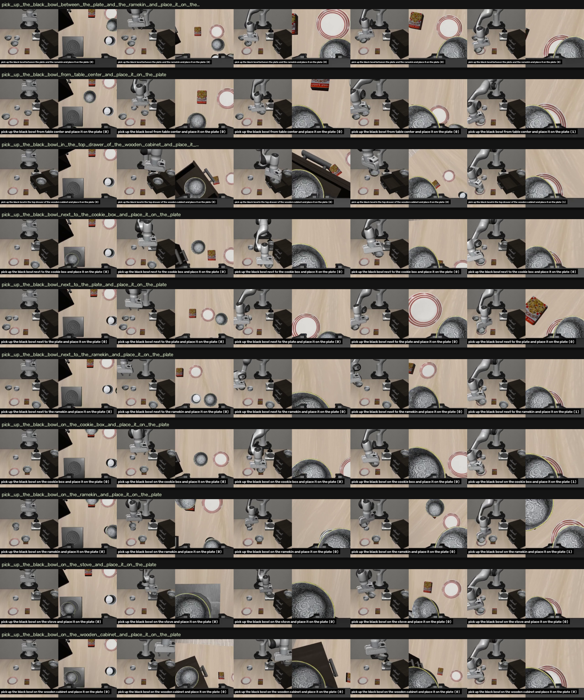
</details>


**Object**

<div style="display:grid;grid-template-columns:repeat(auto-fill,minmax(240px,1fr));gap:10px;margin-top:8px">
<figure style="margin:0"><video controls muted loop playsinline preload="none" style="width:100%;border-radius:6px" src="_static/rldx/libero_object/pick_up_the_alphabet_soup_and_place_it_in_the_basket.mp4"></video><figcaption style="font-size:0.72rem;line-height:1.25">pick up the alphabet soup and place it in the basket</figcaption></figure>
<figure style="margin:0"><video controls muted loop playsinline preload="none" style="width:100%;border-radius:6px" src="_static/rldx/libero_object/pick_up_the_bbq_sauce_and_place_it_in_the_basket.mp4"></video><figcaption style="font-size:0.72rem;line-height:1.25">pick up the bbq sauce and place it in the basket</figcaption></figure>
<figure style="margin:0"><video controls muted loop playsinline preload="none" style="width:100%;border-radius:6px" src="_static/rldx/libero_object/pick_up_the_butter_and_place_it_in_the_basket.mp4"></video><figcaption style="font-size:0.72rem;line-height:1.25">pick up the butter and place it in the basket</figcaption></figure>
<figure style="margin:0"><video controls muted loop playsinline preload="none" style="width:100%;border-radius:6px" src="_static/rldx/libero_object/pick_up_the_chocolate_pudding_and_place_it_in_the_basket.mp4"></video><figcaption style="font-size:0.72rem;line-height:1.25">pick up the chocolate pudding and place it in the basket</figcaption></figure>
<figure style="margin:0"><video controls muted loop playsinline preload="none" style="width:100%;border-radius:6px" src="_static/rldx/libero_object/pick_up_the_cream_cheese_and_place_it_in_the_basket.mp4"></video><figcaption style="font-size:0.72rem;line-height:1.25">pick up the cream cheese and place it in the basket</figcaption></figure>
<figure style="margin:0"><video controls muted loop playsinline preload="none" style="width:100%;border-radius:6px" src="_static/rldx/libero_object/pick_up_the_ketchup_and_place_it_in_the_basket.mp4"></video><figcaption style="font-size:0.72rem;line-height:1.25">pick up the ketchup and place it in the basket</figcaption></figure>
<figure style="margin:0"><video controls muted loop playsinline preload="none" style="width:100%;border-radius:6px" src="_static/rldx/libero_object/pick_up_the_milk_and_place_it_in_the_basket.mp4"></video><figcaption style="font-size:0.72rem;line-height:1.25">pick up the milk and place it in the basket</figcaption></figure>
<figure style="margin:0"><video controls muted loop playsinline preload="none" style="width:100%;border-radius:6px" src="_static/rldx/libero_object/pick_up_the_orange_juice_and_place_it_in_the_basket.mp4"></video><figcaption style="font-size:0.72rem;line-height:1.25">pick up the orange juice and place it in the basket</figcaption></figure>
<figure style="margin:0"><video controls muted loop playsinline preload="none" style="width:100%;border-radius:6px" src="_static/rldx/libero_object/pick_up_the_salad_dressing_and_place_it_in_the_basket.mp4"></video><figcaption style="font-size:0.72rem;line-height:1.25">pick up the salad dressing and place it in the basket</figcaption></figure>
<figure style="margin:0"><video controls muted loop playsinline preload="none" style="width:100%;border-radius:6px" src="_static/rldx/libero_object/pick_up_the_tomato_sauce_and_place_it_in_the_basket.mp4"></video><figcaption style="font-size:0.72rem;line-height:1.25">pick up the tomato sauce and place it in the basket</figcaption></figure>
</div>

<details><summary><b>Object — 10태스크 필름스트립 사진 (클릭)</b></summary>
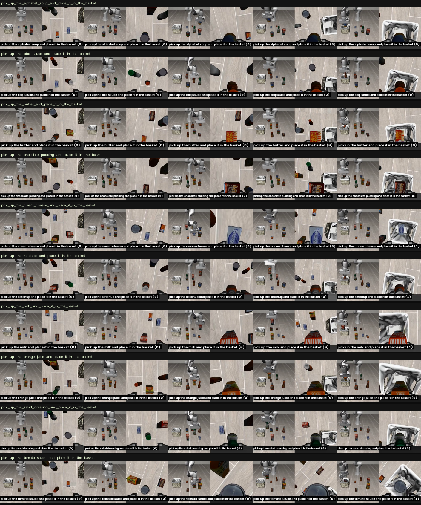
</details>


**Goal**

<div style="display:grid;grid-template-columns:repeat(auto-fill,minmax(240px,1fr));gap:10px;margin-top:8px">
<figure style="margin:0"><video controls muted loop playsinline preload="none" style="width:100%;border-radius:6px" src="_static/rldx/libero_goal/open_the_middle_drawer_of_the_cabinet.mp4"></video><figcaption style="font-size:0.72rem;line-height:1.25">open the middle drawer of the cabinet</figcaption></figure>
<figure style="margin:0"><video controls muted loop playsinline preload="none" style="width:100%;border-radius:6px" src="_static/rldx/libero_goal/open_the_top_drawer_and_put_the_bowl_inside.mp4"></video><figcaption style="font-size:0.72rem;line-height:1.25">open the top drawer and put the bowl inside</figcaption></figure>
<figure style="margin:0"><video controls muted loop playsinline preload="none" style="width:100%;border-radius:6px" src="_static/rldx/libero_goal/push_the_plate_to_the_front_of_the_stove.mp4"></video><figcaption style="font-size:0.72rem;line-height:1.25">push the plate to the front of the stove</figcaption></figure>
<figure style="margin:0"><video controls muted loop playsinline preload="none" style="width:100%;border-radius:6px" src="_static/rldx/libero_goal/put_the_bowl_on_the_plate.mp4"></video><figcaption style="font-size:0.72rem;line-height:1.25">put the bowl on the plate</figcaption></figure>
<figure style="margin:0"><video controls muted loop playsinline preload="none" style="width:100%;border-radius:6px" src="_static/rldx/libero_goal/put_the_bowl_on_the_stove.mp4"></video><figcaption style="font-size:0.72rem;line-height:1.25">put the bowl on the stove</figcaption></figure>
<figure style="margin:0"><video controls muted loop playsinline preload="none" style="width:100%;border-radius:6px" src="_static/rldx/libero_goal/put_the_bowl_on_top_of_the_cabinet.mp4"></video><figcaption style="font-size:0.72rem;line-height:1.25">put the bowl on top of the cabinet</figcaption></figure>
<figure style="margin:0"><video controls muted loop playsinline preload="none" style="width:100%;border-radius:6px" src="_static/rldx/libero_goal/put_the_cream_cheese_in_the_bowl.mp4"></video><figcaption style="font-size:0.72rem;line-height:1.25">put the cream cheese in the bowl</figcaption></figure>
<figure style="margin:0"><video controls muted loop playsinline preload="none" style="width:100%;border-radius:6px" src="_static/rldx/libero_goal/put_the_wine_bottle_on_the_rack.mp4"></video><figcaption style="font-size:0.72rem;line-height:1.25">put the wine bottle on the rack</figcaption></figure>
<figure style="margin:0"><video controls muted loop playsinline preload="none" style="width:100%;border-radius:6px" src="_static/rldx/libero_goal/put_the_wine_bottle_on_top_of_the_cabinet.mp4"></video><figcaption style="font-size:0.72rem;line-height:1.25">put the wine bottle on top of the cabinet</figcaption></figure>
<figure style="margin:0"><video controls muted loop playsinline preload="none" style="width:100%;border-radius:6px" src="_static/rldx/libero_goal/turn_on_the_stove.mp4"></video><figcaption style="font-size:0.72rem;line-height:1.25">turn on the stove</figcaption></figure>
</div>

<details><summary><b>Goal — 10태스크 필름스트립 사진 (클릭)</b></summary>
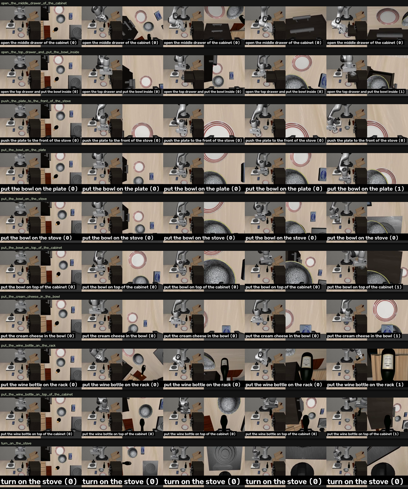
</details>


**Long (libero_10)**

<div style="display:grid;grid-template-columns:repeat(auto-fill,minmax(240px,1fr));gap:10px;margin-top:8px">
<figure style="margin:0"><video controls muted loop playsinline preload="none" style="width:100%;border-radius:6px" src="_static/rldx/libero_10/KITCHEN_SCENE3_turn_on_the_stove_and_put_the_moka_pot_on_it.mp4"></video><figcaption style="font-size:0.72rem;line-height:1.25">KITCHEN SCENE3 turn on the stove and put the moka pot on it</figcaption></figure>
<figure style="margin:0"><video controls muted loop playsinline preload="none" style="width:100%;border-radius:6px" src="_static/rldx/libero_10/KITCHEN_SCENE4_put_the_black_bowl_in_the_bottom_drawer_of_the_cabinet_and_close_it.mp4"></video><figcaption style="font-size:0.72rem;line-height:1.25">KITCHEN SCENE4 put the black bowl in the bottom drawer of the cabinet and close it</figcaption></figure>
<figure style="margin:0"><video controls muted loop playsinline preload="none" style="width:100%;border-radius:6px" src="_static/rldx/libero_10/KITCHEN_SCENE6_put_the_yellow_and_white_mug_in_the_microwave_and_close_it.mp4"></video><figcaption style="font-size:0.72rem;line-height:1.25">KITCHEN SCENE6 put the yellow and white mug in the microwave and close it</figcaption></figure>
<figure style="margin:0"><video controls muted loop playsinline preload="none" style="width:100%;border-radius:6px" src="_static/rldx/libero_10/KITCHEN_SCENE8_put_both_moka_pots_on_the_stove.mp4"></video><figcaption style="font-size:0.72rem;line-height:1.25">KITCHEN SCENE8 put both moka pots on the stove</figcaption></figure>
<figure style="margin:0"><video controls muted loop playsinline preload="none" style="width:100%;border-radius:6px" src="_static/rldx/libero_10/LIVING_ROOM_SCENE1_put_both_the_alphabet_soup_and_the_cream_cheese_box_in_the_basket.mp4"></video><figcaption style="font-size:0.72rem;line-height:1.25">LIVING ROOM SCENE1 put both the alphabet soup and the cream cheese box in the basket</figcaption></figure>
<figure style="margin:0"><video controls muted loop playsinline preload="none" style="width:100%;border-radius:6px" src="_static/rldx/libero_10/LIVING_ROOM_SCENE2_put_both_the_alphabet_soup_and_the_tomato_sauce_in_the_basket.mp4"></video><figcaption style="font-size:0.72rem;line-height:1.25">LIVING ROOM SCENE2 put both the alphabet soup and the tomato sauce in the basket</figcaption></figure>
<figure style="margin:0"><video controls muted loop playsinline preload="none" style="width:100%;border-radius:6px" src="_static/rldx/libero_10/LIVING_ROOM_SCENE2_put_both_the_cream_cheese_box_and_the_butter_in_the_basket.mp4"></video><figcaption style="font-size:0.72rem;line-height:1.25">LIVING ROOM SCENE2 put both the cream cheese box and the butter in the basket</figcaption></figure>
<figure style="margin:0"><video controls muted loop playsinline preload="none" style="width:100%;border-radius:6px" src="_static/rldx/libero_10/LIVING_ROOM_SCENE5_put_the_white_mug_on_the_left_plate_and_put_the_yellow_and_white_mug_on_the_right_plate.mp4"></video><figcaption style="font-size:0.72rem;line-height:1.25">LIVING ROOM SCENE5 put the white mug on the left plate and put the yellow and white mug on the right plate</figcaption></figure>
<figure style="margin:0"><video controls muted loop playsinline preload="none" style="width:100%;border-radius:6px" src="_static/rldx/libero_10/LIVING_ROOM_SCENE6_put_the_white_mug_on_the_plate_and_put_the_chocolate_pudding_to_the_right_of_the_plate.mp4"></video><figcaption style="font-size:0.72rem;line-height:1.25">LIVING ROOM SCENE6 put the white mug on the plate and put the chocolate pudding to the right of the plate</figcaption></figure>
<figure style="margin:0"><video controls muted loop playsinline preload="none" style="width:100%;border-radius:6px" src="_static/rldx/libero_10/STUDY_SCENE1_pick_up_the_book_and_place_it_in_the_back_compartment_of_the_caddy.mp4"></video><figcaption style="font-size:0.72rem;line-height:1.25">STUDY SCENE1 pick up the book and place it in the back compartment of the caddy</figcaption></figure>
</div>

<details><summary><b>Long (libero_10) — 10태스크 필름스트립 사진 (클릭)</b></summary>
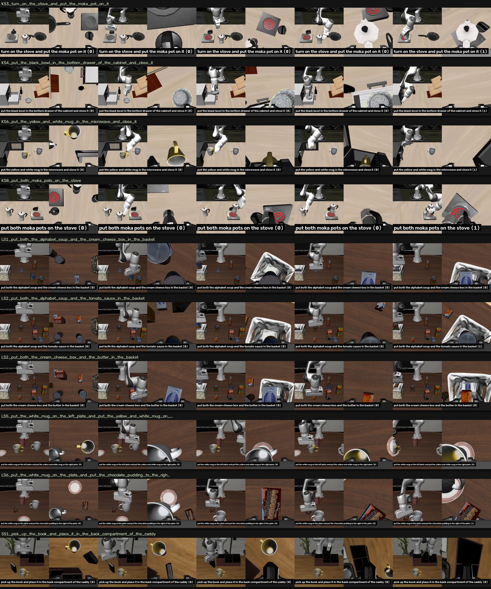
</details>


**실패 사례 (정직 표본)** — 12개 실패 중 4개: goal의 반복 실패 태스크(top-drawer+bowl, cream-cheese-in-bowl)와 object·long의 단발 실패. 접근·파지까지는 가고 배치/여닫기에서 무너지는 패턴.

<div style="display:grid;grid-template-columns:repeat(auto-fill,minmax(240px,1fr));gap:10px">
<figure style="margin:0"><video controls muted loop playsinline preload="none" style="width:100%;border-radius:6px" src="_static/rldx/failures/libero_10__KITCHEN_SCENE6_put_the_yellow_and_white_mug_in_the_microwave_and_close_it.mp4"></video><figcaption style="font-size:0.72rem;line-height:1.25">libero 10 · KITCHEN SCENE6 put the yellow and white mug in the microwave and close it</figcaption></figure>
<figure style="margin:0"><video controls muted loop playsinline preload="none" style="width:100%;border-radius:6px" src="_static/rldx/failures/libero_goal__put_the_bowl_on_the_plate.mp4"></video><figcaption style="font-size:0.72rem;line-height:1.25">libero goal · put the bowl on the plate</figcaption></figure>
<figure style="margin:0"><video controls muted loop playsinline preload="none" style="width:100%;border-radius:6px" src="_static/rldx/failures/libero_goal__put_the_wine_bottle_on_the_rack.mp4"></video><figcaption style="font-size:0.72rem;line-height:1.25">libero goal · put the wine bottle on the rack</figcaption></figure>
<figure style="margin:0"><video controls muted loop playsinline preload="none" style="width:100%;border-radius:6px" src="_static/rldx/failures/libero_object__pick_up_the_ketchup_and_place_it_in_the_basket.mp4"></video><figcaption style="font-size:0.72rem;line-height:1.25">libero object · pick up the ketchup and place it in the basket</figcaption></figure>
</div>


### π0.5 시연 — 전 미션 40/40 (같은 하네스 롤아웃 원본)

각 프레임 좌=front, 우=wrist. RLDX 시연(위)과 같은 고정 init 에피소드라 **같은 태스크·같은 시작 배치를 두 모델이 어떻게 다르게 푸는지** 나란히 볼 수 있다.

**Spatial (π0.5)**

<div style="display:grid;grid-template-columns:repeat(auto-fill,minmax(240px,1fr));gap:10px">
<figure style="margin:0"><video controls muted loop playsinline preload="none" style="width:100%;border-radius:6px" src="_static/rldx/pi05/libero_spatial/pick_up_the_black_bowl_between_the_plate_and_the_ramekin_and_place_it_on_the_plate.mp4"></video><figcaption style="font-size:0.72rem;line-height:1.25">pick up the black bowl between the plate and the ramekin and place it on the plate</figcaption></figure>
<figure style="margin:0"><video controls muted loop playsinline preload="none" style="width:100%;border-radius:6px" src="_static/rldx/pi05/libero_spatial/pick_up_the_black_bowl_from_table_center_and_place_it_on_the_plate.mp4"></video><figcaption style="font-size:0.72rem;line-height:1.25">pick up the black bowl from table center and place it on the plate</figcaption></figure>
<figure style="margin:0"><video controls muted loop playsinline preload="none" style="width:100%;border-radius:6px" src="_static/rldx/pi05/libero_spatial/pick_up_the_black_bowl_in_the_top_drawer_of_the_wooden_cabinet_and_place_it_on_the_plate.mp4"></video><figcaption style="font-size:0.72rem;line-height:1.25">pick up the black bowl in the top drawer of the wooden cabinet and place it on the plate</figcaption></figure>
<figure style="margin:0"><video controls muted loop playsinline preload="none" style="width:100%;border-radius:6px" src="_static/rldx/pi05/libero_spatial/pick_up_the_black_bowl_next_to_the_cookie_box_and_place_it_on_the_plate.mp4"></video><figcaption style="font-size:0.72rem;line-height:1.25">pick up the black bowl next to the cookie box and place it on the plate</figcaption></figure>
<figure style="margin:0"><video controls muted loop playsinline preload="none" style="width:100%;border-radius:6px" src="_static/rldx/pi05/libero_spatial/pick_up_the_black_bowl_next_to_the_plate_and_place_it_on_the_plate.mp4"></video><figcaption style="font-size:0.72rem;line-height:1.25">pick up the black bowl next to the plate and place it on the plate</figcaption></figure>
<figure style="margin:0"><video controls muted loop playsinline preload="none" style="width:100%;border-radius:6px" src="_static/rldx/pi05/libero_spatial/pick_up_the_black_bowl_next_to_the_ramekin_and_place_it_on_the_plate.mp4"></video><figcaption style="font-size:0.72rem;line-height:1.25">pick up the black bowl next to the ramekin and place it on the plate</figcaption></figure>
<figure style="margin:0"><video controls muted loop playsinline preload="none" style="width:100%;border-radius:6px" src="_static/rldx/pi05/libero_spatial/pick_up_the_black_bowl_on_the_cookie_box_and_place_it_on_the_plate.mp4"></video><figcaption style="font-size:0.72rem;line-height:1.25">pick up the black bowl on the cookie box and place it on the plate</figcaption></figure>
<figure style="margin:0"><video controls muted loop playsinline preload="none" style="width:100%;border-radius:6px" src="_static/rldx/pi05/libero_spatial/pick_up_the_black_bowl_on_the_ramekin_and_place_it_on_the_plate.mp4"></video><figcaption style="font-size:0.72rem;line-height:1.25">pick up the black bowl on the ramekin and place it on the plate</figcaption></figure>
<figure style="margin:0"><video controls muted loop playsinline preload="none" style="width:100%;border-radius:6px" src="_static/rldx/pi05/libero_spatial/pick_up_the_black_bowl_on_the_stove_and_place_it_on_the_plate.mp4"></video><figcaption style="font-size:0.72rem;line-height:1.25">pick up the black bowl on the stove and place it on the plate</figcaption></figure>
<figure style="margin:0"><video controls muted loop playsinline preload="none" style="width:100%;border-radius:6px" src="_static/rldx/pi05/libero_spatial/pick_up_the_black_bowl_on_the_wooden_cabinet_and_place_it_on_the_plate.mp4"></video><figcaption style="font-size:0.72rem;line-height:1.25">pick up the black bowl on the wooden cabinet and place it on the plate</figcaption></figure>
</div>

<details><summary><b>Spatial — π0.5 필름스트립 사진 (클릭)</b></summary>
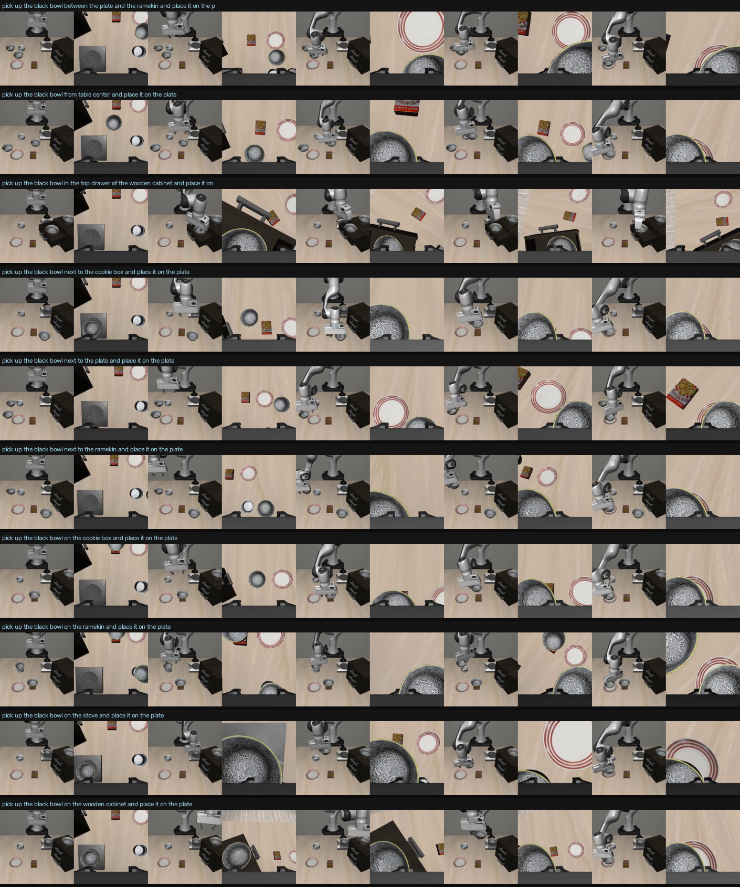</details>

**Object (π0.5)**

<div style="display:grid;grid-template-columns:repeat(auto-fill,minmax(240px,1fr));gap:10px">
<figure style="margin:0"><video controls muted loop playsinline preload="none" style="width:100%;border-radius:6px" src="_static/rldx/pi05/libero_object/pick_up_the_alphabet_soup_and_place_it_in_the_basket.mp4"></video><figcaption style="font-size:0.72rem;line-height:1.25">pick up the alphabet soup and place it in the basket</figcaption></figure>
<figure style="margin:0"><video controls muted loop playsinline preload="none" style="width:100%;border-radius:6px" src="_static/rldx/pi05/libero_object/pick_up_the_bbq_sauce_and_place_it_in_the_basket.mp4"></video><figcaption style="font-size:0.72rem;line-height:1.25">pick up the bbq sauce and place it in the basket</figcaption></figure>
<figure style="margin:0"><video controls muted loop playsinline preload="none" style="width:100%;border-radius:6px" src="_static/rldx/pi05/libero_object/pick_up_the_butter_and_place_it_in_the_basket.mp4"></video><figcaption style="font-size:0.72rem;line-height:1.25">pick up the butter and place it in the basket</figcaption></figure>
<figure style="margin:0"><video controls muted loop playsinline preload="none" style="width:100%;border-radius:6px" src="_static/rldx/pi05/libero_object/pick_up_the_chocolate_pudding_and_place_it_in_the_basket.mp4"></video><figcaption style="font-size:0.72rem;line-height:1.25">pick up the chocolate pudding and place it in the basket</figcaption></figure>
<figure style="margin:0"><video controls muted loop playsinline preload="none" style="width:100%;border-radius:6px" src="_static/rldx/pi05/libero_object/pick_up_the_cream_cheese_and_place_it_in_the_basket.mp4"></video><figcaption style="font-size:0.72rem;line-height:1.25">pick up the cream cheese and place it in the basket</figcaption></figure>
<figure style="margin:0"><video controls muted loop playsinline preload="none" style="width:100%;border-radius:6px" src="_static/rldx/pi05/libero_object/pick_up_the_ketchup_and_place_it_in_the_basket.mp4"></video><figcaption style="font-size:0.72rem;line-height:1.25">pick up the ketchup and place it in the basket</figcaption></figure>
<figure style="margin:0"><video controls muted loop playsinline preload="none" style="width:100%;border-radius:6px" src="_static/rldx/pi05/libero_object/pick_up_the_milk_and_place_it_in_the_basket.mp4"></video><figcaption style="font-size:0.72rem;line-height:1.25">pick up the milk and place it in the basket</figcaption></figure>
<figure style="margin:0"><video controls muted loop playsinline preload="none" style="width:100%;border-radius:6px" src="_static/rldx/pi05/libero_object/pick_up_the_orange_juice_and_place_it_in_the_basket.mp4"></video><figcaption style="font-size:0.72rem;line-height:1.25">pick up the orange juice and place it in the basket</figcaption></figure>
<figure style="margin:0"><video controls muted loop playsinline preload="none" style="width:100%;border-radius:6px" src="_static/rldx/pi05/libero_object/pick_up_the_salad_dressing_and_place_it_in_the_basket.mp4"></video><figcaption style="font-size:0.72rem;line-height:1.25">pick up the salad dressing and place it in the basket</figcaption></figure>
<figure style="margin:0"><video controls muted loop playsinline preload="none" style="width:100%;border-radius:6px" src="_static/rldx/pi05/libero_object/pick_up_the_tomato_sauce_and_place_it_in_the_basket.mp4"></video><figcaption style="font-size:0.72rem;line-height:1.25">pick up the tomato sauce and place it in the basket</figcaption></figure>
</div>

<details><summary><b>Object — π0.5 필름스트립 사진 (클릭)</b></summary>
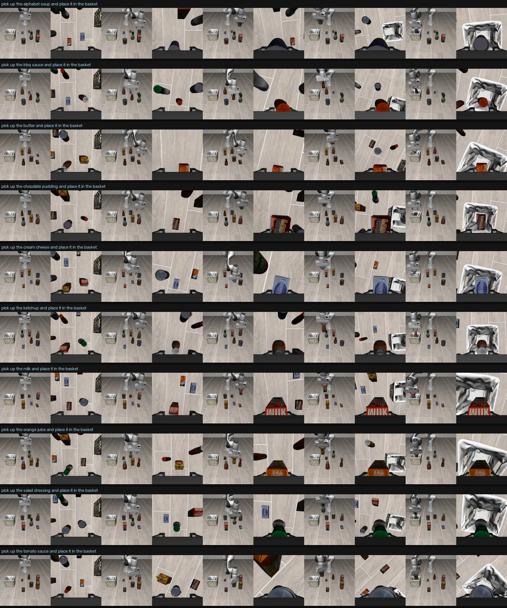</details>

**Goal (π0.5)**

<div style="display:grid;grid-template-columns:repeat(auto-fill,minmax(240px,1fr));gap:10px">
<figure style="margin:0"><video controls muted loop playsinline preload="none" style="width:100%;border-radius:6px" src="_static/rldx/pi05/libero_goal/open_the_middle_drawer_of_the_cabinet.mp4"></video><figcaption style="font-size:0.72rem;line-height:1.25">open the middle drawer of the cabinet</figcaption></figure>
<figure style="margin:0"><video controls muted loop playsinline preload="none" style="width:100%;border-radius:6px" src="_static/rldx/pi05/libero_goal/open_the_top_drawer_and_put_the_bowl_inside.mp4"></video><figcaption style="font-size:0.72rem;line-height:1.25">open the top drawer and put the bowl inside</figcaption></figure>
<figure style="margin:0"><video controls muted loop playsinline preload="none" style="width:100%;border-radius:6px" src="_static/rldx/pi05/libero_goal/push_the_plate_to_the_front_of_the_stove.mp4"></video><figcaption style="font-size:0.72rem;line-height:1.25">push the plate to the front of the stove</figcaption></figure>
<figure style="margin:0"><video controls muted loop playsinline preload="none" style="width:100%;border-radius:6px" src="_static/rldx/pi05/libero_goal/put_the_bowl_on_the_plate.mp4"></video><figcaption style="font-size:0.72rem;line-height:1.25">put the bowl on the plate</figcaption></figure>
<figure style="margin:0"><video controls muted loop playsinline preload="none" style="width:100%;border-radius:6px" src="_static/rldx/pi05/libero_goal/put_the_bowl_on_the_stove.mp4"></video><figcaption style="font-size:0.72rem;line-height:1.25">put the bowl on the stove</figcaption></figure>
<figure style="margin:0"><video controls muted loop playsinline preload="none" style="width:100%;border-radius:6px" src="_static/rldx/pi05/libero_goal/put_the_bowl_on_top_of_the_cabinet.mp4"></video><figcaption style="font-size:0.72rem;line-height:1.25">put the bowl on top of the cabinet</figcaption></figure>
<figure style="margin:0"><video controls muted loop playsinline preload="none" style="width:100%;border-radius:6px" src="_static/rldx/pi05/libero_goal/put_the_cream_cheese_in_the_bowl.mp4"></video><figcaption style="font-size:0.72rem;line-height:1.25">put the cream cheese in the bowl</figcaption></figure>
<figure style="margin:0"><video controls muted loop playsinline preload="none" style="width:100%;border-radius:6px" src="_static/rldx/pi05/libero_goal/put_the_wine_bottle_on_the_rack.mp4"></video><figcaption style="font-size:0.72rem;line-height:1.25">put the wine bottle on the rack</figcaption></figure>
<figure style="margin:0"><video controls muted loop playsinline preload="none" style="width:100%;border-radius:6px" src="_static/rldx/pi05/libero_goal/put_the_wine_bottle_on_top_of_the_cabinet.mp4"></video><figcaption style="font-size:0.72rem;line-height:1.25">put the wine bottle on top of the cabinet</figcaption></figure>
<figure style="margin:0"><video controls muted loop playsinline preload="none" style="width:100%;border-radius:6px" src="_static/rldx/pi05/libero_goal/turn_on_the_stove.mp4"></video><figcaption style="font-size:0.72rem;line-height:1.25">turn on the stove</figcaption></figure>
</div>

<details><summary><b>Goal — π0.5 필름스트립 사진 (클릭)</b></summary>
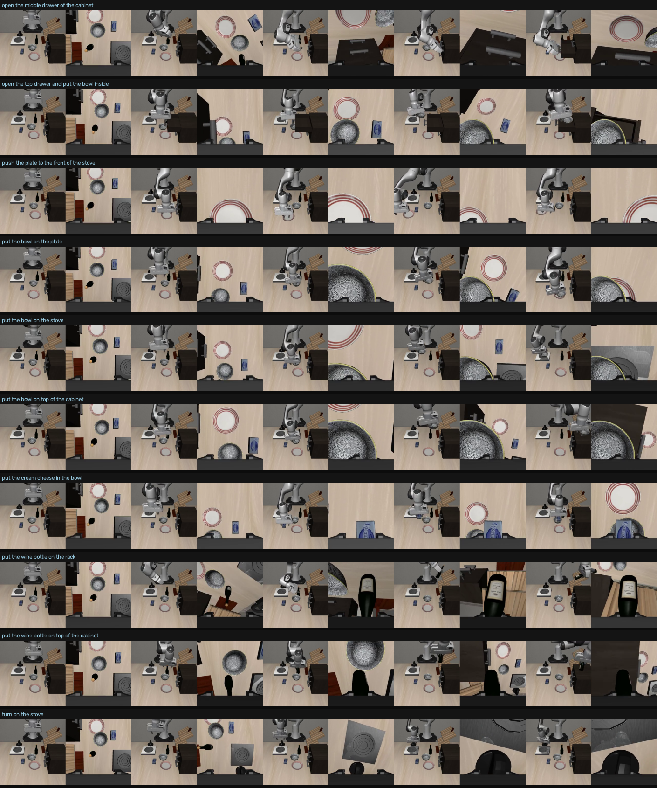</details>

**Long (π0.5)**

<div style="display:grid;grid-template-columns:repeat(auto-fill,minmax(240px,1fr));gap:10px">
<figure style="margin:0"><video controls muted loop playsinline preload="none" style="width:100%;border-radius:6px" src="_static/rldx/pi05/libero_10/KITCHEN_SCENE3_turn_on_the_stove_and_put_the_moka_pot_on_it.mp4"></video><figcaption style="font-size:0.72rem;line-height:1.25">KITCHEN SCENE3 turn on the stove and put the moka pot on it</figcaption></figure>
<figure style="margin:0"><video controls muted loop playsinline preload="none" style="width:100%;border-radius:6px" src="_static/rldx/pi05/libero_10/KITCHEN_SCENE4_put_the_black_bowl_in_the_bottom_drawer_of_the_cabinet_and_close_it.mp4"></video><figcaption style="font-size:0.72rem;line-height:1.25">KITCHEN SCENE4 put the black bowl in the bottom drawer of the cabinet and close it</figcaption></figure>
<figure style="margin:0"><video controls muted loop playsinline preload="none" style="width:100%;border-radius:6px" src="_static/rldx/pi05/libero_10/KITCHEN_SCENE6_put_the_yellow_and_white_mug_in_the_microwave_and_close_it.mp4"></video><figcaption style="font-size:0.72rem;line-height:1.25">KITCHEN SCENE6 put the yellow and white mug in the microwave and close it</figcaption></figure>
<figure style="margin:0"><video controls muted loop playsinline preload="none" style="width:100%;border-radius:6px" src="_static/rldx/pi05/libero_10/KITCHEN_SCENE8_put_both_moka_pots_on_the_stove.mp4"></video><figcaption style="font-size:0.72rem;line-height:1.25">KITCHEN SCENE8 put both moka pots on the stove</figcaption></figure>
<figure style="margin:0"><video controls muted loop playsinline preload="none" style="width:100%;border-radius:6px" src="_static/rldx/pi05/libero_10/LIVING_ROOM_SCENE1_put_both_the_alphabet_soup_and_the_cream_cheese_box_in_the_basket.mp4"></video><figcaption style="font-size:0.72rem;line-height:1.25">LIVING ROOM SCENE1 put both the alphabet soup and the cream cheese box in the basket</figcaption></figure>
<figure style="margin:0"><video controls muted loop playsinline preload="none" style="width:100%;border-radius:6px" src="_static/rldx/pi05/libero_10/LIVING_ROOM_SCENE2_put_both_the_alphabet_soup_and_the_tomato_sauce_in_the_basket.mp4"></video><figcaption style="font-size:0.72rem;line-height:1.25">LIVING ROOM SCENE2 put both the alphabet soup and the tomato sauce in the basket</figcaption></figure>
<figure style="margin:0"><video controls muted loop playsinline preload="none" style="width:100%;border-radius:6px" src="_static/rldx/pi05/libero_10/LIVING_ROOM_SCENE2_put_both_the_cream_cheese_box_and_the_butter_in_the_basket.mp4"></video><figcaption style="font-size:0.72rem;line-height:1.25">LIVING ROOM SCENE2 put both the cream cheese box and the butter in the basket</figcaption></figure>
<figure style="margin:0"><video controls muted loop playsinline preload="none" style="width:100%;border-radius:6px" src="_static/rldx/pi05/libero_10/LIVING_ROOM_SCENE5_put_the_white_mug_on_the_left_plate_and_put_the_yellow_and_white_mug_on_the_right_plate.mp4"></video><figcaption style="font-size:0.72rem;line-height:1.25">LIVING ROOM SCENE5 put the white mug on the left plate and put the yellow and white mug on the right plate</figcaption></figure>
<figure style="margin:0"><video controls muted loop playsinline preload="none" style="width:100%;border-radius:6px" src="_static/rldx/pi05/libero_10/LIVING_ROOM_SCENE6_put_the_white_mug_on_the_plate_and_put_the_chocolate_pudding_to_the_right_of_the_plate.mp4"></video><figcaption style="font-size:0.72rem;line-height:1.25">LIVING ROOM SCENE6 put the white mug on the plate and put the chocolate pudding to the right of the plate</figcaption></figure>
<figure style="margin:0"><video controls muted loop playsinline preload="none" style="width:100%;border-radius:6px" src="_static/rldx/pi05/libero_10/STUDY_SCENE1_pick_up_the_book_and_place_it_in_the_back_compartment_of_the_caddy.mp4"></video><figcaption style="font-size:0.72rem;line-height:1.25">STUDY SCENE1 pick up the book and place it in the back compartment of the caddy</figcaption></figure>
</div>

<details><summary><b>Long — π0.5 필름스트립 사진 (클릭)</b></summary>
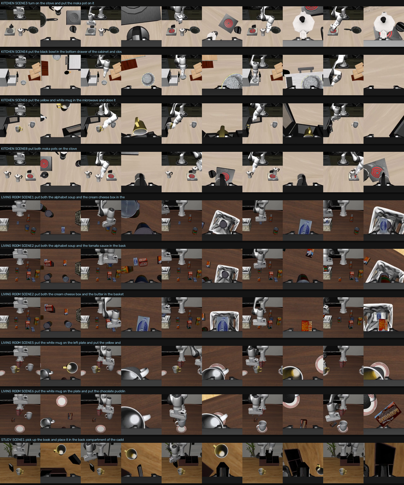</details>

**π0.5 실패 사례 (전체 3건 전부)** — spatial top-drawer 2건 + long mug-in-microwave 1건:

<div style="display:grid;grid-template-columns:repeat(auto-fill,minmax(240px,1fr));gap:10px">
<figure style="margin:0"><video controls muted loop playsinline preload="none" style="width:100%;border-radius:6px" src="_static/rldx/pi05/failures/libero_10__KITCHEN_SCENE6_put_the_yellow_and_white_mug_in_the_microwave_and_close_it__ep0-failure.mp4"></video><figcaption style="font-size:0.7rem;line-height:1.25">libero 10 · KITCHEN SCENE6 put the yellow and white mug in the microwave and close it · ep0-failure</figcaption></figure>
<figure style="margin:0"><video controls muted loop playsinline preload="none" style="width:100%;border-radius:6px" src="_static/rldx/pi05/failures/libero_spatial__pick_up_the_black_bowl_in_the_top_drawer_of_the_wooden_cabinet_and_place_it_on_the_plate__ep0-failure.mp4"></video><figcaption style="font-size:0.7rem;line-height:1.25">libero spatial · pick up the black bowl in the top drawer of the wooden cabinet and place it on the plate · ep</figcaption></figure>
<figure style="margin:0"><video controls muted loop playsinline preload="none" style="width:100%;border-radius:6px" src="_static/rldx/pi05/failures/libero_spatial__pick_up_the_black_bowl_in_the_top_drawer_of_the_wooden_cabinet_and_place_it_on_the_plate__ep1-failure.mp4"></video><figcaption style="font-size:0.7rem;line-height:1.25">libero spatial · pick up the black bowl in the top drawer of the wooden cabinet and place it on the plate · ep</figcaption></figure>
</div>

## 3. GR-1 Tabletop 실측 — 덱스터러스 핸드 휴머노이드

"RLDX는 손 매니퓰레이터 전용인가?"에 대한 실측 답. LIBERO(그리퍼)와 달리 여기는 **Fourier GR-1 휴머노이드 — 양팔 + 덱스터러스 핸드, ego-centric 카메라** — 의 시뮬 벤치(24태스크: 물체 재배치 18 + 여닫이 6)다. `RLDX-1-FT-GR1` 체크포인트, 그들 평가 프로토콜 그대로(랜덤 리셋, 720 step, chunk 16), 태스크당 3 에피소드.

| | **내 실측 (n=3/task, 72ep)** | 주장 (n=50/task, 자체평가) |
|---|---|---|
| 여닫이 articulated (6) | 55.6% (10/18) | 57.7 |
| 재배치 rearrangement (18) | 57.4% (31/54) | 59.1 |
| **전체 (24)** | **56.9% (41/72)** | **58.7** |

- **주장 58.7이 내 셋업에서 재현**(56.9, n=3 이항 잡음 안). 카테고리별 분해까지 방향 일치.
- 태스크 레벨 교차검증: 내 0/3 태스크(PlacematToTieredshelf)는 **논문에서도 최저(24.0%)**였던 그 태스크. 3/3 만점 4개.
- 정직 캐비엇: ① n=3/task는 거친 표본 — suite 합계에서만 의미 ② 이 런은 그들 기본 프로토콜(랜덤 리셋)이며 LIBERO 런과 달리 고정-init 정렬이 불필요(우리 쪽 baseline이 없는 단독 재현) ③ 환경 재현 실록: robocasa_uv 클라이언트 venv에 rldx 의존성 누락(tyro→diffusers→accelerate→transformers→**dm-tree**)을 연쇄 수리해야 돌아갔다.

**시연 — 전 24태스크 영상** (각 프레임 좌=ego view, 우=wrist view; 캡션의 n/3 = 해당 태스크 성적):

<div style="display:grid;grid-template-columns:repeat(auto-fill,minmax(240px,1fr));gap:10px">
<figure style="margin:0"><video controls muted loop playsinline preload="none" style="width:100%;border-radius:6px" src="_static/rldx/gr1_tabletop/PnPBottleToCabinetClose_GR1ArmsAndWaistFourierHands_Env.mp4"></video><figcaption style="font-size:0.72rem;line-height:1.25">PnP BottleToCabinetClose <b style="color:#7fd4b8">2/3</b></figcaption></figure>
<figure style="margin:0"><video controls muted loop playsinline preload="none" style="width:100%;border-radius:6px" src="_static/rldx/gr1_tabletop/PnPCanToDrawerClose_GR1ArmsAndWaistFourierHands_Env.mp4"></video><figcaption style="font-size:0.72rem;line-height:1.25">PnP CanToDrawerClose <b style="color:#7fd4b8">2/3</b></figcaption></figure>
<figure style="margin:0"><video controls muted loop playsinline preload="none" style="width:100%;border-radius:6px" src="_static/rldx/gr1_tabletop/PnPCupToDrawerClose_GR1ArmsAndWaistFourierHands_Env.mp4"></video><figcaption style="font-size:0.72rem;line-height:1.25">PnP CupToDrawerClose <b style="color:#7fd4b8">1/3</b></figcaption></figure>
<figure style="margin:0"><video controls muted loop playsinline preload="none" style="width:100%;border-radius:6px" src="_static/rldx/gr1_tabletop/PnPMilkToMicrowaveClose_GR1ArmsAndWaistFourierHands_Env.mp4"></video><figcaption style="font-size:0.72rem;line-height:1.25">PnP MilkToMicrowaveClose <b style="color:#7fd4b8">1/3</b></figcaption></figure>
<figure style="margin:0"><video controls muted loop playsinline preload="none" style="width:100%;border-radius:6px" src="_static/rldx/gr1_tabletop/PnPPotatoToMicrowaveClose_GR1ArmsAndWaistFourierHands_Env.mp4"></video><figcaption style="font-size:0.72rem;line-height:1.25">PnP PotatoToMicrowaveClose <b style="color:#7fd4b8">2/3</b></figcaption></figure>
<figure style="margin:0"><video controls muted loop playsinline preload="none" style="width:100%;border-radius:6px" src="_static/rldx/gr1_tabletop/PnPWineToCabinetClose_GR1ArmsAndWaistFourierHands_Env.mp4"></video><figcaption style="font-size:0.72rem;line-height:1.25">PnP WineToCabinetClose <b style="color:#7fd4b8">2/3</b></figcaption></figure>
<figure style="margin:0"><video controls muted loop playsinline preload="none" style="width:100%;border-radius:6px" src="_static/rldx/gr1_tabletop/PosttrainPnPNovelFromCuttingboardToBasketSplitA_GR1ArmsAndWaistFourierHands_Env.mp4"></video><figcaption style="font-size:0.72rem;line-height:1.25">CuttingboardToBasket <b style="color:#7fd4b8">3/3</b></figcaption></figure>
<figure style="margin:0"><video controls muted loop playsinline preload="none" style="width:100%;border-radius:6px" src="_static/rldx/gr1_tabletop/PosttrainPnPNovelFromCuttingboardToCardboardboxSplitA_GR1ArmsAndWaistFourierHands_Env.mp4"></video><figcaption style="font-size:0.72rem;line-height:1.25">CuttingboardToCardboardbox <b style="color:#7fd4b8">1/3</b></figcaption></figure>
<figure style="margin:0"><video controls muted loop playsinline preload="none" style="width:100%;border-radius:6px" src="_static/rldx/gr1_tabletop/PosttrainPnPNovelFromCuttingboardToPanSplitA_GR1ArmsAndWaistFourierHands_Env.mp4"></video><figcaption style="font-size:0.72rem;line-height:1.25">CuttingboardToPan <b style="color:#7fd4b8">3/3</b></figcaption></figure>
<figure style="margin:0"><video controls muted loop playsinline preload="none" style="width:100%;border-radius:6px" src="_static/rldx/gr1_tabletop/PosttrainPnPNovelFromCuttingboardToPotSplitA_GR1ArmsAndWaistFourierHands_Env.mp4"></video><figcaption style="font-size:0.72rem;line-height:1.25">CuttingboardToPot <b style="color:#7fd4b8">1/3</b></figcaption></figure>
<figure style="margin:0"><video controls muted loop playsinline preload="none" style="width:100%;border-radius:6px" src="_static/rldx/gr1_tabletop/PosttrainPnPNovelFromCuttingboardToTieredbasketSplitA_GR1ArmsAndWaistFourierHands_Env.mp4"></video><figcaption style="font-size:0.72rem;line-height:1.25">CuttingboardToTieredbasket <b style="color:#7fd4b8">2/3</b></figcaption></figure>
<figure style="margin:0"><video controls muted loop playsinline preload="none" style="width:100%;border-radius:6px" src="_static/rldx/gr1_tabletop/PosttrainPnPNovelFromPlacematToBasketSplitA_GR1ArmsAndWaistFourierHands_Env.mp4"></video><figcaption style="font-size:0.72rem;line-height:1.25">PlacematToBasket <b style="color:#7fd4b8">2/3</b></figcaption></figure>
<figure style="margin:0"><video controls muted loop playsinline preload="none" style="width:100%;border-radius:6px" src="_static/rldx/gr1_tabletop/PosttrainPnPNovelFromPlacematToBowlSplitA_GR1ArmsAndWaistFourierHands_Env.mp4"></video><figcaption style="font-size:0.72rem;line-height:1.25">PlacematToBowl <b style="color:#7fd4b8">2/3</b></figcaption></figure>
<figure style="margin:0"><video controls muted loop playsinline preload="none" style="width:100%;border-radius:6px" src="_static/rldx/gr1_tabletop/PosttrainPnPNovelFromPlacematToPlateSplitA_GR1ArmsAndWaistFourierHands_Env.mp4"></video><figcaption style="font-size:0.72rem;line-height:1.25">PlacematToPlate <b style="color:#7fd4b8">2/3</b></figcaption></figure>
<figure style="margin:0"><video controls muted loop playsinline preload="none" style="width:100%;border-radius:6px" src="_static/rldx/gr1_tabletop/PosttrainPnPNovelFromPlacematToTieredshelfSplitA_GR1ArmsAndWaistFourierHands_Env.mp4"></video><figcaption style="font-size:0.72rem;line-height:1.25">PlacematToTieredshelf <b style="color:#e07a5f">0/3</b></figcaption></figure>
<figure style="margin:0"><video controls muted loop playsinline preload="none" style="width:100%;border-radius:6px" src="_static/rldx/gr1_tabletop/PosttrainPnPNovelFromPlateToBowlSplitA_GR1ArmsAndWaistFourierHands_Env.mp4"></video><figcaption style="font-size:0.72rem;line-height:1.25">PlateToBowl <b style="color:#e07a5f">0/3</b></figcaption></figure>
<figure style="margin:0"><video controls muted loop playsinline preload="none" style="width:100%;border-radius:6px" src="_static/rldx/gr1_tabletop/PosttrainPnPNovelFromPlateToCardboardboxSplitA_GR1ArmsAndWaistFourierHands_Env.mp4"></video><figcaption style="font-size:0.72rem;line-height:1.25">PlateToCardboardbox <b style="color:#7fd4b8">3/3</b></figcaption></figure>
<figure style="margin:0"><video controls muted loop playsinline preload="none" style="width:100%;border-radius:6px" src="_static/rldx/gr1_tabletop/PosttrainPnPNovelFromPlateToPanSplitA_GR1ArmsAndWaistFourierHands_Env.mp4"></video><figcaption style="font-size:0.72rem;line-height:1.25">PlateToPan <b style="color:#7fd4b8">1/3</b></figcaption></figure>
<figure style="margin:0"><video controls muted loop playsinline preload="none" style="width:100%;border-radius:6px" src="_static/rldx/gr1_tabletop/PosttrainPnPNovelFromPlateToPlateSplitA_GR1ArmsAndWaistFourierHands_Env.mp4"></video><figcaption style="font-size:0.72rem;line-height:1.25">PlateToPlate <b style="color:#7fd4b8">3/3</b></figcaption></figure>
<figure style="margin:0"><video controls muted loop playsinline preload="none" style="width:100%;border-radius:6px" src="_static/rldx/gr1_tabletop/PosttrainPnPNovelFromTrayToCardboardboxSplitA_GR1ArmsAndWaistFourierHands_Env.mp4"></video><figcaption style="font-size:0.72rem;line-height:1.25">TrayToCardboardbox <b style="color:#7fd4b8">2/3</b></figcaption></figure>
<figure style="margin:0"><video controls muted loop playsinline preload="none" style="width:100%;border-radius:6px" src="_static/rldx/gr1_tabletop/PosttrainPnPNovelFromTrayToPlateSplitA_GR1ArmsAndWaistFourierHands_Env.mp4"></video><figcaption style="font-size:0.72rem;line-height:1.25">TrayToPlate <b style="color:#7fd4b8">2/3</b></figcaption></figure>
<figure style="margin:0"><video controls muted loop playsinline preload="none" style="width:100%;border-radius:6px" src="_static/rldx/gr1_tabletop/PosttrainPnPNovelFromTrayToPotSplitA_GR1ArmsAndWaistFourierHands_Env.mp4"></video><figcaption style="font-size:0.72rem;line-height:1.25">TrayToPot <b style="color:#7fd4b8">1/3</b></figcaption></figure>
<figure style="margin:0"><video controls muted loop playsinline preload="none" style="width:100%;border-radius:6px" src="_static/rldx/gr1_tabletop/PosttrainPnPNovelFromTrayToTieredbasketSplitA_GR1ArmsAndWaistFourierHands_Env.mp4"></video><figcaption style="font-size:0.72rem;line-height:1.25">TrayToTieredbasket <b style="color:#7fd4b8">2/3</b></figcaption></figure>
<figure style="margin:0"><video controls muted loop playsinline preload="none" style="width:100%;border-radius:6px" src="_static/rldx/gr1_tabletop/PosttrainPnPNovelFromTrayToTieredshelfSplitA_GR1ArmsAndWaistFourierHands_Env.mp4"></video><figcaption style="font-size:0.72rem;line-height:1.25">TrayToTieredshelf <b style="color:#7fd4b8">1/3</b></figcaption></figure>
</div>

<details><summary><b>24태스크 필름스트립 사진 (클릭)</b></summary>
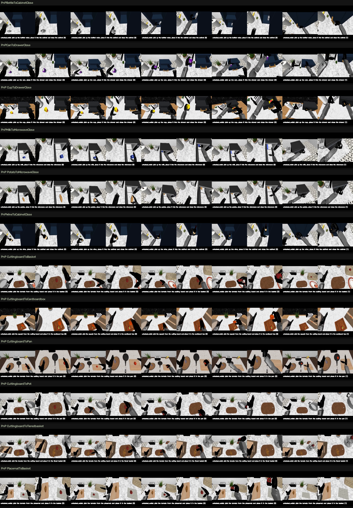
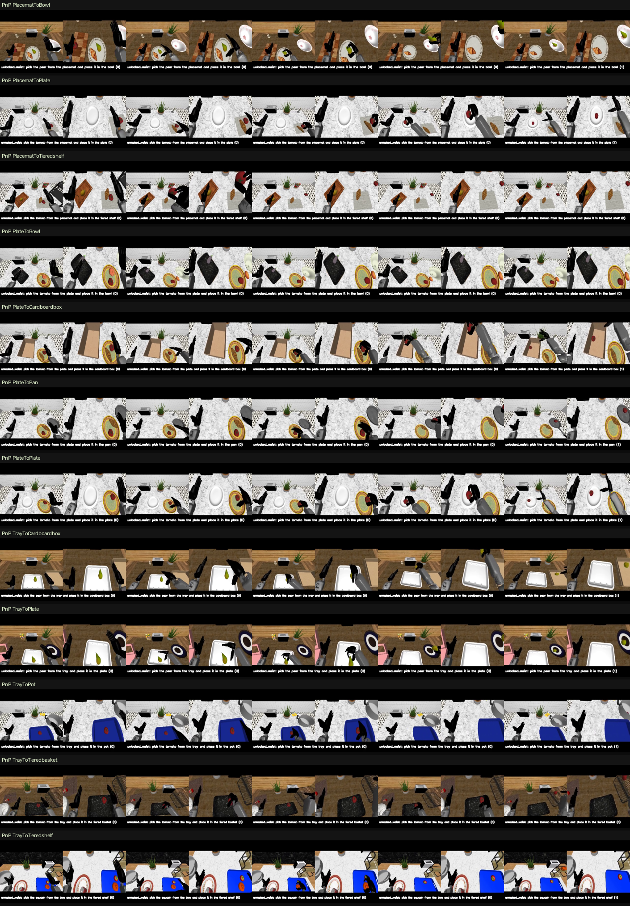
</details>

## 4. VLM probe — robot-VQA 적응이 무엇을 바꾸나 (Qwen3-VL vs RLDX-1-VLM)

기술보고서 Table 2b는 "순정 Qwen3-VL(57.5%) vs robot-VQA 적응 RLDX-1-VLM(60.9%)"을 **action 학습까지 끝낸 downstream 성공률**로 보여준다 — 1×4090으로 재현 불가(from-scratch 60K step). 대신 **두 VLM이 모두 공개**라는 점을 이용해, 같은 로봇 프레임(내 실측 롤아웃에서 추출)에 그들 VQA 데이터의 3축과 같은 질문 — ① 공간관계 ② 다음 subtask ③ 저수준 motion ④ 인스턴스 grounding — 을 던져 **답이 어떻게 달라졌는지**를 직접 본다.

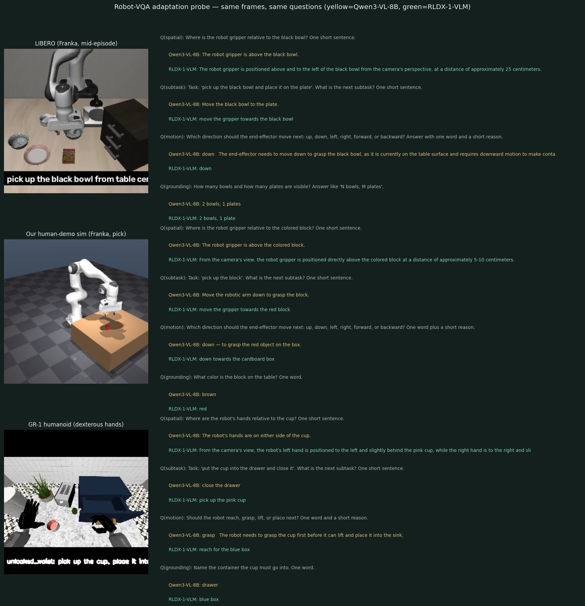

**관찰 (12문항, 정직하게 승패 혼재):**
- **RLDX-1-VLM의 적응 흔적이 뚜렷하다**: 공간 답에 **거리 수치**가 붙고("~25cm", "5–10cm"), subtask 답이 **저수준 imperative**("move the gripper towards the black bowl")로 나온다 — 그들 VQA 구축 3축(EE↔물체 공간관계 / 중간 subtask / 저수준 action 정렬)의 스타일 그대로. 색 grounding에서 순정이 틀린 것을 맞췄다(**red ✓ vs brown ✗**).
- **순정 Qwen3-VL이 나은 지점도 있다**: subtask를 task 수준으로 요약("Move the black bowl to the plate"), GR-1 장면에서 canonical 명칭("drawer")을 답한 반면 RLDX-VLM은 시각적 서술("blue box")로 답했다. motion 질문에 이유 설명도 더 풍부하다.
- **해석**: robot-VQA 적응은 "만능 향상"이 아니라 **action 디코더가 소비하기 좋은 형태로 표현을 돌려놓는 것** — 거리 수치화, imperative 단답, EE 중심 서술. Table 2b의 +3.4%p는 이 스타일 전환의 downstream 얼굴로 읽는 게 정확하다.
- 프로토콜: greedy decoding, max 60 tokens, 동일 프롬프트·프레임. 원본 답변 전체는 `robotics-lab/outputs/vlm_probe/vlm_probe.json`.

## 5. RoboCasa Kitchen 실측 — 모바일 매니퓰레이터 24태스크

세 번째 시뮬 벤치. LIBERO(고정 팔)·GR-1(휴머노이드)과 달리 여기는 **모바일 베이스가 달린 PandaOmron이 실제 스케일 주방**에서 움직인다 — 베이스 재배치까지 액션에 포함되는 24태스크(여닫기·PnP·가전 조작·커피). `RLDX-1-FT-ROBOCASA` 체크포인트, upstream `eval_robocasa.sh`의 단일-GPU 축소판(태스크당 3 에피소드, 720 step, chunk 16, GENERAL_EMBODIMENT), 총 72 에피소드.

| 카테고리 | **내 실측 (n=3/task)** | 비고 |
|---|---|---|
| Open — 여닫기 (3) | **100% (9/9)** | 문·서랍·양문 전부 성공 |
| Close — 닫기 (3) | 88.9% (8/9) | |
| Turn — 수전·가전 조작 (7) | 71.4% (15/21) | TurnOnStove 0/3이 깎아먹음 |
| Coffee — 커피 3단계 (3) | 66.7% (6/9) | |
| PnP — 옮겨놓기 (8) | **41.7% (10/24)** | 약축 — 3개 태스크 0/3 |
| **전체 (24태스크)** | **66.7% (48/72)** | **주장(자체평가) 70.6** |

**읽는 법:**
- **주장 70.6이 재현 범위 안**: 내 66.7은 n=72 표본(SE≈5.5%p)에서 주장과 통계적으로 구분 불가. LIBERO(97.0 vs 97.8)·GR-1(56.9 vs 58.7)에 이어 세 벤치 연속으로 "그들 수치가 내 셋업에서 나온다".
- **강약 프로파일이 선명하다**: articulated 여닫기(Open+Close) 17/18=94.4% vs **PnP 41.7%**. 문 열기는 핸들이라는 고정 어포던스에 붙으면 끝이지만, PnP는 "베이스 재배치 → 파지 → 이동 → 배치" 전 단계가 성공해야 한다 — 모바일 매니퓰레이션의 조합 난이도가 그대로 성적표에 찍힌다.
- **0/3 태스크 3개**: TurnOnStove, PnPStoveToCounter, PnPCounterToCab — 아래 그리드에 실패 롤아웃 원본이 그대로 걸려 있다(캡션 빨강).
- 환경 실록 2건: ① 에셋 다운로더의 `-y` 플래그가 가짜다 — 플래그를 받고도 `input()`을 호출해 비대화 셸에서 EOFError로 죽는다(`echo y |` 파이프로 우회) ② 의존성 설치 중 gymnasium이 1.x로 올라가면 wrapper 속성 포워딩이 깨져 env가 `robot_uid`를 못 찾는다 — **0.29.1 고정** 필수.
- 결과 원본: `robotics-lab/outputs/rldx_robocasa_n3.json`(태스크별 전체), 영상 24개 저장.

**시연 — 전 24태스크 영상** (기록 영상은 카메라 6뷰 나란히, 모델 입력은 그중 left/right/wrist 3뷰; 캡션 n/3 = 해당 태스크 성적):

<div style="display:grid;grid-template-columns:repeat(auto-fill,minmax(300px,1fr));gap:10px">
<figure style="margin:0"><video controls muted loop playsinline preload="none" style="width:100%;border-radius:6px" src="_static/rldx/robocasa/TurnSinkSpout-success.mp4"></video><figcaption style="font-size:0.72rem;line-height:1.25">TurnSinkSpout <b style="color:#7fd4b8">2/3</b></figcaption></figure>
<figure style="margin:0"><video controls muted loop playsinline preload="none" style="width:100%;border-radius:6px" src="_static/rldx/robocasa/TurnOnStove-failure.mp4"></video><figcaption style="font-size:0.72rem;line-height:1.25">TurnOnStove <b style="color:#e07a5f">0/3</b> (실패 원본)</figcaption></figure>
<figure style="margin:0"><video controls muted loop playsinline preload="none" style="width:100%;border-radius:6px" src="_static/rldx/robocasa/TurnOnSinkFaucet-success.mp4"></video><figcaption style="font-size:0.72rem;line-height:1.25">TurnOnSinkFaucet <b style="color:#7fd4b8">3/3</b></figcaption></figure>
<figure style="margin:0"><video controls muted loop playsinline preload="none" style="width:100%;border-radius:6px" src="_static/rldx/robocasa/TurnOnMicrowave-success.mp4"></video><figcaption style="font-size:0.72rem;line-height:1.25">TurnOnMicrowave <b style="color:#7fd4b8">3/3</b></figcaption></figure>
<figure style="margin:0"><video controls muted loop playsinline preload="none" style="width:100%;border-radius:6px" src="_static/rldx/robocasa/TurnOffStove-success.mp4"></video><figcaption style="font-size:0.72rem;line-height:1.25">TurnOffStove <b style="color:#7fd4b8">1/3</b></figcaption></figure>
<figure style="margin:0"><video controls muted loop playsinline preload="none" style="width:100%;border-radius:6px" src="_static/rldx/robocasa/TurnOffSinkFaucet-success.mp4"></video><figcaption style="font-size:0.72rem;line-height:1.25">TurnOffSinkFaucet <b style="color:#7fd4b8">3/3</b></figcaption></figure>
<figure style="margin:0"><video controls muted loop playsinline preload="none" style="width:100%;border-radius:6px" src="_static/rldx/robocasa/TurnOffMicrowave-success.mp4"></video><figcaption style="font-size:0.72rem;line-height:1.25">TurnOffMicrowave <b style="color:#7fd4b8">3/3</b></figcaption></figure>
<figure style="margin:0"><video controls muted loop playsinline preload="none" style="width:100%;border-radius:6px" src="_static/rldx/robocasa/PnPStoveToCounter-failure.mp4"></video><figcaption style="font-size:0.72rem;line-height:1.25">PnPStoveToCounter <b style="color:#e07a5f">0/3</b> (실패 원본)</figcaption></figure>
<figure style="margin:0"><video controls muted loop playsinline preload="none" style="width:100%;border-radius:6px" src="_static/rldx/robocasa/PnPSinkToCounter-success.mp4"></video><figcaption style="font-size:0.72rem;line-height:1.25">PnPSinkToCounter <b style="color:#7fd4b8">2/3</b></figcaption></figure>
<figure style="margin:0"><video controls muted loop playsinline preload="none" style="width:100%;border-radius:6px" src="_static/rldx/robocasa/PnPMicrowaveToCounter-success.mp4"></video><figcaption style="font-size:0.72rem;line-height:1.25">PnPMicrowaveToCounter <b style="color:#7fd4b8">1/3</b></figcaption></figure>
<figure style="margin:0"><video controls muted loop playsinline preload="none" style="width:100%;border-radius:6px" src="_static/rldx/robocasa/PnPCounterToStove-success.mp4"></video><figcaption style="font-size:0.72rem;line-height:1.25">PnPCounterToStove <b style="color:#7fd4b8">1/3</b></figcaption></figure>
<figure style="margin:0"><video controls muted loop playsinline preload="none" style="width:100%;border-radius:6px" src="_static/rldx/robocasa/PnPCounterToSink-success.mp4"></video><figcaption style="font-size:0.72rem;line-height:1.25">PnPCounterToSink <b style="color:#7fd4b8">3/3</b></figcaption></figure>
<figure style="margin:0"><video controls muted loop playsinline preload="none" style="width:100%;border-radius:6px" src="_static/rldx/robocasa/PnPCounterToMicrowave-success.mp4"></video><figcaption style="font-size:0.72rem;line-height:1.25">PnPCounterToMicrowave <b style="color:#7fd4b8">2/3</b></figcaption></figure>
<figure style="margin:0"><video controls muted loop playsinline preload="none" style="width:100%;border-radius:6px" src="_static/rldx/robocasa/PnPCounterToCab-failure.mp4"></video><figcaption style="font-size:0.72rem;line-height:1.25">PnPCounterToCab <b style="color:#e07a5f">0/3</b> (실패 원본)</figcaption></figure>
<figure style="margin:0"><video controls muted loop playsinline preload="none" style="width:100%;border-radius:6px" src="_static/rldx/robocasa/PnPCabToCounter-success.mp4"></video><figcaption style="font-size:0.72rem;line-height:1.25">PnPCabToCounter <b style="color:#7fd4b8">1/3</b></figcaption></figure>
<figure style="margin:0"><video controls muted loop playsinline preload="none" style="width:100%;border-radius:6px" src="_static/rldx/robocasa/OpenSingleDoor-success.mp4"></video><figcaption style="font-size:0.72rem;line-height:1.25">OpenSingleDoor <b style="color:#7fd4b8">3/3</b></figcaption></figure>
<figure style="margin:0"><video controls muted loop playsinline preload="none" style="width:100%;border-radius:6px" src="_static/rldx/robocasa/OpenDrawer-success.mp4"></video><figcaption style="font-size:0.72rem;line-height:1.25">OpenDrawer <b style="color:#7fd4b8">3/3</b></figcaption></figure>
<figure style="margin:0"><video controls muted loop playsinline preload="none" style="width:100%;border-radius:6px" src="_static/rldx/robocasa/OpenDoubleDoor-success.mp4"></video><figcaption style="font-size:0.72rem;line-height:1.25">OpenDoubleDoor <b style="color:#7fd4b8">3/3</b></figcaption></figure>
<figure style="margin:0"><video controls muted loop playsinline preload="none" style="width:100%;border-radius:6px" src="_static/rldx/robocasa/CoffeeSetupMug-success.mp4"></video><figcaption style="font-size:0.72rem;line-height:1.25">CoffeeSetupMug <b style="color:#7fd4b8">1/3</b></figcaption></figure>
<figure style="margin:0"><video controls muted loop playsinline preload="none" style="width:100%;border-radius:6px" src="_static/rldx/robocasa/CoffeeServeMug-success.mp4"></video><figcaption style="font-size:0.72rem;line-height:1.25">CoffeeServeMug <b style="color:#7fd4b8">2/3</b></figcaption></figure>
<figure style="margin:0"><video controls muted loop playsinline preload="none" style="width:100%;border-radius:6px" src="_static/rldx/robocasa/CoffeePressButton-success.mp4"></video><figcaption style="font-size:0.72rem;line-height:1.25">CoffeePressButton <b style="color:#7fd4b8">3/3</b></figcaption></figure>
<figure style="margin:0"><video controls muted loop playsinline preload="none" style="width:100%;border-radius:6px" src="_static/rldx/robocasa/CloseSingleDoor-success.mp4"></video><figcaption style="font-size:0.72rem;line-height:1.25">CloseSingleDoor <b style="color:#7fd4b8">3/3</b></figcaption></figure>
<figure style="margin:0"><video controls muted loop playsinline preload="none" style="width:100%;border-radius:6px" src="_static/rldx/robocasa/CloseDrawer-success.mp4"></video><figcaption style="font-size:0.72rem;line-height:1.25">CloseDrawer <b style="color:#7fd4b8">3/3</b></figcaption></figure>
<figure style="margin:0"><video controls muted loop playsinline preload="none" style="width:100%;border-radius:6px" src="_static/rldx/robocasa/CloseDoubleDoor-success.mp4"></video><figcaption style="font-size:0.72rem;line-height:1.25">CloseDoubleDoor <b style="color:#7fd4b8">2/3</b></figcaption></figure>
</div>

<details><summary><b>24태스크 필름스트립 사진 (클릭)</b></summary>
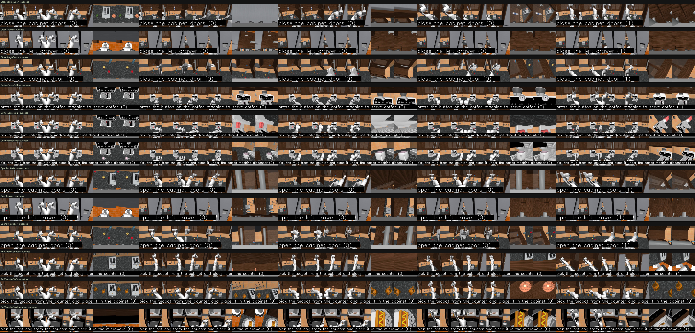
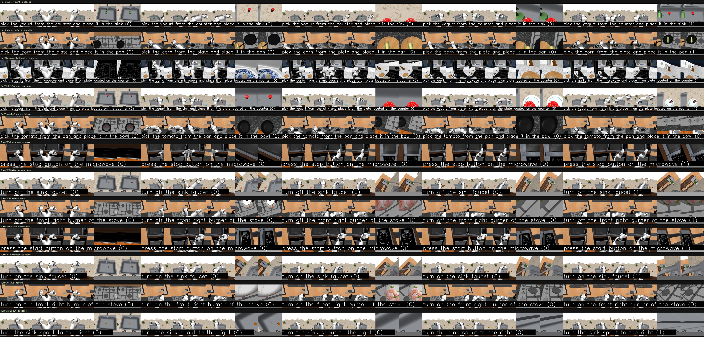
</details>

## 6. SIMPLER 실측 — real-to-sim 평가 + 액션 공간 포렌식

네 번째 벤치이자 이 스프린트에서 가장 값진 구간. SIMPLER는 **실로봇 벤치를 시뮬로 복제해 실기 성적을 예측**하는 real-to-sim 평가다 — Google robot(RT-1의 그 로봇, fractal 데이터)과 WidowX(Bridge 데이터) 두 셋업. 다른 벤치와 달리 여기는 **릴리스가 그대로는 SIMPLER를 아예 못 돌리는 상태**였다: 서버 플래그부터 액션 공간의 부호까지 여섯 겹의 수리를 직접 하고 나서야 아래 숫자가 나왔다(실록은 이 절 끝).

`RLDX-1-FT-SIMPLER-GOOGLE`/`-WIDOWX` 체크포인트, upstream `eval_simpler.sh`의 태스크 목록 그대로, 에피소드만 200→**10/task**로 축소(단일 GPU), max 300 step.

| Google robot VM | **내 실측 (n=10/task)** | | WidowX Bridge | **내 실측 (n=10/task)** |
|---|---|---|---|---|
| pick coke can | **10/10** | | spoon on towel | 8/10 |
| move near | **10/10** | | carrot on plate | 9/10 |
| open drawer | 3/10 | | put eggplant in basket | 3/10 |
| close drawer | 6/10 | | stack cube | 6/10 |
| **합계** | **72.5% (29/40)** — 주장 81.5 | | **합계** | **65.0% (26/40)** — 주장 71.9 |

**읽는 법:**
- **프로파일은 주장과 같은 모양**: 탁상 PnP는 천장 근처(pick/move 20/20, spoon/carrot 17/20), **서랍 여닫이(9/20)와 eggplant-in-basket(3/10)이 손실 전부**를 든다. SIMPLER 논문들에서도 drawer 계열이 최난 축 — 실패 위치가 재현된다.
- **절대값은 주장보다 낮다**: Google −9.0%p, WidowX −6.9%p. n=40 표본의 SE가 7.1/7.5%p라 WidowX는 1SE 안, Google은 1.3SE. 통계 잡음만으로 단정하지 않는다 — 주장은 그들 내부 하네스의 n=200 자체평가고, **내 수치는 내가 여섯 군데를 수리한 파이프라인 위의 값**이라 잔여 액션 매핑 차이를 배제할 수 없다(수리 없이는 0%였으므로 이 비대칭은 구조적이다).
- 결과 원본: `robotics-lab/outputs/rldx_simpler_n10.json`, 영상 80편 저장(아래 대표 8편+실패 4편 게재).

**시연 — Google robot 4태스크** (SIMPLER 시뮬 뷰 = 모델 입력 그대로; 캡션 n/10 = 태스크 성적):

<div style="display:grid;grid-template-columns:repeat(auto-fill,minmax(240px,1fr));gap:10px">
<figure style="margin:0"><video controls muted loop playsinline preload="none" style="width:100%;border-radius:6px" src="_static/rldx/simpler_google/google_robot_pick_coke_can-success.mp4"></video><figcaption style="font-size:0.72rem;line-height:1.25">pick coke can <b style="color:#7fd4b8">10/10</b></figcaption></figure>
<figure style="margin:0"><video controls muted loop playsinline preload="none" style="width:100%;border-radius:6px" src="_static/rldx/simpler_google/google_robot_move_near-success.mp4"></video><figcaption style="font-size:0.72rem;line-height:1.25">move near <b style="color:#7fd4b8">10/10</b></figcaption></figure>
<figure style="margin:0"><video controls muted loop playsinline preload="none" style="width:100%;border-radius:6px" src="_static/rldx/simpler_google/google_robot_open_drawer-success.mp4"></video><figcaption style="font-size:0.72rem;line-height:1.25">open drawer <b style="color:#e0b45f">3/10</b></figcaption></figure>
<figure style="margin:0"><video controls muted loop playsinline preload="none" style="width:100%;border-radius:6px" src="_static/rldx/simpler_google/google_robot_close_drawer-success.mp4"></video><figcaption style="font-size:0.72rem;line-height:1.25">close drawer <b style="color:#7fd4b8">6/10</b></figcaption></figure>
</div>

<details><summary><b>Google robot — 필름스트립 사진 (클릭)</b></summary>
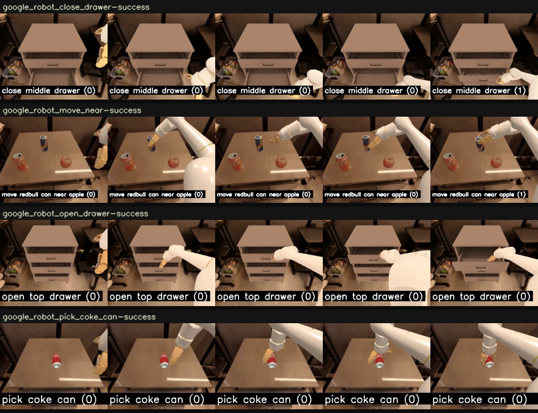</details>

**시연 — WidowX 4태스크:**

<div style="display:grid;grid-template-columns:repeat(auto-fill,minmax(240px,1fr));gap:10px">
<figure style="margin:0"><video controls muted loop playsinline preload="none" style="width:100%;border-radius:6px" src="_static/rldx/simpler_widowx/widowx_spoon_on_towel-success.mp4"></video><figcaption style="font-size:0.72rem;line-height:1.25">spoon on towel <b style="color:#7fd4b8">8/10</b></figcaption></figure>
<figure style="margin:0"><video controls muted loop playsinline preload="none" style="width:100%;border-radius:6px" src="_static/rldx/simpler_widowx/widowx_carrot_on_plate-success.mp4"></video><figcaption style="font-size:0.72rem;line-height:1.25">carrot on plate <b style="color:#7fd4b8">9/10</b></figcaption></figure>
<figure style="margin:0"><video controls muted loop playsinline preload="none" style="width:100%;border-radius:6px" src="_static/rldx/simpler_widowx/widowx_put_eggplant_in_basket-success.mp4"></video><figcaption style="font-size:0.72rem;line-height:1.25">put eggplant in basket <b style="color:#e0b45f">3/10</b></figcaption></figure>
<figure style="margin:0"><video controls muted loop playsinline preload="none" style="width:100%;border-radius:6px" src="_static/rldx/simpler_widowx/widowx_stack_cube-success.mp4"></video><figcaption style="font-size:0.72rem;line-height:1.25">stack cube <b style="color:#7fd4b8">6/10</b></figcaption></figure>
</div>

<details><summary><b>WidowX — 필름스트립 사진 (클릭)</b></summary>
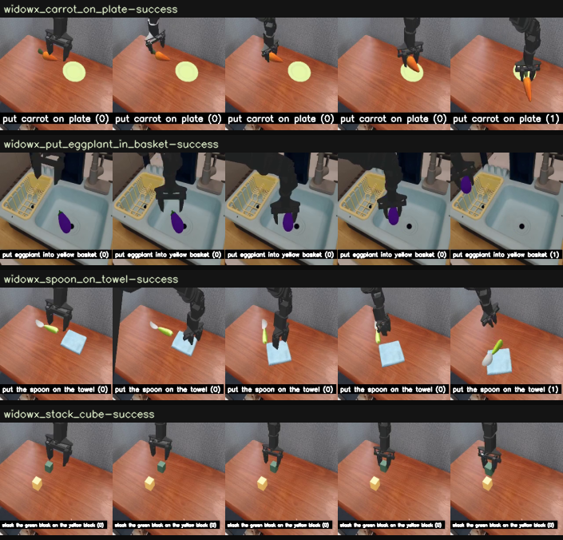</details>

**실패 사례 (정직 표본)** — 손실 축 4태스크의 실패 롤아웃 원본:

<div style="display:grid;grid-template-columns:repeat(auto-fill,minmax(240px,1fr));gap:10px">
<figure style="margin:0"><video controls muted loop playsinline preload="none" style="width:100%;border-radius:6px" src="_static/rldx/simpler_google/failures/google_robot_open_drawer-failure.mp4"></video><figcaption style="font-size:0.72rem;line-height:1.25">google · open drawer 실패</figcaption></figure>
<figure style="margin:0"><video controls muted loop playsinline preload="none" style="width:100%;border-radius:6px" src="_static/rldx/simpler_google/failures/google_robot_close_drawer-failure.mp4"></video><figcaption style="font-size:0.72rem;line-height:1.25">google · close drawer 실패</figcaption></figure>
<figure style="margin:0"><video controls muted loop playsinline preload="none" style="width:100%;border-radius:6px" src="_static/rldx/simpler_widowx/failures/widowx_put_eggplant_in_basket-failure.mp4"></video><figcaption style="font-size:0.72rem;line-height:1.25">widowx · put eggplant in basket 실패</figcaption></figure>
<figure style="margin:0"><video controls muted loop playsinline preload="none" style="width:100%;border-radius:6px" src="_static/rldx/simpler_widowx/failures/widowx_stack_cube-failure.mp4"></video><figcaption style="font-size:0.72rem;line-height:1.25">widowx · stack cube 실패</figcaption></figure>
</div>

### SIMPLER 실록 — 0%에서 72.5%까지: 릴리스 버그 6종 + 체크포인트 버그 1종

이 벤치의 진짜 산출물. 위 숫자는 "스크립트 실행" 결과가 아니라, **공개 릴리스에서 SIMPLER 경로가 한 번도 검증되지 않았음을 발견하고 여섯 겹을 직접 수리한** 결과다. 순서대로(각 수리는 `robotics-lab/wsl/rldx_simpler_*_patch.py`로 재현 가능):

1. **서버 플래그 부재**: 그들 eval 스크립트가 넘기는 `--num-inference-timesteps`를 릴리스 서버가 인식하지 못한다 — 스크립트와 서버가 서로 다른 버전이라는 첫 신호.
2. **디스패치 미라우팅**: `rollout_policy.py`가 embodiment를 `OXE_FRACTAL`/`OXE_BRIDGE_ORIG`로 반환해 놓고 **분기에서 그 값을 라우팅하지 않는다** — SimplerEnv 케이스가 통째로 죽은 코드.
3. **래퍼 스키마 불일치**: SimplerEnv 래퍼가 보내는 관측/액션 키가 체크포인트가 요구하는 스키마와 다르다. 정답의 출처는 문서가 아니라 **체크포인트 안의 `statistics.json`**: fractal state = eef pos(3)+quat(4, wxyz→xyzw roll)+gripper(1), bridge state rot은 rpy(3) — 이 그룹 키로 래퍼를 재작성.
4. **`is_libero` 오판**: 서버가 `video.image` 키만 보고 LIBERO로 오라우팅 — fractal의 비디오 키도 `image`다. LIBERO 래퍼만 보내는 `state.x` 단독 판정으로 수정.
5. **WSL Vulkan 우회**: SAPIEN 렌더러가 요구하는 `VK_KHR_external_semaphore_fd`를 WSL엔 없는 네이티브 ICD 대신 소프트웨어 Vulkan(lavapipe)이 제공하지 않는다 → **`libsapien.so`를 같은 길이의 지원 확장명으로 바이너리 패치**. 이후 클라이언트만 세그폴트 → torch 등 200+ 라이브러리 로드 뒤 드라이버 dlopen 시 로더/static-TLS 고갈로 진단, **`LD_PRELOAD`로 드라이버 선적재**해 해결(~0.12s/step).
6. **회전 변환 부재 — 영상 포렌식 1**: 파이프라인이 다 돌아도 pick_coke_can 0/10. 롤아웃 영상을 컨택트시트로 뜯어보니 **접근까지는 정확한데 파지 직전 표류**. 공식 SimplerEnv 정책(RT-1/Octo)은 전부 rpy→**axis-angle** 변환 후 env.step — 모델 회전 델타가 ±1.57rad까지 나와 소각 근사가 성립하지 않는다. 변환 추가.
7. **그리퍼 부호 반전 — 액션 로깅 포렌식 2**: 그래도 0/5. 실행 액션 벡터를 80스텝 로깅하니 **1스텝부터 끝까지 `gripper_close`≈+1.0** — 접근 내내 그리퍼를 닫고 다닌다. RLDX fractal 전처리의 `gripper_close` 채널이 **이름과 반대 부호**라는 뜻. `1−gc` 반전을 제거하자 **0/5 → 3/3**, WidowX도 같은 수리로 0/3 → 3/3.
8. **(보너스) 체크포인트 버그**: `FT-SIMPLER-WIDOWX`의 `processor_config.json`이 `image_max_area: null`로 배포됨(GOOGLE은 65536) — 첫 요청에서 `NoneType / int` TypeError. 256×256 입력엔 65536이 항등이라 GOOGLE 값으로 정합.

교훈 두 줄: ① 공개 릴리스의 "지원 벤치 목록"과 "실제 검증된 경로"는 다르다 — SIMPLER는 목록엔 있었지만 경로는 한 번도 끝까지 돌지 않은 상태였다. ② 액션 공간 버그는 예외를 던지지 않는다 — **영상을 보고, 액션을 로깅**해야 잡힌다(회전 표류·그리퍼 상수는 어느 로그에도 "에러"로 찍히지 않았다).

## 7. 재현 실록 — 환경·프로토콜에서 확인한 것

(RoboCasa 실록 2건은 §5 안에, SIMPLER 실록 8건은 §6 끝의 전용 절에 있다 — 여기는 LIBERO·π0.5·공통 인프라 편.)

- **공개 상태는 진짜다**: 코드·가중치·문서(architecture/training/evaluation.md)까지 전부 실재. `RLDXPolicy` 5줄로 로드된다.
- **flash-attn 벽**: 표준 설치 경로가 CUDA toolkit(nvcc) 전제의 소스 빌드. nvcc 없는 WSL에서는 커뮤니티 프리빌트 휠(`2.7.4.post1+cu126torch2.7`)로 우회해야 했다.
- **`setup_libero.sh`는 그대로는 안 돈다**: ① cmake 4.x가 구식 egl-probe를 거부(`CMAKE_POLICY_VERSION_MINIMUM=3.5` 필요) ② 스크립트가 고정한 transformers 4.51.3에는 `masking_utils`가 없어 자기 자신(rldx 패키지)을 import 못 한다(→4.57.0으로 상향) ③ diffusers/accelerate가 클라이언트 venv에 누락 ④ 무핀 mujoco가 3.11로 풀려 robosuite 1.4의 `MjData.qM` 접근이 깨진다(→내 검증 조합 mujoco 2.3.2로 고정). — 대기업 공개 레포도 환경 재현은 이만큼 깨지기 쉽다는 표본.
- **평가 프로토콜 차이 발견**: 그들의 LIBERO 래퍼는 에피소드마다 **랜덤 초기 배치**로 리셋한다(공식 LIBERO/OpenVLA 프로토콜은 벤치마크 고정 init state). A/B 공정성을 위해 고정-init 옵션을 패치로 추가했다(기본 동작 불변, `RLDX_FIXED_INIT=1`, `robotics-lab/wsl/rldx_fixed_init_patch.py`).
- **π0.5(lerobot) 통합 전투 6건**: ① lerobot pi05는 **패치판 transformers 포크**(`fix/lerobot_openpi` 브랜치) 필수 — pyproject의 `pi` extra가 git 직링크라 **PyPI 휠 메타데이터에서 증발**해 스스로 찾아야 했다 ② PaliGemma 토크나이저가 **gated repo**(라이선스 동의+토큰) ③ LIBERO init-state 파일을 신형 torch가 `weights_only=True`로 거부 ④ lerobot eval은 벡터 env 전제라 **관측에 배치 차원** 필요 ⑤ **numpy 2.x가 mujoco 2.3.2 텍스처를 조용히 손상**(초록 노이즈 팔 — 렌더 확인 안 했으면 오염된 입력으로 불공정 평가할 뻔) ⑥ `pi05_libero_base`는 커뮤니티 zero-success 리포트(#2533)가 있는 체크포인트 — 내 하네스에서도 1/4 수준이었고, HF 6k-step 재현판(`pi05-libero`)으로 바꾸자 스모크 4/4·본런 96.2%(신형 lerobot 학습 플래그 3개를 config에서 제거해 0.4.2 로드).
- **torchcodec ↔ FFmpeg 8 비호환**(§4에서 만남): torchcodec 0.4는 Ubuntu 26.04의 libavutil 60을 못 연다 — RLDX 로더가 1급 지원하는 opencv 백엔드로 대체.

## 8. Human 시연 → RLDX-1 학습데이터 (LeRobot v2.1)

[Human Pose 트랙](human_pose.md) §10–11이 "사람 손을 로봇 손으로"였다면, 이 절은 그 시연을 **RLDX-1이 먹는 포맷**으로 직렬화한다. RLDX-1 기술보고서는 "사람 손 리타게팅으로 시간당 200+ 시연 수집"을 데이터 엔진의 축으로 쓰고, 학습 입력은 **LeRobot v2.1**이다 — 정확히 이 파이프라인의 산업 버전.

```text
human demo (MANO 손 intent: aperture·yaw·target)          [human_pose §10 리타게팅]
   └→ MuJoCo Franka 실행 + 기록: obs(256²RGB), proprio(7q+grip), action(7=Δee+grip)
        └→ 품질 필터: 성공/관절한계/jerk/IK  (16개 → 12개 통과)
             └→ LeRobot v2.1 직렬화: data/*.parquet + videos/*.mp4(h264)
                  + meta/{info,episodes,tasks,modality,stats}.json
                       └→ 검증: RLDX-1 자체 로더(LeRobotEpisodeLoader)가 로드  ← 여기가 증명
```

### 스키마 — RLDX가 요구하는 그대로

RLDX 로더는 LeRobot 표준 meta에 **`modality.json`**(자체 확장)을 더해, `observation.state`/`action` 배열 컬럼을 의미 단위로 슬라이스한다. 우리 매핑:

| modality | key | 슬라이스 | 의미 |
|---|---|---|---|
| state | `joint_pos` | [0:7] | Franka 관절각 7 |
| state | `gripper` | [7:8] | 그리퍼 개도(0–1) |
| action | `eef_pos_delta` | [0:3] | Δxyz (EE) |
| action | `eef_rot_delta` | [3:6] | Δ회전 (yaw 축 사용) |
| action | `gripper_close` | [6:7] | 그리퍼 명령 |
| video | `front_view` | — | `observation.images.front_view` mp4 |
| annotation | `human.action.task_description` | — | `task_index` → tasks.jsonl 문장 |

`stats.json`(정규화용 q01/q99 포함)은 **rldx 저장소의 `rldx/data/stats.py`로 생성** — 학습 시 액션 정규화까지 그들 코드 경로와 동일.

### 품질 리포트 (수치는 전량 검증값)

| 검사 | 결과 |
|---|---|
| 시연 수 | 16 생성 → **12 export** (성공률 필터; oversized-grasp 4 드롭) |
| 관절 한계 여유 (min over traj) | **최소 28.0°** — 전 에피소드 한계 내 |
| EE jerk (mean \|d³x/dt³\|) | **최대 0.0008** — 부드러운 실행 |
| IK residual (max) | **최대 0.098 mm** |
| 프레임/태스크 | 1,212 frames · 3 tasks (색상별 pick 지시) |

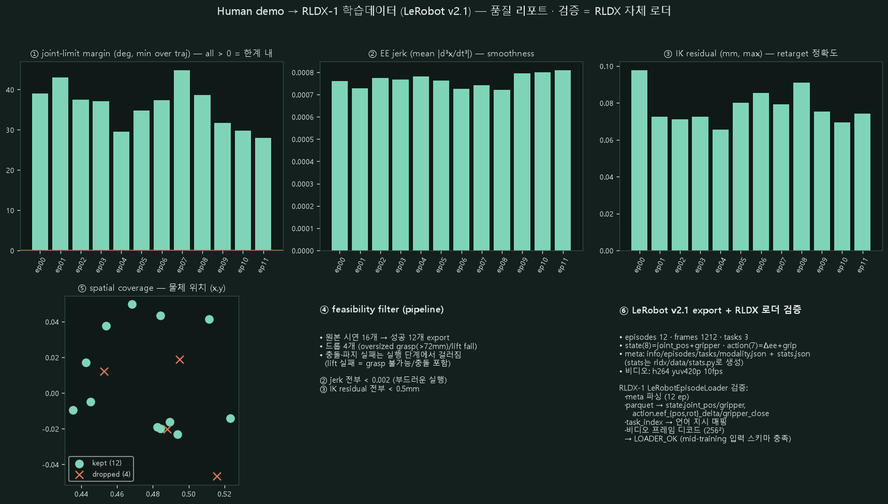

**데이터셋 에피소드 시연** (직렬화된 mp4 원본 그대로):

<div style="display:grid;grid-template-columns:repeat(auto-fill,minmax(200px,1fr));gap:10px;margin-top:10px">
<figure style="margin:0"><video controls muted loop playsinline preload="none" style="width:100%;border-radius:6px" src="_static/rldx/datapipe/ep000.mp4"></video><figcaption style="font-size:0.75rem">데이터셋 ep000 — "pick up the red block"</figcaption></figure>
<figure style="margin:0"><video controls muted loop playsinline preload="none" style="width:100%;border-radius:6px" src="_static/rldx/datapipe/ep001.mp4"></video><figcaption style="font-size:0.75rem">데이터셋 ep001 — "pick up the green block"</figcaption></figure>
<figure style="margin:0"><video controls muted loop playsinline preload="none" style="width:100%;border-radius:6px" src="_static/rldx/datapipe/ep002.mp4"></video><figcaption style="font-size:0.75rem">데이터셋 ep002 — "pick up the blue block"</figcaption></figure>
</div>

### 검증 — "그 회사 로더가 내 데이터를 읽는다"

포맷 문서 준수가 아니라 **RLDX-1 저장소의 실제 학습 로더**(`rldx/data/dataset/lerobot_episode_loader.py`)를 검증기로 썼다:

```text
[validate] loader parsed meta: 12 episodes
[validate] parquet via loader: state.joint_pos/gripper, action.eef_{pos,rot}_delta/gripper_close
[validate] language[0] = 'pick up the red block'      (task_index → 문장 매핑)
[validate] video via loader: front_view (2, 256, 256, 3) uint8
LOADER_OK — RLDX-1 mid-training input schema satisfied.
```

코드: `robotics-lab/src/vla_lerobot_export.py`(직렬화+검증), `vla_lerobot_quality.py`(리포트).

**정직 캐비엇**: ① 12개 시뮬 시연 = 데이터 엔진의 **미니어처 증명**이지 스케일이 아니다(그들은 시간당 200+). ② 실 egocentric 손궤적([HOT3D, human_pose §11.4–11.7](human_pose.md))의 동일 직렬화는 다음 단계 — 여기서는 시뮬 실행이 검증된 시연만 담았다. ③ 스케일업 레퍼런스: RLDX-1은 video 생성모델 증폭(합성 5×)으로 GR-1 벤치 +9.2%p를 보고 — 우리 확장 D(실비디오)와 같은 방향. ④ RLDX-1 가중치는 비상업 라이선스이며 본 데이터셋은 학습·연구 시연용.

## 9. DexBench — 산업 dexterity 태스크 분류 (18태스크 × 55케이스)

RLWRLD가 NVIDIA와 공동으로 발표한 산업 dexterity 벤치 표준(Isaac Lab-Arena 통합 예정). 현재는 **태스크 정의/분류 체계**이며(코드·데이터셋 공개 아님) 산업 현장 관찰(assembly·sorting·packaging)에서 도출됐다. 분류 2축:

- **OSC (Object State Complexity)** — *왜* 어려운가: `C_geom` / `C_force` / `C_contact` / `C_obs` / `C_deform` / `C_dyn`
- **Dexterity Regimes** — *무엇이* 필요한가: Grasp Diversity / Spatial Precision / Temporal Precision / Contact Precision / Context Awareness

설계 원칙 4: state-transition 정의(방법 불문) · 상태 기반 판정(궤적 유사도 아님) · 실구매 가능 물체(치수·중량 공개) · **breakdown curve**(성공률이 아니라 어디서 붕괴하는가).

| ID | 태스크 | 케이스 | 예시 |
|---|---|---|---|
| T00 | Special Picking | 4 | environment-exploiting grasp, 접근 제약 회수 |
| T01 | In-Hand Reorientation | 4 | 단일손 pose 조정 |
| T02 | Bimanual Regrasping | 3 | handoff, load-transfer |
| T03 | Precision Insertion | 6 | tight-tolerance assembly, peg-in-hole |
| T04 | Hand Fastening | 3 | 맨손 나사, 토크 제한 조이기 |
| T05 | Constrained-Axis Manipulation | 5 | 고정축 피벗(밸브류) |
| T06 | Control Interface Actuation | 4 | 버튼/스위치/래치 |
| T07 | Force-Regulated Wiping | 2 | 연속 접촉 유지 |
| T08 | Flowable Material Control | 4 | flow 조절, pouring |
| T09 | Fabric Folding | 2 | 모서리 정렬, bimanual |
| T10 | Cable Winding | 2 | 선형물 라우팅 |
| T11 | Package Handling | 3 | seal cutting, tape 제거, 제품 삽입 |
| T12 | Selective Sorting & Binning | 1 | 시각 판별 → 카테고리별 투입 |
| T13 | Heterogeneous Bin Packing | 2 | 혼합 형상 적재, 공간 효율 |
| T14 | Box Sealing | 1 | 연속 경로 + bimanual 도구 |
| T15 | Precision Arrangement | 3 | visual servoing, 정밀 배치 |
| T16 | Tool-Use | 4 | 도구 조립, 토크 인가 |
| T17 | Moving Object Interaction | 2 | 동적 추적·인터셉트 |

"제네럴 빈피킹" 계열은 **T00(Special Picking) / T12(Sorting & Binning) / T13(Bin Packing)**, 포장·키팅은 T11/T14/T15, peg-in-hole류는 T03. RLDX-1 논문의 실기 태스크와의 연결: T08 Pouring ↔ ALLEX Pot-to-Cup, T17 Moving Object ↔ ALLEX Conveyor PnP.

**내 실습 연결**: Contact Precision 축은 [human_pose](human_pose.md) HM5의 force-closure(ε)·침투 페널티가 쓰는 언어 그대로다. T17의 동적 추적은 [world models 트랙](wm.md)의 존재 이유(모션 예측)와 닿고, T12/T13은 내 bin-pick 파이프라인(zg/GSN/HGGD) 경험과 겹친다. breakdown-curve 철학("어디서 붕괴하는가를 재라")은 이 사이트의 정직 규칙과 같은 정신이다.

**짝지어 읽을 리뷰**: 이런 태스크의 **데이터 공급**(다지손 시연을 로봇 없이 모으기)은 [DexCap 리뷰](reviews/dexcap.md), `C_force`·Contact Precision 축의 **센서-표현 계열**(촉각을 3D 점으로 시각과 융합)은 [3D-ViTac 리뷰](reviews/3d-vitac.md) — 각각 RLDX 데이터 엔진(teleop)과 physical sensing 스트림의 학계 대응물이다.

## 10. 재현 커맨드 + 산출물 맵

```bash
# 환경 (WSL2, uv): flash-attn은 프리빌트 휠로 주입 (nvcc 불필요)
git clone https://github.com/RLWRLD/RLDX-1.git && cd RLDX-1
uv venv --python 3.10
uv pip install "https://github.com/mjun0812/flash-attention-prebuild-wheels/releases/download/v0.0.8/flash_attn-2.7.4.post1+cu126torch2.7-cp310-cp310-linux_x86_64.whl"
uv pip install -e . && uv pip install -e ".[eval]"

# LIBERO env 클라이언트 (셋업 스크립트 4중 수리 — §7)
CMAKE_POLICY_VERSION_MINIMUM=3.5 bash rldx/eval/sim/LIBERO/setup_libero.sh
uv pip install --python rldx/eval/sim/LIBERO/libero_uv/.venv/bin/python \
    transformers==4.57.0 diffusers accelerate mujoco==2.3.2 robosuite==1.4.1

# A/B 실측 (고정 init 패치 + 서버/롤아웃 오케스트레이션)
python3 robotics-lab/wsl/rldx_fixed_init_patch.py ~/rldx/RLDX-1
N_EP=2  bash robotics-lab/wsl/rldx_libero_ab.sh RLWRLD/RLDX-1-FT-LIBERO ab_n2    # OpenVLA 동일조건
N_EP=10 bash robotics-lab/wsl/rldx_libero_ab.sh RLWRLD/RLDX-1-FT-LIBERO ab_n10   # 400ep 재현

# human demo → LeRobot v2.1 + RLDX 로더 검증 (§8)
uv run --no-sync python robotics-lab/src/vla_lerobot_export.py
python robotics-lab/src/vla_lerobot_quality.py
```

| 산출물 | 위치 |
|---|---|
| A/B 태스크별 결과 | `robotics-lab/outputs/rldx_ab_n2.json` · `rldx_ab_n10.json` |
| RoboCasa Kitchen 태스크별 결과 | `robotics-lab/outputs/rldx_robocasa_n3.json` · 러너 `wsl/rldx_robocasa_eval.sh` |
| SIMPLER 태스크별 결과 | `robotics-lab/outputs/rldx_simpler_n10.json` · 러너 `wsl/rldx_simpler_eval.sh`·`rldx_simpler_full.sh` |
| SIMPLER 수리 패치 5종 | `robotics-lab/wsl/rldx_simpler_{dispatch,wrapper,islibero,axangle,gripper}_patch.py` · `rldx_widowx_maxarea_patch.py` |
| 논문 정독 노트(실험 전목록·데이터엔진) | `robotics-lab/notes/rldx_plan.md` |
| 하네스 정렬 패치 / A/B 런처 | `robotics-lab/wsl/rldx_fixed_init_patch.py` · `rldx_libero_ab.sh` |
| LeRobot v2.1 exporter / 품질 리포트 | `robotics-lab/src/vla_lerobot_export.py` · `vla_lerobot_quality.py` |
| 아키텍처 리뷰(수식) | [reviews/rldx1](reviews/rldx1.md) |
