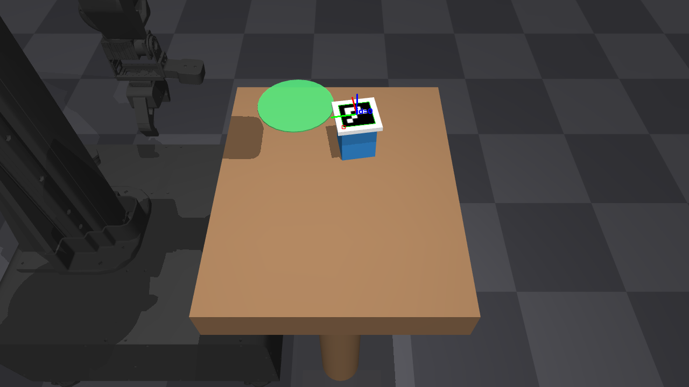
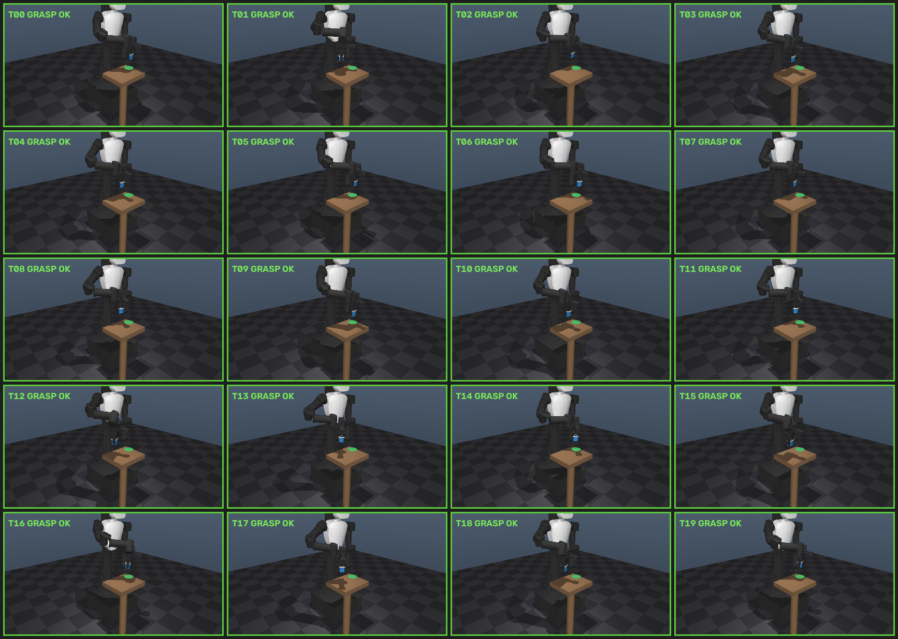
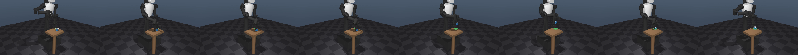
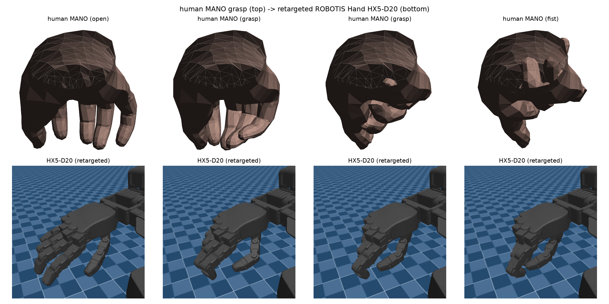
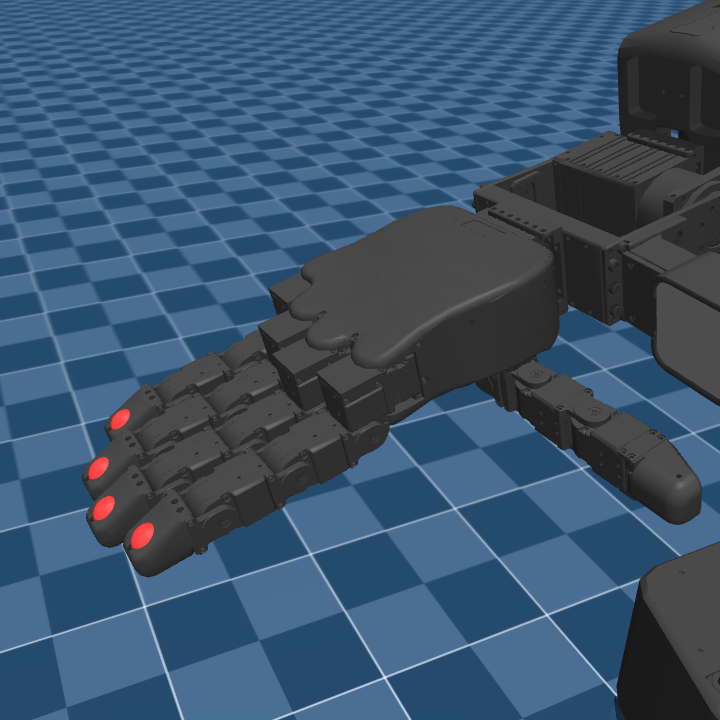
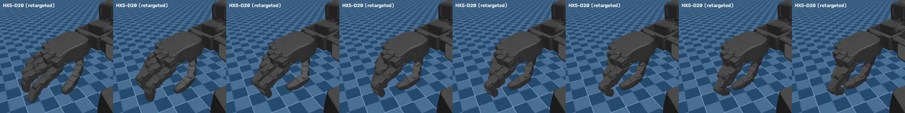

# 로보티즈 오픈소스 실측 — AI Worker 이식 · HX5-D20 리타게팅

ROBOTIS가 공개한 Physical AI 스택(MuJoCo 모델·핸드 URDF·데이터 도구, 전부 [github.com/ROBOTIS-GIT](https://github.com/ROBOTIS-GIT))을 받아, 이 스터디에서 만든 파이프라인 두 개를 **제조사 공식 자산 위에서 그대로 재실행**했다. ① camera-to-robot guidance(perceive→IK→물리 파지)를 Franka Panda에서 **AI Worker(FFW-BG2) 휴머노이드**로 이식하고, ② MANO 사람 손 리타게팅의 타깃을 Allegro에서 **ROBOTIS Hand HX5-D20**(5손가락 20-DoF)으로 교체했다. 목적은 두 가지다: 내 파이프라인이 특정 기체에 묶여 있지 않다는 **이식성 검증**, 그리고 기체가 바뀔 때 실제로 무엇이 깨지는지의 **실측 기록**. 모든 수치는 실측이고, 안 되던 구간은 안 되던 그대로 적었다.

사용한 공개물: `robotis_mujoco_menagerie`(AI Worker FFW-BG2/SG2/SH5 MJCF — SH5에 HX5-D20 핸드 포함), `robotis_hand`(HX5-D20 URDF/xacro), `physical_ai_tools`(LeRobotDataset 수집 스택, §3에서 코드 분석). 모델 파일은 **전부 무개조**로 로드했다.

## 1. AI Worker(FFW-BG2)로 guidance 파이프라인 이식 — 20/20

[Manipulation](manipulation)의 물리 pick-and-place(Franka Panda, `mj_step` 접촉 물리로만 성공이 결정되는 폐루프)를 FFW-BG2의 **오른팔 7-DoF + RH-P12-RN 그리퍼**로 이식했다. 파이프라인 자체는 동일하다: 고정 카메라가 ArUco 물체를 보고(solvePnP) → DLS IK로 접근·파지 자세 → 그리퍼 CLOSE(위치서보, 힘 제한 ±3.5) → lift → carry → place. 물체 위치·yaw를 랜덤화한 20 trial.

| 지표 | Franka Panda (40 trial) | **AI Worker FFW-BG2 (20 trial)** |
|---|---|---|
| perception rate | 100% | <b style="color:#7fd4b8">100%</b> |
| grasp+lift rate | 100% | <b style="color:#7fd4b8">100%</b> |
| place success | 100% | <b style="color:#7fd4b8">100% (20/20)</b> |
| perception 오차 (mean) | 6.59 mm | **5.0 mm** |
| place 오차 (mean) | 4.87 mm | **9.05 mm** |

**읽는 법.**
- 같은 인지·IK 코드가 기체만 바꿔 그대로 닫힌다 — 파이프라인의 기체 독립성이 이 표의 요지다.
- place 오차가 Panda보다 큰 것(4.87→9.05mm)은 정직하게 남긴다: FFW의 팔은 위치서보 강성(kp 600)이 낮아 자중 처짐이 크고, 아래 실록의 droop 보정을 파지 시점에만 적용했다(플레이스 하강은 미보정 — 개선 여지).
- 성공률만 보면 싱겁지만, 이 20/20은 공짜가 아니었다. 이식 직후는 **0/3**이었다.

### 시연 영상 — trial 0–3 (실측 롤아웃 원본)

<figure style="margin:0"><video controls muted loop playsinline preload="none" style="width:100%;border-radius:6px" src="_static/robotis/robotis_pick_t00.mp4"></video><figcaption style="font-size:0.72rem;line-height:1.25">trial 00 — perception 6.6mm · droop 보정 51.6mm · place 7.2mm</figcaption></figure>
<figure style="margin:0"><video controls muted loop playsinline preload="none" style="width:100%;border-radius:6px" src="_static/robotis/robotis_pick_t01.mp4"></video><figcaption style="font-size:0.72rem;line-height:1.25">trial 01 — perception 3.5mm · droop 보정 49.0mm · place 8.6mm</figcaption></figure>
<figure style="margin:0"><video controls muted loop playsinline preload="none" style="width:100%;border-radius:6px" src="_static/robotis/robotis_pick_t02.mp4"></video><figcaption style="font-size:0.72rem;line-height:1.25">trial 02 — perception 7.5mm · droop 보정 46.6mm · place 5.6mm</figcaption></figure>
<figure style="margin:0"><video controls muted loop playsinline preload="none" style="width:100%;border-radius:6px" src="_static/robotis/robotis_pick_t03.mp4"></video><figcaption style="font-size:0.72rem;line-height:1.25">trial 03 — perception 3.7mm · droop 보정 49.9mm · place 7.1mm</figcaption></figure>

인지 쪽 원본(ArUco 검출 + solvePnP 축 오버레이):

<b>20 trial 리프트 순간 몽타주 + trial 0 필름스트립 (클릭)</b>

### 실록 — 이식 직후 0/3에서 20/20까지, 실제로 깨진 세 가지

1. **경로가 테이블을 통과.** 홈 자세(팔 늘어뜨림)에서 접근 자세로 joint-space 램프를 걸면 그리퍼가 테이블 옆면을 뚫는 경로가 나온다 — 물체 근처에도 못 갔다. 홈을 **레디 자세**(IK로 TCP를 상판 위에 파킹)로 바꾸고 테이블을 얇은 상판+다리로 바꿔 해결.
2. **링키지 그리퍼의 닫힘 기하.** RH-P12-RN은 4관절 평행 링키지라 닫힐 때 핑거팁이 **~28mm 아래로 호를 그리며 내려간다**. Panda처럼 물체 중심 높이에서 닫으면 팁이 테이블에 박혀 힘 제한 서보가 스톨 — 접촉 로그를 찍어 보니 CLOSE 구간 내내 `grip_q≈0.000`으로 고정돼 있었다. 파지 높이를 +50mm(박스 상반부)로 올리고, 닫힘도 느려서(4관절 연동 감쇠) CLOSE 구간을 0.52s→1.4s로 늘렸다.
3. **중력 처짐(gravity droop).** 그래도 안 잡혔다. TCP를 FK로 실측하니 명령 대비 **z −28mm / x −16mm** — kp=600 위치서보가 뻗은 팔 자중으로 관절당 ~1.7°씩 처진 게 누적된 값이다. IK는 맞는데 로봇이 낮게 간다. **TCP 실측 잔차를 IK 타깃에 가산해 재명령하는 폐루프 보정 2회**(실기라면 엔코더 피드백)로 잔차를 수 mm까지 수렴시켰다 — 위 영상 캡션의 "droop 보정 ~50mm"가 trial마다 실제로 걷어낸 양이다. 이 보정 직후 0/3 → 3/3, 최종 20/20.

한 줄 교훈: **기체를 바꾸면 IK가 아니라 그리퍼 기하와 서보 강성이 먼저 깨진다.** 셋 다 예외 없이 조용히 실패하는 종류라, 영상 프레임 → 접촉 카운트 → `grip_q` 시계열 순서의 포렌식으로만 잡혔다.

## 2. MANO → ROBOTIS Hand HX5-D20 리타게팅 — Allegro 대비 잔차 1/2.7

[Hand Pose](hand_pose)의 MANO→Allegro dexterous retargeting(vector-based keyvector 매칭, DexPilot/AnyTeleop 원리 — L-BFGS-B를 관절한계로 bound, 충돌 패널티, 스무딩/보간)에서 **타깃 핸드만 HX5-D20으로 교체**하고 같은 24프레임 open→fist 궤적을 다시 풀었다. 모델은 공식 `ffw_sh5.xml`을 무개조로 로드해 오른손 20관절만 구동한다(palm = `hx5_r_base`, 손 내부 geom 쌍만 충돌 집계).

| 항목 | Allegro (16-DoF · 4손가락) | **HX5-D20 (20-DoF · 5손가락)** |
|---|---|---|
| keyvector | 8개 (소지 버림) | **10개 (5손가락 × medial+tip)** |
| human→robot scale | 0.93 | 1.55 |
| keyvector 매칭 (raw) | 58.6 mm | <b style="color:#7fd4b8">19.6 mm</b> |
| keyvector 매칭 (충돌회피 후) | 58.7 mm | <b style="color:#7fd4b8">21.4 mm</b> |
| 관절한계 내 | 100% (bound 설계상) | 100% (동일) |
| 자기충돌 프레임 raw→회피→보간후 | 6/24 → 0 → 0/48 | 17/24 → <b style="color:#7fd4b8">0</b> → 0/48 |
| jerk (스무딩 전→후) | 0.045 → 0.009 | 0.072 → 0.0135 (5.3×↓) |

**읽는 법.**
- **매칭 잔차 58.7 → 21.4mm.** Allegro에서 "cross-morphology 구조차라 0 불가"라고 적었던 잔차의 큰 몫이 실제로 구조(5→4 손가락, 엄지 대향 차이)에서 왔다는 실측 증거다. HX5-D20은 5손가락 + 사람과 유사한 관절 배치(엄지 cmc/mcp_yaw/mcp_pitch/ip, 손가락 mcp/pip/dip/tip)라 MANO와 5:5 대응이 되고, Allegro에서 버려야 했던 **소지에도 타깃이 생긴다**.
- 나머지 21.4mm는 여전히 구조차 + hm5와 동일한 correspondence 스트레치(인간 DIP↔로봇 fingertip)의 몫 — 비교 공정성을 위해 방법을 바꾸지 않았다.

### 시연 영상 — 사람 손과 나란히

<figure style="margin:0"><video controls muted loop playsinline preload="none" style="width:100%;border-radius:6px" src="_static/robotis/robotis_hand_sbs.mp4"></video><figcaption style="font-size:0.72rem;line-height:1.25">MANO open→fist(왼쪽)를 HX5-D20이 따라 쥔다(오른쪽) — 48프레임 보간 궤적, 충돌 0</figcaption></figure>
<figure style="margin:0"><video controls muted loop playsinline preload="none" style="width:100%;border-radius:6px" src="_static/robotis/robotis_hand_closeup.mp4"></video><figcaption style="font-size:0.72rem;line-height:1.25">HX5-D20 단독 클로즈업 — 5손가락이 전부 개별 curl, 엄지 대향</figcaption></figure>

정지 비교(MANO 4프레임 ↔ 리타게팅 4프레임):

<b>키포인트 검증 사진 + 필름스트립 (클릭)</b>

리타게팅 전에 keyvector 끝점(빨간 마커)이 실제 손끝에 놓이는지 FK 프로브로 검증했다 — 엄지 medial→tip 67.5mm, 검지 63.5mm(메시 치수와 일치).

### 실록 — 여기서 발견한 두 가지

1. **numpy 2.x NEP50 승격.** float64 스칼라 × float32 배열이 float64로 승격돼 torch가 MANO float32 가중치와의 연산을 거부한다. [RLDX 재현](rldx)의 numpy 2 텍스처 손상과 같은 계열 — numpy 2 환경에서 dtype은 명시로 고정해야 한다(`.astype(np.float32)`).
2. **배포 충돌메시의 zero-pose 겹침.** 공식 모델이 영자세에서 베이스 쉘↔근위 링크가 최대 **9.1mm 관통**한다(벤더 `<exclude>` 목록이 base↔mcp 링크만 덮고 base↔pip 링크를 빠뜨림). 이걸 모르면 자기충돌이 24/24로 집계되고, 회피 패스가 모델 고유 겹침과 싸우느라 매칭을 26.9mm까지 낭비한다. **zero-pose에서 이미 겹치는 쌍을 베이스라인으로 제외**(MoveIt SRDF 생성의 default-collision 필터링과 같은 원리)하니 raw 충돌이 17/24(진짜 리타게팅 유발분)로 정리되고 매칭도 21.4mm로 회복됐다.

## 3. Physical AI Tools — LeRobotDataset 기록 코드 비교 (실행 아닌 분석)

`physical_ai_tools`는 ROS2 + 실기 전제라 실행 대신 데이터 기록 코어(`lerobot_dataset_wrapper.py`)를 읽고 [내 LeRobot v2.1 export](rldx)와 비교했다.

- **접근이 정반대다.** 나는 v2.1 레이아웃(info.json/episodes.jsonl/stats + chunk parquet + mp4)을 손으로 직접 기록하고 RLDX 로더로 검증했다. 로보티즈는 공식 `LeRobotDataset` 클래스를 **상속**해 upstream validator(`validate_frame`/`validate_episode_buffer`)와 meta writer를 그대로 물려받는다 — 포맷 준수를 라이브러리에 위임하는 설계.
- **실시간 수집 최적화가 상속의 이유다.** `add_frame_without_write_image` + `save_episode_without_video_encoding`으로 프레임 적재와 인코딩을 분리하고, 에피소드를 RAM에 쌓았다가 수집 종료 후 일괄 인코딩한다 — 텔레옵 중 프레임 드랍 방지. 오프라인 배치 변환이던 내 쪽엔 없던 제약이다.
- 코덱 선택은 동일(libx264 + yuv420p) — 서로 독립적으로 같은 호환 지점에 도달했다.

## 4. 정직 — 이 페이지의 한계

- AI Worker place 오차 9.05mm는 Panda(4.87mm)의 약 2배 — 저강성 암 + 플레이스 하강 미보정. droop 보정을 하강에도 적용하면 줄일 수 있는 값으로, 실측 없이는 주장하지 않는다.
- HX5-D20은 URDF(xacro) 대신 `robotis_mujoco_menagerie`의 MJCF판을 사용했다(동일 기체의 공식 배포물이지만 rev1/rev2 URDF와의 수치 대조는 안 함).
- 리타게팅은 물체 없는 free-air 궤적이다 — 물체 파지 안정성은 범위 밖(Allegro 실측과 동일 조건).
- pick의 카메라는 월드 고정 씬 카메라다(AI Worker 머리 카메라 아님). 인지 파이프라인의 조건은 Panda 실측과 동일하게 맞췄다.
- Physical AI Tools는 실행하지 않았다 — §3은 소스 코드 레벨 비교다.

## 5. 산출물

| 항목 | 위치 |
|---|---|
| AI Worker pick 코드 · 결과 | `robotics-lab/src/robotis_pick.py` · `outputs/robotis_pick_result.json` |
| HX5-D20 리타게팅 코드 · 결과 | `robotics-lab/src/robotis_hand_retarget.py` · `outputs/robotis_hand/robotis_hand_result.json` (Allegro 나란히 포함) |
| 영상 렌더러 | `robotics-lab/src/robotis_hand_video.py` |
| 상세 실록 | `robotics-lab/notes/robotis_sprint.md` |

이 페이지의 시연 영상 6편·사진 6장은 전부 위 코드의 실측 출력 원본이다.
