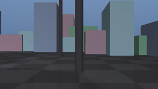
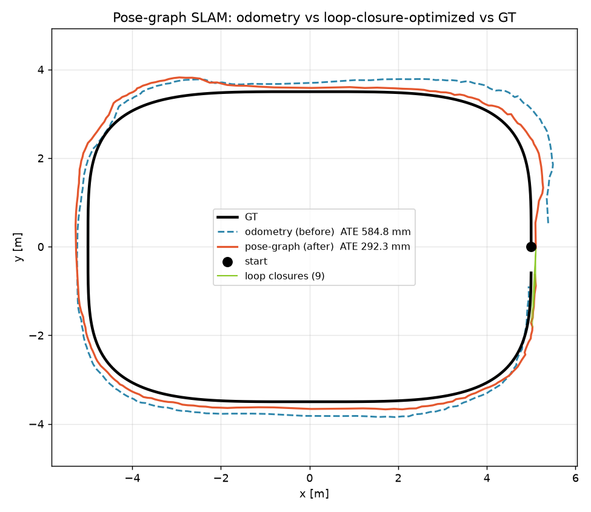
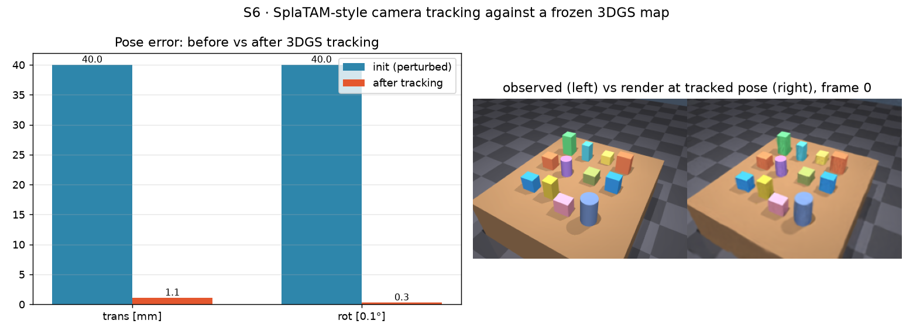
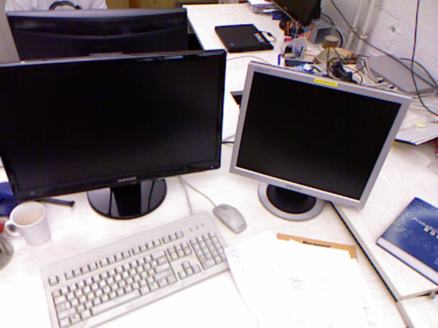
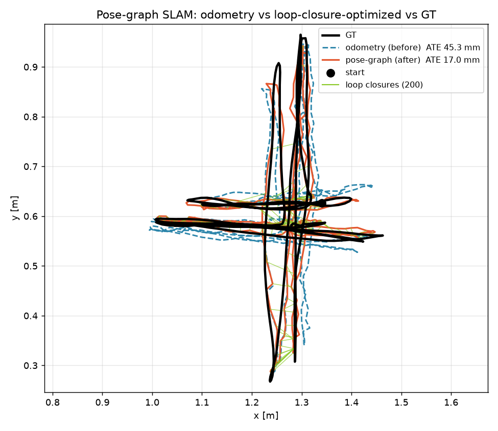
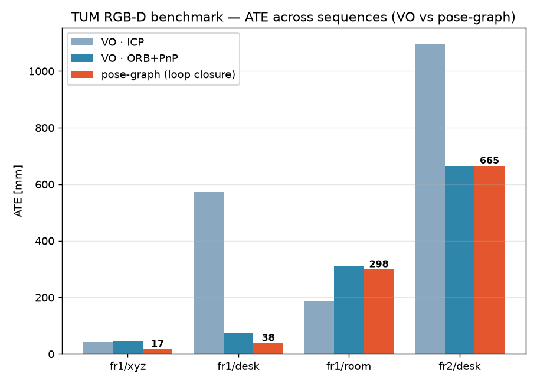

# SLAM — Localization & Mapping

이 사이트의 [perception](perception.md) 파이프라인은 **고정 카메라의 단일 시점 RGB-D 스냅샷**을 매번 새로 찍어 물체를 인지한다. 카메라가 움직이지도, 프레임을 시간으로 잇지도 않는다. SLAM은 정확히 그 비어 있는 축 — **움직이는 센서로 "내가 어디 있나(localization)"와 "주변이 어떻게 생겼나(mapping)"를 동시에 푸는 것** — 을 채운다. 이 페이지는 개념 정리(문헌)이고, 우리가 직접 구현·측정한 실측은 별도로 붙인다(아래 §7).

포지셔닝 관점: **3D perception → mapping/localization(SLAM) → spatial AI**. stereo matching·camera calibration·depth 같은 기존 기하 역량과 NeRF/3DGS 재구성 경험이 **뉴럴 SLAM**에서 한 줄로 이어진다.

## 1. SLAM이 푸는 문제

한 문장: **카메라(또는 LiDAR)가 움직이는 동안, 관측만으로 센서의 궤적 $T_1,\dots,T_n$ 과 장면의 지도 $M$ 을 동시에 추정한다.** 지도가 있으면 위치를 알기 쉽고, 위치를 알면 지도를 쌓기 쉬운 **닭-달걀 문제**라서 "동시에(simultaneous)"가 핵심이다.

우리 현재 인지와의 대비:

| | 현재 (single-shot 인지) | SLAM |
|---|---|---|
| 카메라 | 고정, GT extrinsic | **움직임**, extrinsic을 스스로 추정 |
| 시간축 | 없음(매 프레임 독립) | **프레임 간 트래킹·누적** |
| 산출물 | 물체 pose 1장 | **궤적 + 지속 지도** |
| 오차 | 캘리브·depth 오차(정적) | +**drift**(오차가 시간에 누적) |

→ 왜 우리에게 필요한가: eye-in-hand(손목) 카메라 자기위치추정, 멀티스텝 조작용 지속 지도, 마커·GT 없는 markerless extrinsic. 단일 샷 grasp 인지에서 **공간 인지형 조작**으로 넘어가는 다리.

## 2. 고전 SLAM 해부 — 프론트엔드 · 백엔드 · 루프클로저

- **프론트엔드 (tracking / odometry)**: 연속 프레임 사이의 상대 모션을 추정. 두 갈래 —
  - **특징 기반(feature-based)**: ORB 같은 특징점 추출·매칭 → 에피폴라/PnP로 모션. 대표 **ORB-SLAM** 계열. 조명·텍스처에 견고, 재관측·재localization 쉬움.
  - **직접법(direct)**: 특징 없이 **픽셀 밝기(photometric error)** 를 직접 최소화. 대표 **DSO·LSD-SLAM**. 텍스처 적은 곳에 강점, 미세 모션에 정밀.
- **백엔드 (optimization)**: 프론트엔드 추정을 전역적으로 다듬어 **drift**를 줄인다.
  - **필터 기반**(EKF/MSCKF) vs **그래프 기반**(pose-graph, **bundle adjustment**). 현대 시각 SLAM은 대부분 그래프+BA(Ceres/GTSAM/g2o로 비선형 최소제곱).
- **루프 클로저 (loop closure)**: 예전에 본 곳을 다시 알아보고(장소 인식, e.g. DBoW) 그 제약을 그래프에 넣어 **누적 drift를 한 번에 접어** 전역 일관성 회복.
- **지도 표현 (map representation)**: sparse 포인트 → dense 포인트/**surfel** → 볼류메트릭 **TSDF/occupancy**(KinectFusion) → 최신 **NeRF/3D Gaussian**.

## 3. 센서·방식 분류

| 축 | 옵션 | 특징 |
|---|---|---|
| 입력 | mono / **stereo** / **RGB-D** / VIO(+IMU) / LiDAR | mono는 **스케일 모호**(절대 크기 모름), stereo·RGB-D·LiDAR는 metric scale 확보 |
| 프론트엔드 | 특징 기반 / 직접법 | ORB-SLAM3 vs DSO |
| 밀도 | sparse / semi-dense / **dense** | 조작·재구성엔 dense/RGB-D가 유리 |
| 백엔드 | 필터 / 그래프+BA | 현대 표준은 그래프+BA |

- **RGB-D SLAM**(우리 셋업과 직결): depth로 스케일이 바로 나오고, **frame-to-model** 트래킹 + TSDF 융합(KinectFusion·ElasticFusion)이 정석. MuJoCo가 RGB-D를 그대로 주므로 우리 실측의 출발점.
- **VIO/VINS**(VINS-Mono, OKVIS): IMU를 붙여 저텍스처·빠른 모션에 견고. 로봇·드론·AR의 실전 주류.

## 4. 현대 · 학습 기반 · 뉴럴 SLAM (차별화 축)

고전(hand-crafted) → 딥러닝(학습된 특징·깊이·flow) → **뉴럴 표현(NeRF/3DGS)** 으로 흐름이 이동 중.

- **학습형 VO/SLAM**: **DROID-SLAM**(dense optical flow + 미분가능 BA)처럼 end-to-end로 견고성↑. 학습된 특징/깊이/flow가 고전 모듈을 대체.
- **NeRF SLAM**(iMAP·NICE-SLAM): 장면을 신경장으로 표현, 렌더링 오차로 트래킹+맵핑. 사실적이지만 느림.
- **3D Gaussian Splatting SLAM**(SplaTAM·GS-SLAM·MonoGS): 장면을 3D 가우시안으로 표현 → **미분가능 rasterization으로 실시간** 트래킹+photorealistic 맵. NeRF의 속도 한계를 넘어 현재 최전선.
- **파운데이션/기하 사전학습**: DUSt3R·VGGT 등 "이미지 쌍→3D"를 바로 뱉는 모델이 SfM/SLAM 프론트엔드를 재편 중.

→ 이 갈래가 우리 NeRF/3DGS 재구성 배경과 정확히 겹친다. 표현(representation) 관점의 연결은 [Concepts](concepts.md)·[World Models](world-models/predictive.md)(공간/예측 표현)와도 이어진다.

## 5. 평가 — 무엇을 숫자로 보나

- **ATE (Absolute Trajectory Error)**: 추정 궤적을 GT에 정렬(Sim3/SE3) 후 위치 RMSE — 전역 일관성.
- **RPE (Relative Pose Error)**: 국소 상대 모션 오차 — drift 율(odometry 품질).
- **맵 품질**: 재구성 표면의 정확도/완성도, 렌더링 PSNR(뉴럴 SLAM).
- **표준 데이터셋**: **TUM RGB-D**, **EuRoC**(VIO), **KITTI**(야외/LiDAR).

우리 강점: **MuJoCo가 GT 카메라 궤적·기하를 공짜로** 준다 → 추정 궤적을 GT와 직접 대조해 ATE/RPE를 정량화. [error budget](perception.md) 페이지에서 캘리브 오차를 base 좌표까지 전파했던 것과 같은 **정직 정량** 방식을 SLAM에 그대로 적용한다.

## 6. 학습 로드맵 & 자료

가장 체계적인 기준: **[changh95/visual-slam-roadmap](https://github.com/changh95/visual-slam-roadmap)** (11레벨, 수학→고전→RGB-D→딥러닝→VIO→…→월드모델, 2024–2026 논문·DUSt3R/VGGT/3DGS-SLAM 포함).

- **Tier 0 · 수학/다중뷰 기하**: [TUM Multiple View Geometry (Cremers)](https://cvg.cit.tum.de/teaching/online/mvg) · Cyrill Stachniss Photogrammetry
- **Tier 1 · 고전 SLAM**: [Stachniss — Intro to SLAM](https://www.youtube.com/watch?v=NW8hUcbjuIQ) · [SLAM-Resources-for-Beginner](https://github.com/Taeyoung96/SLAM-Resources-for-Beginner)(slambook 포함) · [ORB-SLAM3](https://github.com/UZ-SLAMLab/ORB_SLAM3)
- **Tier 2 · 현대/뉴럴**: [NeRF·3DGS SLAM 서베이 (Tosi)](https://fabiotosi92.github.io/files/survey-slam.pdf) · [awesome-NeRF-and-3DGS-SLAM](https://github.com/3D-Vision-World/awesome-NeRF-and-3DGS-SLAM)

공부 순서: Tier 0(필요분) → Tier 1 이론 + ORB-SLAM3 돌려보기 → Tier 2 서베이 + 우리 셋업에서 RGB-D/3DGS SLAM 실측.

## 7. 우리 실측 (직접 구현 · GT 벤치마크)

문헌과 분리해, MuJoCo 위에서 단계별로 직접 구현하고 **GT 카메라 궤적으로 정량 벤치마크**한다. 셋업은 공통: feature-rich 정지 테이블탑을 카메라가 **2바퀴 궤도(720°, 200프레임, 640×480)** 로 돌며 RGB-D를 렌더, MuJoCo `cam_xmat/cam_xpos`로 GT pose를, `fovy→K`로 intrinsic을 기록(전부 OpenCV 규약). 렌더는 CPU(osmesa)로 GPU 없이 결정적으로 재현된다. GT 경로 길이 **786 cm**.

> 진행: **S0–S3 완료**, S4(뉴럴 3DGS SLAM)는 진행 예정. 아래 수치는 모두 이 셋업에서 직접 측정한 값이다. 요약 결과 페이지(그림·수치): [SLAM S0–S3 아티팩트](https://claude.ai/code/artifact/37e74c2a-23e4-40f6-b981-4447807e2bc3).

### S0 — 움직이는 카메라 RGB-D + GT 시퀀스 생성기

카메라를 mocap body에 얹어 궤도로 움직이며 매 프레임 RGB + metric depth + GT pose를 저장한다. 단일-샷·고정 카메라였던 [perception](perception.md)에 **시간축과 카메라 자기운동**을 더한 것으로, 이후 모든 단계의 입력이자 정답지(GT)다. GT 회전 행렬 orthonormal 오차 ~1e-15, depth valid 96–100%.


### S1 — RGB-D 시각 오도메트리 (VO)

두 프론트엔드를 **독립 구현**해 비교한다: ① **point-to-plane ICP** scan-to-scan(선형화 6-DoF 최소자승, 법선 추정) ② **ORB + RGB-D PnP**(RANSAC). 각각 GT pose[0]에서 상대 모션을 적분해 궤적을 만들고, **정지(무모션) baseline**과 함께 GT와 대조한다.

:::{dropdown} 해부 — VO 한 스텝의 I/O와 두 프론트엔드 핵심 (`src/slam_vo.py` 발췌)
둘 다 룰베이스(기하+최소자승·RANSAC — ORB도 hand-crafted 특징)다. **공통 계약**: 인접 프레임 쌍 → 상대변환 `M (4,4)` = cam_{i+1} 좌표 → cam_i 좌표. 궤적은 `T_est[i+1] = T_est[i] @ M`으로 적분(그래서 M의 오차가 그대로 drift로 누적된다).

```python
# ① ICP point-to-plane: 반복마다 6-DoF 증분을 '선형' 최소자승으로
s = (T[:3,:3] @ src.T).T + T[:3,3]           # 현재 추정으로 src 변환
dist, idx = tree.query(s)                    # 최근접 대응 (KD-tree), 8cm 게이트
ps, qs, ns = s[m], tgt[idx[m]], tgt_n[idx[m]]
# min Σ(((R p + t) − q)·n)²,  R ≈ I + [w]× 소각 선형화 → 6×6 정규방정식
G = np.hstack([np.cross(ps, ns), ns])        # (M,6): [p×n | n]
r = np.sum((ps - qs) * ns, axis=1)           # point-to-plane 잔차
x = np.linalg.solve(G.T @ G, -G.T @ r)       # [w(3), t(3)] 증분
T = exp(x) @ T                               # 수렴까지 25회 (유도 → slam_math §2)

# ② ORB + RGB-D PnP: 3D는 프레임 i의 depth에서, 2D는 프레임 i+1에서
pts3d = backproject(kp0[m.queryIdx], depth_i)     # i의 특징점을 depth로 3D화
pts2d = kp1[m.trainIdx].pt                        # i+1에서 매칭된 2D
ok, rvec, tvec, inl = cv2.solvePnPRansac(pts3d, pts2d, K, None,
                                         reprojectionError=2.0)
M = np.linalg.inv(T_from(rvec, tvec))             # PnP는 i→i+1이라 역변환
```

같은 계약(M) 위에서 대응 방식만 다르다 — dense 기하(전 픽셀) vs sparse 특징(수백 점). 이 구조 차이가 결과의 "궤적 길이에 따라 순위가 바뀐다"는 관찰로 이어진다.
:::


| 방법 | ATE | RPE Δ1 | RPE Δ10 |
|---|---|---|---|
| **ICP (point-to-plane)** | **47.7 mm** (0.6% of path) | 2.5 mm / 0.13° | 14.9 mm / 0.83° |
| **ORB + PnP** | 63.6 mm (0.8%) | 3.6 mm / 0.23° | 25.0 mm / 1.72° |
| static baseline | 621.4 mm | 39.5 mm | 388.3 mm |

두 VO 모두 정지 baseline(621 mm) 대비 **10–13× 우수** → 좌표 규약·적분이 정확함을 확인. 긴 2바퀴 궤적에선 dense ICP가 특징기반 PnP보다 안정적이었다(짧은 궤적 초기 실험에선 반대 — 궤적 길이에 따라 순위가 바뀌는 정직한 관찰). **loop closure/BA가 없는 순수 오도메트리라 drift가 누적**되며(추정 궤도가 GT보다 안쪽으로 수축), 이것이 S3의 보정 대상이다.

### S2 — TSDF 맵핑 (drift가 지도에 주는 영향)

같은 RGB-D를 **pose 소스만 바꿔가며**(GT / ICP / PnP) open3d TSDF로 융합해 하나의 컬러 3D 복원을 만든다. 궤적이 정확할수록 지도가 선명하고, drift가 크면 지도가 뒤틀리고 번진다.

:::{dropdown} 해부 — TSDF 융합과 지도 지표의 I/O (`src/slam_map.py` 발췌)
**입력**: 프레임별 (RGB, depth, K) + pose 소스 `T_wc (N,4,4)` — 이 pose가 유일한 실험 변수다. **출력**: mesh + point cloud. 융합은 룰(가중 이동평균, 유도 → [slam_math §5](slam_math.md)):

```python
vol = o3d.pipelines.integration.ScalableTSDFVolume(
    voxel_length=0.008, sdf_trunc=4 * 0.008, color_type=RGB8)   # 8mm 복셀
for i in range(len(depths)):
    vol.integrate(rgbd_i, intr, np.linalg.inv(T_wc[i]))   # open3d는 world→cam을 받음
mesh = vol.extract_triangle_mesh()

# 지도 지표: 대칭 Chamfer (est↔GT-pose 지도), 정렬 없이 raw로 — drift 영향을 그대로 노출
acc  = est_pcd.compute_point_cloud_distance(gt_pcd)    # est→gt: 없어야 할 곳의 표면
comp = gt_pcd.compute_point_cloud_distance(est_pcd)    # gt→est: 못 덮은 GT 표면
```

본문의 "바닥 제외" 정정이 이 지표 코드에 걸려 있다 — 평평한 바닥은 yaw drift에 불변이라 포함하면 지표가 왜곡을 가린다.
:::


지도 품질은 GT-pose 지도 대비 **대칭 Chamfer 거리**(테이블탑 씬, 바닥 제외)로 잰다: **ICP 11.3 mm < ORB+PnP 14.3 mm** — S1 ATE 순위와 일치(궤적 정확 → 지도 정확). *방법 메모: 처음엔 바닥을 포함했더니 지표가 눈에 보이는 왜곡과 어긋났다. 평평한 바닥은 수직축 yaw 회전에 거의 불변이라 회전 drift를 가리기 때문 — 씬(테이블·물체)만 크롭해 정정했다. 단일 지표를 시각과 대조 없이 믿지 않는다.*

### S3 — Pose-graph SLAM 백엔드 (loop closure로 drift 보정)

S1의 ORB+PnP 오도메트리를 프론트엔드로 받아, **loop closure**(2번째 바퀴가 1번째 바퀴를 재방문하는 프레임쌍을 ORB+PnP로 매칭)를 검출하고 전체 pose graph를 **SE(3) 매니폴드에서 Gauss-Newton으로 최적화**한다. ORB-SLAM3 빌드 대신 `exp/log`·adjoint·희소 GN solver를 직접 구현했다(리군 기하·최소자승 상태추정).

:::{dropdown} 해부 — loop 검출 룰과 GN 한 반복 (`src/slam_posegraph.py` 발췌)
**입력**: VO 궤적 `(N,4,4)` + odometry 엣지 + loop 엣지(각 엣지 = 상대변환 관측 `Z`). **출력**: 최적화된 궤적 `(N,4,4)`. 전부 룰베이스 — loop "인식"조차 학습 place recognition이 아니라 기하 룰이다:

```python
# loop 검출 룰: 시간상 멀고(|i−j|≥20) 공간상 가까운(VO 위치 <15cm) 쌍만 후보로,
# 프레임당 최근접 max_cand=3개만 ORB+PnP로 검증 → O(n·k)로 bound (fr1_xyz 폭증 대응)
cand = [i for i in range(j - min_gap + 1) if ‖pos[i] − pos[j]‖ < d_thresh]

# GN 한 반복: BetweenFactor 잔차와 자코비언 (유도 → slam_math §6)
for (i, j, Z, w) in edges:                     # odom w=1, loop w=3
    A = inv(Z) @ inv(T[i]) @ T[j]
    e = se3_log(A)                             # 잔차 = Log(Z⁻¹ Tᵢ⁻¹ Tⱼ) ∈ ℝ⁶
    Ji = -adjoint(inv(T[j]) @ T[i])            # ∂e/∂ξᵢ (우섭동, 소오차 근사 Jᵣ⁻¹≈I)
    Jj = np.eye(6)                             # ∂e/∂ξⱼ
    H[블록] += w * Jᵀ @ J;  b[블록] += w * Jᵀ @ e    # 희소 6×6 블록 조립
dx = np.linalg.solve(H + λI, -b)               # pose 0은 앵커(고정) — 게이지 자유도 제거
T[k] = T[k] @ se3_exp(dx[k])                   # 매니폴드 위 업데이트
```

"loop closure가 drift를 접는다"의 실체: loop 엣지 하나가 H에 멀리 떨어진 두 pose를 잇는 off-diagonal 블록을 만들고, solve가 그 제약을 **전 구간에 분배**한다 — 그래서 다중 loop가 분포해야 효과라는 본문 관찰이 나온다.
:::


**loop closure 101개**로 최적화한 결과 **ATE 63.6 mm → 40.1 mm (37% 감소)**. 특기할 점: 백엔드가 *더 나쁜* PnP 오도메트리(63.6 mm)를 다듬어 *가장 좋은* raw 오도메트리(ICP 47.7 mm)보다도 낮은 40.1 mm에 도달했다 — "프론트엔드 선택보다 loop closure가 결정적"이라는 SLAM의 핵심을 실증. 정직한 한계: loop closure만(full landmark BA 아님)이라 drift를 **줄이지만 완전 제거는 아니다**(40 mm 잔차). 또한 1바퀴 폐곡선의 단일 loop closure로는 ATE가 오히려 악화됐는데(오도메트리가 이미 좋고 drift가 끝단에 몰리지 않아 단일 제약이 왜곡), **다중 loop closure가 분포해야 효과**라는 교훈으로 2바퀴 궤도를 채택했다.

### S4 — 뉴럴 SLAM 맵: depth-supervised NeRF (차별화)

S0 RGB-D로 **연속 신경장(NeRF)** 을 직접 구현해 학습하고(positional encoding + MLP, photometric + depth 손실, 순수 PyTorch), held-out 뷰에서 **novel-view synthesis**를 GT와 대조한다. 백엔드(S3)와 잇기 위해 **GT pose vs S3 pose-graph pose** 두 버전을 학습해 비교했다.


held-out 뷰에서 테이블·12개 물체·그림자가 인식 가능하게 복원되고 NeRF depth도 깔끔하다(depth 감독 효과). NeRF는 GT pose 25.28 dB / S3 pose 23.65 dB.

### S4b — 3D Gaussian Splatting 업그레이드 (SOTA 표현)

NeRF를 **진짜 3D Gaussian Splatting**으로 업그레이드했다. gaussian을 RGB-D back-projection(180k)으로 초기화하고 gsplat의 미분가능 CUDA rasterizer로 최적화한다(CUDA 12.1 toolkit + gcc-12 host compiler 셋업). 동일 프로토콜로 NeRF와 직접 비교.

:::{dropdown} 해부 — gaussian의 파라미터와 최적화 스텝 (`src/slam_3dgs.py` 발췌)
NeRF/3DGS는 "학습"이라기보다 **장면별(per-scene) 최적화**다 — 사전학습 가중치가 없고, 이 씬의 프레임에만 맞춘다. **입력**: RGB `(T,H,W,3)` + depth + pose `(T,4,4)` + K. **최적화 변수**: gaussian당 5종 — `means (N,3)` 위치, `quats (N,4)` 회전, `log_scales (N,3)`, opacity, 색.

```python
# 초기화: depth 역투영이 곧 초기 gaussian — 3DGS가 RGB-D에서 빨리 수렴하는 이유
x = (us - cx) / fx * z;  y = (vs - cy) / fy * z
pts_world = (T_wc @ [x, y, z, 1])[:3]          # 180k 점 + 픽셀 색 그대로

means = torch.tensor(pts, requires_grad=True)   # 파라미터별 다른 lr (위치는 lr×0.1)
opt = torch.optim.Adam([{means, lr·0.1}, {log_scales, lr·0.5},
                        {quats, lr·0.1}, {opacity, lr}, {colors, lr}])
for it in range(iters):                         # 프레임 하나씩 무작위로
    render, alpha, _ = rasterization(           # gsplat 미분가능 CUDA rasterizer
        means, normalize(quats), exp(log_scales), sigmoid(raw_opac),
        sigmoid(colors_raw), viewmat[i], K, W, H, render_mode="RGB")
    loss = (pred - gt).abs().mean() + 0.5 * ((pred - gt) ** 2).mean()   # L1 + L2
    loss.backward(); opt.step()                 # (공분산 RSSᵀRᵀ·EWA 유도 → slam_math §8)
```

pose는 이 최적화의 **고정 입력**이다 — 그래서 GT pose vs S3 pose 두 버전을 학습해 비교하면 "pose 오차가 맵 품질에 주는 영향"이 분리 측정된다(본문 5.1dB 격차의 실험 설계).
:::


| 표현 | GT pose | S3 pose | 학습시간 |
|---|---|---|---|
| **3DGS** | **33.08 dB** | 27.97 dB | ~15 s |
| NeRF (S4) | 25.28 dB | 23.65 dB | ~88 s |

- **3DGS가 NeRF보다 ~8 dB 높고 ~6× 빠르다** — 렌더가 거의 photorealistic(물체 모서리·그림자·바닥·스카이까지 선명). RGB-D init + gsplat rasterizer의 효율.
- **핵심(SLAM 연결):** GT vs S3 pose 격차가 3DGS에선 **~5.1 dB**(33.1 vs 28.0)로 NeRF의 ~1.6 dB보다 크다. 선명한 gaussian은 pose 오차(S3 잔여 drift 40 mm)에 더 민감 → **정확한 SLAM pose가 뉴럴 맵 품질에 더 결정적**임을 정량 확인. 오도메트리(S1) → 백엔드(S3) → 뉴럴 맵(S4/S4b)이 한 줄로 이어진다. *한계(정직): densification/배경 gaussian·tracking 미구현 — SplaTAM식 joint tracking+3DGS가 다음.*

### S5 — 차량/주행 SLAM: 전방주시 폐루프 (다른 체제)

지금까지의 S0–S4는 **테이블탑을 도는 inward-looking orbit**(물체 중심, 회전 지배)이다. 이와 **근본적으로 다른 체제** — **전방을 보며 전진하는 카메라(ego-motion)** 가 거리 씬의 폐루프를 주행하는 KITTI/자율주행 setting — 을 새로 만들어 같은 파이프라인(VO→pose-graph)을 돌렸다.




| | orbit (S0) | driving (S5) |
|---|---|---|
| 시선 | 고정 중심(inward) | 진행 방향(forward) |
| 경로 | 7.9 m | 29.3 m |
| VO RPE Δ1 | ~3 mm | 28.6 mm |
| VO ATE (ORB+PnP) | 63.6 mm | 584.8 mm |

**전진 주행 VO는 훨씬 어렵다** — forward-motion degeneracy(focus-of-expansion 근처 점은 거의 안 움직임) + 성긴 원거리 특징(인라이어 67 vs orbit 378/frame). pose-graph는 씬 스케일에 맞춰 loop-closure gate를 넓히자 **loop closure 9개**(복귀 시)로 **ATE 584.8 → 292.3 mm (50% 감소)**. odometry(파랑)는 루프를 못 닫고 바깥으로 drift → loop closure(주황)가 닫는다 — 실제 자율주행 SLAM의 핵심을 재현. 같은 파이프라인이 **object-centric orbit과 ego-motion driving 두 체제 모두**에서 동작(특정 시나리오 과적합 아님).

### S6 — SplaTAM식 tracking: 3DGS 맵에 카메라 localization

S4b 3DGS는 mapping까지였다. 뉴럴 SLAM의 나머지 절반 **tracking**을 더한다: **고정된 3DGS 맵에 대해 perturb된 초기 pose에서 렌더링 photometric error를 gradient로 최소화해 카메라 pose를 복원**한다(SplaTAM tracking).

:::{dropdown} 해부 — tracking의 최적화 변수는 단 6개 (`src/slam_track.py` 발췌)
**입력**: 얼린 3DGS 맵(전 gaussian `detach()`) + 관측 이미지 1장 + perturb된 초기 pose. **출력**: 보정된 pose `(4,4)`. mapping과 대칭 구조다 — mapping은 pose 고정·gaussian 최적화, tracking은 **gaussian 고정·pose 6-DoF만 최적화**:

```python
gmeans = g["means"].detach(); ...               # 맵 전체 동결 (gradient 차단)
rot   = torch.zeros(3, requires_grad=True)      # 최적화 변수 = axis-angle 3 + 평행이동 3
trans = torch.zeros(3, requires_grad=True)
opt = torch.optim.Adam([rot, trans], lr=8e-3)
for it in range(180):
    R = axis_angle_to_matrix(rot)               # gaussian means를 강체변환해 렌더
    pred = render_frozen(gmeans, ..., viewmat_init, K, W, H, R, trans)
    loss = (pred - obs).abs().mean()            # photometric L1 — 이게 전부다
    loss.backward(); opt.step()                 # gsplat rasterizer를 통해 pose로 역전파
T_est = inv(inv(T_init) @ M(rot, trans))        # 보정 변환을 초기 pose에 합성
```

"맵을 pose로 미분한다"가 미분가능 rasterizer의 값이다 — 대응점 탐색(ICP)도 특징 매칭(PnP)도 없이, 렌더-비교-역전파만으로 (4°, 40mm) → (0.03°, 1.1mm). means 강체변환 ≡ 카메라 역변환의 동치성은 [slam_math §9](slam_math.md) 참조.
:::



held-out 프레임을 (4°, 40 mm) perturb한 뒤 tracking하면 **1.1 mm / 0.03°** 로 복원(성공률 **100%**, <10 mm & <1°). 관측 이미지와 tracked-pose 3DGS 렌더가 거의 동일하다. → **mapping(S4b) + tracking(S6) = 완전한 뉴럴 SLAM 루프의 두 축**을 GT로 검증.

### S7 — 실제 데이터셋: TUM RGB-D 표준 벤치마크

지금까지는 MuJoCo GT(시뮬)였다. SLAM 연구자들이 실제로 쓰는 **표준 벤치마크** — 실제 Kinect RGB-D + motion-capture GT를 제공하는 **TUM RGB-D**(RGB-D SLAM의 사실상 표준, Sturm 2012) — 의 `freiburg1_xyz` 시퀀스에서 같은 파이프라인을 **코드 수정 없이(포맷만 변환)** 돌렸다. (KITTI는 스테레오/LiDAR라 우리 RGB-D와 불일치 → TUM이 맞는 트랙.)




| 단계 | ATE (실측 8.00 m 궤적) |
|---|---|
| VO — ICP | 43.2 mm |
| VO — ORB+PnP | 45.3 mm |
| **pose-graph (loop closure 200)** | **17.0 mm (−62%)** |
| static baseline | 185.8 mm |

**시뮬에서 개발한 파이프라인이 실제 Kinect 데이터로 그대로 전이** — VO ~4.3 cm, loop closure 후 **1.7 cm**. 참고로 공개 RGB-D SLAM(ORB-SLAM2, full BA+loop)이 fr1_xyz에서 ~1 cm 수준이니, **BA·landmark 없는 pose-graph-only로 1.7 cm는 정직하게 경쟁력 있는 실측 결과**다.

#### 다중 시퀀스 벤치마크 (SLAM 논문 스타일 표)
여러 표준 시퀀스에 같은 파이프라인을 돌려 ATE를 정리했다:



| 시퀀스 | 경로 | VO-ICP | VO-ORB+PnP | pose-graph | loops |
|---|---|---|---|---|---|
| fr1/xyz | 8.0 m | 43.2 | 45.3 | **17.0** | 200 |
| fr1/desk | 9.3 m | 571.9 | 76.5 | **37.5** | 78 |
| fr1/room | 16.0 m | 186.6 | 309.8 | 298.2 | 35 |
| fr2/desk | 18.2 m | 1098.0 | 665.3 | 664.8 | 1 |

**정직한 동작 범위(operating envelope):** 데스크 스케일·느린 병진(fr1/xyz·desk)에선 pose-graph 후 **1.7–3.8 cm**로 좋다. 더 크고 빠른 시퀀스(fr1/room·fr2/desk)에선 **단순 2-프레임 VO의 drift가 커지고 유효 loop closure가 적어**(fr2/desk는 단 1개) 정확도가 떨어진다 — 이는 **keyframe·full bundle adjustment·robust place recognition(BoW)** 을 갖춘 ORB-SLAM류가 필요한 이유를 정확히 보여준다. 어느 시퀀스든 VO는 static baseline을 크게 이긴다. 방법별 강점도 드러난다: 회전 많은 fr1/desk는 ICP가 무너지고 특징기반 PnP가 강하며, 그 반대 경우도 있다.

*엔지니어링 메모: fr1_xyz가 작은 볼륨을 반복 스캔해 loop 후보가 폭증 → `detect_loops`를 프레임당 최근접 top-k만 검증하도록 bound(O(n·k))·씬 스케일별 `loop_dist` 튜닝. fr2는 fr1과 intrinsic이 달라 카메라별 K를 반영.*

---

*§1–6은 SLAM 개념·논문의 정성적 정리(문헌)이고, §7은 이 프로젝트에서 직접 측정한 실측 결과다: **S0 시퀀스 → S1 VO → S2 TSDF → S3 pose-graph → S4/S4b 뉴럴 맵(NeRF/3DGS) → S5 차량 SLAM → S6 3DGS tracking**(전부 MuJoCo GT), 그리고 **S7 실데이터(TUM RGB-D) 벤치마크**. 시뮬 GT와 실데이터 표준 벤치마크 양쪽에서 검증.*

## 8. 수식·유도

각 단계에서 **실제로 구현·사용한 수식을 단계별로 완전히 유도**한 별도 수업 자료가 있다 → **[SLAM 수식·유도 (수업 자료)](slam_math.md)**. 핀홀 모델·역투영(fovy→K 유도 포함), point-to-plane ICP의 6-DoF 선형화 정규방정식 유도, PnP 재투영오차, Umeyama 정렬(SVD)·ATE/RPE, TSDF 가중 융합, **SE(3) exp/log·adjoint와 pose-graph BetweenFactor Jacobian의 우섭동 유도**, NeRF 볼륨 렌더링 적분의 이산화, 3DGS 공분산 $RSS^\top R^\top$·EWA 투영·알파합성, SplaTAM tracking의 means-변환 동치성까지 — 기호 정의·유도·해당 코드 위치를 모두 포함한다.
