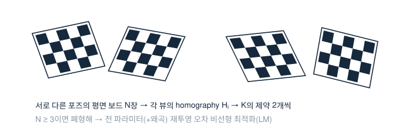

# 9. 카메라 캘리브레이션 (Zhang)

> 평면 보드 사진 N장으로 $K$·왜곡·각 뷰의 포즈를 전부 푸는, 지난 25년의 표준 해법. 참고: 다크 프로그래머 [카메라 캘리브레이션](https://darkpgmr.tistory.com/32).

## 아이디어 — 보드 한 장 = 제약 두 개

보드 평면을 $Z=0$으로 두면 4장의 [Homography](homography.md)에서 본 대로

$$ H = [\mathbf{h}_1\ \mathbf{h}_2\ \mathbf{h}_3] \sim K\,[\mathbf{r}_1\ \mathbf{r}_2\ \mathbf{t}] $$

$\mathbf{r}_1, \mathbf{r}_2$가 정규직교라는 사실에서, $\omega = K^{-\top}K^{-1}$ (image of the absolute conic)에 대해 뷰마다 선형 제약 2개가 나온다:

$$ \mathbf{h}_1^\top \omega\, \mathbf{h}_2 = 0, \qquad
\mathbf{h}_1^\top \omega\, \mathbf{h}_1 = \mathbf{h}_2^\top \omega\, \mathbf{h}_2 $$

$\omega$는 대칭 $3\times3$ → 미지수 6(스케일 포함 5). **서로 다른 포즈 3장 이상**이면 선형으로 풀리고, $\omega$에서 Cholesky로 $K$를 복원한다. 각 뷰의 $(R_i, \mathbf{t}_i)$도 $H_i$에서 나온다.

## 폐형해는 초기값일 뿐

진짜 답은 전체 재투영 오차의 최소화다:

$$ \min_{K,\,\mathbf{d},\,\{R_i,\mathbf{t}_i\}} \sum_{i,j}
\big\| \mathbf{x}_{ij} - \pi(K, \mathbf{d}, R_i, \mathbf{t}_i, \mathbf{X}_j) \big\|^2 $$

왜곡 $\mathbf{d}$까지 포함해 LM으로 정제한다. 보고되는 **재투영 RMS**가 이 값이다.

## 품질을 지배하는 것 — 실측에서 배운 순서

1. **코너 검출 품질**: 서브픽셀 정밀도·초점·블러. 흔들린 한 장이 전체를 오염시킨다 → 뷰별 잔차로 이상 뷰를 걸러라.
2. **포즈 다양성**: 기울임이 없으면 $f$와 $Z$가 분리되지 않는다. 비슷한 정면 샷 20장 < 다양한 기울임 8장.
3. **가장자리 커버**: 왜곡 파라미터는 가장자리 데이터가 결정한다.
4. **과적합 관리**: [8장](distortion.md)의 차수 원칙 그대로.

내 실측: 시뮬 검증에서 fx/fy 오차 ~0.6%, 재투영 RMS 0.37 px — GT가 있는 환경에서 위 요인들을 하나씩 끄고 켜며 확인했다.

## 이 표준이 안 통하는 곳

다항식 왜곡 모델 자체가 렌즈를 못 따라가면(복잡 광학계·초광각·비중심 카메라), 잔차에 공간 패턴이 남는다. 그때 필요한 것이 **모델을 관측으로 대체하는 ray calibration** — [리뷰](../reviews/ray-calibration.md)에서 계보를 정리했다. 석사 계측 과제가 정확히 이 경로를 밟았다.
