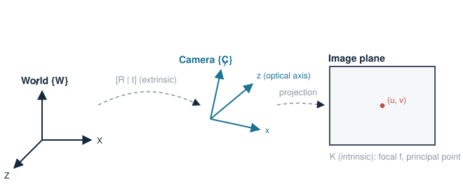

# 1. 좌표계

> 비전 기하의 모든 식은 결국 "어느 좌표계에서 본 값인가"의 회계다. 좌표계 4개와 그 사이 변환만 명확하면 절반은 끝난다.

## 네 개의 좌표계

| 좌표계 | 단위 | 원점 | 역할 |
|---|---|---|---|
| World $\{W\}$ | m | 씬의 기준(보드 코너, 로봇 base 등) | 물체·로봇이 사는 곳 |
| Camera $\{C\}$ | m | 투영 중심, $z$축 = 광축 | 기하 계산의 중심 |
| Normalized image | 무차원 | 광축과 이미지면 교점 | $z{=}1$ 평면의 투영 좌표 |
| Pixel $(u,v)$ | px | 좌상단 | 실제 관측이 이루어지는 곳 |

## 변환 체인

월드 점 $\mathbf{X}_W$가 픽셀이 되기까지:

$$
\mathbf{X}_C = R\,\mathbf{X}_W + \mathbf{t}
\;\;\to\;\;
\mathbf{x}_n = \begin{bmatrix} X_C/Z_C \\ Y_C/Z_C \end{bmatrix}
\;\;\to\;\;
\begin{bmatrix} u \\ v \end{bmatrix} =
\begin{bmatrix} f_x x_n + c_x \\ f_y y_n + c_y \end{bmatrix}
$$

- $(R,\mathbf{t})$: **extrinsic** — 월드→카메라 강체 변환.
- 나눗셈 $/Z_C$: **투영** — 정보(깊이)가 사라지는 유일한 지점.
- $(f_x,f_y,c_x,c_y)$: **intrinsic** — 카메라 내부 기하.

## 실전 함정

- **extrinsic의 방향**: $[R|\mathbf{t}]$는 "월드→카메라"다. 카메라의 월드 내 위치는 $\mathbf{C} = -R^\top \mathbf{t}$. 부호를 헷갈리면 모든 게 뒤집힌다.
- **좌표계 handedness와 축 방향**(y가 아래인 이미지 좌표 vs 위인 수학 좌표)은 라이브러리마다 다르다 — OpenCV는 $z$ 전방, $y$ 아래.
- 내 실측 연결: robotics-lab의 camera→base 변환(위치 오차 9.7 mm)은 정확히 이 체인에서 $\{W\}$를 로봇 base로 둔 경우다. 오차 분해가 가능했던 이유도 단계마다 좌표계를 분리해 검증했기 때문.

참고: 다크 프로그래머, [카메라 캘리브레이션](https://darkpgmr.tistory.com/32) — 같은 주제의 고전 정리.
