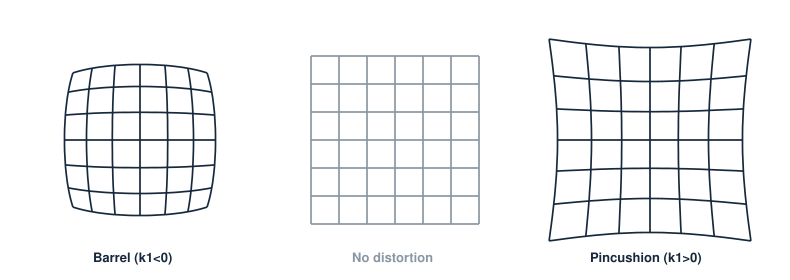

# 8. 렌즈 왜곡 보정

> 핀홀은 이상형이고 렌즈는 현실이다. 현실을 핀홀로 되돌리는 표준 도구가 Brown 왜곡 모델이다.

## Brown(radial–tangential) 모델

정규화 좌표 $(x,y)$, $r^2 = x^2+y^2$에서 왜곡된 좌표는

$$ \begin{aligned}
x_d &= x\,(1 + k_1 r^2 + k_2 r^4 + k_3 r^6) + 2p_1 xy + p_2(r^2 + 2x^2) \\
y_d &= y\,(1 + k_1 r^2 + k_2 r^4 + k_3 r^6) + p_1(r^2 + 2y^2) + 2p_2 xy
\end{aligned} $$

- **Radial** $k_1,k_2,k_3$: 대칭 왜곡 — $k_1<0$이면 barrel(광각에서 흔함), $k_1>0$이면 pincushion.
- **Tangential** $p_1,p_2$: 렌즈-센서 정렬 오차 — 값은 작지만 정밀 계측에선 무시 못 한다.
- 초광각/어안은 이 다항식이 못 따라간다 — equidistant 등 **fisheye 모델**로 갈아타야 한다(OpenCV `cv::fisheye`).

## Undistortion 실무

- 보정은 역방향 매핑이 필요하다(왜곡 식은 정→왜곡 방향). 해석적 역이 없어 반복해로 풀며, 실무는 `initUndistortRectifyMap`으로 **맵을 한 번 만들어 캐싱**하고 `remap`만 반복한다.
- 계측 파이프라인이라면 이미지를 펴지 말고 **점만 보정**(`undistortPoints`)하는 편이 보간 손실이 없다.

## 차수 선택 — 과적합 주의

$k_3$까지 넣으면 잔차는 준다. 문제는 **검증 뷰에서도 주는가**다. 가장자리 데이터가 부족한 채 고차항을 켜면 이미지 밖으로 외삽이 폭주한다. 내 원칙:

1. $k_1,k_2,p_1,p_2$로 시작, 가장자리 커버가 충분할 때만 $k_3$
2. 학습/검증 뷰 분리해 재투영 오차 비교
3. 잔차의 **공간 패턴**을 볼 것 — 남은 패턴이 보이면 모델 부족이다 ([ray calibration 리뷰](../reviews/ray-calibration.md)의 출발점)
