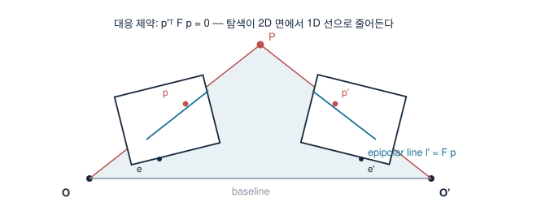

# 7. Epipolar Geometry

> 두 뷰 사이 대응은 자유롭지 않다 — 한 점의 상대편은 반드시 한 직선 위에 있다. 이 제약이 스테레오의 뼈대이고, 내 석사 주제의 무대다.

## 기하: 에피폴라 평면 하나

3D 점 $P$와 두 투영중심 $O, O'$가 만드는 평면이 두 이미지와 만나는 선이 **epipolar line**, baseline이 이미지와 만나는 점이 **epipole**이다. 따라서 $\mathbf{p}$의 대응점 $\mathbf{p}'$는 $\mathbf{l}' = F\mathbf{p}$ 위로 제한된다 — 탐색이 2D에서 1D로 준다.

## Essential과 Fundamental

정규화 좌표에서, 상대 포즈 $(R, \mathbf{t})$일 때

$$ \hat{\mathbf{p}}'^\top E\, \hat{\mathbf{p}} = 0, \qquad E = [\mathbf{t}]_\times R $$

픽셀 좌표로 쓰면 $F = K'^{-\top} E K^{-1}$, $\;\mathbf{p}'^\top F \mathbf{p} = 0$.

| | E | F |
|---|---|---|
| 좌표 | 정규화 | 픽셀 |
| 자유도 | 5 | 7 |
| 필요 정보 | $K$ 필요 | 불필요 |
| 분해 | $R,\mathbf{t}$ 복원(4해→cheirality로 선택) | 사영 재구성까지만 |

추정: 8점법(정규화 필수), $E$는 5점법 + RANSAC이 표준. rank-2 제약을 SVD로 강제한다.

## Rectification과 스테레오

두 이미지를 재투영해 epipolar line을 수평으로 만들면(rectification), 대응 탐색이 같은 행(row)의 1D 탐색이 된다. 시차 $d = u_L - u_R$와 깊이:

$$ Z = \frac{f\,B}{d}, \qquad
\Delta Z \approx \frac{Z^2}{f\,B}\,\Delta d $$

**깊이 오차가 $Z^2$에 비례**한다는 이 식이 스테레오 설계의 전부다 — baseline $B$와 $f$를 키우거나, $\Delta d$(매칭 정밀도)를 줄여야 한다.

## 내 실측 연결 — 두 번

1. **석사**: 선체블록의 반복 패턴·저텍스처에서 epipolar 제약만으로는 오매칭이 남는다 — keypoint 신뢰도·epipolar 거리·재투영 오차 3단 필터링에, guided mask로 **탐색 영역 자체를 줄여** 평균 오차 29.1→2.23 px.
2. **robotics-lab**: mono 마커 깊이 7.9 mm → 스테레오 0.65 mm(92%↓). 위 $\Delta Z$ 식이 예측하는 그대로, 약한 깊이 제약을 기하(baseline)로 바꾼 결과다.
