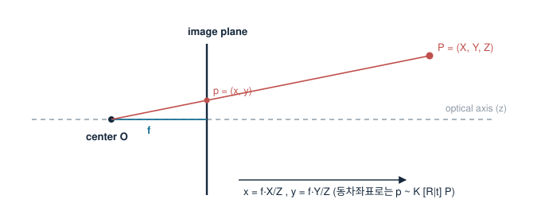

# 6. 이미지 투영 (Imaging Geometry)

> 모든 것의 중심 식: $\mathbf{x} \sim K[R\,|\,\mathbf{t}]\,\mathbf{X}$. 이 한 줄을 분해하는 장이다.

## 핀홀 모델

투영 중심 $O$와 그 앞 $f$ 거리의 이미지 평면. 카메라 좌표의 점 $(X,Y,Z)$는 닮은꼴 삼각형으로

$$ x = f\,\frac{X}{Z}, \qquad y = f\,\frac{Y}{Z} $$

에 맺힌다. 비선형인 이유는 오직 $/Z$ 하나 — 그래서 동차좌표로 쓰면 선형이 된다:

$$ \begin{bmatrix} x \\ y \\ 1 \end{bmatrix} \sim
\begin{bmatrix} f & 0 & 0 \\ 0 & f & 0 \\ 0 & 0 & 1 \end{bmatrix}
\begin{bmatrix} X \\ Y \\ Z \end{bmatrix} $$

## Intrinsic 행렬 K

픽셀 좌표로 가려면 픽셀 크기와 원점 이동이 필요하다:

$$ K = \begin{bmatrix} f_x & s & c_x \\ 0 & f_y & c_y \\ 0 & 0 & 1 \end{bmatrix} $$

- $f_x, f_y$: 초점거리(픽셀 단위) — 센서 셀이 정사각형이면 $f_x \approx f_y$.
- $(c_x, c_y)$: 주점(principal point) — 광축이 이미지와 만나는 픽셀.
- $s$: skew — 현대 센서에선 사실상 0.

같은 $f_x$라도 물리 초점거리(mm)와 셀 피치가 함께 만든 값이라는 점을 기억하자. "35 mm 환산" 같은 감각적 수치와 캘리브레이션 결과를 잇는 다리가 이것이다.

## 전체 사영 행렬

extrinsic까지 합치면

$$ \mathbf{x} \sim \underbrace{K}_{3\times3}\underbrace{[R\,|\,\mathbf{t}]}_{3\times4}\,\mathbf{X}_W
\;=\; P\,\mathbf{X}_W $$

$P$는 $3\times4$, 자유도 11(스케일 동치). DLT로 $P$를 직접 추정한 뒤 $K,R,\mathbf{t}$로 분해(RQ 분해)할 수도 있지만, 실무는 왜곡 때문에 Zhang 방식([9장](calibration.md))이 표준이다.

## Normalized 좌표 — 계산의 홈그라운드

$\hat{\mathbf{x}} = K^{-1}\mathbf{x}$로 픽셀을 정규화하면 $K$가 사라진 순수 기하만 남는다. Essential 행렬, PnP, 삼각측량 대부분이 이 좌표에서 정의된다. "픽셀 오차 1 px가 3D에서 얼마인가"를 셈할 때도 $Z/f$만 곱하면 된다 — W.D 17 m, $f$ 수천 px에서 mm 정밀도가 성립하는 근거.
