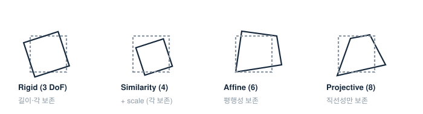

# 3. 2D 변환

> 변환의 위계는 "무엇이 보존되는가"의 위계다. 아래로 갈수록 자유도가 늘고 보존량이 줄어든다.

## 위계 한 장

| 변환 | DoF | 행렬 형태 | 보존되는 것 |
|---|---|---|---|
| Rigid (Euclidean) | 3 | $\begin{bmatrix} R & \mathbf{t} \end{bmatrix}$, $R\in SO(2)$ | 길이, 각, 넓이 |
| Similarity | 4 | $sR,\ \mathbf{t}$ | 각, 길이비 |
| Affine | 6 | $\begin{bmatrix} A & \mathbf{t} \end{bmatrix}$, $A$ 임의 가역 | 평행성, 넓이비, 중점 |
| Projective (Homography) | 8 | $3\times 3$ $H$ (스케일 동치) | 직선성, cross-ratio |

- Affine = "원근이 없는 카메라"가 평면을 볼 때. Projective = 진짜 원근.
- 사영 변환에서 평행선은 만난다 — 소실점이 생기는 이유.

## 어떻게 추정하나

대응점 $n$쌍이 주어지면 최소제곱/DLT로 푼다. 필요 대응 수 = DoF/2 (점 하나가 식 2개): rigid 2쌍, similarity 2쌍, affine 3쌍, homography **4쌍**.

실무에선 outlier가 섞이므로 **RANSAC + 최소 대응 샘플**이 기본형이다. 어떤 변환을 골라야 할지 애매하면 "물리적으로 허용되는 최소 자유도"를 골라야 한다 — 자유도를 과하게 주면 노이즈에 과적합해 기하가 뒤틀린다.

## 내 실측 연결

석사 스테레오 매칭에서 keypoint 필터링(신뢰도→epipolar→재투영)을 거친 뒤 ROI 정합에 similarity/affine 수준의 제약을 쓰는 것과, guided mask로 탐색 영역 자체를 줄이는 것 — 둘 다 "자유도를 줄여 노이즈를 이긴다"는 같은 원리다.
