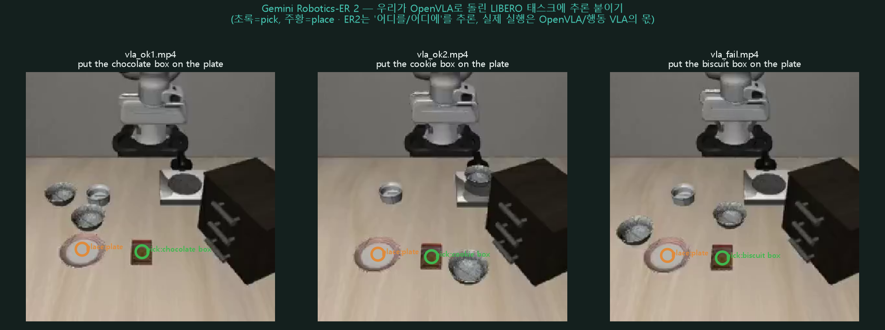
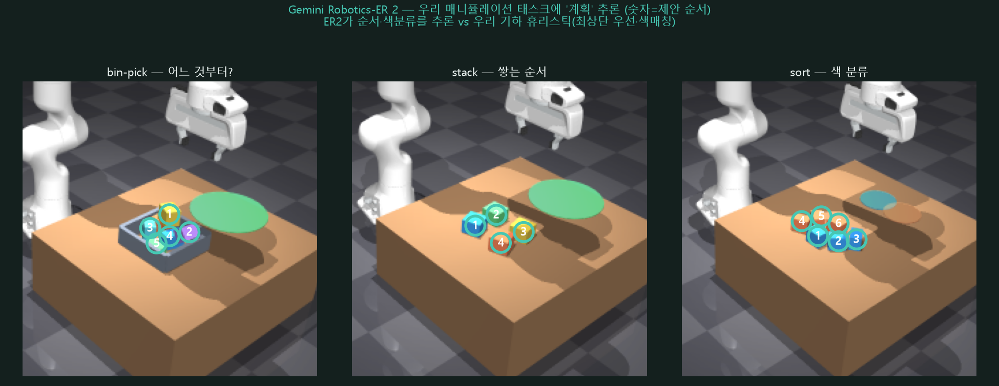
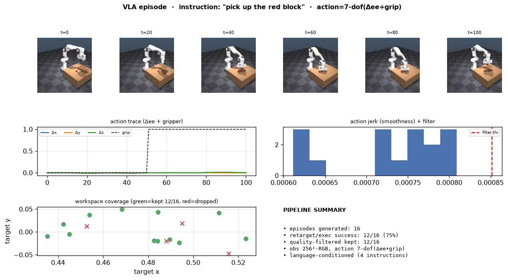
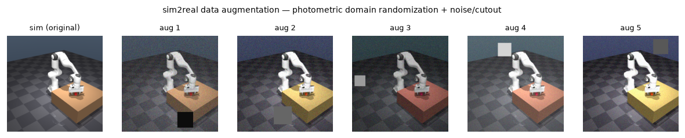
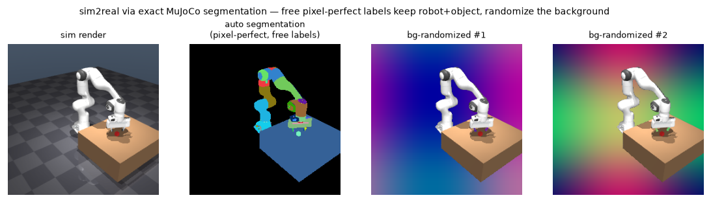
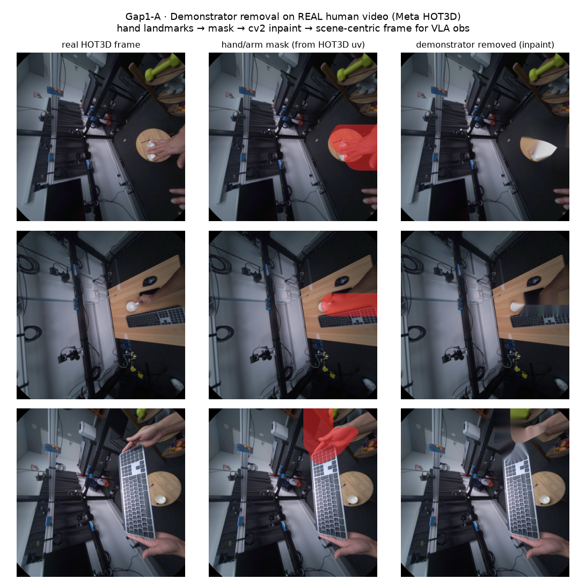
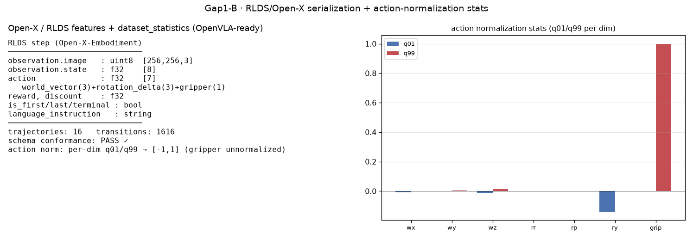
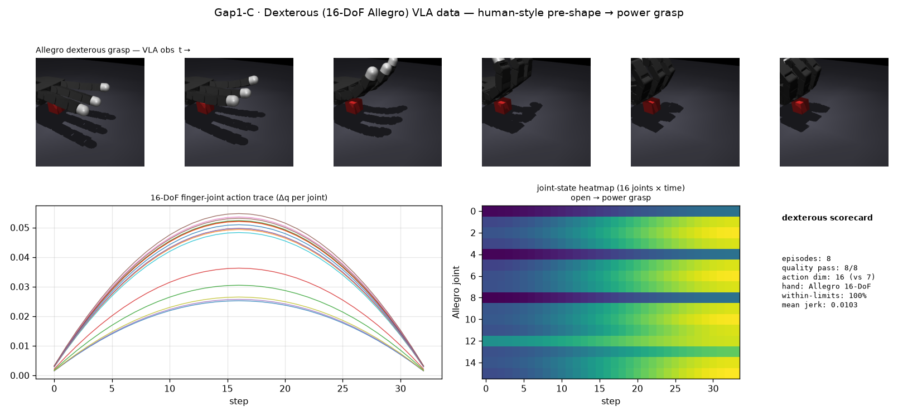
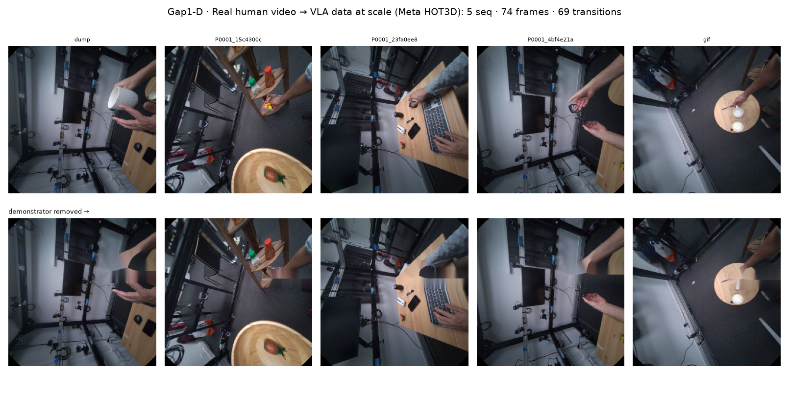
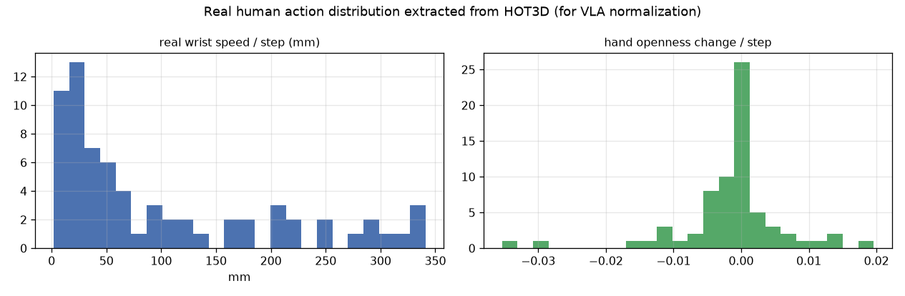

# VLA — OpenVLA (LIBERO 재현 + 파인튜닝)

컨텍스트 전달 사다리의 최상단([context.md](context.md) L1 포인터 → L2 언어 grounding → **L3 VLA**). L1/L2는 "인지 → 우리 IK/제어"였지만, VLA는 **언어+이미지에서 action을 직접** 뱉는다 — 손으로 쌓은 인지·결정·IK·grasp([manipulation.md](manipulation.md), [grasp_sota.md](grasp_sota.md)) 전체를 정책 하나가 대체하는 셈. VLA는 커스텀 씬이 아니라 **자기 네이티브 벤치**(LIBERO)에서 평가해야 embodiment/action-space가 맞아 의미가 있으므로, 그대로 재현했다.

## 무엇인가 — OpenVLA-7B

**OpenVLA-7B**(RSS'24)는 Prismatic VLM(**Llama-2 7B + DINOv2 & SigLIP** 듀얼 비전 인코더) 위에 로봇 action을 **토큰으로** 학습시킨 오픈 VLA다. Open X-Embodiment(~1M 궤적)로 대규모 사전학습한 뒤, downstream 태스크는 **LoRA**로 가볍게 파인튜닝한다.

- **입력**: 3인칭 RGB(256²) + 자연어 지시
- **출력**: next-token 예측으로 뽑는 **7-DoF delta EE action**(+ gripper) — 연속 action을 discrete token으로 매핑해 BC(behavior cloning)로 학습
- 재현에는 LIBERO 4-suite에 **LoRA**(r=32)로 파인튜닝된 공식 체크포인트를 그대로 사용(`openvla/openvla-7b-finetuned-libero-spatial`, ~14GB 자동 다운로드)

## LIBERO 벤치마크 & 평가 프로토콜

LIBERO는 로봇 조작 언어-조건부 정책의 표준 벤치로, **spatial / object / goal / long(10)** 4개 suite로 난이도·조합축을 나눈다. 태스크는 전부 "pick up the black bowl {between the plate and the ramekin / on the cookie box / in the top drawer / ...} and place it on the plate" 류 — **언어로 지정된 물체를 집어 목표 위치에 놓기**다.

- 평가 단위: **20 에피소드/suite**(10 tasks × 2 trials) — 논문 full-eval(500-ep)의 서브셋
- `center_crop` 전처리 적용(학습 시 randomize 대응)
- 시뮬레이터: **robosuite 1.4.1 + mujoco 2.3.2** (LIBERO가 고정하는 조합)
- 렌더: `MUJOCO_GL=egl`(WSL2 EGL 오프스크린)

## 환경 / 의존성 — WSL2 dep-hell 실기록

전용 conda env `ov`(기존 `zg` env를 복제해 torch2.2+cuda+gcc 툴체인 재사용). 실제로 넘은 블로커들:

- **flash-attn 2.5.5**: py3.11 조합이라 소스 빌드 대신 **cp311 prebuilt wheel**(cu122/torch2.2)을 그대로 사용해 컴파일을 회피.
- **robosuite 1.4.1**: `pynput → evdev` 네이티브 빌드가 실패 → `--no-deps`로 설치 후 **런타임에 필요한 의존성만** 채움(teleop 미사용이라 evdev 자체가 불필요). robosuite 호환 버전으로 **mujoco 2.3.2** 고정.
- **LIBERO**: `pip install -e .` 후 `~/.libero/config.yaml`을 **미리 생성**해둠 — 첫 import 시 뜨는 `input()` 프롬프트가 비대화형 셸에서 `EOFError`로 죽는 걸 preseed로 회피.
- **protobuf 삼각충돌**: `tensorflow 2.15`(protobuf `<5` 요구) · `tensorflow-metadata`(최신 1.21은 `protobuf>=5.26` 요구) · `wandb`(`protobuf 4.x` 요구)가 서로 맞물려 어느 조합도 동시 만족이 안 됨 → **tensorflow-metadata 1.14 + protobuf 4.25.3 + tfds 4.9.3**로 수렴시켜 해소.
- 종료 시 `MUJOCO_GL=egl` cleanup에서 뜨는 EGL `__del__` 관련 로그는 무해한 노이즈(`EVAL_RC=0` 확인).

## 재현 결과 — LIBERO 4-suite

| suite | 내 재현(20-ep) | 논문(500-ep) | Octo 논문 |
|---|---|---|---|
| spatial | 80% | 84.7 | 79 |
| object | 85% | 88.4 | 86 |
| goal | 85% | 79.2 | 85 |
| long(10) | 45% | 53.7 | 51 |
| **평균** | **74%** | 76.5 | 75.1 |

spatial suite 기준으로는 20 에피소드 중 **16/20 = 80% 성공**, 실패 4개는 table center·stove 등 애매한 위치에서 grasp를 놓친 케이스. 4-suite 전체로 보면 논문과 **패턴이 정합**한다(spatial~goal은 높고, long이 최난이도인 순서가 동일). 흥미로운 지점은 **7B짜리 OpenVLA가 93M짜리 Octo를 평균 ~1.4%p밖에 못 앞선다**는 것 — LIBERO라는 벤치 안에서는 파라미터 20배 차이가 성능에 거의 반영되지 않는다. 즉 **스케일이 항상 답은 아니다.** 80%가 논문값과 정합한다는 사실 자체가, 재현·통합(모델 로드, LIBERO 인터페이스, action 디코딩, 시뮬 루프)이 올바르게 됐다는 검증이기도 하다.

## 실제 롤아웃

<div style="display:flex;gap:12px;flex-wrap:wrap"><video src="_static/vla_ok1.mp4" controls loop muted playsinline style="width:31%;min-width:220px;border-radius:8px"></video><video src="_static/vla_ok2.mp4" controls loop muted playsinline style="width:31%;min-width:220px;border-radius:8px"></video><video src="_static/vla_fail.mp4" controls loop muted playsinline style="width:31%;min-width:220px;border-radius:8px"></video></div>

*"pick up the black bowl … place it on the plate" — 성공 2 / 실패 1*

20개 롤아웃 전부 성공/실패 라벨을 붙여 저장했고, 그중 대표 3개(성공 2 + 실패 1)를 위에 임베드했다.

## ER 2 (Gemini Robotics) — 같은 LIBERO 태스크에 추론 붙이기

OpenVLA가 LIBERO 태스크를 **실행**한다면, 2026-07-30 출시된 [Gemini Robotics-ER 2](reviews/gemini-robotics.md)(임베디드 추론)는 같은 씬을 **추론**한다. 행동 VLA는 게이트라 못 돌리지만 **ER 2는 API 공개**라, 우리가 OpenVLA로 돌린 LIBERO 롤아웃 씬에 ER 2를 직접 붙여봤다(클라우드, GPU 무관).



*3개 LIBERO 씬에서 ER 2가 태스크 추론 + pick(초록)·place(주황) 포인트 + 단계 계획을 냈다 — 단일 RGB 한 장으로 "어디를 집어 어디에 놓을지"를 바로.*

- ER 2는 **어디를/어디에(where)+계획**을 주고, 실제 **action rollout은 OpenVLA(또는 게이트된 행동 VLA)의 몫** — 추론과 실행의 분업.
- 이미지 한 장에서 open-vocab 물체·접시(target)·grasp 포인트를 바로 낸 것은, 우리 [context 사다리](context.md)의 L1(기하)·L2(OWL-ViT)를 로보틱스-튜닝 VLM이 한 번에 하는 셈. ER2 grasp 포인팅·언어 grounding 상세는 [Gemini Robotics 2 리뷰](reviews/gemini-robotics.md).
- 정직: ER2의 "태스크"는 이미지에서 **추론한 것**(실제 LIBERO 지시문과 다를 수 있음), pick/place 포인트도 정성 확인(n=3).

## ER 2 — 우리 매니퓰레이션 태스크(bin-pick·stack·sort) 계획

LIBERO 씬을 넘어, **우리가 MuJoCo에서 직접 만든 매니퓰레이션 태스크**([manipulation.md](manipulation.md))에도 ER 2를 붙여 "무엇부터·어디로" 계획을 시켰다. 우리는 이 태스크들을 **기하 휴리스틱**(bin-pick=최상단 우선, stack=순차 적재, sort=색매칭)으로 풀었는데, ER 2의 추론이 그 휴리스틱과 얼마나 맞는지 대조하려는 것.



*세 씬에 대한 ER 2의 계획(원 안 숫자 = 제안 실행 순서). 씬당 RGB 한 장만 주고 순서/색분류를 물었다.*

- **bin-pick — "어느 것부터?"**: ER 2가 5개 박스의 픽 순서를 내며 "위·비가림(top / unoccluded)된 것 먼저"라고 근거를 댔다 → **우리 top-down grasp의 최상단 우선 휴리스틱과 그대로 일치**.
- **stack — "쌓는 순서"**: base부터의 적재 순서 + 타워 목표 위치를 냈다(초록 base → …). 우리 순차 적재 로직과 같은 방향.
- **sort — "색 분류"**: 6개 박스를 색(오렌지 3 / 블루 3)으로 갈라 각각 제 색 존으로 보냈다 → **우리 색매칭 sort와 일치**.

정리하면, **로보틱스-튜닝 VLM(ER 2)의 언어 추론이 우리가 손으로 짠 기하 휴리스틱과 같은 결론에 수렴**한다 — L1(기하)/L2(OWL-ViT)로 명시적으로 짜던 "무엇을·어느 순서로"를 VLM이 한 장에서 바로 낸다. 단, 이는 **계획(where/order)까지**고 실제 action rollout은 여전히 실행 정책의 몫이며, 순서·포인트는 정성 확인(씬당 n=1)이다.

## 자체 LoRA 파인튜닝 — 파이프라인은 동작, 단 짧은 run은 undertrain

평가만 재현하는 걸 넘어, 단일 4090에서 `openvla-7b` 베이스 위에 **LoRA 파인튜닝을 처음부터 끝까지 직접 돌렸다**: RLDS 데이터 변환 → LoRA 학습(`finetune.py`) → 어댑터 merge → LIBERO eval — **파이프라인 자체는 end-to-end로 정상 구동**한다.

문제는 학습량이다. 첫 bounded run은 **1500 step ≈ 0.45 epoch**밖에 안 됐고, 이 체크포인트로 LIBERO-Spatial을 평가하면 성공률 **0%**(0/20)가 나왔다. 여기서 중요한 건 원인 규명이다 — action normalization 통계(norm stats)를 직접 점검해 정상임을 확인했으므로 **버그가 아니라 순수한 undertrain**이다.

그래서 **더 길게 다시 돌렸다**: `openvla-7b` 베이스 위에 LoRA(r=32, effective batch 16, image-aug)로 **4000 step ≈ 1.2 epoch**, 단일 4090에서 ~28시간. 학습 종료 시 token action-accuracy ~0.37 / loss ~2.5로 **분명히 학습은 진행됐다**(0에서 우상향). 이 `ft_real` 체크포인트를 LIBERO-Spatial **100 에피소드**(10 태스크 × 10 trial)로 평가한 실측 성공률은 **4.0%(4/100)**:

| run | 학습량 | eval | 성공률 |
|---|---|---|---|
| 첫 run | 1500 step ≈ 0.45 ep | 20-ep | **0%** (0/20) |
| `ft_real` | 4000 step ≈ 1.2 ep | 100-ep | **4.0%** (4/100) |
| 공식 체크포인트(참고) | 대규모 학습 | — | ~84% (논문) |

태스크별로 보면 10개 중 3개에서만 성공이 나왔고(최고 20%) 나머지 7개는 0%였다. 즉 **더 오래 학습하니 0%→4%로 바늘이 움직이긴 했지만**(방향은 옳다), 논문/공식 체크포인트 수준(~84%)과는 여전히 자릿수가 다르다. 0.45→1.2 epoch로도 이 정도이니, 수렴에는 훨씬 더 많은 epoch(compute)가 필요하다는 걸 두 데이터 포인트로 직접 확인한 셈이다.

과정에서 얻은 교훈 하나: 처음엔 wandb를 꺼두고 돌리는 바람에 **loss 곡선을 전혀 남기지 못했다.** 이후 `finetune.py`에 `[metrics]` 태그로 step/loss를 직접 print하도록 패치해서, 외부 로깅 없이도 학습 진행 상황을 콘솔에서 확인할 수 있게 고쳤다.

### 지름길 시도와 그 반전 — "train 지표 ≠ task 성공"

"57일치(200k step) compute가 없으니 **싸게 수렴**시켜 보자"는 가설을 세웠다: **태스크를 1개로 좁히고(45 demos) image_aug를 끄면** 학습이 빨리 수렴할 것이다. 실제로 train token-accuracy는 **0.37 → 0.6**으로 올랐다(l1도 0.07까지). 그런데 그 체크포인트를 **같은 태스크**로 평가하니 —

| 설정 | train action-acc | 그 태스크 eval |
|---|---|---|
| `ft_real` (전체 10태스크 + aug) | 0.37 | **20%** (2/10) |
| 단일태스크 + **no-aug** | **0.6** | **0%** (0/20) |

train 지표는 더 좋아졌는데 **성공률은 20% → 0%로 오히려 떨어졌다.** 착시가 아님을 확인하려 mundane 원인을 전부 배제했다: eval 전처리(`center_crop` True·False 둘 다 0%), action normalization 통계(작동하는 `ft_real`과 **완전 동일**), 단일태스크 필터(궤적 45개=정확히 한 태스크, 정상 작동). 남는 설명은 하나 — **일반화 실패**다. aug를 끄고 데이터를 45 demos로 좁히니 학습 프레임엔 맞췄지만 eval의 **무작위 초기상태**엔 전혀 대응하지 못했다.

교훈: **train token-accuracy는 기만적 지표**다. OpenVLA 레시피의 image_aug·데이터 다양성·대규모 compute는 겉치레가 아니라 **바로 "일반화"를 위한 장치**이고, 지름길로 건너뛰면 오히려 policy가 망가진다. 즉 앞의 compute-wall 결론을 **강화**한다 — 84%로 가는 길은 풀 레시피 × 풀 compute뿐이다. (부수적으로, 이 단일태스크 run은 3000 step까지 학습을 마쳤으나 **장시간 GPU 부하로 WSL2 VM이 crash**해 최종 체크포인트 저장이 손상됐고, 직전 온전한 2500 체크포인트로 평가했다 — 단일 소비자 GPU 환경의 실제 운영 한계까지 포함한 기록이다.)

> **정직한 결론:** VLA 평가는 논문값을 재현할 수 있고, 파인튜닝 파이프라인도 정상적으로 구동된다. 하지만 **VLA 파인튜닝은 compute-heavy**해서, 단일 GPU로 돌린 짧은 run은 LIBERO 성능으로 transfer되지 않는다. "체크포인트 실행"과 "VLA를 훈련시켜 쓸 만하게 만드는 것"은 전혀 다른 난이도의 작업이라는 걸 직접 확인한 결과다.

## 관찰 / 한계

- **VLA는 스택 전체를 대체한다**: L1/L2는 "인지 → 우리 IK/제어"였지만 OpenVLA는 인지·IK·grasp 계획 없이 이미지+문장에서 action을 바로 낸다. 컨텍스트 전달 사다리 L1(포인터) → L2(언어 grounding) → **L3**(VLA)가 이걸로 완성된다.
- **캐비엇 (1)**: 위 결과는 OpenVLA의 **자기 벤치(LIBERO) + 공식 파인튜닝 체크포인트** 결과지, 우리 MuJoCo 커스텀 씬이 아니다 — VLA는 학습된 embodiment/action-space 안에서만 유효하다.
- **캐비엇 (2)**: 체크포인트를 실행해 논문값을 재현하는 것과 VLA를 처음부터 훈련시키는 것은 다르다. 후자를 직접 시도해본 결과가 위의 "0.45 ep → 0% → 1.2 ep → 4%" 정직한 undertrain 진행 사례다 — 학습은 되지만 수렴엔 훨씬 더 많은 compute가 필요하다.
- **캐비엇 (3, 4)**: 20-ep는 논문 full-eval(500-ep)의 부분집합이고, 어디까지나 시뮬레이션이며 실사 로봇은 아니다.
- **다음 축**: 다른 suite(object/goal/long) 간 실패 양상 비교, Octo 같은 경량 모델과의 직접 대조, [grasp_sota.md](grasp_sota.md)의 grasp SOTA A/B와 묶어 "인지형 grasp vs end-to-end VLA 정책" 관점으로 연결. VLA와 world-model 기반 RL 계열의 패러다임 차이는 [concepts.md](concepts.md) 참고.

## 재현

```bash
# WSL2 ov env (torch2.2 + flash-attn + LIBERO + robosuite)
conda run -n ov bash _wsl/run_ov_eval.sh   # openvla-7b-finetuned-libero-spatial, 첫 실행 시 체크포인트 자동 다운로드(~14GB)
```

## Human 시연 → VLA 학습데이터 파이프라인

위가 "VLA 모델을 **학습·평가**"였다면, 여기선 그 **학습데이터를 만드는 파이프라인**을 다룬다 — RLWRLD류 JD의 "대규모 human 데몬스트레이션을 VLA 학습데이터로 변환 + sim2real 증강/inpainting + 품질 검증". 검증된 pick 스택(Franka Panda + `dls_ik`) 위에서 [HM5 human→robot retargeting](human_pose.md)이 내놓는 파지 의도(target · grasp yaw · aperture)를 로봇으로 실행하며 VLA 포맷 에피소드를 자동 생성한다.

**① INGEST/RETARGET → 기록.** human 파지 의도를 Franka approach→grasp→close→lift로 실행하고, 매 스텝 기록한다: **obs**(256² RGB agentview), **action 7-dof** `[Δx,Δy,Δz,0,0,Δyaw,gripper]`(LIBERO/OpenVLA식 EE-delta), **proprio**(관절+그리퍼), **language instruction**(`"pick up the {color} block"`, 박스 색을 지시 색으로 실제 렌더 → 진짜 language-conditioned). 16 에피소드 중 12 실행 성공.



**② Augmentation (sim2real).** 렌더 sim의 도메인 갭을 줄이는 표준 증강: photometric domain randomization(밝기·대비·색조) + gaussian sensor noise + cutout. 한 관측에서 다양한 도메인 변형을 만들어 정책이 렌더 특유의 통계에 과적합하지 않게 한다.



**③ Sim2real — 정확 세그멘테이션 → background randomization.** MuJoCo에서 **픽셀 단위로 정확한 세그멘테이션 라벨을 공짜로** 얻는다(로봇 링크·물체·테이블 각각 분리). 이를 이용해 **로봇+물체는 그대로 두고 배경만 무작위화** — 정책이 렌더 특유의 배경 통계에 과적합하지 않게 하는 sim2real 핵심 기법(합성이라 뭉갬 없이 깨끗). 동일한 exact 마스크가 occlusion inpainting(가림 복원)이나 human-video 파이프라인의 **시연자 제거**에도 그대로 쓰인다 — 여기선 실제 human 비디오가 없어 background randomization으로 시연.



**④ 품질 자동 필터.** 에피소드별로 성공(리프트) · action jerk(smoothness) · IK feasibility를 측정해 자동 필터링. 일부러 섞은 **그리퍼 폭(72mm) 초과 파지(비실현 retargeting) 4개가 리프트 실패 → 자동 드롭**, 12/16 keep. 위 대시보드의 workspace coverage에 kept(초록)/dropped(빨강)로 표시된다 — "나쁜 시연을 걸러내는" 데이터 품질 게이트.

### ⑤ 확장 A — 실제 human 비디오에서 시연자 제거 (Meta HOT3D)

위 sim2real이 합성 배경 랜덤화였다면, 여기선 **실제 egocentric human 영상(Meta HOT3D)**에서 시연자를 지운다. HOT3D가 주는 2D 손 랜드마크(uv)로 손+팔 마스크를 만들고 **cv2 inpaint(Telea)**로 제거 → 사람 손이 사라진 **장면 중심 프레임**을 얻는다. human 데몬은 *사람* 손을 보여주지만 로봇 정책엔 *장면/자기 임베디먼트*가 필요하므로, 시연자 제거는 human-demo → robot-learning 파이프라인의 실제 전처리 단계다.



정직: 마스크는 HOT3D 손 주석(학습 세그멘터 아님), inpaint는 고전적(Telea) — 전처리 실증이지 SOTA 영상 inpainting은 아니다(프레임당 주석된 한 손만 마스킹). 코드 `src/vla_demonstrator_removal.py`.

### ⑥ 확장 B — RLDS / Open-X 표준 직렬화 + action 정규화 통계

ad-hoc npz를 **OpenVLA/Octo가 실제로 먹을 수 있는** RLDS(Open-X-Embodiment) 스키마로 변환한다: step마다 `observation.image/state · action(world_vector3+rotation_delta3+gripper1) · reward · discount · is_first/last/terminal · language_instruction`. 그리고 OpenVLA가 action을 $[-1,1]$로 정규화할 때 쓰는 **per-dim q01/q99 통계(`dataset_statistics.json`)**를 산출한다(gripper는 비정규화). 로더가 shard를 다시 읽어 **스키마 conformance를 검증(PASS)** — 16 궤적·1616 transition.



정직: TF 없이 스키마-준수 npz+json로 내보냈다(TF 박스의 TFDS 빌더에 그대로 투입해 tfrecord화 가능). 코드 `src/vla_rlds_export.py`.

### ⑦ 확장 C — Dexterous(16-DoF) VLA 데이터 (Allegro)

앞의 파이프라인은 **평행 그리퍼(action=ΔEE+1)**였다. 실제 dexterous 텔레오퍼레이션/리타게팅([HM5 MANO→Allegro](human_pose.md))은 훨씬 큰 action 공간이 필요하다. MuJoCo **mjSpec**으로 Allegro 손+테이블+물체+카메라를 조립하고, human식 pre-shape → power-grasp를 **16개 손가락 관절**로 생성해 VLA 에피소드를 만든다 — 동일한 증강·품질·포맷 machinery에 얹되 **action 차원이 7 → 16**으로 커진다.



- 8 에피소드, within-limits **100%**, finger jerk ~0.010(스무딩), 관절-상태 히트맵이 open→power grasp로 램프.
- 정직: 키네매틱 replay(물리 파지성공 아님)이고 grasp 관절타깃은 HM5식 power-grasp를 Allegro 한계 내로 생성(MANO가 이 머신에 없어 전체 retarget 재실행은 못 함). 요점은 **dexterous 16-DoF action 공간과 그 데이터 파이프라인**. 코드 `src/vla_datapipe_dexterous.py`.

### ⑧ 확장 D — 실제 human 비디오 스케일업 (Meta HOT3D, 다중 시퀀스)

A/B/C가 단일 클립·sim이었다면, 여기선 로컬 가용 **HOT3D 실제 시퀀스 5개(74프레임·69 transition)**를 배치로 VLA 데이터화한다. 프레임마다 — obs = 실제 egocentric 프레임(+시연자 제거 variant), state = 손목 3D(`lm_cam`)+hand openness, **action = Δwrist(3)+Δopenness(1) — 실제 영상에서 뽑은 human action**(Human→Robot 리타게터가 소비할 바로 그 신호), instruction = HOT3D 객체 라벨(bottle/keyboard/mouse…). 실제 human 모션 분포로 정규화 통계를 산출한다.




정직: 로컬 HOT3D는 소규모(전체 833분 중 일부) — **파이프라인이 스케일하는 것**이지 데이터가 대규모는 아니다. action은 3D 랜드마크 기반 human 손 모션 proxy(로봇 실행 아님). 코드 `src/vla_realvideo_pipeline.py`.

정직한 경계(전체): sim/실데이터·소규모지만, JD 4번째 담당업무의 **자동 변환 · sim2real 증강 · (실데이터) inpainting · 품질필터 · 표준 직렬화 · dexterous(16-DoF) action · 실영상 다중시퀀스 스케일업**을 전부 실측 구현했다. 남은 것: 실제 대규모(수십 시간) 데이터 확보와 로봇 실행 검증. 코드: `src/vla_datapipe.py`(+`vla_demonstrator_removal.py`, `vla_rlds_export.py`, `vla_datapipe_dexterous.py`, `vla_realvideo_pipeline.py`).
