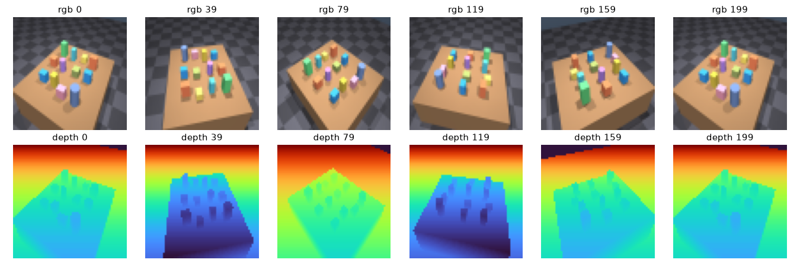
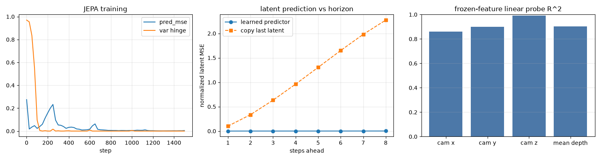
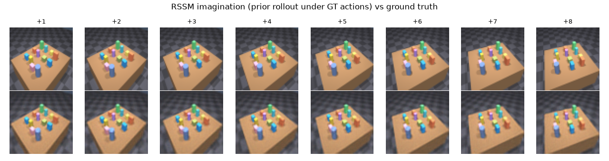
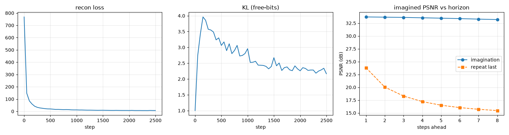
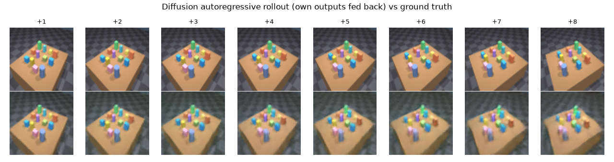
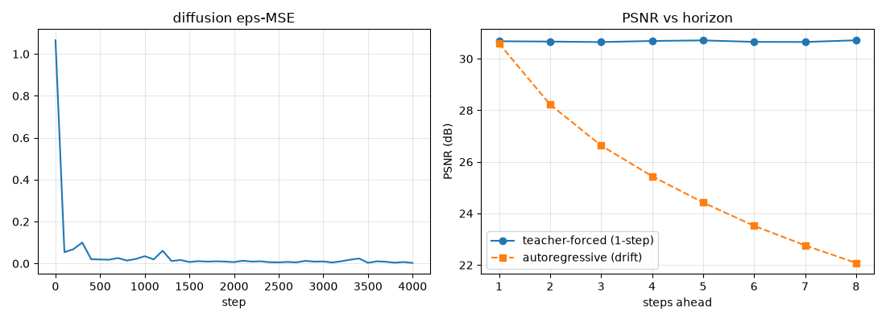
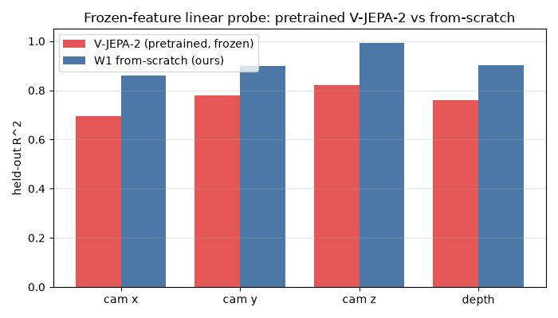
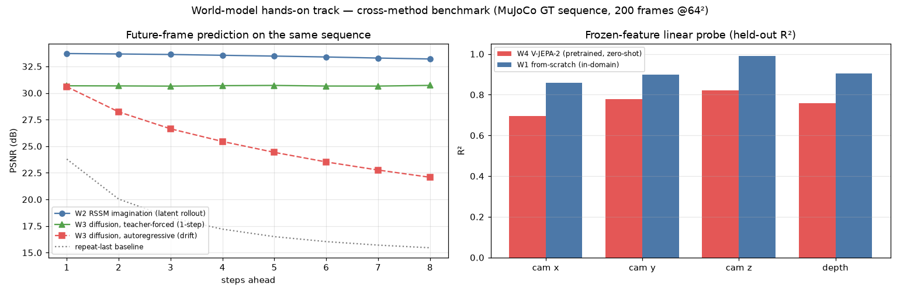

# World Models — hands-on (예측·상상·생성)

[SLAM](slam.md)이 "**관측 → 상태**"(움직이는 센서의 궤적·지도를 관측만으로 복원)라면, world model은 그 반대 방향 — "**상태 → 미래 관측/표현**"(지금까지의 상태와 행동으로 다음에 무엇이 관측될지 예측)을 푼다. 이 사이트의 [World Models 리뷰 트랙](world-models/latent.md)이 논문을 정리한 **읽기** 트랙이라면, 이 페이지는 그 세 계열(예측형·시퀀스형·생성형)을 **우리가 직접 구현·학습하고 같은 MuJoCo GT 시퀀스 위에서 측정한** hands-on 트랙이다.

포지셔닝: **3D perception → localization/mapping(SLAM) → 예측적 공간지능(world model)**. SLAM에서 만든 시퀀스·GT pose를 그대로 재사용하므로, "기하를 재구성하는 능력"이 "미래를 예측·상상하는 능력"으로 한 줄 이어진다.

> 전 단계 수식(JEPA 목적함수·EMA, RSSM ELBO·free-bits, diffusion, se(3) action, probe)은 별도 수업자료 챕터로 분리했다: [World Models 수식·유도](wm_math.md).

## 1. world model이 푸는 문제와 세 계열

한 문장: **과거 관측 $o_{\le t}$ 과 행동 $a_{\le t}$ 로부터 미래 $o_{t+1:t+h}$ (또는 그 표현·보상·가치)을 예측하는 학습된 시뮬레이터.** 계열은 "무엇을 예측 대상으로 두느냐"로 갈린다.

| 축 | 예측 대상 | 대표 | 우리 스테이지 |
|---|---|---|---|
| 예측·표현형 | 미래의 **표현**(픽셀 아님) | JEPA, V-JEPA(-2) | **W1**(자체구현), **W4**(pretrained) |
| 시퀀스·토큰형 | **잠재 상태**의 동역학 → 디코드 | Dreamer, PlaNet, TD-MPC | **W2** |
| 생성·영상형 | **픽셀** 프레임 직접 생성 | DIAMOND, GameNGen, Genie | **W3** |

## 2. 공통 셋업 (W0 — 평가 harness)

SLAM S0 시퀀스(정지 테이블탑을 카메라가 2바퀴 궤도로 도는 200프레임 RGB-D + GT pose)를 그대로 입력으로 쓴다. world model 평가에 필요한 세 가지를 만든다.

- **(context $k$ → future $h$) 윈도우**: 앞 $k$프레임을 보고 뒤 $h$프레임을 예측하는 문제로 자른다($k{=}4, h{=}8$).
- **GT action**: 인접 프레임 카메라 상대 pose의 se(3) log = 6-DoF 카메라 트위스트 $a_t=\log(T_{c_t}^{-1}T_{c_{t+1}})^\vee$. MuJoCo가 GT pose를 주므로 **정확한 행동 신호**를 공짜로 얻는다 → action-conditioned world model이 가능. 등속 궤도라 $\lVert a_t\rVert\approx0.075$로 거의 일정.
- **메트릭**: 표현 예측은 latent-MSE, 픽셀 예측은 PSNR/SSIM, 그리고 **horizon별 오차 곡선**(몇 스텝 앞까지 버티나).

이 장면은 world model 벤치로 좋은 성질이 있다: **정적 장면 + 알려진 ego-motion**이라 "카메라 행동을 받아 장면이 어떻게 재투영되는지"라는 순수 3D/기하 예측 문제로 환원된다(독립적으로 움직이는 물체가 없음). 뒤에서 보듯 이건 world model에 **유리한 체제**이며, 결과는 그 전제 위에서 읽어야 한다.

## 3. W1 — 예측·표현형 (JEPA 자체구현)

V-JEPA식으로, **픽셀을 복원하지 않고 표현(latent)만 예측**한다. online 인코더 $f_\theta$, 그 EMA인 target 인코더 $f_\xi$(stop-grad), 그리고 action을 받아 잠재를 굴리는 residual 예측기 $z_{t+1}=z_t+g_\phi([z_t,a_t])$. 손실은 예측 잠재와 target 잠재의 정규화 MSE(BYOL식) + collapse 방지를 위한 VICReg 분산 힌지. (유도 → [수식 챕터 §1](wm_math.md).)

측정 결과:

- **collapse 아님**: 임베딩 per-dim std 평균 1.55(퍼짐 건강). effective rank는 256차원 중 **5.8**로 낮은데, 이건 collapse가 아니라 **1-자유도 궤도라 데이터 자체가 저차원 매니폴드**이기 때문 — world model이 데이터의 진짜 내재 차원을 회복한 것.
- **표현이 기하를 담는다 (핵심)**: 인코더를 얼리고 latent를 선형 probe(PCA-16, 5-fold **held-out**)하면 카메라 3D 위치 $R^2=[0.86,0.90,0.99]$, 평균 depth $R^2=0.90$. 학습에서 pose·depth를 **한 번도 라벨로 준 적 없는데**, 표현이 그것들을 선형으로 디코드 가능하게 담고 있다.
- **action-conditioned 예측 동작**: 예측기의 latent-MSE는 8스텝 내내 ~0.001–0.002로 평평, "직전 잠재 복사" baseline은 0.10→2.27로 폭발 → 예측기가 실제로 행동을 받아 잠재를 옳게 굴린다.

## 4. W2 — 시퀀스·토큰형 (RSSM, Dreamer/PlaNet)

PlaNet의 잠재 동역학(RSSM)을 그대로 구현: 결정론 GRU 히스토리 $h_t$ + 확률 상태 $s_t$, prior $p(s_t\mid h_t)$(상상용)와 posterior $q(s_t\mid h_t,e_t)$(관측 있을 때), 그리고 $[h_t,s_t]$에서 프레임을 복원하는 conv 디코더. **보상 없음** — 순수 예측 world model이라 ELBO = 복원 + $\mathrm{KL}(q\Vert p)$(free-bits)로 학습. action은 GT 카메라 트위스트. (ELBO 유도 → [수식 챕터 §2](wm_math.md).)

**평가 = 상상(imagination)**: 앞 $k$프레임을 관측해 posterior 상태를 세운 뒤, **미래는 관측 없이 prior만** GT action으로 굴려 프레임을 디코드하고 GT와 대조한다.

- 상상 PSNR **33.7 dB(+1) → 33.2 dB(+8)**, SSIM 0.95로 거의 안 떨어진다. "직전 프레임 반복" baseline은 23.8→15.5 dB로 급락 → 상상이 **10–18 dB 우위**.
- KL이 free-bits 바닥(1 nat) 위 ~2.2 nat에 정착 → posterior collapse 없이 잠재를 실제로 쓴다.
- 위 스트립에서 상상 프레임(아래)이 GT(위)의 카메라 궤도·블록 배치를 8스텝 내내 정확히 따라간다. MSE 디코더라 약간 블러한 게 한계.

## 5. W3 — 생성·영상형 (조건부 diffusion, DIAMOND식)

조건부 DDPM으로 **픽셀 프레임을 직접 생성**한다. 작은 U-Net이 "직전 프레임 $x_t$ + action $a_t$"를 조건으로 $x_{t+1}$의 노이즈를 예측(ε-prediction), 샘플링은 결정론 DDIM 30스텝. (forward/reverse·DDIM 유도 → [수식 챕터 §3](wm_math.md).)

두 방식으로 rollout해 **단일스텝 품질**과 **drift**를 분리한다: teacher-forced(매 스텝 GT를 조건) vs autoregressive(자기 출력을 되먹임).

- **teacher-forced PSNR ~30.7 dB로 8스텝 평평** — 단일스텝 생성 품질 자체는 일정.
- **autoregressive PSNR 30.6 → 22.1 dB, SSIM 0.945 → 0.721** — 자기 출력을 되먹이면 오차가 누적되는 **생성형 world model의 전형적 drift**. rollout 스트립에서 +5 이후 배경 톤·블록이 서서히 흐려지는 게 육안으로 보인다.

## 6. W4 — pretrained V-JEPA-2 추론 probe

W1이 **우리 시퀀스로 학습한** tiny 인코더였다면, 여기선 Meta의 **pretrained V-JEPA-2**(ViT-L, 326M, 우리 장면을 한 번도 못 봄)를 그대로 얼려 같은 질문을 던진다: frozen feature가 카메라 위치·depth를 선형으로 담고 있나? 16프레임 클립 → 2048 토큰(=8 temporal × 256 spatial)을 spatial 평균풀해 1024-d 표현을 얻고, W1과 **같은 held-out probe**를 돌린다.

- **V-JEPA-2 (zero-shot)**: 카메라 위치 $R^2=[0.69,0.78,0.82]$, depth 0.76. 우리 데이터로 **아무 학습도 안 했는데** 범용 표현이 이미 3D 기하를 상당히 담고 있다.
- **W1 (in-domain)**: $[0.86,0.90,0.99]$, depth 0.90 — 이 시퀀스에 맞춰 학습했으니 당연히 더 높다.
- 정직 caveat: V-JEPA-2는 64프레임 클립(fpc64)용인데 16프레임만 줬고 spatial 토큰을 평균풀했으며(depth엔 손해) 샘플수도 다르다 → **V-JEPA-2 수치는 하한**으로 봐야 한다. 그럼에도 zero-shot으로 $R^2\approx0.7$–0.8이 나온다는 게 요점.

## 7. 종합 — 교차 계열 벤치마크

같은 200프레임 시퀀스 위에서 네 접근을 한자리에 놓는다.

| 단계 | 축 | 예측 대상 | 파라미터 | 8-step 지표 | 기하 인코딩 | 한계 |
|---|---|---|---|---|---|---|
| **W1** | 예측·표현형 (JEPA) | 표현(latent) | 1.29M | latent-MSE ~0.002 (copy 2.27) | cam $R^2$≈0.92, depth 0.90 | 픽셀 디코드 불가, 저차원 궤도라 eff-rank 낮음 |
| **W2** | 시퀀스·토큰형 (RSSM) | 잠재→픽셀 | 3.79M | PSNR 33.7→33.2 dB, SSIM 0.95 | 상상 rollout drift 거의 없음 | MSE 디코더 블러, 정적·결정론 장면이 유리 |
| **W3** | 생성·영상형 (diffusion) | 픽셀 | 2.08M | TF 30.7 / AR 30.6→22.1 dB | 단일스텝 선명 | 픽셀공간 drift, 샘플링 비용 |
| **W4** | 예측·표현형(pretrained) | 표현(frozen) | 326M | 추론 전용 | cam $R^2$≈0.76 (zero-shot) | 도메인 밖, 16f·pool→하한 |

읽어낼 교훈:

1. **잠재공간 rollout(W2)이 픽셀공간 autoregression(W3)보다 drift에 강하다** — 이 결정론·정적 장면에서 RSSM 상상은 ~33 dB로 평평한데, 픽셀 diffusion은 30.6→22.1 dB로 무너진다. 오차가 저차원 잠재에서 덜 누적되기 때문.
2. **표현형은 픽셀을 그리지 않는 대신 기하를 가장 깨끗이 담는다**(W1 probe $R^2$가 최고). "예측을 위한 표현"이 곧 "쓸모 있는 상태 추정"이 된다 — SLAM과 만나는 지점.
3. **범용 pretrained 표현(W4)은 zero-shot으로도 기하를 상당히 담지만**, 좁은 도메인에선 작은 in-domain 모델이 이긴다. 실전에선 pretrained를 얼려 쓰고 가벼운 head만 얹는 절충이 자연스럽다.

정직한 경계: 전부 **단일 짧은 시퀀스(200프레임)·정적 장면·알려진 GT action**에서의 **수렴/메커니즘 데모**다. SOTA 재현이 아니라 "세 계열의 목적함수와 rollout 동역학을 직접 구현해 GT로 측정했다"가 이 트랙의 주장이다. 다음 확장: 물체가 독립적으로 움직이는 동적 장면, action을 추정값으로 대체(관측만으로), TUM 실데이터로의 전이.
