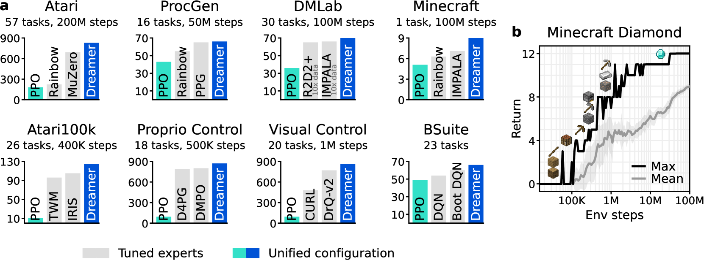
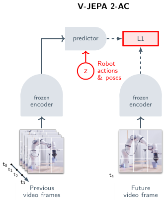
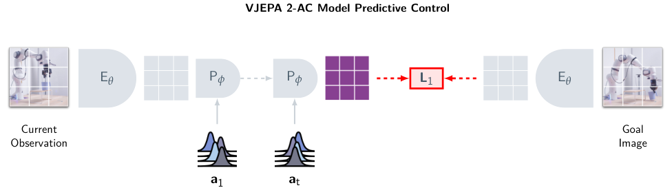
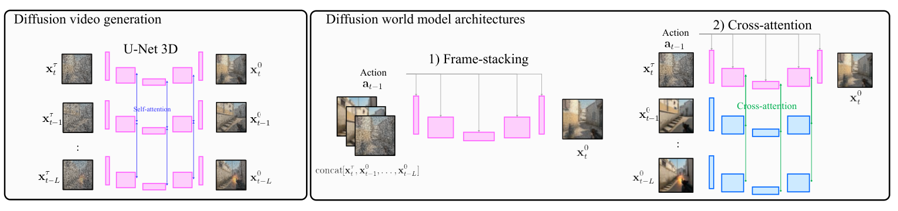
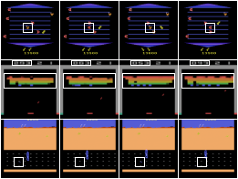
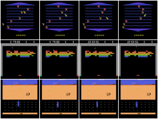

# 네 갈래 가로 비교 — Dreamer · TD-MPC2 · V-JEPA 2 · 생성계

[latent](latent.md)·[predictive](predictive.md)·[generative](generative.md) 트랙이 계열 **안쪽**을 세로로 파는 리뷰라면, 이 페이지는 네 갈래를 **가로로** 놓고 "무엇이 어떻게 다른가"를 한 번에 잡는 비교 지도다. 공부하면서 실제로 막혔던 질문들과 그때 정리한 답을 문답 형태로 함께 남긴다. hands-on 계측은 [World Models hands-on](../wm.md), TD-MPC2 상세 해부는 [아카이브 리포트](../archive/2026-09-30-tdmpc2-scalable-world-models.md) 참고.

## 0. 공통 출발점 — 다 같은 문제에서 시작한다

로봇 RL의 두 가지 고통에서 출발한다. ⑴ 실환경 시행착오가 너무 비싸고 위험하다. ⑵ 카메라는 세계의 일부만 보여준다(POMDP). 그래서 나온 공통 아이디어가 "**세계가 어떻게 굴러가는지를 모델로 배워서, 머릿속 시뮬레이터를 갖자**"다.

네 갈래는 전부 같은 질문 — "**그 시뮬레이터로 무엇을 예측할 것인가**" — 에 대한 네 가지 다른 답이다:

> **전부 그린다(① Dreamer) · 점수만 센다(② TD-MPC) · 뜻만 맞힌다(③ V-JEPA) · 아예 찍어낸다(④ 생성계)**

한 문장 결론을 먼저 쓰면: 네 갈래는 우열이 아니라 **"무엇을 예측하는 게 제어에 이득인가"에 대한 절충이 다른 것**이고, 로봇 실용 최전선은 지금 ③(보상 없이 계획)과 ④(데이터 공급)가 나눠 갖고 있다.

## 1. 쉬운 말 버전 — 각 갈래가 어떤 아이디어로 풀었나

**① Dreamer — "꿈속에서 연습하는 선수".** 세계를 통째로 압축해 머릿속에 담고, 연습은 전부 꿈속에서 하자 — 바둑 기사가 돌을 놓기 전에 머릿속으로 수읽기를 수십 수 하는 것과 같다. 관측을 잠재 상태로 압축하되(RSSM) "화면을 다시 그릴 수 있을 만큼" 충실하게 배우고(재구성 학습), 그 압축 세계 안에서 미래를 rollout하며 정책을 actor-critic으로 훈련한다. 실환경 1스텝을 겪을 때마다 꿈속 경험 수십 스텝을 뽑으니 **샘플 효율**이 나온다. V3에 오면 게임·제어·마인크래프트까지 150+ 태스크가 하이퍼 튜닝 없이 한 설정으로 돈다.

*DreamerV3 (arXiv 2301.04104) Fig.1 — 하나의 설정으로 도는 태스크 스펙트럼과 학습 구조. 재구성 기반 월드모델 + 상상 속 actor-critic이라는 갈래 ①의 원형.*

**② TD-MPC — "도로 사진은 안 그리고 도착 시간만 계산하는 내비게이션".** 어차피 제어에 필요한 건 "이 행동을 하면 점수가 얼마나 나나"뿐인데, 화면 픽셀까지 복원하는 건 낭비다 — **재구성을 버리자**. 잠재 공간에서 보상·가치(Q)만 예측하게 배우고, 매 순간 후보 행동 시퀀스 수백 개를 모델로 굴려본 뒤(MPPI) 제일 좋은 것의 **첫 수만 실행**하고 다음 순간 다시 계획한다. 계획 지평 너머의 먼 미래는 TD로 배운 Q가 한 숫자로 요약해 근시안을 막는다.

*TD-MPC2 (arXiv 2310.16828) — 인코더·잠재 dynamics·보상·Q·정책 prior 5부품, 디코더 없음. "지평 안은 모델이, 지평 밖은 가치가".*

**③ V-JEPA — "다 그리지 말고 뜻만 맞혀라".** 픽셀에는 원리적으로 예측 불가능한 것(나뭇잎의 정확한 흔들림, 조명 노이즈)이 가득한데 그걸 맞추라고 하면 모델 용량이 낭비된다 — **픽셀이 아니라 '표현(의미)'을 예측하면, 예측 가능한 구조(물체·움직임·기하)만 남는다**. 영상의 ~90%를 가리고 가려진 부분의 표현을 맞히는 자기지도 학습이고, 같은 조건에서 픽셀 예측보다 실제로 낫다는 걸 수치로 증명했다. 로봇 버전(2-AC)은 "행동을 하면 표현이 어떻게 변하나"를 로봇 영상 62시간 미만으로 얹은 뒤, **목표 '사진 한 장'과의 표현 거리가 줄어드는 방향으로** 팔을 움직인다 — 보상 설계 없이 목적지 사진만 주면 찾아간다.

*V-JEPA 2-AC (arXiv 2506.09985) — 사전학습된 영상 표현 위에 행동 조건 예측기를 얹는 구조.*

*같은 논문 — 목표 이미지의 표현과의 거리를 비용으로 두는 MPC. "보상 함수 자리에 목표 사진"이 갈래 ③의 핵심 차별점.*

**④ 생성계(DIAMOND·Cosmos) — "세상을 통째로 찍어내는 신경망 카메라".** 생성 모델의 스케일이 충분해진 지금, **다음 화면 자체를 그럴듯하게 찍어낼 수 있다면 그게 곧 시뮬레이터**다. 디퓨전/자기회귀로 다음 프레임을 직접 생성한다. DIAMOND는 그 생성된 꿈속에서 RL을 돌려 "작은 공·총알까지 선명해야 정책이 산다"(화질=제어 성능)를 증명했고, Cosmos는 수천만 시간 영상으로 사전학습한 생성기를 로봇·주행용 합성 데이터 공장으로 내놨다 — 이 갈래는 제어기라기보다 **데이터·시뮬 공급 인프라**가 현재의 실용 포지션이다.

*DIAMOND (arXiv 2405.12399) — 디퓨전 월드모델 안에서 RL을 학습하는 구조.*

| IRIS (이산 토큰 월드모델) | DIAMOND (디퓨전 월드모델) |
|---|---|
|  |  |

*같은 장면의 상상 프레임 비교 — 이산 잠재 압축(IRIS)이 지운 작은 물체를 디퓨전(DIAMOND)은 보존한다. "화질이 곧 제어 성능"이라는 주장의 시각적 근거.*

## 2. 갈래별 상세

### ① Dreamer 계열 — 재구성 기반 + 상상 학습 (계보의 뿌리)

- 계보: Dream to Control(V1, 2020) → [V2](dreamerv2.md)(2021, Atari) → [V3](dreamerv3.md)(2023).
- **학습 루프 3박자**: ⑴ 실환경에서 데이터 수집 → ⑵ world model 학습(관측 **재구성** + 보상 + 에피소드 지속 예측, posterior↔prior KL 정렬) → ⑶ **상상 rollout(H≈15) 안에서 actor-critic 학습**(λ-return). 정책이 실데이터가 아니라 꿈에서 배운다는 게 요점.
- 버전 차: V2 = 잠재를 가우시안→**범주형 32×32**로 바꿔 이산·다봉 동역학(Atari)에서 인간급. V3 = **symlog**(보상·가치 스케일 압착)·**twohot**(스칼라를 이산 분포로 회귀)·free bits로 견고화 → 150+ 태스크를 단일 하이퍼파라미터로, Minecraft 다이아몬드를 사람 데이터 없이 최초 달성.
- 약점 한 줄(다음 갈래로 잇는 다리): 재구성이라 **태스크와 무관한 픽셀 디테일에 모델 용량을 낭비**한다 — 이 지점을 ②는 "재구성 제거"로, ③은 "표현만 예측"으로, ④는 "반대로 더 잘 그리기"로 친다.

### ② TD-MPC2 — 이름이 곧 설계도

- **TD-MPC = "Temporal Difference learning for Model Predictive Control"** — **지평 안(H=5)은 모델로 계획(MPC, 구현은 MPPI)하고, 지평 밖의 먼 미래는 TD로 배운 Q함수가 요약**한다. "지평 안은 모델이, 지평 밖은 가치가".
- 왜 이 결합인가: 계획만 하면(PlaNet류) 지평 밖을 못 보는 근시안이 되고, 정책만 두면(SAC류) 실행 순간의 추가 최적화가 없다 — 둘을 연속제어에서 합친 게 [TD-MPC](tdmpc.md)(2022, DMControl Dog 최초 해결).
- 모델 이름 TOLD(**T**ask-**O**riented **L**atent **D**ynamics): 인코더·잠재 dynamics·보상·Q·정책 5부품, **디코더 없음(재구성 없음)**. 대신 **잠재 일관성 손실** — "내가 예측한 다음 잠재 ≈ 다음 관측을 인코딩한 것" — 로 관측에 정박한다. 정책은 답이 아니라 MPPI 샘플의 warm-start prior다.
- **TD-MPC2(2023)** = 스케일·멀티태스크판: 단일 하이퍼로 104태스크, 317M 단일 에이전트가 80태스크(모델을 키울수록 단조 향상 — "월드모델 RL도 스케일이 된다"). 수식 전개는 [아카이브 리포트](../archive/2026-09-30-tdmpc2-scalable-world-models.md).
- **이 사이트의 hands-on**: 공식 5M 체크포인트(cheetah-run)를 로드해 제어 return 863±12(논문급)를 재현하고, 그 안의 학습된 잠재 모델을 직접 해부했다 — open-loop rollout의 잠재 오차가 h1 2.9e-5 → h30 6.7e-3로 단조 증가함을 실측(= compounding error를 SOTA 모델 내부에서 재현). [wm.md](../wm.md)의 W6.

### ③ V-JEPA 계열 — 표현 예측 (실로봇 계획 최전선)

- **JEPA = "Joint-Embedding Predictive Architecture"**. 픽셀 복원 대신 **마스킹된 부분의 "표현"을 표현 공간에서 예측**한다. 자명해(모든 입력이 같은 표현으로 붕괴)는 EMA 타깃 인코더 + stop-gradient로 방지.
- 왜: 세상엔 원리적으로 예측 불가능한 픽셀이 많다 — 그걸 맞추라고 강요하는 대신 **예측 가능한 구조(물체·운동·기하)만 표현에 남긴다**. 검증: 같은 조건에서 픽셀 예측(VideoMAE) 대비 SSv2 69.5 vs 65.5 + 학습 2배 빠름.
- **[V-JEPA 2](vjepa2.md)(2025)**: 인터넷 영상 100만 시간+로 사전학습. **2-AC = Action-Conditioned** — 라벨 없는 로봇 영상 62시간 미만(Droid)으로 "행동 → 다음 표현" 예측기를 얹고, **목표 이미지의 표현과의 거리를 최소화하는 MPC**로 계획 → 처음 보는 두 실험실의 Franka에서 제로샷 픽앤플레이스. **보상 설계 없이 목표 사진 한 장으로 조작을 계획**한다는 것이 실용 포인트.

### ④ 비디오 생성계 — 관측을 직접 그린다

- **[DIAMOND](diamond.md) = "DIffusion As a Model Of eNvironment Dreams"**(2024): 다음 프레임을 디퓨전으로 직접 생성하는 월드모델 안에서 RL 학습 — Atari100k mean 1.46로 월드모델-only 신기록. 논지: "이산 잠재 압축이 지운 작은 물체(공·총알)가 정책 성능을 깎는다" — **화질이 곧 제어 성능**임을 정량 입증한 유일한 사례.
- **[Cosmos](cosmos.md)**(NVIDIA, 2025): 2,000만 시간 → 10⁸ 클립으로 사전학습한 월드 파운데이션 모델(확산 7/14B + 자기회귀 4~13B, 오픈웨이트) — 제어기가 아니라 **로봇·주행용 데이터/시뮬 공급자** 포지션. 참고 데모: [GameNGen](gamengen.md) — DOOM 게임엔진을 신경망으로 20FPS 통째 재현.
- 계열 공통 약점: 장기 물리 일관성·추론 비용 — 그래서 로봇에서는 "제어기"보다 **데이터 생성** 용도가 먼저 자리 잡았다.

## 3. 관통 비교 — 축 3개

### 축1 — 관측을 얼마나 복원하나 (예측 대상의 선택 = 이 분야 논쟁의 본체)

스펙트럼: **전부 재구성(①) → 복원 없음·점수만(②) → 표현만(③) → 픽셀 직접 생성(④)**.

왜 갈리나: 재구성은 정보를 안 잃고 상상을 눈으로 볼 수 있다(디버깅·해석성)는 게 장점이지만, 태스크와 무관한 픽셀(배경 질감)에 모델 용량을 낭비한다. 그래서 ②는 "제어에 쓸 것만 남기자"(낭비 제거, 대신 뭘 배웠는지 안 보임), ③은 "예측 가능한 의미만 남기자"(노이즈 강건, 대신 기하 정밀도 보증 없음)로 갈라졌다.

**주의 — 이 축엔 정답이 없다는 게 정답이다.** ④의 DIAMOND가 반대 방향 증거를 냈다: 잠재 압축이 지운 작은 물체 때문에 정책이 망가지고, 화질을 올리니 점수가 올랐다(Atari100k 1.46). 즉 "복원을 줄일수록 좋다"가 아니라 **"태스크에 필요한 정보가 예측 대상에 살아남느냐"**가 진짜 기준이다.

### 축2 — 행동을 어떻게 정하나 (상각 vs 온라인 계획)

- **상각(amortized) 정책**(①): 훈련 때 꿈속에서 정책을 미리 구워둠 → 실행은 forward 한 번, 빠름. 대신 배포 후 상황이 바뀌면 재학습 전까진 대응 못 함.
- **온라인 계획**(②): 실행 순간마다 모델로 미래를 굴려 최적화 → 테스트 타임에 적응(목표·제약이 바뀌어도 즉석 대응). 대신 매 스텝 계획 비용(수백 rollout)이 실시간 제어의 부담.
- **목표 조건 계획**(③AC): ②와 같은 MPC인데 **보상 함수 자리에 "목표 사진과의 표현 거리"**를 넣음 — 보상 설계가 사라진 게 핵심 차별점.
- ④는 자체 행동 결정이 없음 — 제어는 하류 정책의 몫이고 자기는 세계/데이터를 공급한다.

### 축3 — 무엇으로 배우나 (로봇 실무에서 제일 결정적인 축)

- ①② = **보상 기반 RL**: 태스크마다 보상을 정의해야 함 — 시뮬·게임에선 쉽지만 실로봇 조작에선 보상 설계 자체가 난제.
- ③ = **자기지도(라벨·보상 불필요)** + 소량의 (영상, 행동) 로그: 인터넷 영상이 연료가 되고, 계획도 목표 사진으로 함 → 보상이 없는 실로봇에 제일 먼저 닿은 이유.
- ④ = **무라벨 대규모 영상**으로 학습, 출력은 데이터: 하류가 뭘로 배우든(RL이든 모방이든) 원료를 대는 위치.

## 4. 한 장 표

| | ① Dreamer | ② TD-MPC2 | ③ V-JEPA(2-AC) | ④ 생성계 |
|---|---|---|---|---|
| 예측 대상 | 픽셀 재구성+보상 | 보상·가치만 | 표현(의미)만 | 픽셀 직접 생성 |
| 행동 결정 | 꿈속서 구운 정책 | 매 스텝 계획+Q | 목표 사진 거리 MPC | 없음(공급자) |
| 보상 필요 | 필요 | 필요 | **불필요** | (자체 학습엔) 불필요 |
| 실행 비용 | 낮음(forward 1회) | 중간(매 스텝 MPPI) | 중간(MPC) | 높음(생성) |
| 해석성 | 상상을 그려볼 수 있음 | 안 보임 | 안 보임 | 가장 잘 보임 |
| 로봇에서 자리 | 시뮬 RL 표준 | 연속제어 표준 베이스라인 | **실로봇 계획 최전선** | **데이터·시뮬 공급** |
| 이 사이트의 실습 접점 | 계보 정리 | **재현 863 + 잠재 drift 계측** | 관심축(표현 예측) | 3D 일관성 관점 |
| 대표 약점 | 픽셀 낭비 | 보상 성기면 표현 빈약 | 기하 정밀도 보증 없음 | 물리 일관성·비용 |

## 5. 공부하며 막혔던 질문과 그때 정리한 답 (Q&A)

**Q1. 그래서 넷 중 뭐가 제일 낫나?**
태스크가 고른다. 보상을 정의할 수 있고 시뮬이 있으면 ①②가 성숙하고, 보상 설계가 안 되는 실조작이면 ③이 유일하게 실기까지 갔고, 데이터가 병목이면 ④다. "어떤 문제를 풀 것인가"가 어느 칸인지에 맞춰 고르는 문제다.

**Q2. 재구성이 있는 게 좋은가, 없는 게 좋은가?**
축의 양끝이 다 반례를 갖고 있다 — 없애서 이긴 게 TD-MPC고, 더 잘해서 이긴 게 DIAMOND다. 기준은 복원 여부가 아니라 **"태스크에 결정적인 정보가 예측 대상에 살아남느냐"**이고, 그게 남는지는 실측으로 확인해야 한다(TD-MPC2 잠재 drift 계측이 그 연습이었다).

**Q3. 월드모델이 로봇에 왜 필요한가?**
세 가지. ⑴ 실로봇 데이터가 비싸니 상상 rollout으로 **샘플 효율**을 번다 ⑵ 행동 전에 결과를 예측하는 **플래닝**이 가능해진다 ⑶ 시뮬 대체·희귀 시나리오 생성. 한계도 같이 알아야 한다: 장기 예측의 누적 오차(compounding error), 그리고 "예측이 좋다 ≠ 제어가 좋다"는 평가 문제.

**Q4. POMDP와 무슨 관계인가?**
부분관측을 잠재 상태(belief)로 메우는 게 월드모델의 존재 이유다. 카메라 한 장은 진짜 상태를 다 보여주지 않고, 월드모델의 잠재 상태가 "지금까지 본 것을 요약한 믿음(belief)" 역할을 한다.

**Q5. "상상은 prior로 돈다"가 무슨 뜻인가? (RSSM의 심장)**
RSSM은 posterior/prior 한 쌍을 학습한다 — posterior는 관측을 **보고** 상태를 추정하고, prior는 관측 **없이** 다음 상태를 예측한다. 학습이 둘을 KL로 붙여놓기 때문에, 관측이 없는 상상 중에도 prior만으로 미래를 굴릴 수 있다. 꿈속 학습이 성립하는 이유가 이 한 쌍이다.

**Q6. 왜 TD-MPC는 정책이 있는데도 매번 계획을 하나?**
정책은 답이 아니라 **좋은 초기값(warm-start prior)**이다. MPPI 샘플링의 출발 분포를 정책이 대주고, 실행 순간의 추가 최적화(계획)가 정책의 실수를 교정한다. 반대로 지평 밖은 Q가 요약하니, "계획의 근시안"과 "정책의 경직성"을 서로가 메운다.

**Q7. V-JEPA의 표현 붕괴(collapse)는 왜 안 일어나나?**
모든 입력을 같은 표현으로 보내버리면 예측 손실이 0이 되는 자명해가 있다. 타깃 인코더를 EMA(지수이동평균)로 천천히 따라오게 하고 거기에 stop-gradient를 걸어, 예측기가 "움직이는 목표물"을 쫓게 만들어 붕괴를 막는다.

**Q8. compounding error는 실제로 얼마나 심한가?**
직접 재봤다 — TD-MPC2 공식 체크포인트의 잠재 open-loop rollout에서 예측 오차가 h=1일 때 2.9e-5, h=30일 때 6.7e-3로 단조 증가했다([wm.md](../wm.md) W6, [아카이브 리포트](../archive/2026-09-30-tdmpc2-scalable-world-models.md)). SOTA 월드모델도 30스텝이면 오차가 두 자릿수 배로 쌓인다 — 짧은 지평 계획 + 가치 부트스트랩(②)이나 재계획(receding horizon)이 괜히 있는 게 아니다.

## 6. 미니 용어사전

- **월드모델**: 관측을 잠재 상태로 인코딩하고, "이 행동을 하면 다음에 뭐가 되나"(동역학)를 그 잠재 위에서 예측하는 모델. 한 줄로 = 시뮬레이터의 학습판.
- **잠재(latent)**: 픽셀 대신 쓰는 압축 상태 벡터 — 예측·계획을 저차원에서 싸게 돌리기 위한 공간.
- **rollout**: 모델(또는 환경)을 여러 스텝 연속으로 굴려 궤적을 펼치는 것. "상상 rollout" = 실환경 접촉 없이 모델만으로 미래 H스텝을 굴리는 것 — 실데이터 1스텝당 가상 경험 수십 스텝이 나오는 게 샘플 효율의 원천.
- **RSSM**(Recurrent State-Space Model): Dreamer 계열의 심장. 결정론적 h(GRU 히든, 장기 기억) + 확률적 z(다봉 불확실성) + posterior/prior 한 쌍.
- **actor-critic**: actor = 행동을 내는 정책 / critic = 그 상태의 미래 보상 합(가치) 추정기.
- **TD**(Temporal Difference): 에피소드 끝까지 안 기다리고 "한 스텝 보상 + 다음 상태의 가치 추정"으로 지금 가치를 갱신(부트스트랩).
- **MPC**(Model Predictive Control): 매 결정 시점에 모델로 미래 H스텝 행동 후보들을 굴려 평가하고 첫 행동만 실행, 다음 스텝에 재계획(receding horizon).
- **MPPI**(Model Predictive Path Integral): MPC의 샘플링 구현 — 행동 시퀀스를 무작위로 뿌린 뒤 보상 가중 평균으로 분포를 갱신해 수렴.
- **POMDP / belief**: 관측만으론 진짜 상태를 다 모르는 설정 / belief = 현재 상태에 대한 확률적 요약. 월드모델의 잠재 상태가 belief 역할.
- **compounding error**: 자기 예측을 다시 입력으로 넣는 rollout에서 작은 오차가 복리로 쌓이는 것 — "장기 상상의 한계"의 정식 이름.

---

피겨 출처: DreamerV3(arXiv 2301.04104), TD-MPC2(arXiv 2310.16828), V-JEPA 2(arXiv 2506.09985), DIAMOND(arXiv 2405.12399) — 개인 학습용 아카이브, 각 피겨는 원 논문 소유.
